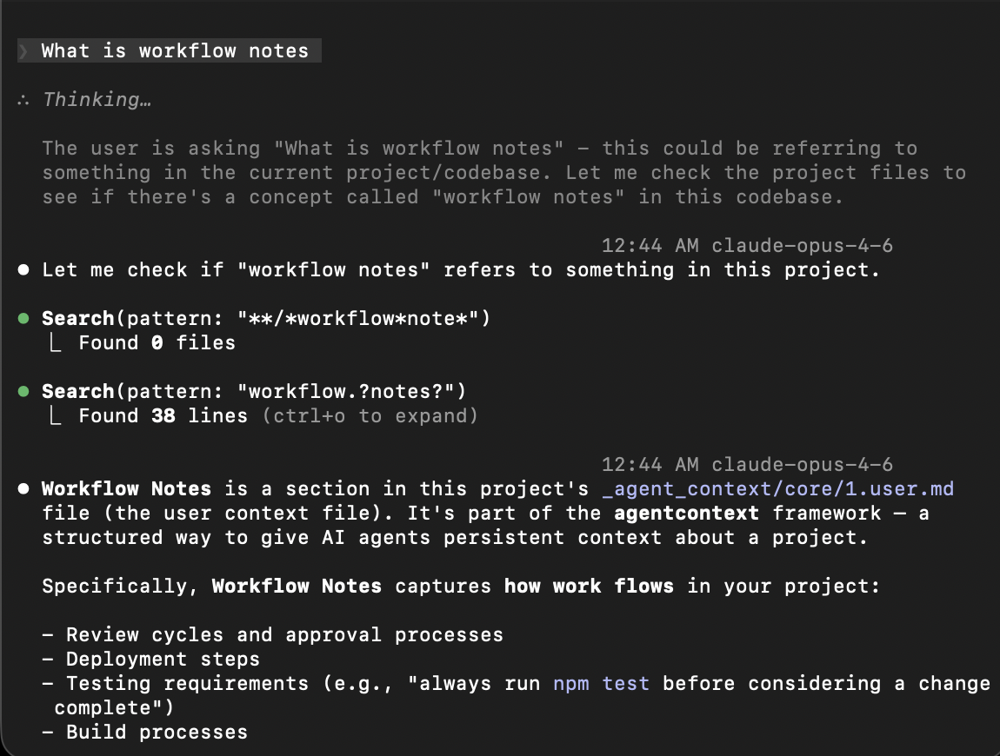
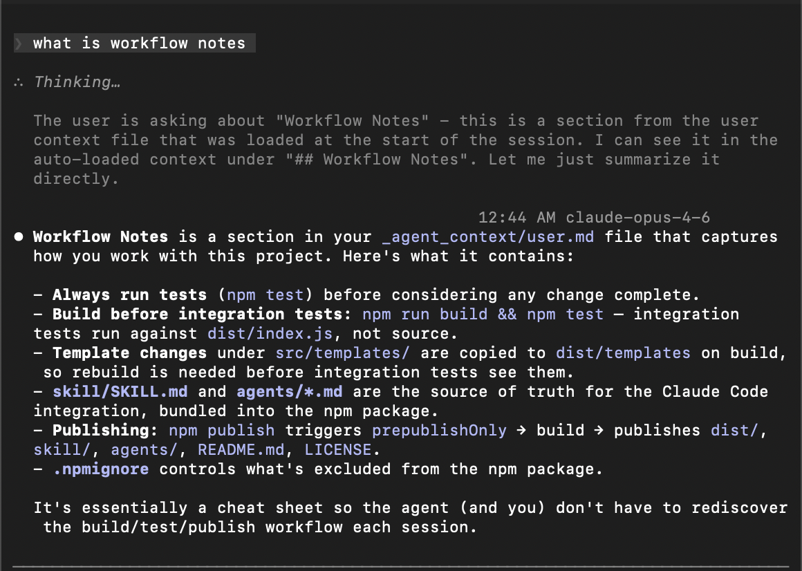

<p align="center">
  
</p>

<h1 align="center">Deep Dive</h1>

<p align="center">
  The philosophy, architecture, and design decisions behind dreamcontext.<br/>
  For setup and commands, see the <a href="README.md">README</a>.
</p>

<p align="center">
  <a href="#why-it-exists">Why It Exists</a> &nbsp;&middot;&nbsp;
  <a href="#the-problem-in-depth">The Problem</a> &nbsp;&middot;&nbsp;
  <a href="#the-architecture">Architecture</a> &nbsp;&middot;&nbsp;
  <a href="#the-hook-mechanism">Hooks</a> &nbsp;&middot;&nbsp;
  <a href="#the-sleep-cycle">Sleep Cycle</a> &nbsp;&middot;&nbsp;
  <a href="#neuroscience-inspired-memory">Neuroscience</a> &nbsp;&middot;&nbsp;
  <a href="#the-dashboard">Dashboard</a> &nbsp;&middot;&nbsp;
  <a href="#cli-design">CLI</a> &nbsp;&middot;&nbsp;
  <a href="#design-tradeoffs">Tradeoffs</a>
</p>

---

## Why It Exists

I built `dreamcontext` because AI coding agents, even the best frontier models, make mistakes that require human judgment to catch. Not small mistakes. Mistakes that would be catastrophic in production.

Here is what I have seen them do, repeatedly, across real projects:

- **Fetch entire collections** instead of filtering at the query level. The data is right there in a Firestore query or a SQL WHERE clause, but the agent pulls everything into memory and filters in code. On any real dataset, that is a performance disaster and a cost explosion.
- **Write serverless functions with infinite loop potential.** Cloud functions that trigger on a write, then write back to the same path, with no circuit breaker. No recursion guard. Just a function that passes its test and would drain your billing in production.
- **Skip index checks, error health, and monitoring.** The agent writes the happy path. The test passes. But there is no error boundary, no retry logic, no alerting, no index on the field it just queried. The kind of thing an experienced engineer catches in review because they have seen it fail before.
- **Optimize for test passing, not system correctness.** An agent will reshape code until the test goes green. That does not mean the implementation is right. It means the test was satisfied. The gap between those two things is where production incidents live.

These are not edge cases from small models. These are the top-of-the-line frontier models on real projects. Maybe an agent can handle a simple frontend on its own, or wire up a small database. But the moment you have complex edge cases, serverless architectures with real scaling concerns, or acceptance criteria that require product judgment, **a human engineer needs to be steering.** And steering only works when both sides have clear visibility into what is happening: what decisions were made, what work is in progress, what rules to follow, and what was tried before.

That is what `dreamcontext` is. Not just memory for agents. **A shared context layer that both you and your agent can read, audit, and act on.** When I open my project's context files, I can see exactly what the agent knows, correct what it got wrong, and make sure the next session starts with accurate information.

The problems that make this necessary are not accidental. **They are structural limitations of how agent memory works today.**

## The Problem in Depth

### The search spiral

You ask the agent to work on a task. The task references something, maybe a caching strategy you decided on two weeks ago. One paragraph. A clear decision that already lives somewhere in your project. But the agent does not know that. So it starts digging.

It greps for "cache." Finds 14 matches across 8 files. Reads 3 of them. Realizes those are implementation files, not the decision. Searches for "strategy." Reads 2 more files. Finds a comment that references a config pattern. Reads the config. Now it searches for where that config is used. Reads 2 more files. Finally pieces it together.

Three minutes. Multiple tool calls. Context window already filling up. And then it says: *"Ok, now I completely understand the codebase. Let me plan the implementation."*

**You have not started working yet.** You have been watching your agent do archaeology on a decision it already knew yesterday. This happens every session. And it scales with your project. More files, more decisions, more things to re-discover. **You are paying for search, not for work.**

<table>
<tr>
<td width="50%" align="center">
<br/>
<em><strong>Without dreamcontext</strong><br/>The agent does archaeology on decisions<br/>it already knew yesterday.</em>
</td>
<td width="50%" align="center">
<br/>
<em><strong>With dreamcontext</strong><br/>The decision is already in the snapshot.<br/>One read if needed. No spiral.</em>
</td>
</tr>
</table>

### Single memory files don't scale

A `CLAUDE.md` works for small projects. "Use tabs. Prefer functional. API is in `/src/api`." That is fine when your project is simple.

But when you have 200 files, 15 active decisions, 3 in-progress features, and a deployment process with edge cases, **one file either balloons into a wall of text the agent skims past, or stays too shallow to help.**

Think about it: identity and principles, user preferences, technical decisions, task progress, deep reference docs. These are structurally different types of knowledge. They change at different rates, serve different purposes, and need different formats. Putting them in one file is like storing your calendar, contacts, journal, and reference library in one document. **It works until it doesn't.**

### Search is the wrong approach for baseline context

It does not matter how your agent searches. Grep, glob, fuzzy match, RAG, vector store. The search technology is not the problem. **The problem is that search is the wrong approach for baseline context.**

Every time your agent greps for a function, reads a file to remember a decision, or globs for config files to understand project structure, it is spending tokens. Tool calls, output parsing, reasoning about what to search next. Whether that is a local `rg` call or a vector similarity query, the cost is the same: tokens and time burned on re-discovery instead of actual work.

Your agent should not need to search for who it is, what it is working on, or what decisions were already made. That is not a search problem. **That is baseline context that should already be there when the session starts.**

The write side has the same issue. Adding a technical decision, logging task progress, and creating a knowledge doc are structurally different operations. They belong in different places with different formats. A flat append to a single file cannot express that difference.

And when it comes time to retrieve, structure is what makes the difference between a clean answer and noise. "What are my active tasks?" is a directory listing, not a search query. "What does the soul file say about error handling?" is a file read, not a fuzzy match across everything. When your context is structured, you don't need clever retrieval. You just go to the right place.

### Closed memory systems lock you out

Some tools offer built-in memory behind their API. Sometimes you can see what the agent "knows." Sometimes you can even edit it. But **every interaction ties you deeper to that platform.** You can copy-paste to another tool, export to a file, find workarounds. But should you have to struggle with friction just to access your own project's context?

When you switch tools, or the service changes its API, or you want to work offline, that knowledge is trapped behind someone else's interface. **The friction is the lock-in.** Not a hard wall, just enough resistance that most people stop trying.

**Your agent's memory should be files in your repo.** Markdown and JSON. Readable, editable, diffable. You should be able to open your agent's understanding of your project in any text editor, fix a wrong assumption, and commit the change. That is ownership.

## The Architecture

Human brains don't store everything in one region. Your prefrontal cortex handles identity and decision-making. Your temporal lobe stores facts and relationships. You have procedural memory for skills you don't think about, and working memory for what you are actively doing. Different types of knowledge, different storage.

`dreamcontext` takes inspiration from this structure:

| Brain Region | dreamcontext | What it holds |
|---|---|---|
| Prefrontal cortex | `0.soul.md` | Identity, principles, rules, constraints |
| Episodic memory | `1.user.md` | Your preferences, project conventions, workflow |
| Semantic memory | `2.memory.md` | Decisions, known issues, technical context |
| Sensory cortex | `3.style_guide.md`, `4.tech_stack.md` | Style, tech stack, data structures |
| Declarative memory | `features/` | Feature PRDs with user stories, acceptance criteria, constraints |
| Long-term knowledge | `knowledge/` | Deep docs, tagged with standard categories, pinnable for auto-loading |
| Working memory | `state/` | Active tasks, in-progress work |
| Skill memory | `SKILL.md` | Teaches the agent the system itself |

The `_dream_context/` directory is the implementation. Everything lives in your repo, structured and version-controlled.

### How each piece works

**Soul** (`0.soul.md`) defines who the agent is when working on your project. Project identity, core principles, behavioral rules, constraints, and warnings. For example: *"Never use `require()` in this project"* or *"Always run tests before considering a change complete."* This is the most stable file. It changes rarely and sets the foundation for everything else.

**User** (`1.user.md`) captures your preferences, communication style, and workflow conventions. For example: *"No em dashes in writing, restructure the sentence instead"* or *"Make decisions directly, don't ask for permission on clear choices."* Tech stack details go in their own extended core file. **User is about how you work, not what you work with.**

**Memory** (`2.memory.md`) is the working log of technical decisions, known issues, and session-level learnings. For example: *"Chose Postgres over MongoDB because the data is highly relational"* or *"The auth middleware must run before rate limiting, not after."* It follows LIFO ordering (newest at top) and is the file that changes most frequently. The sleep cycle keeps it from growing out of control.

**Extended core files** (slots 3-5) hold specialized context: style guide, tech stack, data structures. These are loaded as summaries in the snapshot with paths included, so the agent knows they exist without burning tokens loading the full content every session.

**Knowledge** (`knowledge/`) is where deep reference docs live. Architectural context, domain knowledge, research, design rationales. For example: a doc on *"payment-flow-architecture"* tagged with `[architecture, payments, api]` explaining the full Stripe integration and edge cases. Each file has frontmatter with tags and descriptions. The snapshot surfaces a complete index so the agent knows what docs exist. Files marked `pinned: true` get loaded in full every session for frequently-needed reference.

**State** (`state/`) holds active work: task files with progress logs and a sleep state file tracking consolidation debt. A task like *"migrate-to-postgres"* would have status, priority, and a LIFO log of every step taken. Tasks follow a lifecycle (pending, in-progress, blocked, completed).

## The Hook Mechanism

The core insight: **don't make the agent search for its own context.**

`dreamcontext` uses seven hooks that run outside the agent's context window. They execute in the shell, not in the agent's reasoning loop. No tool calls, no token cost, no context window pressure.

### Stop Hook

Fires when a session ends. Reads the session ID and transcript path from Claude Code, then analyzes the transcript in two ways: counting Write/Edit tool uses (changes) and counting all tool calls (tools). Scores sleep debt based on the higher signal:

| Signal | 1-3 / 1-15 | 4-8 / 16-40 | 9+ / 41+ |
|--------|------------|-------------|----------|
| Changes (Write/Edit) | +1 | +2 | +3 |
| Tools (all calls) | +1 | +2 | +3 |

The final score is `max(changeScore, toolScore)`. This ensures Bash-heavy sessions or deep research sessions that make no file writes still accumulate proper debt.

Beyond scoring, the stop hook also:
- **Links bookmarks to the session.** Any bookmarks created during the session that don't have a `session_id` get linked.
- **Increments the rhythm counter.** `sessions_since_last_sleep` tracks how many sessions have passed since the last consolidation.

Saves the full session record to `.sleep.json`: session ID, transcript path, timestamp, change count, tool count, debt score, and the agent's last message (what it accomplished). Each concurrent session gets its own entry.

### SessionStart Hook

Fires before the agent sees your first message. Compiles and injects a full context snapshot:

1. **Soul + User + Memory** loaded in full (the agent's identity, your preferences, accumulated decisions)
2. **Extended core files** surfaced as summaries with paths (style guide, tech stack, data structures, system flow)
3. **Active tasks** with status, priority, and last update timestamp
4. **Bookmarks** sorted by salience (critical first), showing tagged moments from previous sessions
5. **Contextual reminders** from triggers matching active task names, tags, or bookmark text
6. **Sleep state** with debt level, sessions since last sleep, consolidation history, and per-session records
7. **Recent changelog** (last 3 entries from CHANGELOG.json)
8. **Upcoming versions** (planning releases) and **latest release** with version, date, summary, and included task/feature counts
9. **Features** with the Why, related tasks, and latest changelog entry per feature
10. **Knowledge index** with slug, description, tags, and staleness indicators (30+ days without access)
11. **Warm knowledge** for recently accessed or task-relevant files (first paragraph preview)
12. **Pinned knowledge** loaded in full for files marked `pinned: true`

Every file path is included in the output. If the agent needs more detail on something, it knows exactly where to look. One targeted read instead of a search spiral.

Consolidation directives fire based on multiple signals: debt 4-6 (offers consolidation at natural breaks), debt 7-9 (actively suggests sleeping), debt 10+ (strong recommendation), critical bookmarks (immediate advisory regardless of debt), and 3+ sessions since last sleep (rhythm check). The agent sees these before your first message and can plan accordingly. The UserPromptSubmit hook repeats reminders on every user message for debt >= 4, making them persistent.

### SubagentStart Hook

Fires when any sub-agent launches (Explore, Plan, or custom agents). Injects a lightweight briefing: project summary (capped at 120 characters), directory structure, active tasks, knowledge index, and pinned knowledge.

This is intentionally lighter than the full snapshot. Sub-agents are task-focused and short-lived. They need enough context to check existing knowledge and avoid duplicating work, not the full project state. The briefing fires for all sub-agents, including dreamcontext's own (the initializer and RemSleep agent). The extra context does not conflict with their dedicated prompts.

### PreToolUse Hook

Fires before a tool executes. Currently used for one purpose: blocking the default Explorer sub-agent when `_dream_context/` exists.

The problem: Claude Code's default Explorer has its own built-in system prompt that cannot be overridden by `additionalContext` injection (SubagentStart context is lower priority). When exploring a project with curated context files, the default Explorer ignores the curated knowledge and burns 100K-150K tokens re-reading files that are already summarized in `_dream_context/`.

The solution: the PreToolUse hook detects when `subagent_type` is `"Explore"` and `_dream_context/` exists, then returns a JSON deny response directing the main agent to use the `dreamcontext-explore` custom agent instead. This agent has identical tool access but reads `_dream_context/` files first, returns immediately if the answer is already in the curated context, and only falls back to full codebase search when needed.

This asymmetric strategy (full replacement for Explorer, additive injection for Plan) was a deliberate design choice. Explorer's behavior directly contradicts curated context. Plan's behavior (offering task creation) is additive and works fine with SubagentStart injection.

### UserPromptSubmit Hook

Fires on every user message. Reads sleep debt from `.sleep.json` and outputs a one-line reminder when debt is 4 or higher. Silent when debt is below the threshold. Read-only, no state writes.

Why this hook and not SessionStart? SessionStart fires once per session. Agents can (and do) dismiss it as context pressure pushes out behavioral instructions. UserPromptSubmit fires on every user turn. When the user sends a message, the agent must process the reminder again before generating its next reply. This is the closest analog to persistent awareness.

The reminder format is compact (one line) unlike the multi-line directives in the SessionStart snapshot. Same debt thresholds (4/7/10/critical bookmarks), but condensed for inline display. Critical bookmarks override the threshold and always trigger a reminder.

### PostToolUse Hook

Fires after every Edit or Write tool call on JS/TS files. Runs two checks sequentially:

**Auto-format.** Walks up from the edited file (max 10 levels) looking for Biome config (`biome.json`, `biome.jsonc`) or Prettier config (11 variants: `.prettierrc`, `.prettierrc.json`, `.prettierrc.yaml`, etc.). Biome is preferred when both exist (faster, encompasses both formatting and linting). Runs the formatter via the project's local binary (`node_modules/.bin/`) with `npx` as fallback. Silent on failure.

**Type-check.** Walks up for `tsconfig.json`, runs `tsc --noEmit --incremental --pretty false`, and filters output to only errors in the edited file (absolute and relative path matching). Errors are fed back to the agent via `additionalContext` JSON so it can self-correct on the next turn. First tsc run takes ~5 seconds (full type-check), subsequent runs under 1 second (incremental cache).

The directory walk-up for both formatter and tsconfig detection is merged into a single pass (`findProjectConfig()`) to avoid redundant I/O. All subprocess calls use `execFileSync` with array arguments (no shell interpolation) to prevent command injection via file paths.

PostToolUse cannot block (the tool already ran). It provides feedback, not gatekeeping.

### PreCompact Hook

Fires before Claude Code compacts the context window (both manual and auto-triggered). Saves a compaction record to `.sleep.json`:

- Timestamp
- Trigger type (manual or auto)
- Current debt level
- Session count and bookmark count at the time of compaction

Records are stored in `compaction_log[]` (LIFO, capped at 20 entries). This provides an audit trail of when and why context was lost, which is useful for debugging agent behavior gaps after compaction events.

### The flow

```
Session ends
  → Stop hook fires                                  runs in shell
  → Captures last message + transcript               what the agent accomplished
  → Analyzes changes + tools, scores debt            dual-signal scoring
  → Links bookmarks to session                       awake ripple attachment
  → Increments sessions_since_last_sleep             rhythm tracking
  → Session record saved to .sleep.json              full context preserved

Between sessions
  → You use the dashboard or edit files               human-side work
  → Dashboard changes recorded to .sleep.json         change tracking closes the loop

Next session starts
  → SessionStart hook fires                          runs in shell
  → Snapshot injected: soul, user, memory,           zero tool calls
    core summaries, tasks, bookmarks,
    contextual reminders, sleep state,
    session history, sleep history,
    dashboard changes, latest release,
    features, changelog, knowledge index,
    warm knowledge, pinned docs
  → Consolidation advisory if:                       critical bookmarks, debt >= 4,
    debt >= 10, or 5+ sessions                       or rhythm check
  → You ask your question.
  → Agent is already at full capacity.

During work
  → UserPromptSubmit fires on each message           persistent debt reminder
  → PostToolUse fires after Edit/Write               auto-format + tsc check
  → Errors fed back via additionalContext             agent self-corrects
  → PreToolUse fires before tool execution           blocks blind Explorer
  → dreamcontext-explore used instead                context-first exploration

Before compaction
  → PreCompact hook fires                            runs in shell
  → Saves compaction record to .sleep.json           audit trail of context loss

Sub-agent launches
  → SubagentStart hook fires                         runs in shell
  → Lightweight briefing injected:                   project summary, tasks,
    knowledge index, pinned docs                     avoids blind exploration
```

## The Sleep Cycle

Humans consolidate memory during sleep. Your hippocampus replays the day, extracts patterns, strengthens important connections, and discards noise. Without consolidation, memory degrades. It is not optional. It is how learning works.

Agents face the same challenge. Over multiple sessions, your agent accumulates knowledge: decisions, patterns, problems solved, tasks completed. Without consolidation, that knowledge either gets lost when the session ends or piles up in context files until they are too noisy to be useful. **Good context files don't happen by accident.** They need the same kind of maintenance a good engineer applies to their own notes.

`dreamcontext` ships with a **RemSleep** agent that handles this consolidation:

1. **Debt accumulates automatically.** The Stop hook scores each session based on both file changes and total tool calls. No manual tracking needed. The score reflects how much new knowledge was generated.
2. **Bookmarks prioritize what matters.** During active work, the agent tags important moments (decisions, constraints, bugs) with salience levels. The RemSleep agent reads bookmarks first, ordered by salience, so critical decisions are never lost in a pile of routine session summaries.
3. **Transcript distillation provides depth on demand.** For sessions with critical bookmarks or unclear summaries, the sleep agent calls `transcript distill` to get a structurally filtered view: user messages, agent decisions, code changes, errors. No noise from Read results or Glob output.
4. **The agent responds with graduated awareness.** Consolidation triggers fire based on multiple signals: debt level, critical bookmarks, and session rhythm (see table below).
5. **RemSleep consolidates.** Reviews bookmarks first, then session records, promotes learnings to core files, extracts knowledge, creates contextual triggers for future sessions, **detects recurring patterns** (repeated user preferences, workflow sequences, recurring errors, bookmark themes), updates summaries, cleans stale entries using knowledge access data, and keeps core files within size limits.
6. **History is preserved.** Each consolidation cycle writes a history entry: date, summary, debt before/after, sessions and bookmarks processed. The snapshot shows the last 3 entries so the agent knows what was recently consolidated.
7. **Debt resets.** After consolidation, debt recalculates (only post-epoch sessions count), bookmarks and sessions from before the epoch are cleared, triggers past their fire limit expire, the rhythm counter resets, and the cycle starts fresh.
8. **Next session**, the agent wakes up knowing its debt level, consolidation history, any remaining bookmarks, active triggers, and what the previous session accomplished.

### Debt levels

| Debt | Level | Behavior |
|------|-------|----------|
| 0-3 | Alert | Works normally |
| 4-6 | Drowsy | Mentions consolidation at natural breaks |
| 7-9 | Sleepy | Actively suggests sleeping, snapshot includes a reminder |
| 10+ | Must Sleep | Snapshot strongly recommends consolidation, defers to user if there is urgent work |

### Additional consolidation triggers

| Signal | Advisory |
|--------|----------|
| Critical (salience 3) bookmark exists | Immediate advisory regardless of debt level |
| 3+ sessions since last sleep | Rhythm check advisory |

Each cycle, the agent's context gets cleaner and more structured. Not because the agent "learns" in a human sense, but because consolidation enforces discipline: promote what matters, archive what is done, delete what is stale. Over time, the context files become a progressively better representation of your project's state.

Because sleep debt is tracked as real state (persisted in `.sleep.json`, surfaced in the snapshot, enforced by graduated directives), the system actually drives consolidation instead of hoping the agent remembers to do it. I tested the alternative: when sleep tracking lived in prompt instructions rather than hooks, the agent forgot to consolidate most of the time. **Context pressure pushes out behavioral instructions. Hooks don't have that problem.**

## Neuroscience-Inspired Memory

The memory system draws from a 2025 Science paper (Joo & Frank) that revealed how the hippocampus actually selects which memories to consolidate. The brain does not replay everything equally during sleep. During the day, the hippocampus fires "awake sharp-wave ripples" that bookmark important moments. During sleep, bookmarked memories compete for consolidation, with only the strongest patterns winning transfer to the neocortex.

The key insight: **memory selection and memory consolidation are separate processes.** Selection (tagging) happens during active work. Consolidation (storage) happens during sleep. Getting consolidation right is not enough if the system has no way to distinguish a critical architectural decision from a routine file read.

### How the mapping works

| Brain Mechanism | dreamcontext Feature |
|---|---|
| Hippocampus (working memory) | `state/` files (active tasks, sleep state) |
| Neocortex (long-term storage) | `core/` files (soul, user, memory), `knowledge/` files |
| Awake sharp-wave ripples | `bookmark add` (tag moments for consolidation) |
| Neural competition (strongest win) | Salience scoring (critical bookmarks trigger consolidation) |
| Memory decay (unused synapses weaken) | Knowledge access tracking (staleness indicators at 30+ days) |
| Sleep rhythm (every night) | Session count rhythm (advisory every 5 sessions) |
| Spreading activation | Warm knowledge tier (recently accessed files get first-paragraph preview) |
| Prospective memory ("do X when Y") | Contextual triggers (remind about X when task Y is active) |
| Hippocampal filtering | Transcript distillation (structural filter keeps signal, discards noise) |
| Sleep consolidation | RemSleep agent (compressed replay into core files) |
| Inhibitory neurons | Anti-bloat pass (200-line limit, prune stale knowledge) |
| Synaptic plasticity | LIFO ordering (recent info surfaces first) |
| Immune system (error correction) | PostToolUse hook (auto-format + tsc check on every edit) |
| Attention gating | PreToolUse hook (blocks noisy exploration when curated context exists) |
| Persistent neural signals | UserPromptSubmit hook (undismissable debt reminders) |
| Autobiographical memory logging | PreCompact hook (audit trail of context loss events) |

### Bookmarks (awake ripples)

During active work, the agent calls `bookmark add "<message>" -s <salience>` to tag important moments. Three salience levels:

- **1 (notable)**: Useful pattern discovered, minor decision
- **2 (significant)**: Architectural decision, user preference, meaningful bug
- **3 (critical)**: Breaking change, fundamental constraint, non-negotiable rule

The SKILL.md teaches the agent when to auto-bookmark. The stop hook links bookmarks to their session. The sleep agent processes bookmarks first, in salience order. Critical bookmarks become must-consolidate items.

### Knowledge decay

Knowledge files accumulate but not all remain relevant. The system tracks access via `knowledge touch <slug>`, recording when each file was last read and how often. Files not accessed in 30+ days get staleness indicators in the snapshot. The sleep agent uses access data during its anti-bloat pass: stale files are candidates for archival, frequently accessed files for pinning.

### Warm knowledge

Between the knowledge index (just titles and tags) and pinned knowledge (full content), there is a warm tier. Files accessed in the last 7 days or with tags matching active tasks get their first paragraph loaded into the snapshot. The agent often has just enough context to decide whether to read the full file, without burning tokens loading everything.

### Contextual triggers

The sleep agent creates triggers when it spots context-dependent decisions during consolidation. A trigger stores a "when" keyword and a "remind" message. During snapshot generation, triggers are matched against active task names, tags, and bookmark text. Matching triggers surface as contextual reminders at the top of the snapshot. Triggers auto-expire after a configurable number of fires (default 3) to prevent noise.

### Transcript distillation

Raw JSONL transcripts can be tens of thousands of lines. The `transcript distill` command applies structural filtering (pure Node.js, no AI): keeps user messages, agent reasoning, Write/Edit calls, modifying Bash commands, bookmark calls, and errors. Discards Read results, Glob output, tool metadata, and subagent internals. The sleep agent calls this selectively for sessions that need deep analysis.

## The Dashboard

The CLI and hooks handle the agent side. But context is a shared layer, and the human needs a way to work with it too. Opening markdown files in a text editor works, but it is not the best experience for managing tasks, reviewing sleep state, or browsing features. The dashboard fills that gap.

`dreamcontext dashboard` starts a local HTTP server and opens a web UI. No external services, no accounts, no network calls. It reads and writes the same `_dream_context/` files the CLI uses. There is no separate database.

### What it provides

**Kanban board.** Tasks displayed as cards across columns (To Do, In Progress, Completed). Drag a card to change status. Multi-select filters for status, priority, urgency, tags, and version, with type-ahead search for long lists. Sort by date, priority, urgency, or name. Group by status, priority, urgency, tags, or version, with optional sub-grouping. Click a task to open a Notion-style detail panel with properties block, rendered markdown body, and changelog.

**Eisenhower matrix.** A 2x2 priority-urgency quadrant view (Do First, Schedule, Delegate, Don't Do). Automatically excludes completed tasks so the matrix focuses on actionable work. Toggle between Kanban and matrix views from the filter bar.

**Core file editor.** All core files listed in a sidebar. Markdown files open in a split-pane editor: textarea on the left, live preview on the right. JSON files display formatted. SQL files (like `5.data_structures.sql`) render a visual ER diagram showing entities, fields, types, and foreign key relationships.

**Knowledge manager.** Search across knowledge files by name, description, and tags. Pin and unpin files directly. Clicking a file shows its full content.

**Features viewer.** All feature PRDs listed with status badges and tags. Click to see the full PRD: Why, User Stories, Acceptance Criteria, Constraints, Technical Details, Changelog.

**Sleep tracker.** A debt gauge with color coding by level (green through red). Session history timeline showing what happened in each session. A list of every dashboard change made since the last consolidation.

### Change tracking

This is the piece that ties the dashboard back to the agent. Every action taken through the dashboard (creating a task, editing a core file, pinning knowledge, updating a field) is recorded in `.sleep.json` as a `dashboard_changes` entry. Each entry captures the timestamp, entity type, action, target, and a human-readable summary.

When the agent starts its next session, the snapshot includes these changes. The RemSleep agent reads them during consolidation and folds the human's work into the project context. This closes the loop: the agent learns what you did between sessions without you telling it.

Field-level change tracking goes further. If you change a task's priority from "medium" to "high," the change record captures both the old and new values, not just "task updated." Net-change detection folds redundant changes: if you change priority from medium to high, then high to critical, only one record survives (medium to critical). If you change something and then change it back, the record is removed entirely. This keeps the change list clean for the agent to process.

### Technical decisions

The server uses Node.js native `http` module with zero new runtime dependencies. Routes are thin wrappers around the same `src/lib/` utilities the CLI uses. The React app (React 19 + Vite 6) is built separately and the output is copied to `dist/dashboard/` during the build. React dependencies live in `dashboard/package.json`, isolated from the CLI's dependencies.

The design uses a custom CSS system with design tokens (purple-to-magenta brand gradient, HSL colors, 4px grid, light/dark mode with system preference detection). No CSS framework. The Visby CF font is the brand font with a system font fallback for environments where it is not installed.

**Version manager.** A full-width modal showing planning and released versions with task counts and status badges. Planning versions have a "Release" button that transitions their status and sets the release date. Create new planning versions directly from the dashboard. Versions and releases are unified in `RELEASES.json` (a version is a release entry with `status: planning`).

### Release management

Versions and releases live in a single `RELEASES.json` file. A "version" is a release entry with `status: planning`. When released, the status changes to `released` and the date is set automatically. This eliminates the need for a separate versioning system.

The `core releases add` command auto-discovers unreleased items when creating a release: completed tasks without a `released_version`, active features without a `released_version`, and changelog entries since the last release. In interactive mode, you select which items to include via checkboxes. In non-interactive mode (`--yes`), everything unreleased is included automatically. Use `--status planning` to create a version placeholder without auto-discovery, with empty task/feature/changelog arrays.

After recording a released entry, the command back-populates `released_version` on included features. This means the next release correctly excludes already-released items. `core releases list` and `core releases show` let you review release history.

The snapshot includes both "Upcoming Versions" (planning entries) and "Latest Release" (most recent released entry) so the agent always knows what is planned and what was last shipped. Tasks can be assigned to planning versions via the `version` field, and the sleep agent checks whether all tasks for a planning version are complete during consolidation.

## CLI Design

Making an agent edit structured files (JSON, frontmatter, LIFO-ordered lists) means it has to read the file, understand the format, reason about where the edit goes, make the change, and verify it didn't break anything. **That is four or five operations and a lot of tokens for what should be one call.**

The CLI handles structural operations in a single command:

```bash
dreamcontext tasks create auth-refactor     # Scaffolds task with frontmatter
dreamcontext tasks log auth-refactor "..."  # Appends log entry (LIFO)
dreamcontext tasks complete auth-refactor   # Updates status in frontmatter
dreamcontext core changelog add             # Adds entry with proper schema
dreamcontext features create payments       # Scaffolds feature PRD
dreamcontext features insert auth changelog "Added OAuth flow"  # LIFO section insert
dreamcontext knowledge create api-patterns  # Creates tagged knowledge doc
```

One CLI call replaces a Read + reason + Edit + verify cycle. That difference compounds over a session. The CLI handles frontmatter parsing, LIFO ordering, JSON schema enforcement, and section insertion. The agent does not need to think about any of that.

Direct content edits (rewriting a paragraph in soul.md, updating a decision in memory.md, adding detail to a knowledge doc) still use the agent's native Read/Edit/Write tools. The agent is good at content. It is wasteful at structure.

The split is simple: **CLI for structure, native tools for content.**

### Optional Skill Packs

Beyond the core context management skill, `dreamcontext` ships curated skill packs for common workflows. Each pack contains a base skill (always-active principles) and on-demand sub-skills that Claude Code loads when relevant.

Five packs ship in v0.1.0: **engineering** (coding standards, backend architecture, Firebase), **design** (design systems, web/mobile UX, onboarding), **growth** (retention, ads, analytics), **brand-voice** (enforcement, discovery, guideline generation), and **system-prompts** (prompt engineering, cognitive architecture). Some packs include related agents (e.g., a code reviewer for engineering, brand discovery agents for brand-voice).

The install interface has three modes:

- **Interactive browser** (`install-skill --packs`): a terminal checkbox UI showing all packs with descriptions, sub-skill counts, agent counts, installed status, and `[always active]` badges. Select what you want, confirm, done.
- **Direct install** (`install-skill --packs engineering design`): skip the UI, install specific packs by name.
- **Individual skills** (`install-skill --skill firebase-firestore`): install a single sub-skill without the full pack.

Cross-pack dependencies are warned at install time (e.g., engineering recommends design for UI work). Skills install flat to `.claude/skills/{pack-name}/`, agents to `.claude/agents/`. Sub-skills with reference files (like Firebase packs) carry their references along.

The catalog lives in `skill-packs/catalog.json` and ships with the npm package. The CLI reads it to discover available packs, resolve dependencies, and locate source files.

## Design Tradeoffs

Every design choice was deliberate. Here is what I chose, what I chose it over, and why.

| I chose | Over | Why |
|---|---|---|
| **Local files** | Jira, Linear, GitHub APIs via MCP | `Read` on a local file never fails. Filesystem speed beats network speed. And I can open the file myself. |
| **Smart pre-loading** | On-demand search | A structured snapshot once is cheaper than repeated search loops. Soul, user, memory load in full. Everything else loads as summaries with paths. |
| **Opinionated structure** | Flexible layout | The snapshot knows where everything lives because it is always in the same place. Flexibility means discovery, discovery means search, search means tokens. |
| **JSON changelogs** | Markdown or git log | JSON is the agent's native format. Discrete fields, instant parsing, one CLI call to append. |
| **Keyword search** | Semantic/vector search | Zero dependencies, instant, predictable. Dozens of context files don't need embeddings. |
| **CLI for structure** | Agent editing JSON/frontmatter directly | One CLI call beats a Read + reason-about-format + Edit + verify cycle. |
| **Hooks over prompts** | Instructions in CLAUDE.md | When sleep tracking lived in prompt instructions, the agent forgot to consolidate most of the time. Hooks fire consistently regardless of context pressure. |
| **Human-readable files** | Agent-only memory stores | If I cannot read what the agent knows, I cannot correct it. Markdown and JSON are readable by both. That is the whole point. |
| **Claude Code first** | All agents at once | Starting where the hook and tool ecosystem is richest. More agents coming as I expand. |
| **Native HTML drag-and-drop** | @dnd-kit or react-dnd | Zero dependency cost. Upgrade later if UX is insufficient. |
| **No CSS framework** | Tailwind, CSS Modules | Full control over design system. Custom tokens, brand gradient, light/dark mode. Minimal bundle. |
| **Native Node HTTP server** | Express, Fastify | Zero new runtime deps for the dashboard server. Routes wrap existing `src/lib/` utilities. |
| **SVG bezier curves for ER diagrams** | D3, React Flow | Graph libraries are overkill for a static schema view. SVG paths with cubic bezier and arrowheads over CSS grid. |
| **Field-level change tracking** | "Entity changed" records | The agent needs to know *what* changed, not just *that* something changed. Net-change detection keeps the list clean. |
| **Bookmarks over equal processing** | Process all sessions the same | Without salience tagging, the sleep agent has no way to distinguish a critical constraint from a routine fix. Bookmarks give it a priority signal. |
| **Structural distillation** | AI-based summarization | Pure Node.js JSONL filtering is instant, deterministic, and free. Tool name pattern matching is sufficient to separate signal from noise. |
| **Dual-signal debt scoring** | Change count only | Bash-heavy sessions or deep research with no file writes were invisible. `max(changeScore, toolScore)` ensures all meaningful work registers. |
| **Warm knowledge tier** | Binary pinned/indexed | A file you read yesterday should not be as cold as one from 6 months ago. First-paragraph previews give the agent enough context to decide without loading everything. |
| **Triggers over memory scanning** | Agent re-reads memory.md | Prospective memory ("do X when Y") is a stored intention, not a recall task. Triggers surface automatically when the right context appears. |
| **Session rhythm advisory** | Crisis-driven consolidation only | Regular small consolidations (every 5 sessions) keep context fresh. Waiting for debt 10+ means a massive catch-up job with reduced quality. |
| **PreToolUse deny for Explorer** | SubagentStart injection only | Explorer's built-in system prompt overrides `additionalContext`. The only way to enforce context-first behavior is to replace the default Explorer entirely via a deny hook. Plan is additive and works fine with injection. |
| **UserPromptSubmit for debt reminders** | SessionStart-only reminders | SessionStart fires once per session. Agents dismiss it under context pressure. UserPromptSubmit fires on every user turn, making the reminder persistent and undismissable. |
| **PostToolUse auto-format + tsc** | Manual formatting and type-checking | Errors caught in real-time after each edit are cheaper to fix than accumulated errors found at test time. Single hook handles both (sequential execution, one process). |
| **execFileSync over execSync** | Shell string interpolation | File paths with special characters (`$`, spaces, backticks) are safe with array arguments. Never regress to execSync with string interpolation in hooks. |
| **PreCompact audit trail** | Ignoring context compaction | When the agent loses context mid-session, understanding when and why helps debug behavior gaps. 20-entry cap prevents unbounded growth. |
| **Pattern extraction in sleep** | Manual knowledge curation only | Recurring patterns across sessions (user preferences, workflow sequences, errors) are automatically surfaced by the sleep agent and written to memory or knowledge files. |
| **Unified versions/releases** | Separate VERSIONS.json | A version is just a release that hasn't shipped yet. One file, one lifecycle (`planning` -> `released`). Less complexity, less code, and the sleep agent can check version readiness during consolidation. |
| **Eisenhower matrix excludes completed** | Show all tasks | The matrix is for deciding what to do next. Completed tasks are noise in that context. Kanban still shows them for a complete project view. |
| **Skill packs as flat file copies** | npm sub-packages, dynamic loading | Skills are markdown files. Copying them to `.claude/skills/` is the simplest install mechanism. No package resolution, no runtime dependency. The agent reads them as local files. |
| **Interactive checkbox for pack selection** | CLI flags only | Developers want to browse what's available before committing. The terminal UI shows descriptions, sub-skill counts, installed status, and cross-pack warnings in one view. Direct flags (`--packs engineering`) still work for scripting. |

---

## What Comes Next

Right now, `dreamcontext` supports Claude Code. The hook system, the skill format, and the agent integration are all built around Claude's tool ecosystem. But the core idea (structured files, pre-loaded context, consolidation cycles) is not tied to any one agent. The architecture is designed so that other agents (Gemini CLI, Copilot, custom agents) can plug into the same `_dream_context/` directory with their own integration layer.

The neuroscience-inspired memory system (bookmarks, decay tracking, warm knowledge, triggers, transcript distillation) shipped in v0.1.x. Seven hooks now cover the full session lifecycle: context injection, session recording, sub-agent briefing, context-first exploration, persistent debt reminders, post-edit code quality gates, and pre-compaction state preservation. Optional skill packs (engineering, design, growth, brand-voice, system-prompts) ship with the package and install via an interactive terminal UI or direct CLI flags. The dashboard is built and shipping with the package. Remaining polish includes accessibility audit, responsive layout refinements, i18n token extraction for future localization, and bundle size optimization.

The long-term vision: your project's context lives in your repo, structured and version-controlled, and any agent you choose to work with can pick it up. **The human stays in the loop. The context stays portable.** The agent gets better every session because the system enforces the discipline that makes that possible.

For setup, commands, and getting started, see the [README](README.md).
