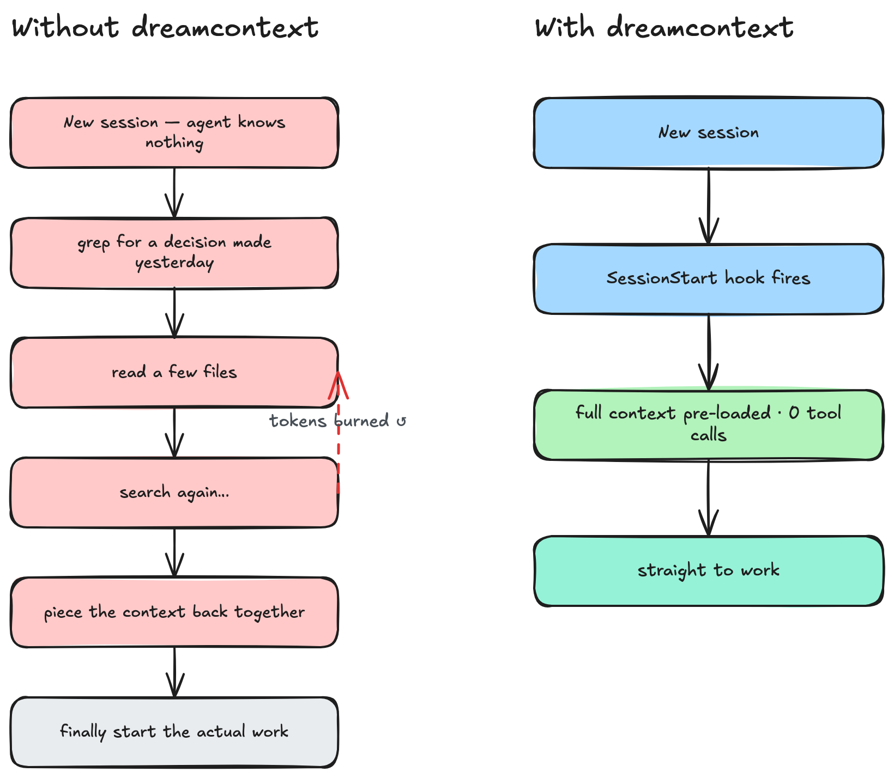
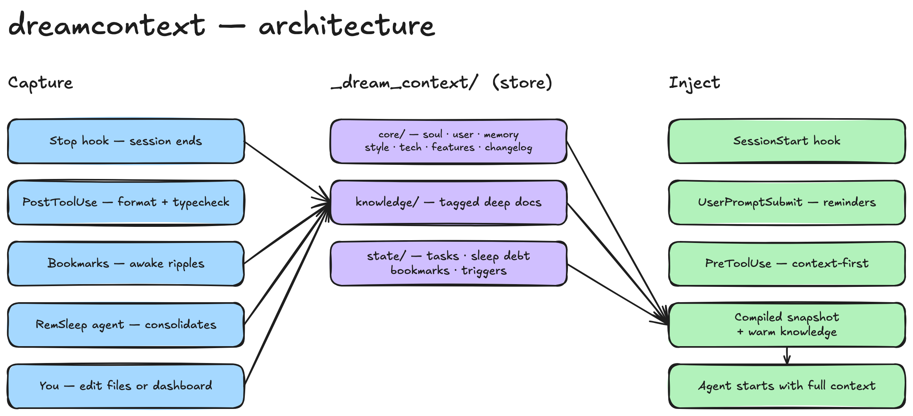
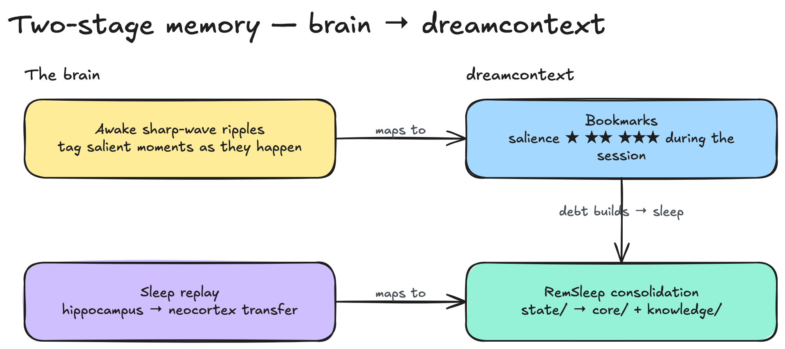
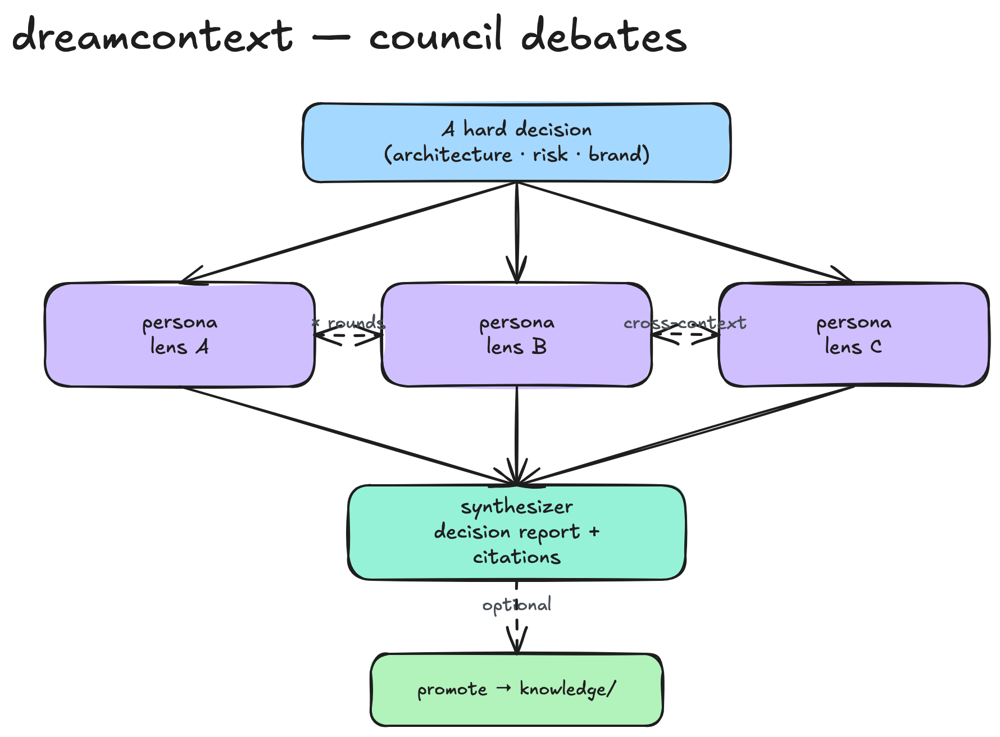

<p align="center">
  
</p>

<h1 align="center">Deep Dive</h1>

<p align="center">
  The philosophy, architecture, and design decisions behind dreamcontext.<br/>
  For setup and commands, see the <a href="README.md">README</a>.
</p>

<p align="center">
  <a href="#why-it-exists">Why It Exists</a> &nbsp;&middot;&nbsp;
  <a href="#the-problem-in-depth">The Problem</a> &nbsp;&middot;&nbsp;
  <a href="#the-architecture">Architecture</a> &nbsp;&middot;&nbsp;
  <a href="#the-hook-mechanism">Hooks</a> &nbsp;&middot;&nbsp;
  <a href="#the-sleep-cycle">Sleep Cycle</a> &nbsp;&middot;&nbsp;
  <a href="#neuroscience-inspired-memory">Neuroscience</a> &nbsp;&middot;&nbsp;
  <a href="#the-dashboard">Dashboard</a> &nbsp;&middot;&nbsp;
  <a href="#council-debates">Council</a> &nbsp;&middot;&nbsp;
  <a href="#memory-recall-bm25-over-the-curated-corpus">Memory Recall</a> &nbsp;&middot;&nbsp;
  <a href="#obsidian-integration">Obsidian</a> &nbsp;&middot;&nbsp;
  <a href="#cli-design">CLI</a> &nbsp;&middot;&nbsp;
  <a href="#install--update">Install &amp; Update</a> &nbsp;&middot;&nbsp;
  <a href="#design-tradeoffs">Tradeoffs</a>
</p>

---

## Why It Exists

I built `dreamcontext` because AI coding agents, even the best frontier models, make mistakes that require human judgment to catch. Not small mistakes. Mistakes that would be catastrophic in production.

Here is what I have seen them do, repeatedly, across real projects:

- **Fetch entire collections** instead of filtering at the query level. The data is right there in a Firestore query or a SQL WHERE clause, but the agent pulls everything into memory and filters in code. On any real dataset, that is a performance disaster and a cost explosion.
- **Write serverless functions with infinite loop potential.** Cloud functions that trigger on a write, then write back to the same path, with no circuit breaker. No recursion guard. Just a function that passes its test and would drain your billing in production.
- **Skip index checks, error health, and monitoring.** The agent writes the happy path. The test passes. But there is no error boundary, no retry logic, no alerting, no index on the field it just queried. The kind of thing an experienced engineer catches in review because they have seen it fail before.
- **Optimize for test passing, not system correctness.** An agent will reshape code until the test goes green. That does not mean the implementation is right. It means the test was satisfied. The gap between those two things is where production incidents live.

These are not edge cases from small models. These are the top-of-the-line frontier models on real projects. Maybe an agent can handle a simple frontend on its own, or wire up a small database. But the moment you have complex edge cases, serverless architectures with real scaling concerns, or acceptance criteria that require product judgment, **a human engineer needs to be steering.** And steering only works when both sides have clear visibility into what is happening: what decisions were made, what work is in progress, what rules to follow, and what was tried before.

That is what `dreamcontext` is. Not just memory for agents. **A shared context layer that both you and your agent can read, audit, and act on.** When I open my project's context files, I can see exactly what the agent knows, correct what it got wrong, and make sure the next session starts with accurate information.

The problems that make this necessary are not accidental. **They are structural limitations of how agent memory works today.**

## The Problem in Depth

<p align="center">
  
</p>

### The search spiral

You ask the agent to work on a task. The task references something, maybe a caching strategy you decided on two weeks ago. One paragraph. A clear decision that already lives somewhere in your project. But the agent does not know that. So it starts digging.

It greps for "cache." Finds 14 matches across 8 files. Reads 3 of them. Realizes those are implementation files, not the decision. Searches for "strategy." Reads 2 more files. Finds a comment that references a config pattern. Reads the config. Now it searches for where that config is used. Reads 2 more files. Finally pieces it together.

Three minutes. Multiple tool calls. Context window already filling up. And then it says: *"Ok, now I completely understand the codebase. Let me plan the implementation."*

**You have not started working yet.** You have been watching your agent do archaeology on a decision it already knew yesterday. This happens every session. And it scales with your project. More files, more decisions, more things to re-discover. **You are paying for search, not for work.**

<table>
<tr>
<td width="50%" align="center">
<br/>
<em><strong>Without dreamcontext</strong><br/>The agent does archaeology on decisions<br/>it already knew yesterday.</em>
</td>
<td width="50%" align="center">
<br/>
<em><strong>With dreamcontext</strong><br/>The decision is already in the snapshot.<br/>One read if needed. No spiral.</em>
</td>
</tr>
</table>

### Single memory files don't scale

A `CLAUDE.md` works for small projects. "Use tabs. Prefer functional. API is in `/src/api`." That is fine when your project is simple.

But when you have 200 files, 15 active decisions, 3 in-progress features, and a deployment process with edge cases, **one file either balloons into a wall of text the agent skims past, or stays too shallow to help.**

Think about it: identity and principles, user preferences, technical decisions, task progress, deep reference docs. These are structurally different types of knowledge. They change at different rates, serve different purposes, and need different formats. Putting them in one file is like storing your calendar, contacts, journal, and reference library in one document. **It works until it doesn't.**

### Search is the wrong approach for baseline context

It does not matter how your agent searches. Grep, glob, fuzzy match, RAG, vector store. The search technology is not the problem. **The problem is that search is the wrong approach for baseline context.**

Every time your agent greps for a function, reads a file to remember a decision, or globs for config files to understand project structure, it is spending tokens. Tool calls, output parsing, reasoning about what to search next. Whether that is a local `rg` call or a vector similarity query, the cost is the same: tokens and time burned on re-discovery instead of actual work.

Your agent should not need to search for who it is, what it is working on, or what decisions were already made. That is not a search problem. **That is baseline context that should already be there when the session starts.**

The write side has the same issue. Adding a technical decision, logging task progress, and creating a knowledge doc are structurally different operations. They belong in different places with different formats. A flat append to a single file cannot express that difference.

And when it comes time to retrieve, structure is what makes the difference between a clean answer and noise. "What are my active tasks?" is a directory listing, not a search query. "What does the soul file say about error handling?" is a file read, not a fuzzy match across everything. When your context is structured, you don't need clever retrieval. You just go to the right place.

### Closed memory systems lock you out

Some tools offer built-in memory behind their API. Sometimes you can see what the agent "knows." Sometimes you can even edit it. But **every interaction ties you deeper to that platform.** You can copy-paste to another tool, export to a file, find workarounds. But should you have to struggle with friction just to access your own project's context?

When you switch tools, or the service changes its API, or you want to work offline, that knowledge is trapped behind someone else's interface. **The friction is the lock-in.** Not a hard wall, just enough resistance that most people stop trying.

**Your agent's memory should be files in your repo.** Markdown and JSON. Readable, editable, diffable. You should be able to open your agent's understanding of your project in any text editor, fix a wrong assumption, and commit the change. That is ownership.

## The Architecture

<p align="center">
  
</p>

Human brains don't store everything in one region. Your prefrontal cortex handles identity and decision-making. Your temporal lobe stores facts and relationships. You have procedural memory for skills you don't think about, and working memory for what you are actively doing. Different types of knowledge, different storage.

`dreamcontext` takes inspiration from this structure:

| Brain Region | dreamcontext | What it holds |
|---|---|---|
| Prefrontal cortex | `0.soul.md` | Identity, principles, rules, constraints |
| Episodic memory | `1.user.md` | Your preferences, project conventions, workflow |
| Semantic memory | `2.memory.md` | Decisions, known issues, technical context |
| Sensory cortex | `3.style_guide_and_branding.md`, `4.tech_stack.md` | Style, tech stack, data structures |
| Declarative memory | `features/` | Feature PRDs with user stories, acceptance criteria, constraints |
| Long-term knowledge | `knowledge/` | Deep docs, tagged with standard categories, pinnable for auto-loading |
| Working memory | `state/` | Active tasks, in-progress work |
| Skill memory | `SKILL.md` | Teaches the agent the system itself |

The `_dream_context/` directory is the implementation. Everything lives in your repo, structured and version-controlled.

### How each piece works

**Soul** (`0.soul.md`) defines who the agent is when working on your project. Project identity, core principles, behavioral rules, constraints, and warnings. For example: *"Never use `require()` in this project"* or *"Always run tests before considering a change complete."* This is the most stable file. It changes rarely and sets the foundation for everything else.

**User** (`1.user.md`) captures your preferences, communication style, and workflow conventions. For example: *"No em dashes in writing, restructure the sentence instead"* or *"Make decisions directly, don't ask for permission on clear choices."* Tech stack details go in their own extended core file. **User is about how you work, not what you work with.**

**Memory** (`2.memory.md`) is the working log of technical decisions, known issues, and session-level learnings. For example: *"Chose Postgres over MongoDB because the data is highly relational"* or *"The auth middleware must run before rate limiting, not after."* It follows LIFO ordering (newest at top) and is the file that changes most frequently. The sleep cycle keeps it from growing out of control.

**Extended core files** (slots 3-6) hold specialized context: style guide and branding, tech stack, data structures, and the system-flow reference. These are loaded as summaries in the snapshot with paths included, so the agent knows they exist without burning tokens loading the full content every session.

**Knowledge** (`knowledge/`) is where deep reference docs live. Architectural context, domain knowledge, research, design rationales. For example: a doc on *"payment-flow-architecture"* tagged with `[architecture, payments, api]` explaining the full Stripe integration and edge cases. Each file has frontmatter with tags and descriptions. The snapshot surfaces a complete index so the agent knows what docs exist. Files marked `pinned: true` get loaded in full every session for frequently-needed reference.

**State** (`state/`) holds active work: task files with progress logs and a sleep state file tracking consolidation debt. A task like *"migrate-to-postgres"* would have status, priority, and a LIFO log of every step taken. Tasks follow a lifecycle (pending, in-progress, blocked, completed).

## The Hook Mechanism

The core insight: **don't make the agent search for its own context.**

`dreamcontext` uses seven hooks that run outside the agent's context window. They execute in the shell, not in the agent's reasoning loop. No tool calls, no token cost, no context window pressure.

### Stop Hook

Fires when a session ends. Reads the session ID and transcript path from Claude Code, then analyzes the transcript in two ways: counting Write/Edit tool uses (changes) and counting all tool calls (tools). Scores sleep debt based on the higher signal:

| Signal | 1-3 / 1-15 | 4-8 / 16-40 | 9+ / 41+ |
|--------|------------|-------------|----------|
| Changes (Write/Edit) | +1 | +2 | +3 |
| Tools (all calls) | +1 | +2 | +3 |

The final score is `max(changeScore, toolScore)`. This ensures Bash-heavy sessions or deep research sessions that make no file writes still accumulate proper debt.

Beyond scoring, the stop hook also:
- **Links bookmarks to the session.** Any bookmarks created during the session that don't have a `session_id` get linked.
- **Increments the rhythm counter.** `sessions_since_last_sleep` tracks how many sessions have passed since the last consolidation.

Saves the full session record to `.sleep.json`: session ID, transcript path, timestamp, change count, tool count, debt score, and the agent's last message (what it accomplished). Each concurrent session gets its own entry.

### SessionStart Hook

Fires before the agent sees your first message. Compiles and injects a full context snapshot:

1. **Soul + User + Memory** loaded in full (the agent's identity, your preferences, accumulated decisions). `2.memory.md` now contains only Decisions + Known Issues — the LIFO section was removed 2026-05-23; quick captures route through CHANGELOG via `memory remember`.
2. **Extended core files** surfaced as summaries with paths (style guide, tech stack, data structures, system flow)
3. **Active tasks** with status, priority, last update timestamp, and `why:` excerpt (capped at 250 chars, HTML template comments stripped)
4. **Bookmarks** sorted by salience (critical first), showing tagged moments from previous sessions
5. **Contextual reminders** from triggers matching active task names, tags, or bookmark text
6. **Recent CHANGELOG (tiered)** — top 3 entries detailed (summary + first ~300 chars of description), next 10 entries titles-only under an `### Older` subheading. Tier sizes configurable via constants at the top of `src/cli/commands/snapshot.ts`. Older entries remain searchable through `memory recall --types changelog`.
7. **Upcoming versions** (planning releases) and **latest release** with version, date, summary, and included task/feature counts
8. **Features** with the `Why:` excerpt (capped at 250 chars, HTML template comments stripped), related tasks, and latest changelog entry per feature
9. **Knowledge index** with slug, description, tags, and staleness indicators (30+ days without access). **Pinned files surface at the top of the index with a prominent warning** — the agent loads the body on demand via the surfaced path (body inlining removed 2026-05-23 to keep snapshot bounded).
10. **Warm knowledge** for recently accessed or task-relevant files (first paragraph preview)

A dedicated **Sleep State** block used to appear here. It was removed 2026-05-23 — consolidation pressure now lives in the SessionStart consolidation directive prepend (when debt is high or critical bookmarks exist) and the persistent UserPromptSubmit hook one-liner. The standalone block was duplicative.

Every file path is included in the output. If the agent needs more detail on something, it knows exactly where to look. One targeted read instead of a search spiral.

Consolidation directives fire based on multiple signals: debt 4-6 (offers consolidation at natural breaks), debt 7-9 (actively suggests sleeping), debt 10+ (strong recommendation), critical bookmarks (immediate advisory regardless of debt), and 3+ sessions since last sleep (rhythm check). The agent sees these before your first message and can plan accordingly. The UserPromptSubmit hook repeats reminders on every user message for debt >= 4, making them persistent.

### SubagentStart Hook

Fires when any sub-agent launches (Explore, Plan, or custom agents). Injects a lightweight briefing: project summary (capped at 120 characters), directory structure, active tasks, knowledge index, and pinned knowledge.

This is intentionally lighter than the full snapshot. Sub-agents are task-focused and short-lived. They need enough context to check existing knowledge and avoid duplicating work, not the full project state. The briefing fires for all sub-agents, including dreamcontext's own (the initializer and the RemSleep specialists). The extra context does not conflict with their dedicated prompts.

### PreToolUse Hook

Fires before a tool executes. Currently used for one purpose: blocking the default Explorer sub-agent when `_dream_context/` exists.

The problem: Claude Code's default Explorer has its own built-in system prompt that cannot be overridden by `additionalContext` injection (SubagentStart context is lower priority). When exploring a project with curated context files, the default Explorer ignores the curated knowledge and burns 100K-150K tokens re-reading files that are already summarized in `_dream_context/`.

The solution: the PreToolUse hook detects when `subagent_type` is `"Explore"` and `_dream_context/` exists, then returns a JSON deny response directing the main agent to use the `dreamcontext-explore` custom agent instead. This agent has identical tool access but reads `_dream_context/` files first, returns immediately if the answer is already in the curated context, and only falls back to full codebase search when needed.

This asymmetric strategy (full replacement for Explorer, additive injection for Plan) was a deliberate design choice. Explorer's behavior directly contradicts curated context. Plan's behavior (offering task creation) is additive and works fine with SubagentStart injection.

### UserPromptSubmit Hook

Fires on every user message. Reads sleep debt from `.sleep.json` and outputs a one-line reminder when debt is 4 or higher. Silent when debt is below the threshold. Read-only, no state writes.

Why this hook and not SessionStart? SessionStart fires once per session. Agents can (and do) dismiss it as context pressure pushes out behavioral instructions. UserPromptSubmit fires on every user turn. When the user sends a message, the agent must process the reminder again before generating its next reply. This is the closest analog to persistent awareness.

The reminder format is compact (one line) unlike the multi-line directives in the SessionStart snapshot. Same debt thresholds (4/7/10/critical bookmarks), but condensed for inline display. Critical bookmarks override the threshold and always trigger a reminder.

This hook has grown to carry three responsibilities, all read-only and all best-effort (wrapped in try/catch so a failure never breaks the prompt):

1. **Sleep-debt reminder** — the one-liner described above.
2. **Memory recall injection** — top BM25 hits for the prompt, surfaced inline (see [Memory Recall](#memory-recall-bm25-over-the-curated-corpus)).
3. **The context gate** — on a non-trivial prompt that matches a skill domain, the hook prepends a short "get the full picture first" block: read the recalled knowledge in full, **review the entire skill catalog already injected by the harness and invoke whatever fits** (explicitly *not* a pre-picked subset), recall more if needed, and check whether a task already exists before starting untracked work. An earlier version listed a top-3 skill subset; that was removed after four iterations because narrowing the agent's view of its own toolkit was worse than telling it to scan everything and decide. The hook's internal relevance check only decides *whether* to fire the gate — it never narrows *which* skills the agent considers.

### PostToolUse Hook

Fires after every Edit or Write tool call on JS/TS files. Runs two checks sequentially:

**Auto-format.** Walks up from the edited file (max 10 levels) looking for Biome config (`biome.json`, `biome.jsonc`) or Prettier config (11 variants: `.prettierrc`, `.prettierrc.json`, `.prettierrc.yaml`, etc.). Biome is preferred when both exist (faster, encompasses both formatting and linting). Runs the formatter via the project's local binary (`node_modules/.bin/`) with `npx` as fallback. Silent on failure.

**Type-check.** Walks up for `tsconfig.json`, runs `tsc --noEmit --incremental --pretty false`, and filters output to only errors in the edited file (absolute and relative path matching). Errors are fed back to the agent via `additionalContext` JSON so it can self-correct on the next turn. First tsc run takes ~5 seconds (full type-check), subsequent runs under 1 second (incremental cache).

The directory walk-up for both formatter and tsconfig detection is merged into a single pass (`findProjectConfig()`) to avoid redundant I/O. All subprocess calls use `execFileSync` with array arguments (no shell interpolation) to prevent command injection via file paths.

PostToolUse cannot block (the tool already ran). It provides feedback, not gatekeeping.

### PreCompact Hook

Fires before Claude Code compacts the context window (both manual and auto-triggered). Saves a compaction record to `.sleep.json`:

- Timestamp
- Trigger type (manual or auto)
- Current debt level
- Session count and bookmark count at the time of compaction

Records are stored in `compaction_log[]` (LIFO, capped at 20 entries). This provides an audit trail of when and why context was lost, which is useful for debugging agent behavior gaps after compaction events.

### The flow

```
Session ends
  → Stop hook fires                                  runs in shell
  → Captures last message + transcript               what the agent accomplished
  → Analyzes changes + tools, scores debt            dual-signal scoring
  → Links bookmarks to session                       awake ripple attachment
  → Increments sessions_since_last_sleep             rhythm tracking
  → Session record saved to .sleep.json              full context preserved

Between sessions
  → You use the dashboard or edit files               human-side work
  → Dashboard changes recorded to .sleep.json         change tracking closes the loop

Next session starts
  → SessionStart hook fires                          runs in shell
  → Snapshot injected: soul, user, memory,           zero tool calls
    core summaries, tasks, bookmarks,
    contextual reminders, sleep state,
    session history, sleep history,
    dashboard changes, latest release,
    features, changelog, knowledge index,
    warm knowledge, pinned docs
  → Consolidation advisory if:                       critical bookmarks, debt >= 4,
    debt >= 10, or 5+ sessions                       or rhythm check
  → You ask your question.
  → Agent is already at full capacity.

During work
  → UserPromptSubmit fires on each message           persistent debt reminder
  → PostToolUse fires after Edit/Write               auto-format + tsc check
  → Errors fed back via additionalContext             agent self-corrects
  → PreToolUse fires before tool execution           blocks blind Explorer
  → dreamcontext-explore used instead                context-first exploration

Before compaction
  → PreCompact hook fires                            runs in shell
  → Saves compaction record to .sleep.json           audit trail of context loss

Sub-agent launches
  → SubagentStart hook fires                         runs in shell
  → Lightweight briefing injected:                   project summary, tasks,
    knowledge index, pinned docs                     avoids blind exploration
```

## The Sleep Cycle

<p align="center">
  
</p>

Humans consolidate memory during sleep. Your hippocampus replays the day, extracts patterns, strengthens important connections, and discards noise. Without consolidation, memory degrades. It is not optional. It is how learning works.

Agents face the same challenge. Over multiple sessions, your agent accumulates knowledge: decisions, patterns, problems solved, tasks completed. Without consolidation, that knowledge either gets lost when the session ends or piles up in context files until they are too noisy to be useful. **Good context files don't happen by accident.** They need the same kind of maintenance a good engineer applies to their own notes.

`dreamcontext` consolidates through a **RemSleep** cycle. There is no single sleep agent and no separate orchestrator: the main agent runs the cycle directly and fans out to three specialist sub-agents in parallel, each owning a non-overlapping slice of the context so they never overwrite each other's work.

1. **Debt accumulates automatically.** The Stop hook scores each session based on both file changes and total tool calls. No manual tracking needed. The score reflects how much new knowledge was generated.
2. **Bookmarks prioritize what matters.** During active work, the agent tags important moments (decisions, constraints, bugs) with salience levels. The specialists read bookmarks first, ordered by salience, so critical decisions are never lost in a pile of routine session summaries.
3. **Transcript distillation provides depth on demand.** For sessions with critical bookmarks or unclear summaries, the cycle calls `transcript distill` to get a structurally filtered view: user messages, agent decisions, code changes, errors. No noise from Read results or Glob output.
4. **The agent responds with graduated awareness.** Consolidation triggers fire based on multiple signals: debt level, critical bookmarks, and session rhythm (see table below).
5. **The three specialists consolidate in parallel.** `sleep-tasks` (always fired) reconciles task files — bumps statuses, creates tasks for untracked work, attaches them to the active planning version. `sleep-state` (always fired) owns the core files (soul, user, memory, the extended core 3–6), the changelog, and releases — promotes learnings, writes a changelog entry for every meaningful change, and enforces the anti-bloat ceiling. `sleep-product` (fired conditionally, when research or new patterns warrant) owns knowledge docs and feature PRDs — extracts and dedupes knowledge, updates feature progress. Collectively they review bookmarks first, then session records, **detect recurring patterns** (repeated user preferences, workflow sequences, recurring errors, bookmark themes), create contextual triggers for future sessions, update summaries, and clean stale entries using knowledge access data. (The fan-out collapsed from an original five specialists to three in v0.3.0 — merging core+changelog into `sleep-state` and knowledge+features into `sleep-product` — to cut launch and synthesis overhead while preserving the no-stomp guarantee.)
6. **History is preserved.** Each consolidation cycle writes a history entry: date, summary, debt before/after, sessions and bookmarks processed. The snapshot shows the last 3 entries so the agent knows what was recently consolidated.
7. **Debt resets.** After consolidation, debt recalculates (only post-epoch sessions count), bookmarks and sessions from before the epoch are cleared, triggers past their fire limit expire, the rhythm counter resets, and the cycle starts fresh.
8. **Next session**, the agent wakes up knowing its debt level, consolidation history, any remaining bookmarks, active triggers, and what the previous session accomplished.

### Debt levels

| Debt | Level | Behavior |
|------|-------|----------|
| 0-3 | Alert | Works normally |
| 4-6 | Drowsy | Mentions consolidation at natural breaks |
| 7-9 | Sleepy | Actively suggests sleeping, snapshot includes a reminder |
| 10+ | Must Sleep | Snapshot strongly recommends consolidation, defers to user if there is urgent work |

### Additional consolidation triggers

| Signal | Advisory |
|--------|----------|
| Critical (salience 3) bookmark exists | Immediate advisory regardless of debt level |
| 3+ sessions since last sleep | Rhythm check advisory |

Each cycle, the agent's context gets cleaner and more structured. Not because the agent "learns" in a human sense, but because consolidation enforces discipline: promote what matters, archive what is done, delete what is stale. Over time, the context files become a progressively better representation of your project's state.

Because sleep debt is tracked as real state (persisted in `.sleep.json`, surfaced in the snapshot, enforced by graduated directives), the system actually drives consolidation instead of hoping the agent remembers to do it. I tested the alternative: when sleep tracking lived in prompt instructions rather than hooks, the agent forgot to consolidate most of the time. **Context pressure pushes out behavioral instructions. Hooks don't have that problem.**

## Neuroscience-Inspired Memory

<p align="center">
  
</p>

The memory system draws from a 2025 Science paper (Joo & Frank) that revealed how the hippocampus actually selects which memories to consolidate. The brain does not replay everything equally during sleep. During the day, the hippocampus fires "awake sharp-wave ripples" that bookmark important moments. During sleep, bookmarked memories compete for consolidation, with only the strongest patterns winning transfer to the neocortex.

The key insight: **memory selection and memory consolidation are separate processes.** Selection (tagging) happens during active work. Consolidation (storage) happens during sleep. Getting consolidation right is not enough if the system has no way to distinguish a critical architectural decision from a routine file read.

### How the mapping works

| Brain Mechanism | dreamcontext Feature |
|---|---|
| Hippocampus (working memory) | `state/` files (active tasks, sleep state) |
| Neocortex (long-term storage) | `core/` files (soul, user, memory), `knowledge/` files |
| Awake sharp-wave ripples | `bookmark add` (tag moments for consolidation) |
| Neural competition (strongest win) | Salience scoring (critical bookmarks trigger consolidation) |
| Memory decay (unused synapses weaken) | Knowledge access tracking (staleness indicators at 30+ days) |
| Sleep rhythm (every night) | Session count rhythm (advisory every 5 sessions) |
| Spreading activation | Warm knowledge tier (recently accessed files get first-paragraph preview) |
| Prospective memory ("do X when Y") | Contextual triggers (remind about X when task Y is active) |
| Hippocampal filtering | Transcript distillation (structural filter keeps signal, discards noise) |
| Sleep consolidation | RemSleep cycle (compressed replay into core files) |
| Inhibitory neurons | Anti-bloat pass (~150-line ceiling on core files, prune stale knowledge) |
| Synaptic plasticity | LIFO ordering (recent info surfaces first) |
| Immune system (error correction) | PostToolUse hook (auto-format + tsc check on every edit) |
| Attention gating | PreToolUse hook (blocks noisy exploration when curated context exists) |
| Persistent neural signals | UserPromptSubmit hook (undismissable debt reminders) |
| Autobiographical memory logging | PreCompact hook (audit trail of context loss events) |

### Bookmarks (awake ripples)

During active work, the agent calls `bookmark add "<message>" -s <salience>` to tag important moments. Three salience levels:

- **1 (notable)**: Useful pattern discovered, minor decision
- **2 (significant)**: Architectural decision, user preference, meaningful bug
- **3 (critical)**: Breaking change, fundamental constraint, non-negotiable rule

The SKILL.md teaches the agent when to auto-bookmark. The stop hook links bookmarks to their session. The sleep agent processes bookmarks first, in salience order. Critical bookmarks become must-consolidate items.

### Knowledge decay

Knowledge files accumulate but not all remain relevant. The system tracks access via `knowledge touch <slug>`, recording when each file was last read and how often. Files not accessed in 30+ days get staleness indicators in the snapshot. The sleep agent uses access data during its anti-bloat pass: stale files are candidates for archival, frequently accessed files for pinning.

### Warm knowledge

Between the knowledge index (just titles and tags) and pinned knowledge (full content), there is a warm tier. Files accessed in the last 7 days or with tags matching active tasks get their first paragraph loaded into the snapshot. The agent often has just enough context to decide whether to read the full file, without burning tokens loading everything.

### Contextual triggers

The sleep agent creates triggers when it spots context-dependent decisions during consolidation. A trigger stores a "when" keyword and a "remind" message. During snapshot generation, triggers are matched against active task names, tags, and bookmark text. Matching triggers surface as contextual reminders at the top of the snapshot. Triggers auto-expire after a configurable number of fires (default 3) to prevent noise.

### Transcript distillation

Raw JSONL transcripts can be tens of thousands of lines. The `transcript distill` command applies structural filtering (pure Node.js, no AI): keeps user messages, agent reasoning, Write/Edit calls, modifying Bash commands, bookmark calls, and errors. Discards Read results, Glob output, tool metadata, and subagent internals. The sleep agent calls this selectively for sessions that need deep analysis.

## The Dashboard

The CLI and hooks handle the agent side. But context is a shared layer, and the human needs a way to work with it too. Opening markdown files in a text editor works, but it is not the best experience for managing tasks, reviewing sleep state, or browsing features. The dashboard fills that gap.

`dreamcontext dashboard` starts a local HTTP server and opens a web UI. No external services, no accounts, no network calls. It reads and writes the same `_dream_context/` files the CLI uses. There is no separate database.

### What it provides

**Kanban board.** Tasks displayed as cards across columns (To Do, In Progress, Completed). Drag a card to change status. Multi-select filters for status, priority, urgency, tags, and version, with type-ahead search for long lists. Sort by date, priority, urgency, or name. Group by status, priority, urgency, tags, or version, with optional sub-grouping. Click a task to open a Notion-style detail panel with properties block, rendered markdown body, and changelog.

**Eisenhower matrix.** A 2x2 priority-urgency quadrant view (Do First, Schedule, Delegate, Don't Do). Automatically excludes completed tasks so the matrix focuses on actionable work. Toggle between Kanban and matrix views from the filter bar.

**Core file editor.** All core files listed in a sidebar. Markdown files open in a split-pane editor: textarea on the left, live preview on the right. JSON files display formatted. SQL files (like `5.data_structures.sql`) render a visual ER diagram showing entities, fields, types, and foreign key relationships.

**Knowledge manager.** Search across knowledge files by name, description, and tags. Pin and unpin files directly. Clicking a file shows its full content.

**Features viewer.** All feature PRDs listed with status badges and tags. Click to see the full PRD: Why, User Stories, Acceptance Criteria, Constraints, Technical Details, Changelog.

**Sleep tracker.** A debt gauge with color coding by level (green through red). Session history timeline showing what happened in each session. A list of every dashboard change made since the last consolidation.

**Brain graph.** An interactive force-directed graph of your project's knowledge. Nodes are memory entries, knowledge docs, features, and core decisions; edges are explicit cross-references and inferred links from shared tags and slugs. A node drawer opens the full content inline when you click. A settings panel controls layout strength, link weighting, label visibility, and node-type filters. The graph view is what "scattered context" looks like when it's actually connected.

**Council Hall.** Every multi-persona debate rendered as a searchable card grid. Click a card to open a full-page detail view with a back button and three tabs:

- **Overview** — the Problem (the question that triggered the debate) as the hero block, followed by the synthesized final report. Sections are extracted dynamically from the report's `##` headings — the synthesizer is free to emit whatever sections fit the decision (Why, What was missing, Risks, Revision priorities, etc.) and they all render as cards. Citation chips in the format `slug in RN` jump to the matrix cell; inline `**slug**` mentions jump to the agent's full transcript.
- **Agents** — a persona-centric, searchable, collapsible transcript. One block per persona with all rounds LIFO, plus the cross-context they received before each round and any research notes they persisted.
- **Matrix** — persona × round grid. Each cell shows a compact position chip (GO / DEFER / HOLD / PIVOT, color-coded) plus the round's executive summary. Click a cell to expand it in place with the full Position / Reasoning / Reactions / Open questions sections. Peer reaction chips are clickable. Keyboard navigation: ← → across rounds, ↑ ↓ across personas, Esc to clear. Text filter dims non-matching cells.

### Change tracking

This is the piece that ties the dashboard back to the agent. Every action taken through the dashboard (creating a task, editing a core file, pinning knowledge, updating a field) is recorded in `.sleep.json` as a `dashboard_changes` entry. Each entry captures the timestamp, entity type, action, target, and a human-readable summary.

When the agent starts its next session, the snapshot includes these changes. The RemSleep specialists read them during consolidation and fold the human's work into the project context. This closes the loop: the agent learns what you did between sessions without you telling it.

Field-level change tracking goes further. If you change a task's priority from "medium" to "high," the change record captures both the old and new values, not just "task updated." Net-change detection folds redundant changes: if you change priority from medium to high, then high to critical, only one record survives (medium to critical). If you change something and then change it back, the record is removed entirely. This keeps the change list clean for the agent to process.

### Technical decisions

The server uses Node.js native `http` module with zero new runtime dependencies. Routes are thin wrappers around the same `src/lib/` utilities the CLI uses. The React app (React 19 + Vite 6) is built separately and the output is copied to `dist/dashboard/` during the build. React dependencies live in `dashboard/package.json`, isolated from the CLI's dependencies.

The design uses a custom CSS system with design tokens (purple-to-magenta brand gradient, HSL colors, 4px grid, light/dark mode with system preference detection). No CSS framework. The Visby CF font is the brand font with a system font fallback for environments where it is not installed.

**Version manager.** A full-width modal showing planning and released versions with task counts and status badges. Planning versions have a "Release" button that transitions their status and sets the release date. Create new planning versions directly from the dashboard. Versions and releases are unified in `RELEASES.json` (a version is a release entry with `status: planning`).

### Security model

The dashboard is a **local-only tool** with no login — it reads and writes your `_dream_context/` files (soul, tasks, sleep state) over unauthenticated routes. That is the right tradeoff *only* if the server is reachable by you and nothing else, so the server is locked down to enforce exactly that. These four mitigations were hardened before the first public release:

- **Loopback bind.** `server.listen` binds to `127.0.0.1`, not `0.0.0.0`. The dashboard is reachable only from your own machine — never from other devices on the same Wi-Fi or LAN. (Binding to `0.0.0.0` would have exposed read/write access to your project files to anyone on the network.)
- **CSRF guard.** Mutating routes (`POST`/`PUT`/`PATCH`/`DELETE`) check the request's `Origin`/`Host` and reject cross-site writes. Without this, any website you visit with the dashboard open could silently `POST` to `localhost` and edit your project.
- **CORS lockdown.** No wildcard `Access-Control-Allow-Origin: *`. The server reflects only the loopback origin, so cross-origin reads are refused.
- **Path-traversal guard.** Request-derived file paths (e.g. `/api/core/:filename`) pass through `safeChildPath`, which resolves the target and confirms it stays inside the context directory. `../` escape attempts are rejected before any file is touched.

The full threat model and the anti-regression invariants live in `_dream_context/knowledge/dashboard-server-security.md`, backed by `tests/unit/server-security.test.ts`.

### Release management

Versions and releases live in a single `RELEASES.json` file. A "version" is a release entry with `status: planning`. When released, the status changes to `released` and the date is set automatically. This eliminates the need for a separate versioning system.

The `core releases add` command auto-discovers unreleased items when creating a release: completed tasks without a `released_version`, active features without a `released_version`, and changelog entries since the last release. In interactive mode, you select which items to include via checkboxes. In non-interactive mode (`--yes`), everything unreleased is included automatically. Use `--status planning` to create a version placeholder without auto-discovery, with empty task/feature/changelog arrays.

After recording a released entry, the command back-populates `released_version` on included features. This means the next release correctly excludes already-released items. `core releases list` and `core releases show` let you review release history.

The snapshot includes both "Upcoming Versions" (planning entries) and "Latest Release" (most recent released entry) so the agent always knows what is planned and what was last shipped. Tasks can be assigned to planning versions via the `version` field, and the sleep agent checks whether all tasks for a planning version are complete during consolidation.

## Council Debates

<p align="center">
  
</p>

Some decisions are too load-bearing for a single model pass. Architecture choices that will shape the system for a year. Hiring reviews where the wrong read means the wrong hire. Risk-heavy migrations where one missed edge case is a production incident. Brand critiques where one loud voice can flatten dissent.

For those, dreamcontext ships a **council**: a structured, multi-persona, multi-round deliberation with a synthesized verdict. Each persona is its own sub-agent with a scoped prompt, a model choice, and a set of aspects it advocates for. The council runs in rounds. Between rounds, each persona receives a cross-context panel summarizing what every other persona said, so round 2 is not a repeat of round 1 — it is personas responding to each other. At the end, a synthesizer produces the final report.

### Why rounds

A single-pass multi-agent debate collapses into either groupthink (if the model sees everyone's draft at once, it averages) or anchoring (whoever spoke first sets the frame). Rounds prevent both.

- **Round 1** is blind. Every persona writes against the same prompt without seeing peers. You get genuine independent positions.
- **Round 2+** is informed. Each persona sees a cross-context summary of every peer's round-1 submission, then writes a fresh round. Positions sharpen, converge, or explicitly dissent — but always with awareness of the room.

Three rounds is the sweet spot for hard decisions. Two rounds is enough for tactical calls. One round with synthesis is a "council lite" for sanity checks.

### Structure on disk

Each debate lives in its own folder:

```
_dream_context/council/<id>/
├── debate.md                    # frontmatter: topic, status, rounds_planned, current_round, personas[], timestamps
├── round-log.md                 # append-only timeline: who submitted, when, with what exec summary
├── final-report.md              # synthesizer output (emitted after all rounds close)
└── <persona-slug>/
    ├── context-and-persona.md   # persona prompt + injected "## Round N — Cross-context loaded" for N ≥ 2
    ├── report.md                # LIFO round entries: Executive Summary / Position / Reasoning / Reactions / Open questions
    └── researches/              # optional per-persona research notes, indexed in researches/index.json
        └── <slug>.md
```

Lifecycle: `created → round_N_running → round_N_complete → synthesizing → complete` (+ optional `promoted_to_knowledge`).

This shape is deliberate. The persona folder is the unit of truth for that voice — you can open any `context-and-persona.md` and see exactly what that persona was instructed to be and what cross-context it received. The `report.md` is LIFO so the newest round is always at the top. The `final-report.md` cites personas by `slug in RN` which the dashboard wires up as jump links.

### Sub-agents

Two sub-agents ship with the council feature:

- **`council-persona`** — a generic persona runner. It's invoked per-round per-persona with the persona prompt, the round number, and (for N ≥ 2) the cross-context. It produces a report matching the five-section template: Executive Summary / Position / Reasoning / Reactions to peers / Open questions. The Reactions section uses `**slug**:` syntax so the dashboard can turn peer mentions into clickable chips.

- **`council-synthesizer`** — reads every persona's `report.md`, the round log, and any research notes, and produces `final-report.md`. The synthesizer is free to structure the report however fits the decision. It always emits `## Verdict` and `## Appendix: per-agent per-round summaries`; the middle sections (`## Why`, `## What was missing`, `## Open risks`, `## Minority views`, whatever is load-bearing for this call) vary by debate. The dashboard parses whatever H2 sections exist rather than hardcoding a schema.

### Synthesizer readability rules

The synthesizer prompt includes explicit readability rules learned the hard way from early tests: short paragraphs, concrete names (not "the Opus persona"), position-first statements, citation format `slug in RN`, preserve dissent by name, surface unresolved risks explicitly. Without those rules, the synthesizer produced bureaucratic hedging. With them, it produces decision memos you can actually act on.

### Promotion to knowledge

When a debate resolves a real decision, `dreamcontext council promote --to <knowledge-slug>` copies the verdict and key sections into a knowledge doc with backlinks to the council folder. The knowledge doc is what the sleep agent and future sessions see; the council folder is the full audit trail. This matches the project's broader pattern: **synthesize the signal into knowledge; keep the noise where it's searchable but not loaded.**

### The skill pack

Council ships as an opt-in skill pack at `skill-packs/council/` with its own `SKILL.md` teaching the agent the debate protocol. You install it with `dreamcontext install-skill --packs council`. The pack includes the two sub-agents and a debate protocol reference so the agent knows how to orchestrate rounds, when to request research, and how to hand off to the synthesizer.

## Memory Recall (BM25 over the curated corpus)

<p align="center">
  
</p>

The SessionStart snapshot pre-loads everything an agent needs to start work. But once a project's corpus crosses ~50 documents, there is a second question: *"Where did we decide X?"* or *"What do we know about Y?"* The agent cannot rely on the snapshot alone; the answer is in the corpus, just not in the always-loaded tier. Memory recall is the second-tier retrieval layer for exactly this case.

```bash
dreamcontext memory recall "how did we decide on the sleep fan-out"
```

Top-5 hits across knowledge files, feature PRDs, task files, `2.memory.md` sections (Decisions + Known Issues), and `CHANGELOG.json` entries. Snippets included. Under 100ms on a 40-doc corpus. No init step, no daemon, no API key.

### Why BM25 and not a vector store / mem0

The original exploration was a full mem0 integration: Python + Ollama runtime, LLM-extracted facts on every `add()`, vector store for semantic recall. Three independent adversarial reviewers (critic, pragmatist, security) converged on rejecting it. The decisive argument:

> **dreamcontext's content is already curated atomic facts.** Knowledge docs are written deliberately. PRDs follow a structured template. Closed tasks have changelogs. The `2.memory.md` file is LIFO-ordered, hand-vetted decisions. The LLM extraction step that mem0 provides is solving a problem dreamcontext has already solved at write time. Stacking a non-deterministic 1.5–4s LLM call on top of already-curated content is paying twice for the same value.

Specific issues the reviewers flagged with the vector approach:

- **Runtime cliff.** Python + Ollama dependency for what is otherwise a Node CLI. Cold start, model download, port management, all for a 44-doc corpus.
- **Non-determinism.** Same query, different ranking depending on which facts mem0 happened to extract from your input. Hard to debug, hard to test, hard to trust.
- **Cost.** Every `add()` is an LLM call. Every recall is a vector search. For content that does not need semantic generalization (most slugs and decisions are exact-match queries), the spend buys little.
- **Security surface.** Embedding inversion, redaction order bugs, finalizer crash on rebase, and OpenAI exfil paths if a cloud embedding provider was used. Five critical hardening items just to make it safe.
- **Documented dedup unreliability.** mem0's own native dedup is documented as best-effort. Curated knowledge corpora need reliable dedup, not best-effort.

BM25 over the curated corpus gives ~80% of the value at 1% of the complexity: zero new npm dependencies, deterministic ranking, version-controllable, instant. The full decision trace lives at `_dream_context/core/features/memory-recall-bm25.md`.

### What is indexed

The corpus is deliberately narrower than "everything in `_dream_context/`":

| Type | Source | Doc unit |
|---|---|---|
| `knowledge` | `_dream_context/knowledge/*.md` | 1 doc per file |
| `feature` | `_dream_context/core/features/*.md` | 1 doc per file |
| `task` | `_dream_context/state/*.md` | 1 doc per file |
| `memory` | `_dream_context/core/2.memory.md` | 1 doc per H2 section (Decisions, Known Issues — LIFO section removed 2026-05-23) |
| `changelog` | `_dream_context/core/CHANGELOG.json` | 1 doc per entry; body = `summary` + `description` + `references[]` joined |

`0.soul.md`, `1.user.md`, the remaining core 3–6 files, `RELEASES.json`, and the sleep state are **intentionally not indexed.** They are always-loaded in the snapshot and belong to the deterministic tier. Recall is a complement to the snapshot, not a replacement. CHANGELOG joined the corpus 2026-05-23 because (a) the snapshot's tiered changelog block only surfaces the top 13 entries, so older history needs an on-demand path, and (b) `memory remember` now writes CHANGELOG entries directly, making CHANGELOG the durable home for quick-capture notes.

**CHANGELOG schema (2026-05-23 additions, all optional):**

| Field | Type | Purpose |
|---|---|---|
| `summary` | string (≤200 char soft cap) | One-line headline rendered in the snapshot's tiered display and in recall snippets. |
| `references[]` | string[] | Prefixed evidence tokens: `commit:<sha>`, `file:<path>`, `knowledge:<slug>`, `feature:<slug>`, `task:<slug>`, `url:<href>`. Searchable. |
| `supersedes` | string (entry id) | Points at a prior entry this decision replaces — surfaces "this was overridden" relationships during recall. |

### Ranking

Recall runs on **two deliberately decoupled scores**, and keeping them separate is the load-bearing design choice of the v0.6.0 engine overhaul:

- **`score` — the raw flat-haystack BM25.** Standard BM25 (`k1=1.5`, `b=0.75`) over the *unweighted* union of `(title + description + tags + body)`, with IDF in the `log(1 + (N - df + 0.5) / (df + 0.5))` form so it stays non-negative on small corpora. This is the number the hooks gate on (memory-recall injection at `≥ 2.0`, the skill gate at `≥ 1.0`). Field weighting, recency, and synonyms **never** touch it — so those thresholds mean the same thing from one release to the next.
- **`rankScore` — the derived sorting signal.** This is what hits are actually ordered by. It layers BM25F field weighting (`title ×3`, `tags ×2`, `description ×2`, `body ×1` — short, high-signal fields win) on top of the base, then folds in recency (a gentle tie-breaker with a floor, never a content override), task/status relevance, query-time synonym matches, an exact-identity boost for slug/title hits, and `[[wiki-link]]` connectivity. Auto-captured digests carry a `CAPTURE_RANK_PENALTY` so hand-curated docs outrank machine-captured ones — again, only here, never in the threshold-bearing `score`.

The tokenizer is light and bilingual: standard English stopwords plus Turkish particles (`ve`, `ile`, `ki`, `için`, `gibi`), since the user codes in mixed Turkish/English. **Conservative EN+TR stemming** is applied to both the index and the query — it only collapses inflections to a shared stem (`databases → database`), so identical text still scores identically and the hard `score` thresholds are unaffected; slug-like terms keep their exact-identity boost on top. A small, hand-curated **synonym table** (`recall-synonyms.ts`) bridges common short forms to the corpus's canonical vocabulary, expanding query terms into `rankScore` only. There is still **no embedding model and no semantic recall** by design: a curated synonym list is deterministic and inspectable — "ML practitioner" matches "data scientist" only if you put it in the table. If that gap ever proves painful, a deterministic local-embedding overlay (`@xenova/transformers` with a 30 MB MiniLM model, no Python dep) is the v2 path — not mem0.

Snippet extraction picks the line with the most query-term hits and includes ±1 line of context.

There is no persistent index file. The inverted index is rebuilt in memory on every `recall` call. For corpora up to ~500 docs the rebuild is under 100ms; storing an index file would introduce gitignore complications and cache-invalidation bugs for negligible speedup.

### Command surface

| Command | Purpose |
|---|---|
| `memory recall <query...> [--top N] [--types ...] [--json] [--plain]` | BM25 search; `--top` clamped to 1–50, default 5 |
| `memory remember <text...> [--type T] [--scope S] [--summary] [--references] [--supersedes]` | Write a CHANGELOG entry. Defaults: `type=note`, `scope=quick`. Replaces the old LIFO append to `2.memory.md` (LIFO section removed 2026-05-23). |
| `memory update <slug> [--description] [--tags] [--content] [--append] [--pin\|--unpin]` | Edit an indexed doc by slug |
| `memory delete <slug> [--force]` | Remove an indexed doc |
| `memory list [--types ...]` | List indexed docs (no scoring) |
| `memory status` | Corpus stats broken down by type |

`--json` returns `{ score, type, path, title, snippet }` per hit for scripted use. `--plain` strips ANSI for piping into other tools or grep. `--types` accepts a comma-separated subset of `knowledge,feature,task,memory,changelog`.

### Hook integration (default ON)

The `UserPromptSubmit` hook handler injects the top-3 recall hits into the agent's context for every non-trivial user prompt. **ON by default; opt out with `DREAMCONTEXT_MEMORY_HOOK=0`.** Originally shipped opt-in per the security reviewer's recommendation, but flipped to default-on the same day (2026-05-23) after the noise/utility tradeoff proved favourable on the live dreamcontext benchmark — strong hits (score ≥2.0) consistently surfaced the right docs, and short prompts are filtered.

Behavior:

- Reads the prompt from stdin (the Claude Code hook payload).
- Skips if the prompt is shorter than 8 characters (filters "hi", "ok", short replies).
- Runs `bm25Search(prompt, corpus, 3)` against the same corpus as `memory recall`.
- Emits the block only if the top hit's score ≥ 2.0 (filters weak matches that would just be noise).
- Output is a 5–9 line context block prefixed with `— Memory recall (BM25, top 3) —`.
- Wrapped in try/catch — recall is best-effort and never breaks the user-prompt flow.

Verified latency budget is under 100ms on a 44-doc corpus with no persistent index.

### Why this fits the broader architecture

Memory recall mirrors the pattern the rest of dreamcontext uses: **deterministic structure beats clever retrieval, and humans plus agents both need to read what is happening.** The corpus is files in your repo. The ranker is the standard formula every information-retrieval textbook teaches. The output cites paths, not opaque vector IDs. If a query ranks something unexpectedly, you can open the file, see what is indexed, and either edit the doc or refine the query. There is no embedding model whose weights you cannot inspect.

The sleep-product specialist (`agents/sleep-product.md`) needs no changes — it already maintains knowledge files, feature PRDs, and the tag set. Recall reads what sleep-product already maintains. Same pattern as the snapshot: the deterministic tier curates, the on-demand tier queries.

## Federation

<p align="center">
  
</p>

> Full-size diagram: [`public/image/diagram-federation.pdf`](public/image/diagram-federation.pdf). Board source: `_dream_context/knowledge/diagrams/federation.board.cjs` (regenerated by `npm run diagrams`).
>
> **Note:** the rendered image still depicts the older PUSH/PULL model (copy-based sync) and is pending regeneration for the read-only pivot — federation now only does the live PULL half described below.

One project rarely lives alone. You have a backend, a marketing site, an internal tool — each its own `_dream_context/`, each accumulating decisions, and each blind to the others. A decision made in the API repo ("we standardized on cursor pagination") is exactly the kind of thing the dashboard repo's agent should know, but copy-pasting context between projects is the manual re-discovery problem all over again, one directory up.

Federation is the answer, and it is built on the same principle as everything else: **opt-in, local, and human-auditable. No server, no account, no background daemon reaching across your machine.**

### The vault registry

Federation starts with a global registry of *vaults* — a vault is just a registered `_dream_context/` project, addressable by name. The registry (`src/lib/vaults.ts`) lives in your home directory, not in any one repo, so it is the one shared index every project and the desktop app read from.

```bash
dreamcontext vaults discover ~/projects --register
```

`vaults discover` walks a directory tree (ignoring `node_modules`), finds every `_dream_context/`, and — with `--register` — adds the new ones idempotently. The desktop app's launcher is a GUI over this same registry: every window it opens is a vault by name.

### Cross-vault recall

Once vaults are registered, recall can span them. The same BM25 ranker that searches one corpus searches several, and every hit is tagged with the vault it came from:

- `--vault <name>` — also search a specific named vault (repeatable).
- `--connected` — span this vault plus the peers it has an outbound connection to.
- `--all-vaults` — span this vault plus every vault marked shareable.

The gate is consent: a vault is only reachable from another if its owner ran `config shareable on`. Recall silently skips vaults that are not shareable or no longer exist on disk, rather than erroring — the same "a missing source is a non-event, not a failure" posture as the version nudge.

### Connections are read edges — nothing is copied

You connect two vaults with a direction (`out`, `in`, or `both`); `out`/`both` means "this vault may **read** that peer." There is no per-situation "when to read" rule — a connection is a standing "may read" agreement that resolves live at recall time.

```bash
dreamcontext connect api-backend --direction out --topics auth,pagination
```

Live read is the **default**, not a flag. Plain `memory recall` already spans connected, shareable peers (`memory.ts` → `resolveConnectedVaults` → `crossVaultRecall`), and the per-prompt UserPromptSubmit recall hook now does too — surfacing each peer's **canonical** docs (a `— Connected peers (live read) —` block, namespaced `vault::path`). It builds the peer corpus at query time and writes nothing; the cost is zero when you have no connections (the path short-circuits). The transitive-leak guard drops `federated: true` docs from cross-vault serving, so a third vault never sees what merely passed through this one.

```bash
dreamcontext federation peers         # Compact summary of readable peers (ambient awareness)
dreamcontext federation status        # Connections + any leftover federated copies
dreamcontext federation purge --all   # Remove leftover federated:true copies from the old sync path
```

The desktop launcher's **federation network view** draws every vault as a card and lets you wire a single relationship by clicking source → target: a violet **reads** wire — `out`/`both` + the target's Readable gate, meaning "A reads B's canonical memory live." A per-node panel and an always-on connections list render the stored directions back as plain sentences ("X reads Y live"), each removable in one click — a direct, auditable window onto the `.connections.json` direction model.

### Copy-based sync is parked on the roadmap

Earlier builds had a *push* half: during sleep, a `sleep-federation` specialist pushed a recall-filtered, lossy **digest** of each vault into its consenting peers' inboxes (`federation sync`), and the receiver ingested those as `federated: true` copies (`federation drain`). That broke single-source-of-truth — the copies were truncated, went stale the instant the source changed, and a re-edit produced a duplicate plus a false conflict-note instead of refreshing. So it is **disabled**: `federation sync`/`drain` are inert no-ops, the `sleep-federation` specialist is no longer dispatched, and sleep copies nothing across vaults. The one thing live read structurally can't do is survive a peer going offline; a redesigned, explicitly opt-in offline-mirror mode may return for that case, but only after a proper design.

### Read-only by construction

The security model mirrors the dashboard's loopback-and-CSRF posture. The browser-reachable route (`POST /api/federation/sync`) is **dry-run by construction** — it returns deltas with a constant `dryRun: true`, and no file under `src/server/routes/` may import a federation write function, so a crafted loopback request *cannot* write into a peer vault. The destructive `federation purge` is CLI-only and guarded: it requires an explicit `--all`/`--vault` flag and, before any `unlinkSync`, resolves symlinks and rejects anything that escapes the vault's `knowledge/` directory. `.connections.json` writes are atomic (temp-file + rename with a per-write nonce) so concurrent CLI/launcher writers never clobber a direction. Dead or unreachable peers are skipped (warned once), so a deleted sibling never stalls recall.

## Obsidian Integration

`_dream_context/` is a directory of markdown and JSON, shaped like a knowledge graph (memory links to decisions link to features link to knowledge). The most natural way to browse that graph is Obsidian, which is built for exactly this shape.

`dreamcontext init` scaffolds an `_dream_context/.obsidian/` vault config with curated settings:

- **`app.json`** — enables attachment folder, always update internal links, show frontmatter.
- **`appearance.json`** — base theme alignment with the dreamcontext brand.
- **`graph.json`** — pre-configured node coloring, link forces, and filters so the graph view is useful on open rather than requiring setup.

Open `_dream_context/` as an Obsidian vault and you get: wiki-link navigation between files (`[[memory#decision-x]]` etc.), the Obsidian graph view showing explicit links, backlink panels, and full-text search that operates directly on the markdown. No sync, no plugin, no dependency on Obsidian to run dreamcontext — this is purely a "you can open it this way if you want" integration.

The dashboard also ships with an Obsidian-style search library (`dashboard/src/lib/obsidian-search.ts`) that implements the same `[[link]]` and tag-query syntax so searching within the dashboard feels native if you also use Obsidian.

## CLI Design

Making an agent edit structured files (JSON, frontmatter, LIFO-ordered lists) means it has to read the file, understand the format, reason about where the edit goes, make the change, and verify it didn't break anything. **That is four or five operations and a lot of tokens for what should be one call.**

The CLI handles structural operations in a single command:

```bash
dreamcontext tasks create auth-refactor     # Scaffolds task with frontmatter
dreamcontext tasks log auth-refactor "..."  # Appends log entry (LIFO)
dreamcontext tasks complete auth-refactor   # Updates status in frontmatter
dreamcontext core changelog add             # Adds entry with proper schema
dreamcontext features create payments       # Scaffolds feature PRD
dreamcontext features insert auth changelog "Added OAuth flow"  # LIFO section insert
dreamcontext knowledge create api-patterns  # Creates tagged knowledge doc
```

One CLI call replaces a Read + reason + Edit + verify cycle. That difference compounds over a session. The CLI handles frontmatter parsing, LIFO ordering, JSON schema enforcement, and section insertion. The agent does not need to think about any of that.

Direct content edits (rewriting a paragraph in soul.md, updating a decision in memory.md, adding detail to a knowledge doc) still use the agent's native Read/Edit/Write tools. The agent is good at content. It is wasteful at structure.

The split is simple: **CLI for structure, native tools for content.**

### Optional Skill Packs

Beyond the core context management skill, `dreamcontext` ships curated skill packs for common workflows. Each pack contains a base skill (principles, sometimes always-active) and on-demand sub-skills or sub-agents that the agent loads only when the work matches.

Seven packs ship today: **engineering** (coding standards, security, testing, Firebase) and **design** (design systems, web/mobile UX, onboarding) — both *always-on* base principles — plus **growth** (retention, ads, analytics), **brand-voice** (enforcement, discovery, guideline generation), and three sub-agent **orchestration packs**: **council** (multi-persona debate), **multi-review** (router + niche code-review specialists), and **goal-skill** (plan → review → implement → validate execution). Six standalone skills install individually: **system-prompts**, **business-idea-discovery**, **business-idea-validation**, **meta-marketing**, **excalidraw** (deterministic Excalidraw board generation from a JSON spec), and **video-watching** (time-mapped video transcripts with on-screen visuals described inline). Several packs ship their own agents (e.g. a code reviewer for engineering, the council persona/synthesizer pair, the goal-skill orchestration agents).

The three orchestration packs share a shape: instead of one model doing everything in one pass, they decompose the work across **isolated sub-agents** — each with its own clean context, scoped prompt, and (often) a different model tier — then synthesize. Council debates a decision across persona sub-agents and rounds; multi-review fans a diff out to security/cloud-functions/frontend/edge-case specialists and re-ranks their findings; goal-skill runs a goal through a planner, an independent plan reviewer, an implementer, and a validator. The pattern is the same insight as the rest of dreamcontext — structure beats volume — applied to *reasoning* rather than *memory*.

The install interface has three modes:

- **Interactive browser** (`install-skill --packs`): a terminal checkbox UI showing all packs with descriptions, sub-skill counts, agent counts, installed status, and `[always active]` badges. Select what you want, confirm, done.
- **Direct install** (`install-skill --packs engineering design`): skip the UI, install specific packs by name.
- **Individual skills** (`install-skill --skill firebase-firestore`): install a single sub-skill without the full pack.

Cross-pack dependencies are warned at install time (e.g., engineering recommends design for UI work). Skills install flat to `.claude/skills/{pack-name}/`, agents to `.claude/agents/`. Sub-skills with reference files (like Firebase packs) carry their references along.

The catalog lives in `skill-packs/catalog.json` and ships with the npm package. The CLI reads it to discover available packs, resolve dependencies, and locate source files.

## Install & Update

A tool that is hard to install never gets adopted, and a tool that silently goes stale loses the trust that made it useful. Both the first install and every update are designed to be one command, with the surprising-failure modes engineered out.

### One-command install

```bash
curl -fsSL https://cdn.jsdelivr.net/npm/dreamcontext/install.sh | sh
```

`install.sh` ships *inside the npm tarball* and is served through the jsdelivr CDN. That detail matters: the CDN serves the published package, so the installer works even when the source repo is private — no GitHub access, no auth, no clone. The script is deliberately conservative:

- **POSIX `sh`**, not bash — runs on the default shell everywhere.
- **Node ≥ 18 gate.** Checks the version up front and exits with a clear message rather than failing halfway.
- **No `sudo`, no `eval`, no nested remote pipe.** Nothing in the script escalates privileges or pipes a second remote payload into a shell. You can read the whole thing before running it.
- **Idempotent and non-TTY safe.** Re-running it is harmless, and it works in CI or any non-interactive shell.
- **Install-or-update by detection.** If `_dream_context/` already exists, the script updates in place; otherwise it does a fresh install. The same one-liner is both your install and your upgrade path.

### Two things to update

There are two distinct artifacts, and conflating them is the usual source of "I updated but nothing changed":

1. **The CLI binary** — installed globally via npm. `dreamcontext upgrade` runs `npm install -g dreamcontext@latest`. `dreamcontext upgrade --check` prints `current: X  latest: Y` and exits without installing.
2. **The project's installed files** — the skill, agents, and hooks copied into `.claude/` or `.agents/` at install time. These are per-project snapshots; upgrading the global CLI does not retroactively rewrite them. `dreamcontext update` refreshes them to match the newly-installed CLI, preserving your own non-managed content.

So a full update is `dreamcontext upgrade` (get the new CLI) followed by `dreamcontext update` (propagate it into this project) — or just re-run the `curl … | sh` one-liner, which does both.

### The in-session update nudge

The hard constraint: tell the user about a new version **without ever slowing session start**. Session start is the hot path — it runs on every single session, and the whole point of dreamcontext is that the agent wakes up instantly with context already loaded. A blocking network call there would defeat the product.

The design separates the two concerns:

- **The SessionStart snapshot reads a *cached* result only.** `buildNudge()` looks at `_dream_context/state/.version-check.json` and, if a newer version is recorded, prepends a single-line nudge to the agent's context. It never makes a network call. If there is no cache, there is no nudge — session start is never blocked or slowed.
- **The actual npm lookup runs off the hot path.** The single network call fires from the `UserPromptSubmit` hook, at most **once every 24 hours**, and writes the result to the cache for the snapshot to read next time. It is wrapped in try/catch and fails silent — if npm is unreachable, nothing breaks and no error surfaces.
- **Fully opt-out.** Set `DREAMCONTEXT_VERSION_CHECK=0` and no check ever runs.

One related fix shipped alongside this: the CLI version string used to be hardcoded (`.version('0.1.0')`), which drifted from `package.json`. It now reads from the manifest via `dreamcontextVersion()`, so `--version`, the nudge comparison, and the published package can never disagree.

## The Desktop App

The localhost dashboard is great for one project. The moment you have five, "open a tab, find the port, remember which is which" becomes the friction the tool was supposed to remove. The desktop app (`dreamcontext-beta`, macOS, **Tauri 2**) is the answer — and the design decision that shaped everything is that it is *not a rewrite*. It wraps the exact same React dashboard and Node server the `dashboard` command already serves.

### Multi-vault is multi-window over one server

The Rust shell launches the bundled (or, preferentially, the globally-installed) CLI in `--launcher` mode — the dashboard server booted with no default vault. The launcher page lists every registered [vault](#federation); clicking one opens a **new native window** pointed at the same server with a `?vault=<name>` parameter. The SPA reads that, and injects an `X-Dreamcontext-Vault` header on every API call. The server resolves a per-request context root from that header through a strict, name-only resolver that rejects anything path-shaped or unknown with a 400 — a deliberate confused-deputy guard, so a window can never be tricked into reading a directory outside the registry. The upshot: multi-vault is just multi-window over one shared Node process. No in-window switcher, no cache thrash.

### In-app onboarding, terminal-free

A quiz-style wizard lets you create a brand-new project (native macOS folder picker) or initialize an existing folder without ever touching a shell. Three vault-agnostic server routes (`/api/launcher/scaffold`, `/detect`, `/defaults`) back it. The load-bearing decision: the server **spawns the bundled CLI in a child process** (`execFile`, no shell, arg array) with `cwd` set to the target directory — the long-lived launcher never mutates its own working directory. The wizard is deterministic and ships no LLM; quiz answers map 1:1 to `init`'s flags. The rich, code-scanning enrichment is still Claude Code's job — the success screen hands you a prompt to paste.

### Sleepy — the notch companion

Sleepy is a global-hotkey quick-capture companion: a transparent, always-on-top notch panel (true transparency via `macOSPrivateApi`) with an animated mascot whose mood tracks your sleep debt. It captures into any registered vault and offers three modes — **Learn** (save to memory, then enrich), **Ask** (one-shot project Q&A, nothing saved), and **Sleep** (run a full consolidation from the notch). A few hard-won details are worth recording because they are the kind of thing you only learn by shipping:

- **The mascot is an animated WebP, not a `<video>`.** WKWebView hard-blocks `<video>` autoplay and Tauri exposes no override; an `` with an animated WebP autoplays unconditionally.
- **The capture write is in-process, not a child CLI call.** Because a Finder-launched `.app` doesn't inherit your interactive-shell PATH, a spawned `dreamcontext memory remember` could resolve a stale global or none at all. Since the server *is* dreamcontext, it writes the CHANGELOG entry directly — failure-proof.
- **Enrichment spawns `claude` through an interactive login shell (`-ilc`).** Tools added to PATH in `~/.zshrc` are invisible to a non-interactive shell, so a Finder-launched app got "command not found: claude" until the interactive-login flag was used.

### Continuous updates without Apple notarization

The app updates continuously *without* an Apple Developer ID or the Tauri updater, because the entire delivery path is CLI/curl-driven — which never sets the `com.apple.quarantine` bit, so Gatekeeper's notarization check never fires (ad-hoc signing already satisfies Apple Silicon's must-be-signed rule). Two mechanisms make it work:

1. **The thin-shell pivot.** The app *prefers* your globally-installed, auto-upgrading CLI over its bundled copy. Since that global CLI carries the whole server/dashboard/route stack, ~95% of changes ride the normal `dreamcontext upgrade` with **no app rebuild**; the bundled copy is only a first-run fallback.
2. **`dreamcontext app install | update | status`.** Installs to `~/Applications` (no admin) via an atomic same-volume swap, tracks the installed version in `~/.dreamcontext/app.json`, and can fire a detached background update from the same ≤1×/24h hook tick the version nudge uses (opt out with `DREAMCONTEXT_APP_AUTO_UPDATE=0`). The security catch: a downloaded artifact **requires a matching per-asset `.sha256`** or the install refuses — ad-hoc signing proves integrity in transit at best, never origin, so it is not treated as a substitute.

A GitHub Actions workflow (`desktop-release.yml`) builds, ad-hoc-signs, packages the `.app.tar.gz` + checksum, and publishes to a GitHub Release on every `v*` tag — E2E-verified end to end at `v0.8.1`.

> The desktop app is a working **beta**: not Apple-signed/notarized (local install only, first launch may need a right-click → Open), macOS only for now, and the Sleepy companion's visual design is shipped but not yet formally user-accepted.

## Design Tradeoffs

Every design choice was deliberate. Here is what I chose, what I chose it over, and why.

| I chose | Over | Why |
|---|---|---|
| **Local files** | Jira, Linear, GitHub APIs via MCP | `Read` on a local file never fails. Filesystem speed beats network speed. And I can open the file myself. |
| **Smart pre-loading** | On-demand search | A structured snapshot once is cheaper than repeated search loops. Soul, user, memory load in full. Everything else loads as summaries with paths. |
| **Opinionated structure** | Flexible layout | The snapshot knows where everything lives because it is always in the same place. Flexibility means discovery, discovery means search, search means tokens. |
| **JSON changelogs** | Markdown or git log | JSON is the agent's native format. Discrete fields, instant parsing, one CLI call to append. |
| **Keyword search** | Semantic/vector search | Zero dependencies, instant, predictable. Dozens of context files don't need embeddings. |
| **CLI for structure** | Agent editing JSON/frontmatter directly | One CLI call beats a Read + reason-about-format + Edit + verify cycle. |
| **Hooks over prompts** | Instructions in CLAUDE.md | When sleep tracking lived in prompt instructions, the agent forgot to consolidate most of the time. Hooks fire consistently regardless of context pressure. |
| **Human-readable files** | Agent-only memory stores | If I cannot read what the agent knows, I cannot correct it. Markdown and JSON are readable by both. That is the whole point. |
| **Claude Code first** | All agents at once | Starting where the hook and tool ecosystem is richest. More agents coming as I expand. |
| **Native HTML drag-and-drop** | @dnd-kit or react-dnd | Zero dependency cost. Upgrade later if UX is insufficient. |
| **No CSS framework** | Tailwind, CSS Modules | Full control over design system. Custom tokens, brand gradient, light/dark mode. Minimal bundle. |
| **Native Node HTTP server** | Express, Fastify | Zero new runtime deps for the dashboard server. Routes wrap existing `src/lib/` utilities. |
| **SVG bezier curves for ER diagrams** | D3, React Flow | Graph libraries are overkill for a static schema view. SVG paths with cubic bezier and arrowheads over CSS grid. |
| **Field-level change tracking** | "Entity changed" records | The agent needs to know *what* changed, not just *that* something changed. Net-change detection keeps the list clean. |
| **Bookmarks over equal processing** | Process all sessions the same | Without salience tagging, the sleep agent has no way to distinguish a critical constraint from a routine fix. Bookmarks give it a priority signal. |
| **Structural distillation** | AI-based summarization | Pure Node.js JSONL filtering is instant, deterministic, and free. Tool name pattern matching is sufficient to separate signal from noise. |
| **Dual-signal debt scoring** | Change count only | Bash-heavy sessions or deep research with no file writes were invisible. `max(changeScore, toolScore)` ensures all meaningful work registers. |
| **Warm knowledge tier** | Binary pinned/indexed | A file you read yesterday should not be as cold as one from 6 months ago. First-paragraph previews give the agent enough context to decide without loading everything. |
| **Triggers over memory scanning** | Agent re-reads memory.md | Prospective memory ("do X when Y") is a stored intention, not a recall task. Triggers surface automatically when the right context appears. |
| **Session rhythm advisory** | Crisis-driven consolidation only | Regular small consolidations (every 5 sessions) keep context fresh. Waiting for debt 10+ means a massive catch-up job with reduced quality. |
| **PreToolUse deny for Explorer** | SubagentStart injection only | Explorer's built-in system prompt overrides `additionalContext`. The only way to enforce context-first behavior is to replace the default Explorer entirely via a deny hook. Plan is additive and works fine with injection. |
| **UserPromptSubmit for debt reminders** | SessionStart-only reminders | SessionStart fires once per session. Agents dismiss it under context pressure. UserPromptSubmit fires on every user turn, making the reminder persistent and undismissable. |
| **PostToolUse auto-format + tsc** | Manual formatting and type-checking | Errors caught in real-time after each edit are cheaper to fix than accumulated errors found at test time. Single hook handles both (sequential execution, one process). |
| **execFileSync over execSync** | Shell string interpolation | File paths with special characters (`$`, spaces, backticks) are safe with array arguments. Never regress to execSync with string interpolation in hooks. |
| **PreCompact audit trail** | Ignoring context compaction | When the agent loses context mid-session, understanding when and why helps debug behavior gaps. 20-entry cap prevents unbounded growth. |
| **Pattern extraction in sleep** | Manual knowledge curation only | Recurring patterns across sessions (user preferences, workflow sequences, errors) are automatically surfaced by the sleep agent and written to memory or knowledge files. |
| **Unified versions/releases** | Separate VERSIONS.json | A version is just a release that hasn't shipped yet. One file, one lifecycle (`planning` -> `released`). Less complexity, less code, and the sleep agent can check version readiness during consolidation. |
| **Eisenhower matrix excludes completed** | Show all tasks | The matrix is for deciding what to do next. Completed tasks are noise in that context. Kanban still shows them for a complete project view. |
| **Skill packs as flat file copies** | npm sub-packages, dynamic loading | Skills are markdown files. Copying them to `.claude/skills/` is the simplest install mechanism. No package resolution, no runtime dependency. The agent reads them as local files. |
| **Interactive checkbox for pack selection** | CLI flags only | Developers want to browse what's available before committing. The terminal UI shows descriptions, sub-skill counts, installed status, and cross-pack warnings in one view. Direct flags (`--packs engineering`) still work for scripting. |
| **Council rounds over single-pass debate** | One-shot multi-agent debate | Single-pass collapses into averaging (if all personas see each other's drafts) or anchoring (whoever spoke first sets the frame). Rounds with blind R1 then cross-context R2+ produce genuinely independent positions that then sharpen against each other. |
| **Dynamic final-report sections** | Hardcoded Why/Minority/Risks template | Real synthesizer output varies by decision: a hiring review needs "What was missing", a migration needs "Rollback strategy", a brand critique needs "Revision priorities". Parsing whatever `##` sections the synthesizer emits matches the shape of the decision. |
| **Inline cell expand in matrix** | Side drawer or modal | Drawer pushes the matrix out of view. Modal breaks scan-ability. Expanding the cell in place lets you see full round content without losing the grid context. |
| **Problem as hero on Overview tab** | Topic in the header | For a completed debate, the user is there to read the verdict against the original question. Making the Problem the visual anchor ensures "what did we decide about X" is always answerable in one scroll. |
| **Obsidian integration by vault config, not plugin** | An Obsidian plugin | A plugin is installable-software the user has to manage. A `.obsidian/` config is a directory of JSON files that travels with the repo and works for anyone who opens the folder. |
| **Full project build after dashboard changes** | Per-package build | The CLI serves from `dist/dashboard/` (sibling of `dist/index.js`). The tsup `onSuccess` hook copies `dashboard/dist/` → `dist/dashboard/`. Only the root `npm run build` triggers both. Building just the dashboard silently leaves the served version stale — learned the hard way. |
| **BM25 over the curated corpus** | mem0 / Python + Ollama vector store | Three independent reviewers rejected the vector plan: the LLM extraction step solves a problem dreamcontext already solved (content is already curated atomic facts). BM25 is deterministic, instant, version-controllable, zero new deps. ~80% of the value at 1% of the complexity. |
| **In-memory index rebuild per query** | Persistent index file | At ≤500 docs the rebuild is under 100ms. A persistent index would add gitignore complications and cache-invalidation bugs for negligible speedup. |
| **Memory hook ON by default** | Off-by-default opt-in | Initially shipped opt-in per the security reviewer's "off by default" recommendation. Flipped to default-on the same day after dogfood showed the score ≥2.0 filter + 8-char minimum keep noise low and utility high. Opt out with `DREAMCONTEXT_MEMORY_HOOK=0`. |
| **Loopback bind + CSRF/CORS guard** | `0.0.0.0` bind, wildcard CORS | The dashboard edits local files over unauthenticated routes — safe only if it is reachable by you alone. Binding to `127.0.0.1`, an `Origin`/`Host` check on writes, and loopback-only CORS close LAN exposure and browser-CSRF-to-localhost. Hardened before first publish. |
| **Version check off the hot path** | Check at session start | Session start must stay instant. The snapshot reads a *cached* result only; the one npm call runs ≤1×/24h from `UserPromptSubmit`, fail-silent, opt-out via `DREAMCONTEXT_VERSION_CHECK=0`. A blocking check at session start would defeat the product's core promise. |
| **CLI/project update split** | One "update" command | The global CLI and the per-project installed files are different artifacts. `upgrade` moves the binary; `update` propagates it into a project. Conflating them is the usual "I updated but nothing changed" trap. The `curl … \| sh` one-liner does both. |
| **Full skill catalog in the context gate** | Pre-picked top-3 skills | An earlier gate listed a top-3 skill subset; removed after four iterations. Narrowing the agent's view of its own toolkit was worse than telling it to scan the whole (already-injected) catalog and decide. The relevance check only gates *whether* to fire, never *which* skills are visible. |
| **CDN-served `install.sh`** | GitHub raw / git clone | The installer ships in the npm tarball and is served via jsdelivr, so `curl … \| sh` works with a private source repo — no GitHub access, no auth, no clone. POSIX, Node-gated, no `sudo`/`eval`/nested-pipe. |

---

## What Comes Next

`dreamcontext` ships first-class support for **Claude Code** and **Codex**. The hook system, the skill format, and the agent integration are richest on Claude (seven hooks; core sub-agents — initializer, explore, the three primary RemSleep specialists, plus conditional `sleep-federation` and `sleep-migration` specialists; optional pack agents); Codex gets project-level skills (`.agents/skills`), a managed `AGENTS.md`, native `.codex/agents/*.toml`, and managed `.codex/config.toml` hooks (best-effort parity where event semantics differ). The core idea — structured files, pre-loaded context, consolidation cycles — is not tied to any one agent, and the architecture is designed so that others (Gemini CLI, Copilot, custom agents) can plug into the same `_dream_context/` directory with their own integration layer.

**How it got here.** Each release widened the system along one axis:

- **v0.1.x** — the neuroscience-inspired memory core (bookmarks, decay tracking, warm knowledge, triggers, transcript distillation), the web dashboard, and the first skill packs.
- **v0.2.0** — Council debates, the Brain graph, Obsidian integration, lightweight root-instruction installs, and the catalog-driven skill-pack CLI.
- **v0.3.0** — the **sleep-cycle fan-out**: the single consolidation agent became three parallel specialists (`sleep-tasks` and `sleep-state` always, `sleep-product` conditionally), with the main agent orchestrating directly and no separate orchestrator (see [The Sleep Cycle](#the-sleep-cycle)).
- **v0.4.0** — the **manifest-aware install/update system** (the `setup` front door, `.install-manifest.json`, stale-file pruning), multi-product/monorepo support, **BM25 memory recall** (deterministic, zero new deps, hook-injected by default), the tightened 150-line anti-bloat ceiling, and a 3D Brain graph.
- **v0.5.0 / v0.5.1** — the **"persistent brain" positioning**, the **one-command install** and **in-session update nudge** (see [Install & Update](#install--update)), the **goal-skill** and **multi-review** orchestration packs (joining Council under one decompose-then-synthesize pattern), optional Haiku-assisted recall, a context gate redesigned to surface the *full* skill catalog instead of a pre-picked subset, and the dashboard security hardening — loopback bind, CSRF guard, CORS lockdown, path-traversal guard — shipped as the v0.5.1 fast-follow before the first public release (see [Security model](#security-model)).
- **v0.6.0** — the **recall engine overhaul** detailed in [Memory Recall](#memory-recall-bm25-over-the-curated-corpus) (BM25F field weighting, EN/TR stemming, a synonym table, score/rank decoupling — recall@1 68→85%, @3 82→95%), **continuous capture** (auto-digest + salience + a capture guard so machine-captured notes never outrank curated ones), and the backend **control-plane** (config/packs/version-check/vaults routes) that the desktop app is built on.
- **v0.7.0** — **recall v3** (link-aware ranking, a snapshot token budget, an agent-feedback loop, and the graphify spec), **multi-people awareness** (attribute work per person), **PRD freshness tracking** with `features doctor`, the **Eisenhower matrix** view, and **Excalidraw boards as first-class knowledge** (their extracted text indexed, never the scene JSON).
- **v0.8.x** — the part of the vision that used to live in this section: the **desktop app** ([Tauri 2 multi-vault launcher](#the-desktop-app), in-app onboarding, the Sleepy notch companion, and continuous no-notarization updates), **federation** ([read-only live cross-vault recall](#federation); the copy-based sync inbox shipped then was pulled back to the roadmap), a **pluggable task backend** (local markdown or a ClickUp list behind one adapter), a **faceted tag taxonomy** with sleep-time maintenance, and a **versioned migration system** (registry + ledger + a `sleep-migration` specialist) that keeps installed projects' assets in step across releases.

**What's next.** With the desktop app and federation shipped, the near-term road is depth on both: per-page reskin and an Overview surface in the app, the accessibility/responsive/i18n polish still deferred from the beta, Windows/Linux desktop builds, and widening federation from live read toward a redesigned, opt-in offline-mirror mode (the one thing live read can't do) and richer cross-project awareness. The agent-integration surface keeps broadening too — the architecture is deliberately not tied to Claude Code, so Gemini CLI, Copilot, and custom agents can plug into the same `_dream_context/` directory with their own integration layer.

The long-term vision: your project's context lives in your repo, structured and version-controlled, and any agent you choose to work with can pick it up. **The human stays in the loop. The context stays portable.** The agent gets better every session because the system enforces the discipline that makes that possible.

For setup, commands, and getting started, see the [README](README.md).
