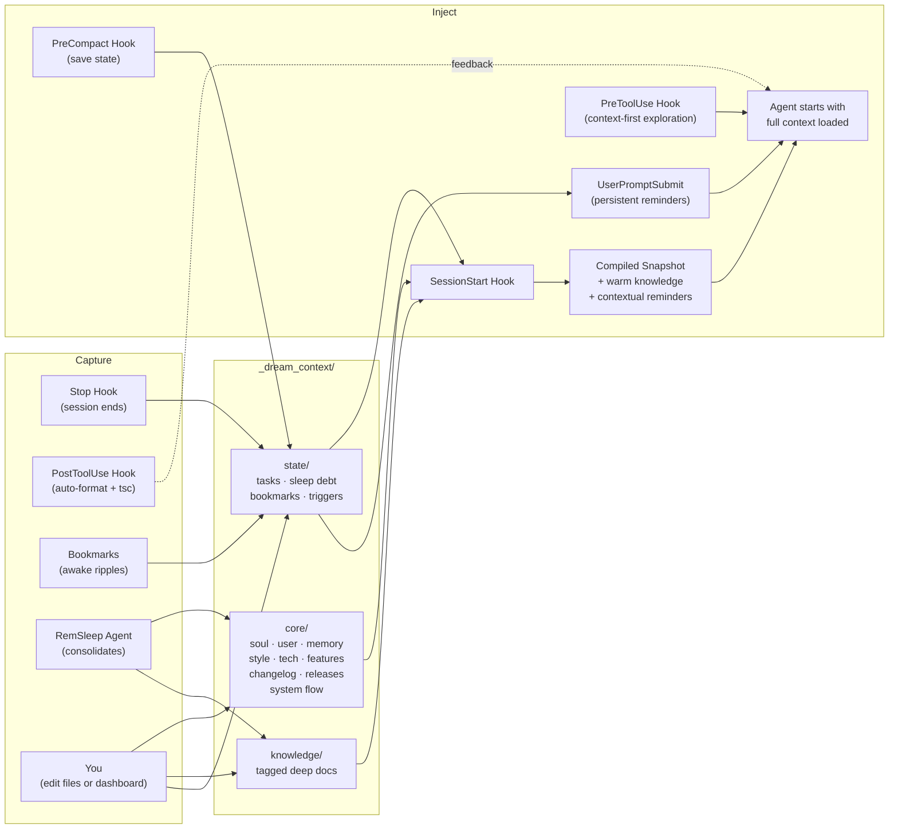

<p align="center">
  
</p>

<h1 align="center">dreamcontext</h1>

<p align="center">
  Structured, persistent context for AI coding agents.<br/>
  Pre-loaded via hooks. Zero tool calls to get started.
</p>

<p align="center">
  <a href="#why">Why</a> &nbsp;&middot;&nbsp;
  <a href="#how-it-works">How It Works</a> &nbsp;&middot;&nbsp;
  <a href="#quick-start">Quick Start</a> &nbsp;&middot;&nbsp;
  <a href="#dashboard">Dashboard</a> &nbsp;&middot;&nbsp;
  <a href="#commands">Commands</a> &nbsp;&middot;&nbsp;
  <a href="DEEP-DIVE.md">Deep Dive</a>
</p>

> **Under active development.** APIs and commands may change before v1.0.

---

## Why

AI coding agents are powerful, but they make real mistakes. They fetch entire collections instead of filtering at the query level. They write serverless functions with infinite loop potential. They optimize for making the test pass, not making the system correct.

A human needs to be steering. But steering only works when both you and the agent are looking at the same context: what decisions were made, what is in progress, what rules to follow.

And every session starts from scratch. Your agent greps for a decision it already made yesterday. Reads a few files. Searches again. Pieces together context it already had. By the time it says "Ok, I understand the codebase," you haven't started working yet. This happens every session, and it gets worse as your project grows.

`dreamcontext` fixes both problems. It gives your agent structured, pre-loaded context before the first message, and gives you readable files you can open, audit, and correct. **Context that both you and your agent can act on.**

<table>
<tr>
<td width="50%" align="center">
<br/>
<em><strong>Without dreamcontext</strong><br/>Search, read, search again.<br/>Tokens burned on re-discovery.</em>
</td>
<td width="50%" align="center">
<br/>
<em><strong>With dreamcontext</strong><br/>Context pre-loaded via hook.<br/>Zero tool calls. Straight to work.</em>
</td>
</tr>
</table>

> **Want the full story?** Philosophy, architecture, and every design tradeoff explained. **[Read the deep dive &rarr;](DEEP-DIVE.md)**

## How It Works



- **Seven hooks capture context automatically.** Stop hook records what happened. SessionStart injects everything before the first message. SubagentStart briefs sub-agents. PreToolUse blocks blind exploration when curated context exists. UserPromptSubmit reminds about sleep debt on every user message. PostToolUse auto-formats and type-checks edited files. PreCompact saves state before context compaction.
- **Bookmarks tag important moments.** During active work, the agent bookmarks decisions, constraints, and discoveries with salience levels. Critical bookmarks trigger immediate consolidation advisories.
- **Files are structured by purpose.** Identity, preferences, decisions, knowledge, and active work each live in their own file with their own format.
- **Sleep cycles consolidate knowledge.** A RemSleep agent reads bookmarks first, distills transcripts for high-signal content, extracts recurring patterns, promotes learnings, creates contextual triggers, cleans stale entries, and resets debt.
- **Everything is local markdown and JSON.** Readable, editable, git-tracked, owned by you.

## Quick Start

```bash
npm install -g dreamcontext
```

> Requires **Node.js >= 18**. Currently supports **Claude Code**.

```bash
# 1. Initialize the context structure
dreamcontext init

# 2. Install the Claude Code integration (skill, agents, hooks)
dreamcontext install-skill
```

Two commands. Next session, the hook fires, context loads, and the agent is ready.

### Optional Skill Packs

Beyond the core context management skill, dreamcontext ships with curated skill packs you can install for your team's workflow:

```bash
# Browse and install interactively (terminal checkbox UI)
dreamcontext install-skill --packs

# Install specific packs directly
dreamcontext install-skill --packs engineering design

# Install a single sub-skill
dreamcontext install-skill --skill firebase-firestore

# See what's available
dreamcontext install-skill --list
```

| Pack | What it covers | Sub-skills |
|------|---------------|------------|
| **engineering** | Coding standards, security, testing, architecture | backend-principles, web-app-frontend, firebase-cloud-functions, firebase-firestore |
| **design** | Design systems, typography, colors, accessibility | frontend-principles, design-web, design-mobile, onboarding-design |
| **growth** | Retention, distribution, monetization, analytics | performance-marketing, lean-analytics-experiments, lean-analytics-metrics |
| **brand-voice** | Brand enforcement, discovery, guideline generation | discover-brand, guideline-generation |
| **system-prompts** | Prompt engineering, cognitive architecture, agent design | *(standalone)* |

Packs install to `.claude/skills/{pack-name}/` with related agents to `.claude/agents/`. Cross-pack dependencies are warned at install time.

### Interactive mode

Run `dreamcontext` with no arguments to enter interactive mode with a visual menu for all commands.

### What gets created

```
your-project/
├── _dream_context/              # Structured context (git-tracked)
│   ├── core/
│   │   ├── 0.soul.md           # Identity, principles, rules
│   │   ├── 1.user.md           # Your preferences, project details
│   │   ├── 2.memory.md         # Decisions, issues, learnings
│   │   ├── 3.style_guide.md    # Style & branding
│   │   ├── 4.tech_stack.md     # Tech decisions
│   │   ├── 5.data_structures.sql
│   │   ├── 6.system_flow.md    # Session lifecycle, data flows
│   │   ├── CHANGELOG.json
│   │   ├── RELEASES.json
│   │   └── features/           # Feature PRDs
│   ├── knowledge/              # Tagged docs (index in snapshot)
│   │   └── *.md                # pinned: true → auto-loaded in full
│   └── state/                  # Active tasks, sleep state
│       └── .sleep.json
│
├── .claude/
│   ├── skills/dreamcontext/
│   │   └── SKILL.md            # Teaches the agent the system
│   ├── agents/
│   │   ├── dreamcontext-initializer.md
│   │   ├── dreamcontext-explore.md
│   │   └── dreamcontext-rem-sleep.md
│   └── settings.json           # 7 hooks (see below)
```

## Dashboard

```bash
dreamcontext dashboard                   # Open at localhost:4173
dreamcontext dashboard --port 8080       # Custom port
dreamcontext dashboard --no-open         # Start without opening browser
```

A local web UI for managing agent context visually. Built with React 19, served by a zero-dependency Node HTTP server. Ships in the npm package.

<table>
<tr>
<td width="50%">

**Kanban board** with drag-and-drop, multi-select filters (status, priority, urgency, tags, version) with type-ahead search, sorting, and grouping by any field. **Eisenhower matrix** view for priority-urgency quadrant planning. Create tasks, update status, add changelog entries from a Notion-style detail panel.

</td>
<td width="50%">

**Core editor** with split-pane markdown editing and live preview. Knowledge manager with search and pin/unpin. Feature PRD viewer. SQL ER diagram preview. **Version manager** for planning and releasing versions.

</td>
</tr>
<tr>
<td width="50%">

**Sleep tracker** showing debt gauge, session history timeline, and a list of every manual change made through the dashboard.

</td>
<td width="50%">

**Change tracking** records every dashboard action to `.sleep.json` so the agent knows what you changed between sessions and consolidates it during sleep.

</td>
</tr>
</table>

Light and dark mode with system preference detection. Brand palette: purple-to-magenta gradient. Visby CF font with system font fallback.

## Commands

### Core

```bash
dreamcontext core changelog add           # Add changelog entry
dreamcontext core releases add            # Create release with auto-discovery
dreamcontext core releases add --yes      # Non-interactive, include all unreleased items
dreamcontext core releases add --ver v0.2.0 --summary "..." --status planning  # Planning version
dreamcontext core releases list           # List recent releases
dreamcontext core releases show <version> # Show release details
```

Release creation auto-discovers unreleased tasks, features, and changelog entries. Back-populates `released_version` on included features. Use `--status planning` to create a version placeholder without auto-discovery. Tasks can be assigned to planning versions, and the version manager in the dashboard provides a "Release" action to transition from planning to released.

### Tasks

```bash
dreamcontext tasks list                   # List active tasks (excludes completed)
dreamcontext tasks list --all             # List all tasks
dreamcontext tasks list --status in_progress  # Filter by status
dreamcontext tasks create <name>          # Create a task
dreamcontext tasks create <name> --priority high --status in_progress --tags "api,auth" --urgency high --version v0.2.0
dreamcontext tasks log <name> <content>   # Log progress (newest first)
dreamcontext tasks insert <name> <section> <content>  # Insert into a named section
dreamcontext tasks complete <name>        # Mark completed
```

All flags (`--description`, `--priority`, `--status`, `--tags`, `--why`, `--urgency`, `--version`) are optional. Defaults to medium priority/urgency and todo status, so the command works non-interactively for agent use.

### Features

```bash
dreamcontext features create <name>       # Create a feature PRD
dreamcontext features insert <name> <section> <content>
```

### Knowledge

```bash
dreamcontext knowledge create <name>      # Create a knowledge doc
dreamcontext knowledge index              # List all with descriptions + tags
dreamcontext knowledge index --tag api    # Filter by tag
dreamcontext knowledge tags               # List standard tags
dreamcontext knowledge touch <slug>       # Record access (staleness tracking)
```

Set `pinned: true` in frontmatter to auto-load a knowledge file in every snapshot. Knowledge files not accessed in 30+ days are flagged as stale. Recently accessed files appear in a "warm knowledge" tier with first-paragraph previews.

### Bookmarks

Tag important moments during active work. Inspired by the brain's awake sharp-wave ripples that bookmark memories for consolidation during sleep.

```bash
dreamcontext bookmark add "<message>" -s 2    # Bookmark with salience (1-3)
dreamcontext bookmark list                     # Show all bookmarks
dreamcontext bookmark clear                    # Clear all bookmarks
```

Salience levels: 1 = notable, 2 = significant, 3 = critical. Critical bookmarks trigger immediate consolidation advisories regardless of debt level.

### Triggers

Contextual reminders that fire when matching tasks are active. The brain's prospective memory: "remind me about X when working on Y."

```bash
dreamcontext trigger add "<when>" "<remind>"   # Create a trigger
dreamcontext trigger list                       # Show active triggers
dreamcontext trigger remove <id>                # Remove a trigger
```

Triggers match against active task names, tags, and bookmark text. Auto-expire after a configurable number of fires (default 3).

### Sleep

Sleep debt is tracked automatically via hooks. The UserPromptSubmit hook reminds about debt on every user message, so the agent cannot dismiss the reminder. Consolidation rhythm advisory fires after 3+ sessions since last sleep, even at low debt.

```bash
dreamcontext sleep status                # Debt level, sessions, last sleep
dreamcontext sleep history               # Consolidation log
dreamcontext sleep add <score> <desc>    # Add debt manually
dreamcontext sleep start                 # Mark consolidation epoch
dreamcontext sleep done <summary>        # Complete consolidation, reset
dreamcontext sleep debt                  # Raw number (for scripts)
```

### Transcript

```bash
dreamcontext transcript distill <session_id>   # Structural filter of session transcript
```

Extracts high-signal content from raw JSONL transcripts: user messages, agent decisions, code changes, errors, bookmarks. Discards noise (Read results, Glob output, tool metadata). Pure Node.js, no AI. Used by the RemSleep agent for selective deep analysis of important sessions.

### Dashboard

```bash
dreamcontext dashboard                   # Start the web dashboard
```

### System

```bash
dreamcontext hook session-start          # SessionStart hook output
dreamcontext hook stop                   # Stop hook: capture + score
dreamcontext hook subagent-start         # SubagentStart hook output
dreamcontext hook pre-tool-use           # PreToolUse hook: block default Explorer
dreamcontext hook user-prompt-submit     # UserPromptSubmit hook: sleep debt reminder
dreamcontext hook post-tool-use          # PostToolUse hook: auto-format + tsc check
dreamcontext hook pre-compact            # PreCompact hook: save state before compaction
dreamcontext snapshot                    # Snapshot only (no hook processing)
dreamcontext snapshot --tokens           # Estimated token count
dreamcontext doctor                      # Validate structure
dreamcontext install-skill               # Install core skill + agents + hooks
dreamcontext install-skill --packs       # Interactive skill pack browser
dreamcontext install-skill --packs engineering design  # Install specific packs
dreamcontext install-skill --skill <name>  # Install a single sub-skill
dreamcontext install-skill --list        # Show available skill packs
```

## Design Principles

- **Structure over volume** -- organized context beats more context
- **Pre-loaded, not searched** -- memory injected before the first message
- **Consolidation built in** -- sleep cycles keep context sharp, not bloated
- **Agent-native** -- designed for how LLMs consume context
- **Owned by you** -- plain markdown and JSON in your repo

## Works With

- **Claude Code**: full support via skill, 3 sub-agents, and 7 hooks
- **Web Dashboard**: local UI for visual context management (ships in the package)

More agents coming soon.

## License

MIT

## Acknowledgements

The memory system draws partial inspiration from [OpenClaw](https://github.com/openclaw/openclaw)'s approach to agent memory. The neuroscience-inspired two-stage memory model (bookmarks during waking, selective consolidation during sleep) is based on findings from Joo & Frank 2025 (Science) on hippocampal awake sharp-wave ripples. The brain-region architecture, sleep consolidation cycle, and CLI-first design are my own, built from months of working with AI coding agents on real projects.
