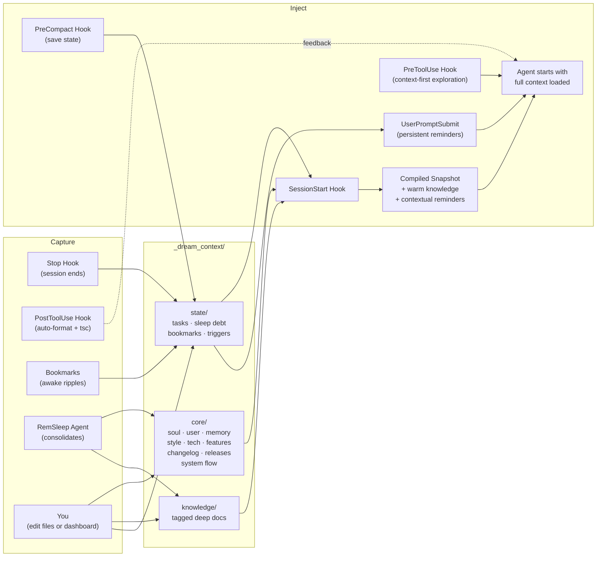

<p align="center">
  
</p>

<h1 align="center">dreamcontext</h1>

<p align="center">
  dreamcontext is the persistent brain for your AI agents — and for you.<br/>
  It remembers every decision you made, knows how your project is structured,<br/>
  and is learning to act on that knowledge so that every session starts ready instead of blind.<br/>
  Built for founders and builders, technical or not, who are tired of watching their agent<br/>
  re-discover context it already had.
</p>

<p align="center">
  <a href="#why">Why</a> &nbsp;&middot;&nbsp;
  <a href="#how-it-works">How It Works</a> &nbsp;&middot;&nbsp;
  <a href="#quick-start">Quick Start</a> &nbsp;&middot;&nbsp;
  <a href="#skills">Skills</a> &nbsp;&middot;&nbsp;
  <a href="#staying-up-to-date">Updating</a> &nbsp;&middot;&nbsp;
  <a href="#dashboard">Dashboard</a> &nbsp;&middot;&nbsp;
  <a href="#council">Council</a> &nbsp;&middot;&nbsp;
  <a href="#memory-recall">Memory Recall</a> &nbsp;&middot;&nbsp;
  <a href="#commands">Commands</a> &nbsp;&middot;&nbsp;
  <a href="DEEP-DIVE.md">Deep Dive</a>
</p>

<p align="center">
  
</p>

<p align="center">
  <sub>The built-in <strong>“What is this?”</strong> page, served live by <code>dreamcontext dashboard</code>.</sub>
</p>

> **Under active development.** APIs and commands may change before v1.0.

---

## Why

AI coding agents are powerful, but they make real mistakes. They fetch entire collections instead of filtering at the query level. They write serverless functions with infinite loop potential. They optimize for making the test pass, not making the system correct.

A human needs to be steering. But steering only works when both you and the agent are looking at the same context: what decisions were made, what is in progress, what rules to follow.

And every session starts from scratch. Your agent greps for a decision it already made yesterday. Reads a few files. Searches again. Pieces together context it already had. By the time it says "Ok, I understand the codebase," you haven't started working yet. This happens every session, and it gets worse as your project grows.

`dreamcontext` fixes both problems. It gives your agent structured, pre-loaded context before the first message, and gives you readable files you can open, audit, and correct. **Context that both you and your agent can act on.**

<table>
<tr>
<td width="50%" align="center">
<br/>
<em><strong>Without dreamcontext</strong><br/>Search, read, search again.<br/>Tokens burned on re-discovery.</em>
</td>
<td width="50%" align="center">
<br/>
<em><strong>With dreamcontext</strong><br/>Context pre-loaded via hook.<br/>Zero tool calls. Straight to work.</em>
</td>
</tr>
</table>

> **Want the full story?** Philosophy, architecture, and every design tradeoff explained. **[Read the deep dive &rarr;](DEEP-DIVE.md)**

## How It Works



- **Seven hooks capture context automatically.** Stop hook records what happened. SessionStart injects everything before the first message. SubagentStart briefs sub-agents. PreToolUse blocks blind exploration when curated context exists. UserPromptSubmit reminds about sleep debt on every user message. PostToolUse auto-formats and type-checks edited files. PreCompact saves state before context compaction.
- **Bookmarks tag important moments.** During active work, the agent bookmarks decisions, constraints, and discoveries with salience levels. Critical bookmarks trigger immediate consolidation advisories.
- **Files are structured by purpose.** Identity, preferences, decisions, knowledge, and active work each live in their own file with their own format.
- **Sleep cycles consolidate knowledge.** A RemSleep agent reads bookmarks first, distills transcripts for high-signal content, extracts recurring patterns, promotes learnings, creates contextual triggers, cleans stale entries, and resets debt.
- **Everything is local markdown and JSON.** Readable, editable, git-tracked, owned by you.

## Quick Start

```bash
curl -fsSL https://cdn.jsdelivr.net/npm/dreamcontext/install.sh | sh
```

> Served from the published npm package via CDN — works with a private repo, no GitHub access needed.

**Manual install (npm):**

```bash
npm install -g dreamcontext
```

> Requires **Node.js >= 18**. Currently supports **Claude Code** and **Codex**.

```bash
# One-shot setup — scaffolds _dream_context/, installs the skill, agents,
# hooks, and root instructions, and prompts for optional skill packs.
dreamcontext setup

# Scriptable / non-interactive (explicit platforms, skip all prompts)
dreamcontext setup --platforms claude,codex --defaults
```

One command. Next session, the hook fires, context loads, and the agent is ready.

> **`setup` is the front door** — it runs init + install-skill + install-instructions in one step and tracks every file it writes in a manifest. The individual commands below still exist for advanced/scripted use, but `setup` is what you want on a new project.

<details>
<summary>Advanced: run the steps individually</summary>

```bash
# Scaffold the context structure only (does NOT install the agent integration)
dreamcontext init

# Install platform integration (multi-select prompt; defaults to Claude)
dreamcontext install-skill
dreamcontext install-skill --platforms claude,codex
```

`dreamcontext init` on its own leaves you without `.claude/` skills, agents, and hooks — your agent won't load the context until you also run `install-skill` (or just use `setup`). When run interactively, `init` now offers to finish the install for you.

</details>

### Interactive mode

Run `dreamcontext` with no arguments to enter interactive mode with a visual menu for all commands.

### What gets created

```
your-project/
├── _dream_context/              # Structured context (git-tracked)
│   ├── core/
│   │   ├── 0.soul.md                    # Identity, principles, rules
│   │   ├── 1.user.md                    # Your preferences, project details
│   │   ├── 2.memory.md                  # Decisions & known issues
│   │   ├── 3.style_guide_and_branding.md
│   │   ├── 4.tech_stack.md              # Tech decisions
│   │   ├── 5.data_structures.sql
│   │   ├── 6.system_flow.md             # Session lifecycle, data flows
│   │   ├── CHANGELOG.json
│   │   ├── RELEASES.json
│   │   └── features/                    # Feature PRDs
│   ├── knowledge/                       # Tagged docs (index in snapshot)
│   │   └── *.md                         # pinned: true → auto-loaded in full
│   └── state/                           # Active tasks + working state
│       ├── *.md                         # Active task files
│       ├── .sleep.json                  # Sleep debt, session history
│       └── .version-check.json          # Cached update check (24h)
│
├── .claude/
│   ├── skills/dreamcontext/
│   │   └── SKILL.md            # Teaches the agent the system
│   ├── agents/
│   │   ├── dreamcontext-initializer.md
│   │   ├── dreamcontext-explore.md
│   │   └── dreamcontext-rem-sleep.md
│   └── settings.json           # 7 hooks (see below)
```

### Opening the context directory in Obsidian

`dreamcontext init` scaffolds an `_dream_context/.obsidian/` vault config with curated graph, appearance, and app settings so you can open the directory directly in Obsidian and navigate the context as a knowledge graph. Links between files (tasks → features → knowledge → memory) render natively, and the Obsidian graph view works out of the box.

### Root instruction files without full skill install

For projects that want managed root instruction files without installing the full skill + agent bundle:

```bash
dreamcontext install-instructions --platforms claude,codex
```

This writes managed fenced blocks into `CLAUDE.md` and/or `AGENTS.md` at the project root, preserving existing non-managed content.

## Skills

The core `dreamcontext` skill (installed by `install-skill`) teaches your agent the context system itself. On top of that, dreamcontext ships **curated skill packs and standalone skills** that give your agent domain expertise — loaded on demand, only when the work calls for it, so they cost nothing the rest of the time.

```bash
# Browse and install interactively (terminal checkbox UI)
dreamcontext install-skill --packs

# Install specific packs directly
dreamcontext install-skill --packs engineering design

# Install one orchestration pack (council, multi-review, goal-skill)
dreamcontext install-skill --packs goal-skill

# Install a single sub-skill or standalone skill
dreamcontext install-skill --skill firebase-firestore
dreamcontext install-skill --skill system-prompts

# See everything available
dreamcontext install-skill --list
```

**Skill packs** (a base skill + on-demand sub-skills or sub-agents):

| Pack | What it covers | Inside |
|------|---------------|--------|
| **engineering** _(always-on)_ | Coding standards, security, testing, architecture | backend-principles, web-app-frontend, firebase-cloud-functions, firebase-firestore |
| **design** _(always-on)_ | Design systems, typography, color, accessibility | frontend-principles, design-web, design-mobile, onboarding-design |
| **growth** | Retention, distribution, monetization, analytics | performance-marketing, lean-analytics-experiments, lean-analytics-metrics |
| **brand-voice** | Brand enforcement, discovery, guideline generation | discover-brand, guideline-generation |
| **council** | Multi-persona debate for hard decisions | `council-persona`, `council-synthesizer` agents |
| **multi-review** | Multi-agent code review (router + niche specialists) | `review-router` + security / cloud-functions / frontend / edge-cases agents |
| **goal-skill** | Sub-agent-orchestrated execution: plan → review → implement → validate | `goal-planner`, `goal-plan-reviewer`, `goal-implementer`, `goal-validator` agents |

**Standalone skills** (install individually with `--skill <name>`):

| Skill | What it covers |
|-------|----------------|
| **business-idea-discovery** | Market selection, trend validation, competitor intel, pain-point mining, MVP scoping |
| **business-idea-validation** | Demand testing via landing page + waitlist, quick validation loops |
| **meta-marketing** | Meta / Facebook / Instagram ad campaigns end to end |
| **system-prompts** | Prompt engineering, cognitive architecture, agent design |
| **video-watching** | Turn a video into a time-mapped transcript with on-screen visuals described inline (whisper.cpp + ffmpeg), then reason about it |

_Always-on_ packs apply their base principles to every relevant task; the rest load only when the work matches. Packs install to platform-specific paths — Claude: `.claude/skills/{pack}/` (+ agents in `.claude/agents/`); Codex: `.agents/skills/{pack}/` (+ agents in `.codex/agents/`). Cross-pack dependencies are warned at install time.

## Staying Up to Date

dreamcontext tells you when a new version ships, and updating is one command. There are two distinct things to update: the **CLI** (the `dreamcontext` binary) and your **project's installed files** (the skill, agents, and hooks copied into `.claude/` or `.agents/`).

```bash
dreamcontext upgrade            # Upgrade the CLI to the latest published version
dreamcontext upgrade --check    # Just print "current: X  latest: Y" and exit
dreamcontext update             # Refresh this project's skill/agent/hook files to match the CLI
```

Or re-run the one-command installer — it detects an existing `_dream_context/` and updates in place:

```bash
curl -fsSL https://cdn.jsdelivr.net/npm/dreamcontext/install.sh | sh
```

**In-session update nudge.** When a newer version is published, your agent sees a single-line nudge at the top of its loaded context — so you find out while you're working, not months later. The version check is deliberately unobtrusive: it runs **at most once every 24 hours**, never during the context-loading hot path (so session start is never slowed or blocked), and fails silent if npm is unreachable. Opt out entirely with `DREAMCONTEXT_VERSION_CHECK=0`.

## Dashboard

```bash
dreamcontext dashboard                   # Open at localhost:4173
dreamcontext dashboard --port 8080       # Custom port
dreamcontext dashboard --no-open         # Start without opening browser
```

A local web UI for managing agent context visually. Built with React 19, served by a zero-dependency Node HTTP server. Ships in the npm package.

It also ships a built-in **“What is this?”** explainer page — a full landing experience with a spotlight that reveals each faculty's live diagram, and a layered map of how the brain is organized:

<p align="center">
  
</p>
<p align="center">
  
</p>

<table>
<tr>
<td width="50%">

**Kanban board** with drag-and-drop, multi-select filters (status, priority, urgency, tags, version) with type-ahead search, sorting, and grouping by any field. **Eisenhower matrix** view for priority-urgency quadrant planning. Create tasks, update status, add changelog entries from a Notion-style detail panel.

</td>
<td width="50%">

**Core editor** with split-pane markdown editing and live preview. Knowledge manager with search and pin/unpin. Feature PRD viewer. SQL ER diagram preview. **Version manager** for planning and releasing versions.

</td>
</tr>
<tr>
<td width="50%">

**Sleep tracker** showing debt gauge, session history timeline, and a list of every manual change made through the dashboard.

</td>
<td width="50%">

**Change tracking** records every dashboard action to `.sleep.json` so the agent knows what you changed between sessions and consolidates it during sleep.

</td>
</tr>
<tr>
<td width="50%">

**Brain graph** visualizes your knowledge as an interactive network. Nodes are memory, knowledge, features, and decisions; edges are explicit and inferred links. Node drawer for full content, settings panel for layout and filters.

</td>
<td width="50%">

**Council Hall** shows every multi-persona debate as a searchable card grid. Open a debate into a full-page detail view with three tabs: **Overview** (problem + synthesized final report + citation chips), **Agents** (per-persona transcripts with search), **Matrix** (persona × round grid with inline cell expansion).

</td>
</tr>
</table>

Light and dark mode with system preference detection. Brand palette: purple-to-magenta gradient. Visby CF font with system font fallback.

## Council

**Multi-persona debates for hard decisions.** When a question is too load-bearing for a single model pass — architecture calls, hiring reviews, risk-heavy migrations, brand critiques — a council lets you convene N personas, run them through N rounds of structured deliberation, and synthesize a verdict that cites the contributing voices.

Each persona gets its own sub-agent with a scoped prompt, model choice, and aspects it advocates for. Between rounds, personas see a cross-context panel summarizing what everyone else said, so responses sharpen rather than repeat. A synthesizer produces the final report.

```bash
# Start a debate
dreamcontext council create "Should we migrate from Postgres to Firestore?" \
  --rounds 2

# Add personas (each gets a sub-agent and persona file)
dreamcontext council agent create migration-risk-auditor --model sonnet \
  --aspects operational-risk,rollback-readiness,team-readiness
dreamcontext council agent create dx-champion --model opus \
  --aspects developer-experience,feature-velocity
dreamcontext council agent create user-advocate --model haiku \
  --aspects end-user-impact,reliability-perception

# Drive rounds (the CLI orchestrates sub-agent dispatch; reports append as they return)
dreamcontext council round start 1
dreamcontext council round end 1              # Injects cross-context for R2+
dreamcontext council round start 2
dreamcontext council round end 2

# Synthesize the final report
dreamcontext council synthesize
dreamcontext council complete

# Optionally promote the verdict into knowledge
dreamcontext council promote --to knowledge/migration-decision
```

Each debate stores its state in `_dream_context/council/<id>/` with `debate.md`, `round-log.md`, `final-report.md`, and per-persona folders containing `context-and-persona.md`, `report.md`, and `researches/`. The dashboard's **Council Hall** page renders this data as a searchable grid and full-page detail view.

Ships with two sub-agents (`council-persona`, `council-synthesizer`) and a dedicated skill pack at `skill-packs/council/`.

## Memory Recall

Recall and remember across your project's curated context. BM25 ranking over knowledge files, feature PRDs, task files, `2.memory.md` sections, and `CHANGELOG.json` entries — deterministic, instant, no setup.

```bash
# Ask a question, get top-5 hits with snippets
dreamcontext memory recall "how did we decide on the sleep fan-out"

# Filter by corpus type (knowledge | feature | task | memory | changelog)
dreamcontext memory recall "auth flow" --types knowledge,feature
dreamcontext memory recall "deprecated" --types changelog

# Machine-readable output for scripts
dreamcontext memory recall "rice prioritization" --json --top 3

# Quick-capture a decision or note — writes a CHANGELOG entry (type=note, scope=quick)
dreamcontext memory remember "Chose BM25 over mem0 after 3-reviewer review"

# Inspect the corpus
dreamcontext memory status
```

**Why not a vector DB or mem0.** dreamcontext content is already curated atomic facts — knowledge docs, feature PRDs, closed tasks, memory entries, CHANGELOG entries. The LLM-extraction step a mem0-style stack provides solves a problem this system already solved. BM25 over the live corpus gives ~80% of the value at 1% of the complexity: zero new npm dependencies, no Python, no Ollama, no API keys, no embeddings to invalidate, version-controllable. Cold start is under 100ms on a 40-doc corpus; the index is rebuilt in memory on every call.

Hook injection is **ON by default**: top hits are auto-surfaced to the agent on every non-trivial user prompt via the UserPromptSubmit hook. Opt out with `DREAMCONTEXT_MEMORY_HOOK=0` if you want raw prompts without context augmentation.

**Recent CHANGELOG in the snapshot is tiered**: top 3 entries detailed (summary + ~300 char body), next 10 titles-only under an "Older" subheading. Everything older still lives in `CHANGELOG.json` and is reachable through `memory recall --types changelog`.

## Commands

### Core

```bash
dreamcontext core changelog add           # Add changelog entry
dreamcontext core releases add            # Create release with auto-discovery
dreamcontext core releases add --yes      # Non-interactive, include all unreleased items
dreamcontext core releases add --ver v0.2.0 --summary "..." --status planning  # Planning version
dreamcontext core releases list           # List recent releases
dreamcontext core releases show <version> # Show release details
```

Release creation auto-discovers unreleased tasks, features, and changelog entries. Back-populates `released_version` on included features. Use `--status planning` to create a version placeholder without auto-discovery. Tasks can be assigned to planning versions, and the version manager in the dashboard provides a "Release" action to transition from planning to released.

### Tasks

```bash
dreamcontext tasks list                   # List active tasks (excludes completed)
dreamcontext tasks list --all             # List all tasks
dreamcontext tasks list --status in_progress  # Filter by status
dreamcontext tasks create <name>          # Create a task
dreamcontext tasks create <name> --priority high --status in_progress --tags "api,auth" --urgency high --version v0.2.0
dreamcontext tasks log <name> <content>   # Log progress (newest first)
dreamcontext tasks insert <name> <section> <content>  # Insert into a named section
dreamcontext tasks complete <name>        # Mark completed
```

All flags (`--description`, `--priority`, `--status`, `--tags`, `--why`, `--urgency`, `--version`) are optional. Defaults to medium priority/urgency and todo status, so the command works non-interactively for agent use.

### Features

```bash
dreamcontext features create <name>       # Create a feature PRD
dreamcontext features insert <name> <section> <content>
```

### Knowledge

```bash
dreamcontext knowledge create <name>      # Create a knowledge doc
dreamcontext knowledge index              # List all with descriptions + tags
dreamcontext knowledge index --tag api    # Filter by tag
dreamcontext knowledge tags               # List standard tags
dreamcontext knowledge touch <slug>       # Record access (staleness tracking)
```

Set `pinned: true` in frontmatter to auto-load a knowledge file in every snapshot. Knowledge files not accessed in 30+ days are flagged as stale. Recently accessed files appear in a "warm knowledge" tier with first-paragraph previews.

### Memory

```bash
dreamcontext memory recall <query...>                # BM25 search over knowledge + features + tasks + memory + changelog
dreamcontext memory recall <query...> --top 10       # Number of hits (1-50, default 5)
dreamcontext memory recall <query...> --types knowledge,task,changelog
dreamcontext memory recall <query...> --json         # Machine-readable
dreamcontext memory recall <query...> --plain        # No ANSI colors
dreamcontext memory remember "<text>"                # Writes a CHANGELOG entry (type=note, scope=quick by default)
dreamcontext memory remember "<text>" --type fix --scope api --summary "..." --references commit:abc,task:auth-refactor
dreamcontext memory update <slug> --description "..." --tags a,b --append "..."
dreamcontext memory update <slug> --pin              # or --unpin
dreamcontext memory delete <slug> --force
dreamcontext memory list                              # List indexed docs
dreamcontext memory list --types feature,task
dreamcontext memory status                           # Corpus stats by type
```

`memory remember` writes a CHANGELOG entry instead of appending to a LIFO section in `2.memory.md` (the LIFO section was removed in 2026-05-23 — `2.memory.md` now holds Decisions + Known Issues only). The new CHANGELOG schema supports optional `summary` (≤200 char soft cap), `references[]` (prefixed: `commit:|file:|knowledge:|feature:|task:|url:`), and `supersedes` (entry-id pointer).

Recall has no setup step — no init, no daemon, no API keys. The corpus is rebuilt in memory on every call (under 100ms on a 40-doc corpus). UserPromptSubmit hook injection of top hits is **ON by default**; set `DREAMCONTEXT_MEMORY_HOOK=0` to opt out.

### Bookmarks

Tag important moments during active work. Inspired by the brain's awake sharp-wave ripples that bookmark memories for consolidation during sleep.

```bash
dreamcontext bookmark add "<message>" -s 2    # Bookmark with salience (1-3)
dreamcontext bookmark list                     # Show all bookmarks
dreamcontext bookmark clear                    # Clear all bookmarks
```

Salience levels: 1 = notable, 2 = significant, 3 = critical. Critical bookmarks trigger immediate consolidation advisories regardless of debt level.

### Triggers

Contextual reminders that fire when matching tasks are active. The brain's prospective memory: "remind me about X when working on Y."

```bash
dreamcontext trigger add "<when>" "<remind>"   # Create a trigger
dreamcontext trigger list                       # Show active triggers
dreamcontext trigger remove <id>                # Remove a trigger
```

Triggers match against active task names, tags, and bookmark text. Auto-expire after a configurable number of fires (default 3).

### Sleep

Sleep debt is tracked automatically via hooks. The UserPromptSubmit hook reminds about debt on every user message, so the agent cannot dismiss the reminder. Consolidation rhythm advisory fires after 3+ sessions since last sleep, even at low debt.

```bash
dreamcontext sleep status                # Debt level, sessions, last sleep
dreamcontext sleep history               # Consolidation log
dreamcontext sleep add <score> <desc>    # Add debt manually
dreamcontext sleep start                 # Mark consolidation epoch
dreamcontext sleep done <summary>        # Complete consolidation, reset
dreamcontext sleep debt                  # Raw number (for scripts)
```

### Transcript

```bash
dreamcontext transcript distill <session_id>   # Structural filter of session transcript
```

Extracts high-signal content from raw JSONL transcripts: user messages, agent decisions, code changes, errors, bookmarks. Discards noise (Read results, Glob output, tool metadata). Pure Node.js, no AI. Used by the RemSleep agent for selective deep analysis of important sessions.

### Council

```bash
dreamcontext council create <topic> [--rounds N]     # Open a new debate
dreamcontext council list                             # List all debates
dreamcontext council show <id>                        # Show a debate's current state
dreamcontext council agent create <slug> --model <m> --aspects a,b,c
dreamcontext council round start <n>                  # Dispatch round n to all personas
dreamcontext council round end <n>                    # Close round n, inject cross-context for n+1
dreamcontext council round round-context <n>          # Preview what personas will see at round n
dreamcontext council report append <slug> <n> <path>  # Append a persona report from file
dreamcontext council report summaries <n>             # Summaries of all reports in round n
dreamcontext council research add <slug> <topic> <path>  # Persist a persona's research note
dreamcontext council research list <slug>
dreamcontext council synthesize                       # Produce the final synthesized report
dreamcontext council complete                         # Mark the debate complete
dreamcontext council promote --to <knowledge-slug>    # Promote verdict to knowledge
```

See the [Council](#council) section above for the full workflow.

### Dashboard

```bash
dreamcontext dashboard                   # Start the web dashboard
```

### System

```bash
dreamcontext hook session-start          # SessionStart hook output
dreamcontext hook stop                   # Stop hook: capture + score
dreamcontext hook subagent-start         # SubagentStart hook output
dreamcontext hook pre-tool-use           # PreToolUse hook: block default Explorer
dreamcontext hook user-prompt-submit     # UserPromptSubmit hook: sleep debt reminder
dreamcontext hook post-tool-use          # PostToolUse hook: auto-format + tsc check
dreamcontext hook pre-compact            # PreCompact hook: save state before compaction
dreamcontext snapshot                    # Snapshot only (no hook processing)
dreamcontext snapshot --tokens           # Estimated token count
dreamcontext doctor                      # Validate structure
dreamcontext upgrade                     # Upgrade the CLI to the latest published version
dreamcontext upgrade --check             # Print current vs latest version, no install
dreamcontext update                      # Refresh installed skill/agent/hook files to match the CLI
dreamcontext install-skill               # Install core integration for selected platforms
dreamcontext install-skill --platforms claude,codex  # Explicit platform selection
dreamcontext install-skill --packs       # Interactive skill pack browser
dreamcontext install-skill --packs engineering design  # Install specific packs
dreamcontext install-skill --skill <name>  # Install a single sub-skill
dreamcontext install-skill --list        # Show available skill packs
dreamcontext install-instructions --platforms claude,codex  # Write managed root instruction blocks
dreamcontext install-claude-md           # Legacy alias: CLAUDE.md only
```

## Design Principles

- **Structure over volume** -- organized context beats more context
- **Pre-loaded, not searched** -- memory injected before the first message
- **Consolidation built in** -- sleep cycles keep context sharp, not bloated
- **Agent-native** -- designed for how LLMs consume context
- **Owned by you** -- plain markdown and JSON in your repo

## Works With

- **Claude Code**: full support via skill, 3 core sub-agents (initializer, explore, rem-sleep), 2 optional council sub-agents (persona, synthesizer), and 7 hooks
- **Codex**: project-level skills (`.agents/skills`), managed `AGENTS.md`, native `.codex/agents/*.toml`, and managed `.codex/config.toml` hooks (best-effort parity where event semantics differ)
- **Web Dashboard**: local UI with Kanban, Core editor, Knowledge, Features, Brain graph, Sleep tracker, and Council Hall (ships in the package)
- **Obsidian**: `_dream_context/` can be opened as an Obsidian vault; the directory is scaffolded with curated vault settings at `dreamcontext init` time

More agents coming soon.

## License

MIT

## Acknowledgements

The memory system draws partial inspiration from [OpenClaw](https://github.com/openclaw/openclaw)'s approach to agent memory. The neuroscience-inspired two-stage memory model (bookmarks during waking, selective consolidation during sleep) is based on findings from Joo & Frank 2025 (Science) on hippocampal awake sharp-wave ripples. The brain-region architecture, sleep consolidation cycle, and CLI-first design are my own, built from months of working with AI coding agents on real projects.
