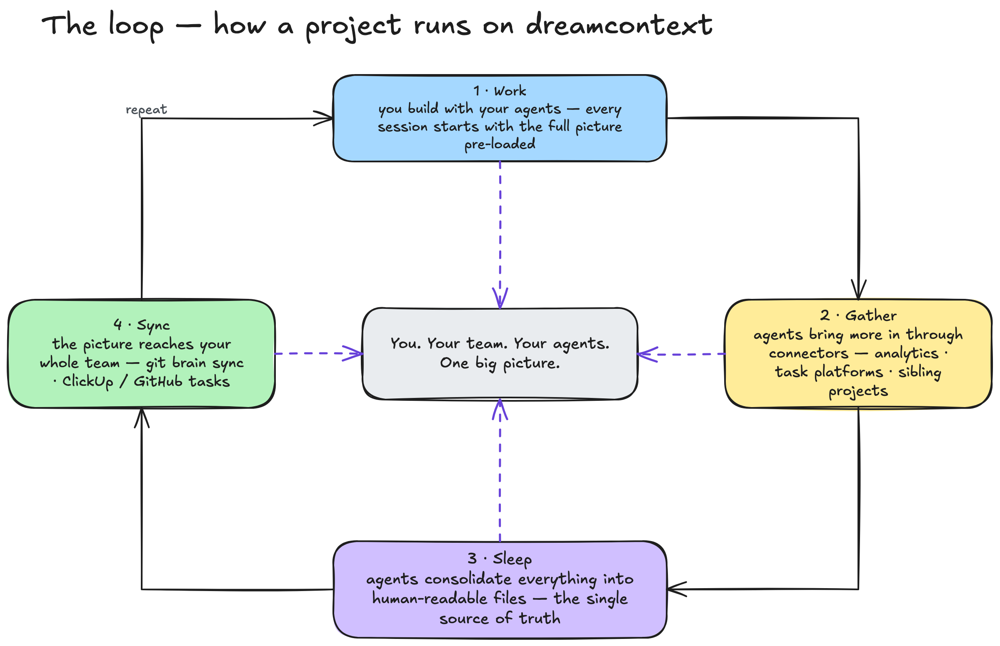
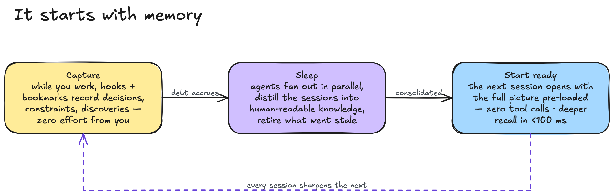
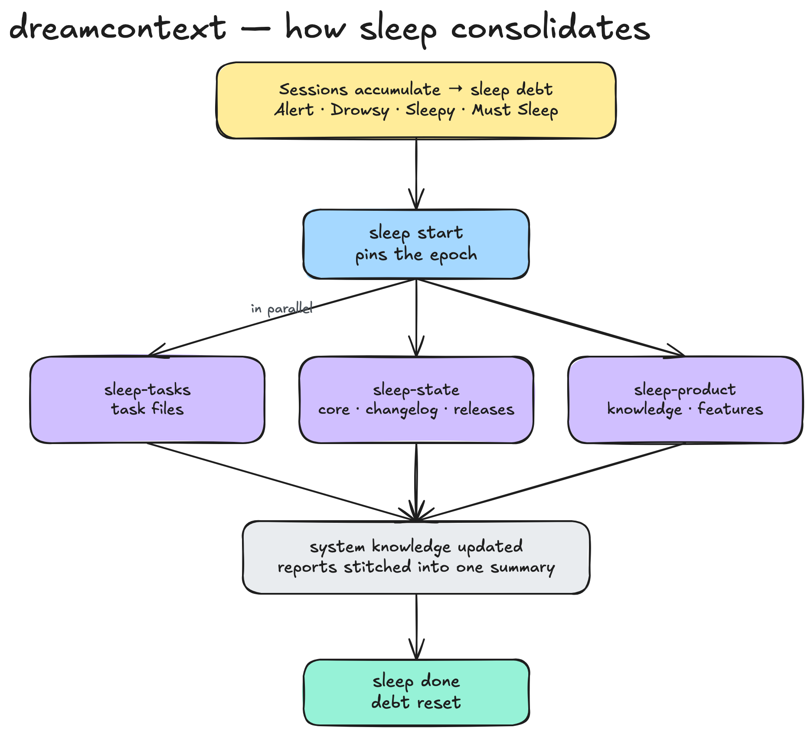
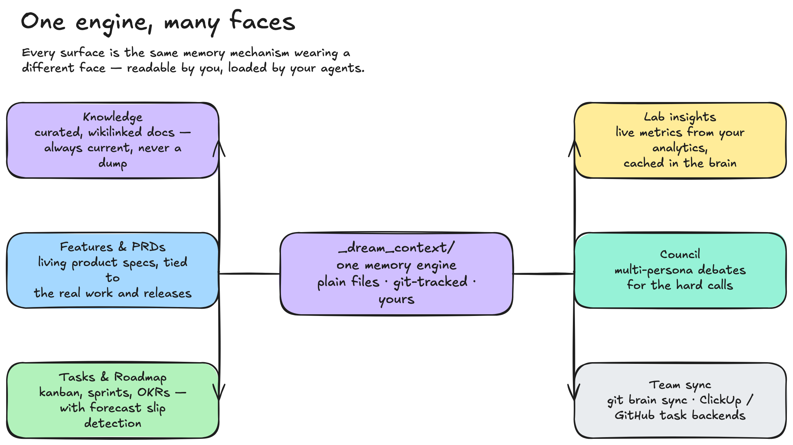
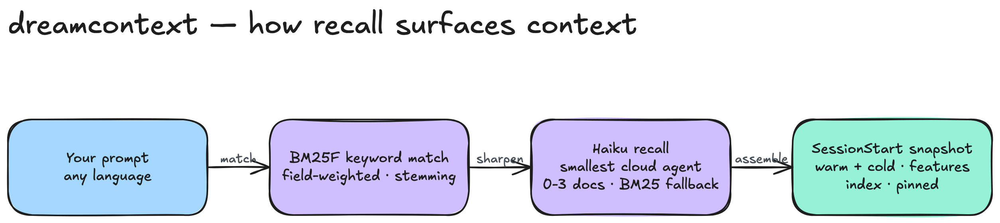
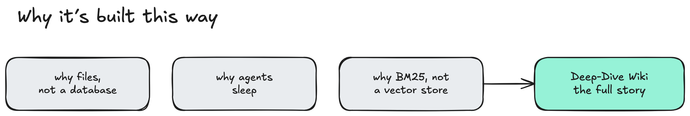

<p align="center">
  
</p>

<h1 align="center">dream<span>context</span></h1>

<p align="center">
  <strong>Run your whole project through your agents.</strong>
</p>

<p align="center">
  <em>You, your team, and your agents — all seeing the same big picture.</em>
</p>

<p align="center">
  dreamcontext is the layer where your project actually lives — structured knowledge,<br/>
  product features and PRDs, tasks and roadmap, live metrics — in files both humans<br/>
  and agents read, and agents keep true.
</p>

<p align="center">
  <sub>Works with <strong>Claude Code</strong> today. Built agent-agnostic.</sub>
</p>

<p align="center">
  <a href="#why">Why</a> &nbsp;&middot;&nbsp;
  <a href="#it-starts-with-memory">It Starts with Memory</a> &nbsp;&middot;&nbsp;
  <a href="#quick-start">Quick Start</a> &nbsp;&middot;&nbsp;
  <a href="#the-cli">CLI</a> &nbsp;&middot;&nbsp;
  <a href="#dashboard">Dashboard</a> &nbsp;&middot;&nbsp;
  <a href="#desktop-app">Mac App</a> &nbsp;&middot;&nbsp;
  <a href="#built-for-teams">Teams</a> &nbsp;&middot;&nbsp;
  <a href="#skills">Skills</a> &nbsp;&middot;&nbsp;
  <a href="#cli-reference">Reference</a> &nbsp;&middot;&nbsp;
  <a href="#why-its-built-this-way">Deep Dive</a>
</p>

<p align="center">
  
</p>

<p align="center">
  <sub>The loop: you <strong>work</strong> with agents · agents <strong>gather</strong> more through connectors · <strong>sleep</strong> consolidates it into the single source of truth · <strong>sync</strong> carries it to your team. Repeat.</sub>
</p>

> **Under active development.** APIs and commands may change before v1.0.

---

## Why

Every project has the same two problems — and they are secretly one problem.

**Your agent forgets.** Every session starts from scratch: it greps for a decision it already made yesterday, reads a few files, searches again, and burns thousands of tokens re-discovering context it already had. By the time it says "Ok, I understand the codebase," you haven't started working yet. And an agent without the full picture doesn't just waste tokens — it makes real mistakes: fetching whole collections instead of filtering at the query level, optimizing for making the test pass instead of making the system correct.

**Your team's docs rot.** The PRD is three sprints old. The metric in the deck was pasted in last May. The architecture doc describes the system you *used* to have. Everyone knows the docs are stale, so nobody trusts them — and nobody updates what nobody reads.

Same root cause: **context that nobody maintains.** dreamcontext fixes both at once by making the maintenance the agents' job. The agent gets structured, pre-loaded context before its first message. You and your team get readable files you can open, audit, and correct. **One picture everyone — human or agent — can act on.**

These two are just the headline. Metrics scattered across five dashboards, roadmaps that turn into unreachable abstractions, platforms that make you work their way, knowledge that leaves when a teammate does, embedded AI you can't audit — the full problem catalog, with what each one became, is in the **[deep dive &rarr;](https://github.com/meanllbrl/dreamcontext/wiki/The-Problem-In-Depth)**.

<table>
<tr>
<td width="50%" align="center">
<br/>
<em><strong>Without dreamcontext</strong><br/>Search, read, search again.<br/>Tokens burned on re-discovery.</em>
</td>
<td width="50%" align="center">
<br/>
<em><strong>With dreamcontext</strong><br/>Context pre-loaded via hook.<br/>Zero tool calls. Straight to work.</em>
</td>
</tr>
</table>

## It Starts with Memory

An agent can only run your project if it *remembers* your project. Everything in dreamcontext stands on one mechanism, modeled on how a real brain works:

<p align="center">
  
</p>

- **Capture** — while you work, hooks and bookmarks record what matters — decisions, constraints, discoveries — with zero effort from you. Seven hooks do it automatically: Stop records what happened, SessionStart injects everything before the first message, SubagentStart briefs sub-agents, PreToolUse blocks blind exploration when curated context exists, UserPromptSubmit surfaces sleep debt and relevant memories on every message, PostToolUse auto-formats and type-checks edited files, PreCompact saves state before context compaction. Bookmarks tag the important moments with salience levels; critical ones trigger immediate consolidation advisories.
- **Sleep** — a brain doesn't file raw experience; it consolidates during sleep. So does dreamcontext: when enough has happened, agents fan out in parallel — reading bookmarks first, distilling transcripts for high-signal content, extracting recurring patterns, promoting learnings, cleaning stale entries — and fold it all back into human-readable files. The single source of truth, refreshed.
- **Start ready** — the next session opens with the full picture already loaded: identity, decisions, active work, the knowledge index. Zero tool calls. Anything deeper is one recall away — instant, local, zero tokens.

**Remember → learn → start ready.** Every surface below — knowledge, PRDs, roadmap, insights, team sync — is this mechanism wearing a different face.

<p align="center">
  
</p>
<p align="center">
  <sub><strong>Sleep consolidation</strong> — when debt crosses a threshold, three specialists fold what changed back into the brain in parallel, then the meter resets.</sub>
</p>

<details>
<summary><strong>Full data-flow diagram</strong> — capture &rarr; store &rarr; inject</summary>


</details>

> Why memory works this way — the neuroscience behind bookmarks and sleep, and every design tradeoff — is in the **[deep dive &rarr;](https://github.com/meanllbrl/dreamcontext/wiki)**

## One Engine, Many Faces

The same memory mechanism powers every surface of the project. Files are structured by purpose — everything is local markdown and JSON: readable, editable, git-tracked, owned by you.

<p align="center">
  
</p>

- **Knowledge** — curated, tagged, wikilinked docs; always current, never a dump. Open the folder in Obsidian and it's a knowledge graph.
- **Features & PRDs** — living product specs with freshness tracking, tied to real tasks and releases.
- **Tasks & Roadmap** — a full task lifecycle (kanban, sprints, custom fields) plus PO-authored [objectives](#roadmap-objectives--the-okr-board) with dependency-aware forecast and slip detection.
- **[Lab insights](#lab-insights)** — live metrics from your analytics, Stripe, or any API — curated, cached in the brain, visible to every session.
- **[Council](#council)** — multi-persona debates for the hard calls, synthesized into cited verdicts.
- **[Team sync](#built-for-teams)** — the whole picture reaches your team: git-backed brain sync, ClickUp / GitHub task backends, cross-project federation.

## Quick Start

```bash
curl -fsSL https://cdn.jsdelivr.net/npm/dreamcontext/install.sh | sh
```

> Served from the published npm package via CDN — works with a private repo, no GitHub access needed. On macOS this also installs the optional [desktop app](#desktop-app) into `~/Applications` (skip with `DREAMCONTEXT_INSTALL_NO_APP=1`).

**Manual install (npm):**

```bash
npm install -g dreamcontext
```

> Requires **Node.js >= 18**. Currently supports **Claude Code**.

```bash
# One-shot setup — scaffolds _dream_context/, installs the skill, agents,
# hooks, and root instructions, and prompts for optional skill packs.
dreamcontext setup

# Scriptable / non-interactive (explicit platforms, skip all prompts)
dreamcontext setup --platforms claude --defaults
```

One command. Next session, the hook fires, context loads, and the agent is ready.

> **`setup` is the front door** — it runs init + install-skill + install-instructions in one step and tracks every file it writes in a manifest. The individual commands below still exist for advanced/scripted use, but `setup` is what you want on a new project.

<details>
<summary>Advanced: run the steps individually</summary>

```bash
# Scaffold the context structure only (does NOT install the agent integration)
dreamcontext init

# Install platform integration (multi-select prompt; defaults to Claude)
dreamcontext install-skill
dreamcontext install-skill --platforms claude
```

`dreamcontext init` on its own leaves you without `.claude/` skills, agents, and hooks — your agent won't load the context until you also run `install-skill` (or just use `setup`). When run interactively, `init` now offers to finish the install for you.

</details>

### Interactive mode

Run `dreamcontext` with no arguments to enter interactive mode with a visual menu for all commands.

### What gets created

```
your-project/
├── _dream_context/              # Structured context (git-tracked)
│   ├── core/
│   │   ├── 0.soul.md                    # Identity, principles, rules
│   │   ├── 1.user.md                    # Your preferences, project details
│   │   ├── 2.memory.md                  # Decisions & known issues
│   │   ├── 3.style_guide_and_branding.md
│   │   ├── 4.tech_stack.md              # Tech decisions
│   │   ├── 6.system_flow.md             # Session lifecycle, data flows
│   │   ├── CHANGELOG.json
│   │   ├── RELEASES.json
│   │   └── features/                    # Feature PRDs
│   ├── knowledge/                       # Tagged docs (index in snapshot)
│   │   ├── data-structures/             # Schema files (SQL-fenced, highlighted)
│   │   │   └── default.md              # single-product; one per product if monorepo
│   │   └── *.md                         # pinned: true → auto-loaded in full
│   └── state/                           # Active tasks + working state
│       ├── *.md                         # Active task files
│       ├── .sleep.json                  # Sleep debt, session history
│       └── .version-check.json          # Cached update check (24h)
│
├── .claude/
│   ├── skills/dreamcontext/
│   │   ├── SKILL.md            # Teaches the agent the system
│   │   └── references/         # Deep-dive refs loaded on demand (cli, tasks, sleep, recall, integrations)
│   ├── skills/initializer/
│   │   └── SKILL.md            # Interactive brain bootstrap (drives the initializer-* agents)
│   ├── skills/curator/
│   │   └── SKILL.md            # Interactive brain refactor (drives the curator-* agents)
│   ├── skills/dreamcontext-deep-research/
│   │   └── SKILL.md            # Iterative corpus synthesis (fans out dreamcontext-explore searchers)
│   ├── skills/task-manager/
│   │   └── SKILL.md            # Task-scoped curate session (drives the dashboard Task Manager pane)
│   ├── agents/
│   │   ├── initializer-scout.md     # bootstrap: intake → ingestion manifest
│   │   ├── initializer-ingestor.md  # bootstrap: fan-out write into the hierarchy
│   │   ├── initializer-verifier.md  # bootstrap: PASS/FAIL gate
│   │   ├── curator-auditor.md       # refactor: one-per-domain audit → reorg plan
│   │   ├── curator-worker.md        # refactor: applies a confirmed reorg batch
│   │   ├── curator-verifier.md      # refactor: PASS/FAIL gate
│   │   ├── dreamcontext-explore.md
│   │   ├── sleep-tasks.md       # RemSleep specialists —
│   │   ├── sleep-state.md       #   the agent fans out to
│   │   ├── sleep-product.md     #   these three in parallel
│   │   ├── sleep-federation.md  # disabled (read-only federation; copy-sync parked on roadmap)
│   │   └── sleep-migration.md   # conditional: when a migration is pending
│   └── settings.json           # 7 hooks (see CLI Reference → System)
```

### Opening the context directory in Obsidian

`dreamcontext init` scaffolds an `_dream_context/.obsidian/` vault config with curated graph, appearance, and app settings so you can open the directory directly in Obsidian and navigate the context as a knowledge graph. Links between files (tasks → features → knowledge → memory) render natively, and the Obsidian graph view works out of the box.

### Root instruction files without full skill install

For projects that want managed root instruction files without installing the full skill + agent bundle:

```bash
dreamcontext install-instructions --platforms claude
```

This writes managed fenced blocks into `CLAUDE.md` at the project root, preserving existing non-managed content.

## The CLI

The `dreamcontext` binary is the backbone of everything — the dashboard, the desktop app, the hooks, and the agents all drive the same CLI. **Humans and agents share the same verbs**, which is exactly why the picture stays shared: there is no agent-only API and no human-only UI, just one command surface over plain files.

The design rule is **CLI for structure, native edits for content.** Making an agent edit a structured file (frontmatter, LIFO logs, JSON schemas) costs five operations — read, understand the format, reason where the edit goes, edit, verify. The CLI collapses that to one call:

```bash
dreamcontext tasks log auth-refactor "JWT rotation done, refresh tokens left"
dreamcontext memory remember "Chose BM25 over mem0 — simpler, zero deps"
dreamcontext memory recall "how did we decide on the sleep fan-out"
dreamcontext knowledge create payment-flow
dreamcontext sleep status
```

Rewriting a paragraph of prose is still the agent's native Read/Edit — the agent is good at content, wasteful at structure.

A few properties worth knowing:

- **Interactive mode.** Run `dreamcontext` with no arguments for a visual menu over every command, with multiline inputs, that stays open until you close it.
- **Non-interactive by default.** Every command takes flags, so agents, git hooks, and cron can drive it headless — task sync, for example, talks to ClickUp/GitHub REST directly (no MCP) precisely so it works where no agent is running.
- **Self-checking.** `dreamcontext doctor` validates the whole structure; `dreamcontext snapshot --tokens` shows exactly what a session pre-loads and what it costs.
- **Owned output.** Everything the CLI writes is markdown and JSON in your repo — diffable, reviewable, greppable.

The complete command surface is in the [CLI Reference](#cli-reference) below; commands that belong to a specific capability (teams, Council, Lab) appear in their sections.

## Dashboard

```bash
dreamcontext dashboard                   # Open at localhost:4173
dreamcontext dashboard --port 8080       # Custom port
dreamcontext dashboard --no-open         # Start without opening browser
```

A local web UI over the same files the CLI writes — React 19 on a zero-dependency Node HTTP server, shipped in the npm package. No accounts, no external services, no separate database.

**Search & ask.** The front door is a search bar over your whole picture: instantly-ranked hits across knowledge, features, tasks, core, and memory, each jumping straight to its source — plus a plain-language **Ask** that answers from your own files with sources cited inline. Both run on the same local BM25 engine as `memory recall`: instant, zero tokens, nothing leaves your machine. A **Chat** mode goes deeper by running a read-only Claude Code session inside your vault (planning permission mode, action tools disallowed — it can never write or run commands), streamed live, with a normal/intelligent depth toggle.

**Tasks.** A drag-and-drop Kanban with saved views (each with its own persisted filter, sort, and grouping), two-pane include/exclude filters, a sprint-aware Versions popover with Current / Backlog / Completed buckets and inline set-current / mark-complete actions, per-card property badges (due date, RICE score, multi-assignee avatars), and an At-Risk alert for past-due or blocked work. The same tasks render along the time axis as a **Timeline (Gantt)**, a **Calendar**, an **Activity heatmap**, an **Eisenhower matrix**, and a **RICE** prioritization view. A Notion-style detail panel edits everything inline — status, dates, custom fields, changelog entries.

**Memory surfaces.** A split-pane **Core editor** with live preview; a **Knowledge manager** with search and pin/unpin; a **Feature PRD viewer**; SQL ER-diagram previews for data structures; a **Brain graph** that renders the whole corpus as an interactive network (explicit and inferred links, node drawer, layout filters); **Council Hall** for browsing debates (overview, per-persona transcripts, persona × round matrix); a **Roadmap page** with a draggable forecast timeline where dependents slide and redden live when an objective slips; and a **Version manager** for planning, releasing, renaming, and deleting versions safely.

**Agent surfaces.** Every task can open its own **Task Manager** Claude session, pinned inside the task view, which *maintains* the document (revise, split, reconcile criteria) rather than building it — with **anchored doc comments**: select any span of the rendered task, drop a 💬, and send the batch to the session as one message; anchors are quotes, not offsets, so they survive live rewrites, and a git-style session diff shows what moved. **Delegate to Claude** hands a task card to a real coding session straight from the board. A **living agent dock** tracks every session with screen-true status — a session that stops to ask you something shakes, chimes, and jumps the queue as "Needs you."

**Ops.** A **Sleep tracker** (debt gauge, session history, every manual dashboard change); **change tracking** that records your edits to `.sleep.json` so agents consolidate them at the next sleep; and **Settings** for cloud-task tokens (gitignored, masked, never echoed), preview-then-provision custom fields, task-format overrides, and linked repos.

Light and dark mode with system detection; violet brand anchored by the dream-gem mark.

## Desktop App

> **macOS beta.** A native **Tauri 2** app that wraps the same dashboard server — one window for *every* project instead of a localhost tab per repo. Ships via the desktop release and the macOS one-line installer, not the npm package.

```bash
dreamcontext app install      # Install to ~/Applications (no admin, no quarantine prompt)
dreamcontext app update       # Update the installed app to the latest release
dreamcontext app status       # Show installed app version and state
```

**One window over all your projects.** The launcher lists every registered [vault](#federation) and opens each project in its own window — multi-vault is multi-window over one shared Node server, each window pinned to its vault. Per-project status dots (green up-to-date / yellow needs-update / red folder-gone) let you update from the UI.

**Onboarding without a terminal.** A quiz-style wizard creates a new project (native folder picker), initializes an existing folder, or clones one from GitHub — sign in, search your repos, clone as a cancelable background job with live progress — then scaffolds `_dream_context/`, runs `setup`, and best-effort installs the global CLI. Deterministic and LLM-free; the success screen hands you a prompt to paste into your agent for the rich enrichment pass.

**A real agent terminal, in-app** _(beta)_. Drive Claude Code sessions inside any vault from a split-pane, multi-session terminal — per-pane tabs, ⌘D drag-to-split, ⌘T/⌘W, minimize-to-corner dock; sessions live in a detached DOM so the PTY never remounts. Drop an image to inject it into the vault; jump anywhere with the **⌘K command palette** (live BM25 recall + intelligent toggle). The dock is **screen-true** — status is read from the visible terminal buffer, not byte-flow, so a session waiting on you surfaces as "Needs you" (shake, chime, queue-jump) instead of flapping between ready and working.

**Sleepy — notch quick-capture** _(beta, off by default)_. A global-hotkey companion that drops a transparent notch panel over whatever you're doing, with an animated mascot whose mood follows your sleep debt. Pick a vault, type a thought, choose a mode: **Learn** (save to project memory, then enrich), **Ask** (one-shot Q&A, nothing saved), or **Sleep** (trigger a full consolidation for that vault from the notch). Enable in dashboard Settings → Sleepy.

**Federation, drawn.** The launcher renders your projects as an interactive board where you wire a **reads** relationship by clicking source → target — a violet wire means one project reads another's canonical memory live during recall (a reference, never a copy), gated by the target being Readable. An always-on Connections list spells out who reads whom in plain language.

**Cloud sync without git knowledge.** GitHub device-flow login (PAT fallback), a Settings toggle for whole-project sync, a team-updates badge when teammates push, one-click **"Resolve with AI"** for deferred prose merges — and if the project has no `origin`, the panel creates a private repo (or connects an existing one) and does the first push for you.

**Always current, no notarization wait.** Delivery is CLI/curl-driven, so Gatekeeper's notarization check never fires (ad-hoc signing satisfies Apple Silicon). The app prefers your globally-installed, auto-upgrading CLI over its bundled copy, so ~95% of changes ride the normal CLI upgrade with no app rebuild. Downloaded artifacts require a matching `.sha256` or the install refuses.

> A working local beta — not yet Apple-signed/notarized, so first launch may need a right-click → Open. Windows/Linux are nice-to-have for later.

## Built for Teams

The loop's last stage: the picture reaches everyone. Four pieces, each doing one job — one brain shared by a team, tasks living where your team already works, one brain reading its siblings, and one brain governing bare code repos.

### Brain Cloud Sync

Lets a whole team work on the *same* brain. When you turn it on, dreamcontext syncs the **whole project** — your code, `.claude/`, and the brain under `_dream_context/` — to the project's own GitHub repo, so tasks, knowledge, and features are pushed, pulled, merged, and reviewed the way you already collaborate on code. Local-first the entire time: the brain stays plain markdown and JSON on disk; git is only the transport, not a new database.

```bash
dreamcontext brain enable    # Turn cloud sync on — whole project → its GitHub origin (needs an origin)
dreamcontext brain status    # Mode (full-repo | in-tree), remote, and current sync state
dreamcontext brain sync      # Manual fetch → merge → commit → push, outside a sleep cycle
dreamcontext brain disable   # Turn it off (the brain stays committed locally, never pushed)
```

- **Sync rides sleep.** Every `sleep done` runs fetch → merge → commit → push against `origin`, so teammates' consolidated context reaches you with no extra step. A sync failure never fails the sleep.
- **Deterministic files merge themselves; prose defers to an agent; code goes to you.** JSON and task status/changelog merge by rule (changelogs union, the furthest status wins). When two people edit the same *prose* section, the conflict goes to a semantic **merge agent** (the `/dream-sync` skill) that reads base/ours/theirs and writes the real merge. A real **code** conflict is left for your editor with native git markers — never mangled by an agent.
- **Two modes.** `full-repo` (cloud sync on) syncs the whole project on the current branch; **`in-tree`** (the safe default) commits the brain locally on sleep and **never auto-pushes**.
- **Nothing secret or machine-local is ever pushed.** A **scrub gate** blocks secrets and absolute local paths before every commit and push; the machine-local excludes are force-written into `.gitignore` before every stage; the auth token rides `GIT_ASKPASS` with a `0600` temp file — never the remote URL, the environment, or a process argument. Per-machine indexes, caches, and embeddings are gitignored and rebuilt locally.
- **Personal attribution, no per-person forks.** Attribution rides `person:<slug>` tags and changelog authors, not per-person file copies.

The [desktop app](#desktop-app) wraps the whole flow terminal-free — login, toggle, team-updates badge, AI conflict resolution, and origin creation.

### Remote Task Backends — ClickUp or GitHub Issues

Tasks default to local markdown files. Optionally they live in a **ClickUp** list or **GitHub Issues** instead — same CLI verbs, same dashboard, same recall and snapshot behavior, backed by a gitignored local mirror.

```bash
# ClickUp
dreamcontext config task-backend clickup            # switch backend (gitignores mirror/sync files, installs git triggers)
dreamcontext config clickup-list <teamId> <spaceId> <listId>
dreamcontext config clickup-token [--user <name>]   # stored in a gitignored secrets file (0600), never in .config.json

# GitHub Issues
dreamcontext config task-backend github             # switch backend (same gitignored mirror + git triggers)
dreamcontext config github-repo <owner> <repo>      # target repo (the switch flow also auto-discovers repos your token can see)
echo "$GITHUB_TOKEN" | dreamcontext config github-token   # stored in the gitignored secrets file (0600), never in .config.json

# Either backend — same verbs:
dreamcontext tasks sync [push|pull|both]            # manual two-way sync
dreamcontext tasks sync pull --reconcile            # heal assignees + version that sit BELOW the watermark
dreamcontext tasks sync --refresh-meta              # force-refresh cached statuses/members/fields (skip the hourly throttle)
dreamcontext tasks sync-hooks install               # best-effort post-commit/pre-push triggers (can never fail git)
```

- Both backends talk to the provider's REST API directly (no MCP) — so sync works headless in git hooks, post-sleep consolidation, and cron.
- **GitHub** maps each task to an issue: the issue body holds the task, changelog entries become comments, `todo` / `in_progress` / `in_review` ride `dc:*` labels, and priority / urgency / tags / version ride reserved-prefix labels. Only `completed` closes the issue; a delete soft-closes as `not_planned`.
- **Local task images render on GitHub**: a locally-embedded image is uploaded to a dedicated `dreamcontext-assets` branch — content-sniffed by magic bytes, size-gated, content-addressed for dedupe — and linked by its hosted URL on the wire, while the local task keeps its canonical path.
- Sync is watermark-based on server time: one field-level `PUT` per task under the rate limit, changelog entries union-merge as comments, prose merges 3-way against the last synced base.
- **Conflicts are never silently lost**: when the remote wins, the local copy is preserved under `state/.conflicts/` and surfaced in the sync report and dashboard. Offline edits queue in `state/.tasks-queue.json` and replay idempotently.
- **Assignees resolve to real members**: tag a task `person:<slug>` (or `--person <name>`) and the name resolves against the live roster — fuzzy, diacritic-folded; ambiguous names abort, unmatched names warn. Assignments are never silently dropped or reassigned to the token owner. Tags and assignee changes push as per-item deltas.
- **Custom fields round-trip**: the recommended RICE/meta fields plus anything you declare in `overrides/task.md` are provisioned and synced — `select` as a ClickUp drop-down / GitHub label, the rest as native fields / body blocks. `tasks provision` reuses existing remote fields by name.
- **One list per project.** Two projects sharing one ClickUp list pull each other's tasks in as their own; `dreamcontext doctor` warns when two registered projects point at the same container. Set the list's statuses in the ClickUp UI **before** first sync.
- **Docs**: illustrated guide → [docs/clickup.md](docs/clickup.md); technical reference → [docs/remote-task-setup.md](docs/remote-task-setup.md).

### Federation

Most people end up with more than one dreamcontext project. **Federation** lets those projects discover each other and recall across each other **live** — each vault stays the single source of truth for its own knowledge and sees its peers' canonical knowledge by reference at query time. All opt-in, all local, no server in the middle, and **nothing is ever copied between vaults**.

```bash
dreamcontext vaults add <name> <path>               # Register a project directory as a vault
dreamcontext vaults discover ~/projects --register   # Find + register every _dream_context/ project (idempotent)
dreamcontext vaults list / remove <name>             # Inspect / unregister

dreamcontext config shareable on                     # Allow this vault to be recalled by peers
dreamcontext connect <vault> --direction out --topics api,auth   # Connect to read a peer (out = read)
dreamcontext connections / disconnect <vault>        # Inspect / remove connections
dreamcontext federation peers                        # Compact summary of readable peers
dreamcontext federation status                       # Connections + any leftover federated copies
dreamcontext federation purge --all                  # Remove leftover copies from the old sync path

dreamcontext memory recall "<query>" --vault other-project   # Also search a named vault (repeatable)
dreamcontext memory recall "<query>" --connected             # Span this vault + its out/both connections
dreamcontext memory recall "<query>" --all-vaults            # Span this vault + every shareable vault
```

**Connections are live read edges.** Connect to a peer and your recall (and the per-prompt recall hook) surfaces that peer's canonical docs *as they are in the source* — always current, no stale duplicate left behind. A peer is readable when your connection is `out`/`both`, it isn't stale, **and** it has opted in with `config shareable on`. A transitive-leak guard keeps a third vault from seeing what merely passed through this one.

> **Copy-based sync is parked on the roadmap.** Earlier builds pushed lossy digests into peers at sleep; copies went stale and bred duplicates, so those verbs are now inert no-ops (`federation purge` clears leftovers). A redesigned opt-in offline-mirror mode may return — its one genuine advantage is surviving a peer going offline, which live read can't.

### Linked Repos

One brain can **govern the bare code repos it points at** — products or services in their *own* GitHub repos, with no `_dream_context/` of their own, cloned to different paths on each teammate's machine (or not cloned at all). The brain becomes a control tower over a family of repos, decoupled from where any of them physically lives.

```bash
dreamcontext link add app-b ../app-b     # Govern a repo — URL derived from its git origin (no clone/push happens)
dreamcontext links                       # List them: ✓ present (local path) / ✗ missing here (--json)
dreamcontext link clone app-c            # Fetch a missing one to this machine — one-way, trust-gated clone
dreamcontext link rm app-b               # Stop governing it (the machine-local path mapping is kept)
```

Linking is a **pointer, not a pipe** — it records a **shared** `{name, gitRemoteUrl}` in `.config.json` (travels with the team) and a **machine-local** `url → path` mapping in `~/.dreamcontext/linked-repos.json` (never leaves your machine). Each session's snapshot shows a Linked-repos glance — present repos hand their resolved path to the agent so it can read and edit the governed code; missing ones show a one-line `link clone` hint. Manageable from **Settings → Cloud sync → Linked repos**. GitHub-only for now, and the clone path is hardened so a team-writable URL can never turn into code execution.

## Council

**Multi-persona debates for hard decisions.** When a question is too load-bearing for a single model pass — architecture calls, hiring reviews, risk-heavy migrations, brand critiques — a council convenes N personas through N rounds of structured deliberation and synthesizes a verdict that cites the contributing voices.

Each persona gets its own sub-agent with a scoped prompt, model choice, and aspects it advocates for. Between rounds, personas see a cross-context panel summarizing what everyone else said, so responses sharpen rather than repeat. A synthesizer writes the final report.

```bash
dreamcontext council create "Should we migrate from Postgres to Firestore?" --rounds 2
dreamcontext council agent create migration-risk-auditor --model sonnet \
  --aspects operational-risk,rollback-readiness,team-readiness
dreamcontext council agent create dx-champion --model opus --aspects developer-experience,feature-velocity

dreamcontext council round start 1 && dreamcontext council round end 1   # …repeat per round
dreamcontext council synthesize && dreamcontext council complete
dreamcontext council promote --to knowledge/migration-decision            # Verdict → knowledge
```

Each debate stores its full state under `_dream_context/council/<id>/` (debate, round log, final report, per-persona folders with reports and research). The dashboard's **Council Hall** renders it all as a searchable grid and detail view. Ships as the `council` skill pack with the `council-persona` / `council-synthesizer` sub-agents; `council list / show / report / research` subcommands cover inspection.

## Memory Recall

Recall and remember across your project's curated context. BM25 ranking over knowledge files, feature PRDs, task files, `2.memory.md` sections, and `CHANGELOG.json` entries — deterministic, instant, no setup: no daemon, no API keys, the corpus is rebuilt in memory on every call (under 100ms on a 40-doc corpus).

<p align="center">
  
</p>

```bash
dreamcontext memory recall "how did we decide on the sleep fan-out"      # top-5 hits with snippets
dreamcontext memory recall "auth flow" --types knowledge,feature          # filter by corpus type
dreamcontext memory remember "Chose BM25 over mem0 after 3-reviewer review"   # quick-capture → CHANGELOG entry
```

**Why not a vector DB or mem0.** dreamcontext content is already curated atomic facts. The LLM-extraction step a mem0-style stack provides solves a problem this system already solved; BM25 over the live corpus gives ~80% of the value at 1% of the complexity. (The full reasoning → [deep dive](https://github.com/meanllbrl/dreamcontext/wiki).)

**Hybrid recall _(experimental, opt-in)_.** For the remaining ~20% — paraphrased and cross-lingual queries (a Turkish question whose answer lives in an English doc) — an optional **local embedding layer** fuses on top of BM25. Fully offline after a one-time model download (`multilingual-e5-small`, ~113 MB), incremental content-hash cache (gitignored), confidence-gated fusion so exact-term queries stay byte-identical to BM25. On the benchmark: Turkish recall@1 2×, English paraphrase recall@1 +17 pts, zero regressed categories. Off by default:

```bash
dreamcontext recall hybrid       # switch recall mode to BM25 + dense fusion
dreamcontext embed refresh       # prewarm / refresh the embedding index
dreamcontext embed status        # cache size, model, vector count
dreamcontext embed dedup --title "..." --stdin   # semantic near-duplicate check for a candidate doc
```

Freshness is automatic (lazy per-query refresh + an eager re-check at `sleep done`); if the model isn't installed, hybrid silently falls back to plain BM25. The same index powers a **near-duplicate gate during sleep**: before a specialist creates a doc, `embed dedup` scores the candidate against the corpus and advises **MERGE / REVIEW / CREATE** — advisory only, and a no-op on vaults with no embedding cache.

**Hook injection is ON by default**: top hits are auto-surfaced to the agent on every non-trivial prompt via the UserPromptSubmit hook (`DREAMCONTEXT_MEMORY_HOOK=0` to opt out). The snapshot's recent-CHANGELOG block is tiered — top 3 detailed, next 10 titles-only — and everything older stays reachable via `memory recall --types changelog`.

## Lab (Insights)

The numbers that tell you whether the project is working — weekly active users, conversion, revenue, error rate — live in external systems. Getting them into the shared picture used to mean pasting a figure into a note, stale the moment you typed it. **Lab** closes the loop: define a named **insight** — a *curated* metric, never a raw dump — backed by any HTTP JSON API or a local script, and dreamcontext fetches it, rolls it up, caches it **in the brain**, and surfaces it to every session.

```bash
dreamcontext lab create weekly-active-users --title "Weekly Active Users" \
  --render line --adapter http --group growth --ttl 1440
dreamcontext lab credentials set analytics_token   # gitignored, 0600, never printed (list shows names only)
dreamcontext lab sync --all                        # refresh every insight (skips fresh unless --force)
dreamcontext lab show weekly-active-users --json   # cached series only — never re-fetches
dreamcontext lab tweak weekly-active-users range 90d   # adjust a declared tweak, e.g. the time range
dreamcontext lab bind weekly-active-users increase-retention-20   # feed an objective's Key Result
```

- **Insights, not raw dumps.** A hard cap of **62 points per series** is structural: over ~180 days rolls up monthly, 45–180 days weekly, under 45 daily. Lab delivers curated metrics to agents and dashboards; it is not a BI tool.
- **Every session sees the latest value.** Cached snapshots ride the SessionStart snapshot and are recallable by meaning — `memory recall "weekly active users" --types insight` — without knowing the slug.
- **Measured roadmap progress.** Bind an insight to an objective's Key Result and `lab sync` writes `metric.current`, so the [forecast cascade](#roadmap-objectives--the-okr-board) reflects *measured* progress instead of asserted numbers. An objective has exactly one feeder; binding a new insight unbinds the previous one, loudly.
- **A source is either** the generic **HTTP** adapter (any JSON API — endpoint, headers, and body may reference `{{tweak:…}}` and `{{cred:…}}` placeholders, with a JSON-path `extract`) **or a custom `.mjs` script** under `lab/scripts/` — which runs locally with your credentials, so Lab prints a loud change notice before a modified script runs again.
- **No silent half-sync.** A failed fetch keeps the prior cached series intact, surfaces the error loudly, and exits non-zero. **Sleep never runs lab sync** (credential exposure, latency, non-determinism).

The dashboard's **Lab page** groups insights by category with number / line / pie / raw renders (hand-rolled SVG), per-insight and sync-all refresh, inline tweak editing, and a "feeds &lt;objective&gt;" provenance chip on bound insights.

## Skills

The core `dreamcontext` skill (installed by `install-skill`) teaches your agent the context system itself. On top of that, dreamcontext ships **curated skill packs and standalone skills** that give your agent domain expertise — loaded on demand, only when the work calls for it, so they cost nothing the rest of the time.

Four more skills install with the core (no pack needed) and run only when the moment calls for them:

- **`initializer`** — interactive brain **bootstrap**. It recognizes a missing or sparse `_dream_context/` (or that you're migrating notes from another folder, or loading a large docs export into an existing brain) and ingests whatever you have — a docs folder, an Obsidian/Notion export, ADRs, an old wiki, or just the codebase — into the proper knowledge / feature / task hierarchy (scout → confirm → ingest → verify).
- **`curator`** — interactive brain **refactor**: the periodic re-organization the conservative sleep cycle won't do. It can MOVE, MERGE, SPLIT, RENAME, RE-TYPE, and RETIRE content to conform the whole brain to current conventions — deduping near-duplicate knowledge, enforcing single-source-of-truth, and normalizing tags (audit → confirm plan → execute → verify).
- **`dreamcontext-deep-research`** — the heavy, iterative counterpart to the fast `dreamcontext-explore` searcher, for **large / multi-project / federated** brains: fans out parallel searchers across the whole curated corpus **and connected peer vaults**, loops to close gaps, **adversarially verifies** load-bearing claims, and synthesizes a **cited** report — not raw hits. Read-only.
- **`task-manager`** — a **task-scoped** session that *maintains* one task document rather than implementing it: revise, summarize, split, reconcile status and criteria with what is actually true. Loaded automatically by the dashboard's Task Manager pane.

```bash
dreamcontext install-skill --packs                   # Browse and install interactively (terminal checkbox UI)
dreamcontext install-skill --packs engineering design # Install specific packs directly
dreamcontext install-skill --skill firebase-firestore # Install a single sub-skill or standalone skill
dreamcontext install-skill --list                     # See everything available
```

**Skill packs** (a base skill + on-demand sub-skills or sub-agents):

| Pack | What it covers | Inside |
|------|---------------|--------|
| **engineering** _(always-on)_ | Coding standards, security, testing, architecture | backend-principles, web-app-frontend, firebase-cloud-functions, firebase-firestore |
| **design** _(always-on)_ | Design systems, typography, color, accessibility | frontend-principles, design-web, design-mobile, onboarding-design |
| **growth** | Retention, distribution, monetization, analytics | performance-marketing, lean-analytics-experiments, lean-analytics-metrics |
| **brand-voice** | Brand enforcement, discovery, guideline generation | discover-brand, guideline-generation |
| **council** | Multi-persona debate for hard decisions | `council-persona`, `council-synthesizer` agents |
| **multi-review** | Multi-agent code review (router + niche specialists) | `review-router` + security / cloud-functions / frontend / edge-cases agents |
| **goal-skill** | Sub-agent-orchestrated execution: plan → review → implement → validate | `goal-planner`, `goal-plan-reviewer`, `goal-implementer`, `goal-validator` agents |

**Standalone skills** (install individually with `--skill <name>`):

| Skill | What it covers |
|-------|----------------|
| **business-idea-discovery** | Market selection, trend validation, competitor intel, pain-point mining, MVP scoping |
| **business-idea-validation** | Demand testing via landing page + waitlist, quick validation loops |
| **meta-marketing** | Meta / Facebook / Instagram ad campaigns end to end |
| **system-prompts** | Prompt engineering, cognitive architecture, agent design |
| **excalidraw** | ~44 deterministic builders — charts, wireframes, real-proportion device mockups — that turn data into valid Obsidian Excalidraw boards at near-zero token cost, with a 3-check render audit |
| **video-watching** | Turn a video into a time-mapped transcript with on-screen visuals described inline, then reason about it |

_Always-on_ packs apply their base principles to every relevant task; the rest load only when the work matches. Packs install to `.claude/skills/{pack}/` (+ agents in `.claude/agents/`); cross-pack dependencies warn at install time.

## Staying Up to Date

Two distinct things update: the **CLI** (the `dreamcontext` binary) and your **project's installed files** (the skill, agents, and hooks in `.claude/`).

```bash
dreamcontext upgrade            # Upgrade the CLI to the latest published version
dreamcontext upgrade --check    # Just print "current: X  latest: Y" and exit
dreamcontext update             # Refresh this project's skill/agent/hook files to match the CLI
```

Or re-run the one-command installer — it detects an existing `_dream_context/` and updates in place. **In-session update nudge**: when a newer version ships, your agent sees a one-line notice at the top of its loaded context — checked at most once every 24 hours, never in the context-loading hot path, silent if npm is unreachable (`DREAMCONTEXT_VERSION_CHECK=0` to opt out).

## CLI Reference

The command groups below are the ones not already covered in their feature sections above ([Teams](#built-for-teams) holds brain / federation / link / task-backend commands; [Council](#council), [Memory Recall](#memory-recall), and [Lab](#lab-insights) hold theirs).

### Core (changelog & releases)

```bash
dreamcontext core changelog add           # Add changelog entry
dreamcontext core releases add            # Create release with auto-discovery
dreamcontext core releases add --yes      # Non-interactive, include all unreleased items
dreamcontext core releases add --ver v0.2.0 --summary "..." --status planning  # Planning version
dreamcontext core releases list / show <version>
```

Release creation auto-discovers unreleased tasks, features, and changelog entries and back-populates `released_version` on included features. Use `--status planning` for a version placeholder; the dashboard's version manager provides the planning → released transition.

### Tasks

```bash
dreamcontext tasks list [--all] [--status in_progress] [--objective <slug>]
dreamcontext tasks create <name> [--priority high] [--status in_progress] [--tags "api,auth"] \
  [--urgency high] [--version v0.2.0] [--start 2026-06-25] [--due 2026-07-01] [--objectives a,b] [--field key=value]
dreamcontext tasks start <name> <date|clear>     # set/clear the planned start
dreamcontext tasks due <name> <date|clear>       # set/clear the due/end
dreamcontext tasks version <name> [version|clear] # print / set / clear the sprint a task rides
dreamcontext tasks field <name> <key> [value|clear] # user-declared custom fields
dreamcontext tasks tag <name> <tags…> [--remove]
dreamcontext tasks log <name> <content>          # Log progress (newest first)
dreamcontext tasks insert <name> <section> <content>
dreamcontext tasks complete <name>
```

All flags are optional (medium priority/urgency, todo status by default), so every command works non-interactively for agent use.

- **Date ranges**: start must be on or before due; setting any date removes the `backlog` tag, and the first move to `in_progress` auto-stamps `start_date` if unset. Dates render in Timeline/Calendar and sync natively to both remote backends.
- **Version folding**: `tasks version` folds against `RELEASES.json`, so a lowercased round-trip or a typed `s5` resolves to the canonical spelling instead of minting a near-duplicate version string.
- **Custom fields**: declare them in `_dream_context/overrides/task.md` (`text` / `number` / `select` / `date`); values validate against the schema and sync to both backends. Absent the override file, tasks behave exactly as the defaults.

### Roadmap (objectives — the OKR board)

A product-owner-authored board of **objectives** (outcomes like "increase retention 20%") — not a derived shadow of tasks. Objectives live one file each in `core/objectives/<slug>.md`; tasks link many-to-many via `objectives:` frontmatter; a computed assist layer does the math: progress rollups, a **full-DAG dependency forecast cascade** (a slip upstream moves every transitive dependent), and **target vs forecast** slip detection. Active objectives ride every session snapshot and are recallable (`memory recall --types objective`), so agents always know what the project is driving toward.

```bash
dreamcontext roadmap [--json]                         # text board + regenerate knowledge/roadmap/board.md
dreamcontext roadmap objective create increase-retention-20 --title "Increase retention by 20%" --target 2026-09-30
dreamcontext roadmap objective depend launch-mobile increase-retention-20   # write-time circular-dep guard
dreamcontext roadmap objective show increase-retention-20                   # members + "if this slips, so do: …"
dreamcontext tasks create "Retention email drip" --objectives increase-retention-20
```

- 🟢 done · 🔵 active · 🟡 review · ⚪ not started — rolled up from real member-task statuses; a manual `--status` override (the PO's call) wins. 🔴 **SLIPPING** = computed forecast lands after the PO's target date.
- An objective with no dated member tasks is unforecastable (null) and never constrains its dependents; circular dependencies are rejected at write time. During sleep, agents propose `objectives:` links for unlabeled tasks (never overwriting a non-empty list).
- The dashboard's [Roadmap page](#dashboard) makes the board live and editable — draggable forecast bars, dependency wiring, inline detail editing.

### Features

```bash
dreamcontext features create <name>       # Create a feature PRD
dreamcontext features insert <name> <section> <content>
dreamcontext features doctor              # Audit PRD freshness (stale / orphaned / dangling refs)
```

Feature PRDs track freshness the same way knowledge does: `features doctor` reports which PRDs went stale, which have no linked task or release, and which reference things that no longer exist.

### Knowledge

```bash
dreamcontext knowledge create <name>      # Create a knowledge doc
dreamcontext knowledge index [--tag api]  # List all with descriptions + tags
dreamcontext knowledge tags               # List standard tags
dreamcontext knowledge touch <slug>       # Record access (staleness tracking)

dreamcontext taxonomy vocab               # Canonical faceted tag vocabulary
dreamcontext taxonomy audit [--fix]       # Surface / bulk-normalize non-canonical tags (--dry-run to preview)
```

Set `pinned: true` in frontmatter to auto-load a file in every snapshot. Files not accessed in 30+ days flag as stale; recently accessed ones ride a "warm knowledge" tier with first-paragraph previews.

### Memory

```bash
dreamcontext memory recall <query...> [--top 10] [--types knowledge,task,changelog] [--json] [--plain]
dreamcontext memory recall <query...> [--vault other] [--connected] [--all-vaults]   # federation-aware
dreamcontext memory remember "<text>" [--type fix] [--scope api] [--summary "..."] [--references commit:abc,task:auth]
dreamcontext memory update <slug> [--description "..."] [--tags a,b] [--append "..."] [--pin|--unpin]
dreamcontext memory delete <slug> --force
dreamcontext memory list [--types feature,task]
dreamcontext memory status                # Corpus stats by type
```

`memory remember` writes a CHANGELOG entry (with optional `summary`, prefixed `references[]`, and `supersedes`) — `2.memory.md` holds Decisions + Known Issues only.

### Bookmarks & Triggers

```bash
dreamcontext bookmark add "<message>" -s 2    # Bookmark with salience 1-3 (3 = critical)
dreamcontext bookmark list / clear

dreamcontext trigger add "<when>" "<remind>"  # Prospective memory: "remind about X when working on Y"
dreamcontext trigger list / remove <id>
```

Bookmarks are the brain's awake sharp-wave ripples: tag important moments during work; critical ones trigger immediate consolidation advisories. Triggers match active task names, tags, and bookmark text, and auto-expire after a configurable number of fires (default 3).

### Sleep & Transcript

```bash
dreamcontext sleep status / history / debt    # Debt level, consolidation log, raw number for scripts
dreamcontext sleep add <score> <desc>         # Add debt manually
dreamcontext sleep start                      # Mark consolidation epoch
dreamcontext sleep done <summary>             # Complete consolidation, reset

dreamcontext transcript distill <session_id>  # Structural filter of a session transcript (pure Node, no AI)
```

Sleep debt is tracked automatically via hooks; the UserPromptSubmit hook reminds on every user message, so the agent cannot dismiss it. `transcript distill` extracts high-signal content (user messages, decisions, code changes, errors, bookmarks) for the RemSleep specialists' selective deep analysis.

### System

```bash
dreamcontext hook session-start | stop | subagent-start | pre-tool-use \
  | user-prompt-submit | post-tool-use | pre-compact     # The seven hooks
dreamcontext snapshot [--tokens]         # The compiled context snapshot (+ estimated token count)
dreamcontext doctor                      # Validate structure
dreamcontext setup [--platforms claude --defaults]       # One-shot project setup
dreamcontext install-skill [--platforms claude] [--packs …] [--skill <name>] [--list]
dreamcontext install-instructions --platforms claude     # Managed root instruction blocks only
dreamcontext upgrade [--check] / update  # CLI upgrade / refresh installed project files
```

## Design Principles

- **One picture, two readers** -- every file is written for humans and loaded by agents
- **Structure over volume** -- organized context beats more context
- **Pre-loaded, not searched** -- memory injected before the first message
- **Consolidation built in** -- sleep cycles keep context sharp, not bloated
- **Owned by you** -- plain markdown and JSON in your repo

## Works With

- **Claude Code** — full support: the skill, seven hooks, and the core sub-agent families (initializer, curator, explore, deep-research, the RemSleep specialists), plus optional pack sub-agents.
- **Web Dashboard & Desktop App** — ship with the package / desktop release ([Dashboard](#dashboard), [Desktop App](#desktop-app)).
- **Obsidian** — `_dream_context/` opens as a vault with curated graph settings scaffolded at init.

More agents coming soon — the brain is platform-neutral; only the thin hook/skill layer is per-platform.

## Why It's Built This Way

<p align="center">
  
</p>

The README tells you what dreamcontext does. The deep dive tells you **why** — the philosophy, the neuroscience, and every design tradeoff, argued honestly:

- **Why files, not a database** — what plain markdown buys you (auditability, git, ownership) that no store can.
- **Why agents sleep** — the two-stage memory model borrowed from hippocampal research, and why consolidation beats logging.
- **Why BM25, not a vector store** — when curated context makes embeddings the wrong default, and where the hybrid layer earns its keep.

**[Read the full story &rarr;](https://github.com/meanllbrl/dreamcontext/wiki)**

## License

[Apache License 2.0](./LICENSE) — a permissive open-source license. You may use,
modify, distribute, and sell the code, and build commercial products on it.
Apache 2.0 also grants an explicit patent license and protects the project's
trademarks (the **dreamcontext** name and brand are *not* part of the code grant
— see [TRADEMARK.md](./TRADEMARK.md): fork freely, but ship it under your own
name). Contributions are accepted under Apache 2.0 with a DCO sign-off — see
[CONTRIBUTING.md](./CONTRIBUTING.md).

## Acknowledgements

The memory system draws partial inspiration from [OpenClaw](https://github.com/openclaw/openclaw)'s approach to agent memory. The neuroscience-inspired two-stage memory model (bookmarks during waking, selective consolidation during sleep) is based on findings from Joo & Frank 2025 (Science) on hippocampal awake sharp-wave ripples. The brain-region architecture, sleep consolidation cycle, and CLI-first design are my own, built from months of working with AI coding agents on real projects.
