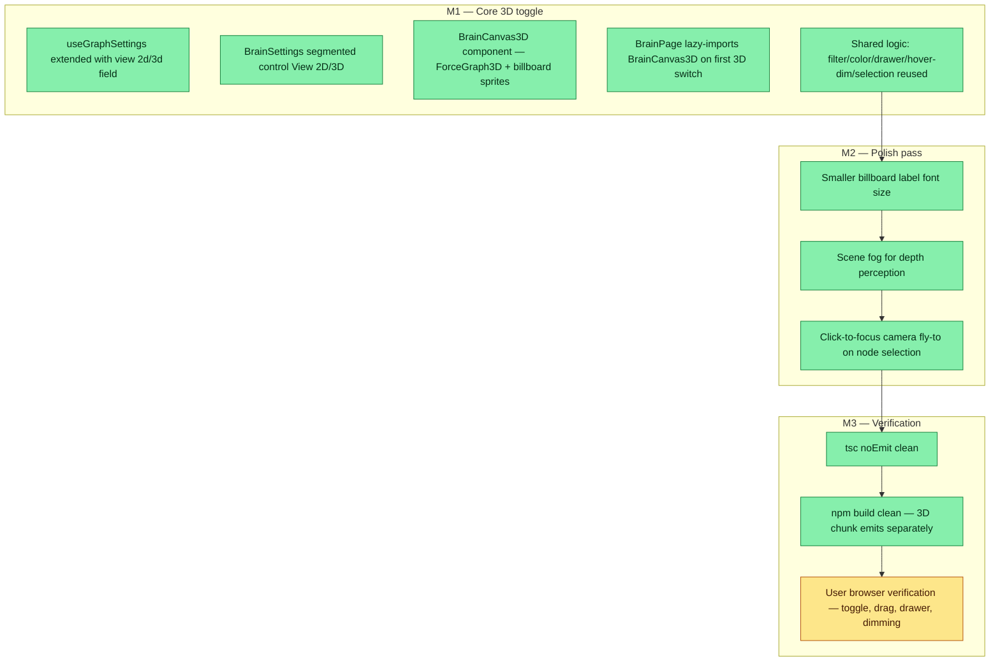

## Workflow

## Why

The Brain graph in 2D causes cluster overlap and link-density ambiguity when node count grows. A 3D toggle lets the user perceive depth in their knowledge graph — relationships that appear tangled in 2D separate spatially in 3D. The mode is opt-in so the default session cost (bundle size, render overhead) is zero.

## User Stories

- [x] As a user with a dense knowledge graph, I can switch to 3D view and orbit/drag nodes to perceive cluster depth that was obscured in 2D.
- [x] As a user on a slow connection, I pay zero 3D bundle cost until I actually toggle to 3D (lazy-load).
- [x] As a user who clicks a node in 3D, the camera flies to focus on that node (same interaction model as 2D click→drawer).
- [ ] As a user at far camera distance, labels fade out to reduce clutter (deferred).
- [ ] As a user with 500+ nodes, performance stays acceptable (deferred — collide-radius tuning needed).

## Acceptance Criteria

- [x] BrainSettings → Display → View segmented control toggles between 2D and 3D
- [x] Initial bundle unchanged (~334KB gzip); 3D chunk (~334KB gzip) loads lazily on first toggle
- [x] Filtering, hover-dim, group color rules, click→drawer all work identically in 3D
- [x] Billboard sprite labels are camera-facing, tuned font size, lower opacity when dimmed
- [x] Scene fog applied for depth perception
- [x] Camera flies to focused node on click in 3D
- [x] `npx tsc -b --noEmit` clean; `npm run build` clean with separate chunk
- [ ] User verifies in browser: toggle 2D↔3D, drag nodes, click into drawer, group colors, hover-dim

## Constraints & Decisions

- **[2026-05-23]** `view` field added to `brain:settings:v1` localStorage blob; old state without `view` falls back to `'2d'` — no migration needed.
- **[2026-05-23]** Toggle not replacement — 2D stays default. 3D is opt-in to keep initial load cost zero.
- **[2026-05-23]** Billboard sprites (THREE.Sprite, text-on-canvas → texture) chosen over HTML-overlay labels for performance in orbit mode.

## Technical Details

Files changed:
- `dashboard/package.json` — added `react-force-graph-3d@^1.29.1`, `three@^0.184.0`, `@types/three@^0.184.1`
- `dashboard/src/hooks/useGraphSettings.ts` — extended `display` with `view: '2d' | '3d'`, default `'2d'`
- `dashboard/src/components/brain/BrainSettings.tsx` — added `SegmentedRow` component, View 2D/3D row at top of Display section
- `dashboard/src/pages/BrainPage.css` — `.brain-segmented*` styles
- `dashboard/src/components/brain/BrainCanvas3D.tsx` — new file: ForceGraph3D + force config (charge/link/center/collide + forceX/Y/Z) + billboard label sprites + scene fog + camera fly-to on click
- `dashboard/src/pages/BrainPage.tsx` — React.lazy import of BrainCanvas3D, conditional render on `settings.display.view`, runtime types extended with z/vz/fz for 3D simulation state

Bundle: main chunk `index-*.js` ~334KB gzip (unchanged); 3D chunk `BrainCanvas3D-*.js` ~334KB gzip (lazy).

## Notes

- Label fade at far camera distance (mirror of 2D `textFadeThreshold`) deferred — no equivalent control in react-force-graph-3d without custom rendering.
- Collide-radius tuning for 500+ nodes deferred — current count fits, cube-root formula may need adjustment at scale.

## Changelog
<!-- LIFO: newest at top. Auto-prepended by `dreamcontext tasks log`. -->

### 2026-05-23 - Status → in_review
- 3D toggle implemented + build verified (lazy-load chunk confirmed, tsc clean). Second-pass polish shipped (fog, label tuning, camera fly-to). Pending user browser verification of 2D/3D toggle, drag, drawer, and dimming in live session.

### 2026-05-23 - Session Update
- Second-pass polish: smaller billboard labels (font size tuned down), scene fog for depth perception, click-to-focus camera fly-to on node selection — all implemented after initial task file was written

### 2026-05-23 - Created
- Initial implementation: useGraphSettings.ts extended, BrainSettings segmented control, BrainCanvas3D.tsx (ForceGraph3D + billboard sprites), BrainPage lazy-loads 3D chunk. tsc + build both clean.
