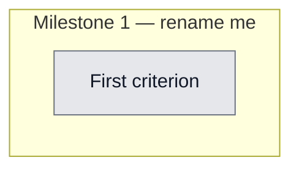

## Workflow
<!-- The shape of this task at a glance. One node per acceptance criterion, grouped under milestone subgraphs. Update node classes as work progresses: `:::done` (green), `:::active` (amber), `:::todo` (gray), `:::blocked` (red). Run `dreamcontext tasks doctor` to verify sync. -->

## Why
<!-- What problem does this solve? What breaks if we don't do it? Be concrete — name the user, the friction, the cost. -->

Entrepreneurs need a structured, repeatable discovery process informed by real user signals (YouTube, Reddit). Encapsulating this as a dreamcontext skill pack makes it reusable across projects.

## User Stories
<!-- As a <role>, I can <action>, so that <outcome>. Tick when demonstrably true in the running system. -->

- [ ] As a [role], I can [action], so that [outcome]

## Acceptance Criteria
<!-- The contract. Each line is testable and gets a node in the Workflow flowchart above. -->

- [ ] First criterion (matches node A1 in Workflow)

skill-packs/business-idea-discovery/SKILL.md shipped with discovery flow

Informed by YouTube research on discovery processes (2+ video transcripts analyzed)

Reddit signals included as a core discovery channel in the skill

All 3 mirrors in sync: skill-packs/, .claude/skills/, .agents/skills/

catalog.json entry valid with correct file path, tags, and cross-pack deps
## Constraints & Decisions
<!-- LIFO: newest at top. Capture the why, not just the what. -->

## Technical Details
<!-- Where the work lives. Files, services, key functions to reuse. Body is current truth — update in place; don't append. -->

(Key files, services, dependencies, implementation approach.)

Key files: skill-packs/business-idea-discovery/SKILL.md. Informed by 2 YouTube transcripts on business idea discovery. Reddit is a primary signal channel. Cross-pack dep: business-idea-validation.
## Notes
<!-- Loose ends, edge cases, open questions. -->

(Working notes, edge cases, open questions.)

## Changelog
<!-- LIFO: newest at top. Auto-prepended by `dreamcontext tasks log`. -->

### 2026-05-26 - Status → in_review
- Skill shipped to skill-packs/, all 3 mirrors validated in sync. Catalog entry valid. Committed in 0685eeb.
### 2026-05-26 - Session Update
- Session 76a35fde: Skill created from YouTube transcript analysis of 2 discovery-focused videos. Reddit identified as important signal channel. Skill shipped to skill-packs/business-idea-discovery/. All 3 mirrors validated in sync. One dangling crossPackDep to business-idea-validation (expected to resolve once that skill commits).
### 2026-05-26 - Created
- Task created.
