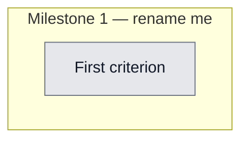

## Workflow
<!-- The shape of this task at a glance. One node per acceptance criterion, grouped under milestone subgraphs. Update node classes as work progresses: `:::done` (green), `:::active` (amber), `:::todo` (gray), `:::blocked` (red). Run `dreamcontext tasks doctor` to verify sync. -->

## Why
<!-- What problem does this solve? What breaks if we don't do it? Be concrete — name the user, the friction, the cost. -->

Validating a business idea requires stage-gated checks (conceive, decide, validate) where each step's output gates the next. Unlike code review (parallel), this is sequential. Encapsulating this as a skill pack makes the process reusable and agent-driven.

## User Stories
<!-- As a <role>, I can <action>, so that <outcome>. Tick when demonstrably true in the running system. -->

- [ ] As a [role], I can [action], so that [outcome]

## Acceptance Criteria
<!-- The contract. Each line is testable and gets a node in the Workflow flowchart above. -->

- [ ] First criterion (matches node A1 in Workflow)

skill-packs/business-idea-validation/SKILL.md shipped with sequential stage-gated flow

stage-definitions.md shipped with stage-by-stage Go/No-Go criteria

All 3 mirrors in sync: skill-packs/, .claude/skills/, .agents/skills/

catalog.json entry references business-idea-discovery as crossPackDep
## Constraints & Decisions
<!-- LIFO: newest at top. Capture the why, not just the what. -->

- **[2026-05-26]** Sequential not parallel — stage N+1 cannot start until stage N passes Go/No-Go gate
## Technical Details
<!-- Where the work lives. Files, services, key functions to reuse. Body is current truth — update in place; don't append. -->

(Key files, services, dependencies, implementation approach.)

Key files: skill-packs/business-idea-validation/SKILL.md, skill-packs/business-idea-validation/stage-definitions.md. Sequential architecture (unlike parallel multi-review): each stage gate must pass before next stage. Informed by user's personal workflow at /Documents/Personal Workspace/200-Projects/270-STARTUP_CHEATSHEET_EXE/.
## Notes
<!-- Loose ends, edge cases, open questions. -->

(Working notes, edge cases, open questions.)

## Changelog
<!-- LIFO: newest at top. Auto-prepended by `dreamcontext tasks log`. -->

### 2026-05-26 - Status → in_review
- Skill shipped to skill-packs/ with SKILL.md + stage-definitions.md, all 3 mirrors in sync. Committed in 0685eeb.
### 2026-05-26 - Session Update
- Session bbadbac1: Skill created using multi-review approach to review the workflow design. Stage-gated sequential flow (unlike parallel code review). Inspired by user's existing STARTUP_CHEATSHEET_EXE conceive/decide/validate process. stage-definitions.md documents Go/No-Go criteria per stage. Committed as part of 0685eeb.
### 2026-05-26 - Created
- Task created.
