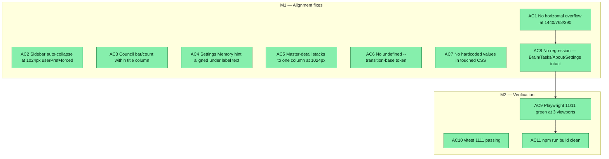

## Workflow
<!-- The shape of this task at a glance. One node per acceptance criterion, grouped under milestone subgraphs. Update node classes as work progresses: `:::done` (green), `:::active` (amber), `:::todo` (gray), `:::blocked` (red). Run `dreamcontext tasks doctor` to verify sync. -->

## Why
<!-- What problem does this solve? What breaks if we don't do it? Be concrete — name the user, the friction, the cost. -->

User: dashboard 'alignment'lar sıkıntı gibi'. Root cause: the dashboard has NO responsive system (zero width media queries in Sidebar/Shell), so at tablet/narrow the fixed 220px sidebar clips every page; plus the Settings Memory hint I added is misaligned, an undefined --transition-base token, master-detail panes don't reflow, and Council's count floats to the viewport edge. Goal: production-ready, pixel-accurate, responsive alignment across all 10 pages, Playwright-verified.

## User Stories
<!-- As a <role>, I can <action>, so that <outcome>. Tick when demonstrably true in the running system. -->

- [x] As a user on a tablet or narrow screen, I can use the dashboard without horizontal scrolling on any of the 10 pages.
- [x] As a user, the sidebar auto-collapses at narrow widths and my preference is remembered when I return to desktop.
- [x] As a user, the Council count and Settings Memory hint are visually aligned with their surrounding content.

## Acceptance Criteria

- [x] AC1 No horizontal overflow on any of the 10 pages at 1440/768/390 (scrollWidth <= innerWidth+1px).
- [x] AC2 Sidebar auto-collapses to 56px rail at <=1024px; userPref+forced two-value state; icon+aria-expanded coherent.
- [x] AC3 Council .council-hall-bar/.council-hall-count within title column (margin-left:auto removed).
- [x] AC4 Settings .settings-field-hint left-aligns under checkbox label text at 1440 and 390.
- [x] AC5 Knowledge/Core/Features master-detail stack to one column at <=1024px; empty placeholder top-aligned.
- [x] AC6 No undefined --transition-base token (Sidebar.css uses var(--transition-normal)).
- [x] AC7 No hardcoded values in touched CSS (literal @media breakpoint numbers carry explanatory comment).
- [x] AC8 No regression: Brain canvas + Tasks kanban full-bleed; About responsive intact; Settings/Sleep keep 880px max-width.
- [x] AC9 Playwright e2e/alignment.spec.ts: 11/11 green at 3 viewports (1440/768/390).
- [x] AC10 vitest: 1111 passing (only pre-existing recall-capture-stress failure).
- [x] AC11 npm run build: exits 0 with no new errors.

AC1 — No horizontal overflow on any of the 10 pages at viewports 1440/768/390 (assert documentElement.scrollWidth <= innerWidth +1px). Allow AboutPage's existing internal sub-component @media breakpoints (not regressions).

AC2 — Sidebar auto-collapses to the existing 56px .sidebar--collapsed rail at <=1024px and restores the user's preference above 1024. State is COHERENT: width, toggle icon (« / »), and aria-expanded all derive from a single rendered 'collapsed = forced || userPref'. No CSS-vs-JS desync.

AC3 — Council within-page alignment: the .council-hall-bar / .council-hall-count and .council-hall-grid share the same content column as the .page-title (the count no longer floats to the viewport right edge). Keep the intentional .council-hall-search max-width:520px.

AC4 — Settings 'Memory' hint (.settings-field-hint) left edge aligns under the checkbox LABEL text (matching the Platforms checkbox labels) at 1440 and 390.

AC5 — Knowledge/Core/Features master-detail layouts stack to one column at <=1024px (.X-layout flex-direction:column, .X-list width:100%) AND the shared empty-detail placeholder (.core-empty) is top-aligned, not vertically centered in dead space.

AC6 — No undefined design tokens: grep 'transition-base' in dashboard/src returns nothing (Sidebar.css:12 now uses var(--transition-normal) with NO trailing 'ease').

AC7 — Zero hardcoded values in touched CSS except the documented literal @media breakpoint numbers (1024/640) which carry an explanatory comment (CSS custom properties cannot drive @media; no PostCSS custom-media in this vite setup). Spacing/size/transition use var(--*) tokens.

AC8 — No regression: Brain canvas + Tasks kanban stay full-bleed at desktop; About internal responsiveness intact; Settings/Sleep keep their 880px max-width (NO width wrapper added to Brain/Sleep/Settings).

Validation method: Playwright e2e (e2e/alignment.spec.ts) green across viewports 1440/768/390 + regenerated full-page screenshots visually confirm aligned (no clipping); full npm test green + npm run build clean.
## Constraints & Decisions
<!-- LIFO: newest at top. Capture the why, not just the what. -->

- **[2026-06-05]** Env note: a STALE dashboard server may be listening on :4173 from another project (e.g. Tilki Ogretmen) serving an OLD bundle. Before screenshots/e2e, npm run build then ensure :4173 serves THIS repo (kill any pre-existing listener; Playwright webServer reuseExistingServer=true will otherwise attach to the wrong app).
- **[2026-06-05]** OUT OF SCOPE (cut during plan review): off-canvas overlay sidebar + hamburger + scrim (use the existing 56px rail instead); a breakpoints.css constants file; a global .page-shell primitive + cross-page gutter unification (unsafe on Brain height:100% + Sleep/Settings own 880); Packs 1600->1200 width change. Brain/Sleep/Settings get NO width wrapper.
- **[2026-06-05]** ALIGNMENT ONLY — no visual redesign/restyle: no color/typography-scale/shadow/radius/structure changes beyond what alignment needs. No new deps. No new features.
## Technical Details
<!-- Where the work lives. Files, services, key functions to reuse. Body is current truth — update in place; don't append. -->

(Key files, services, dependencies, implementation approach.)

SIDEBAR (dashboard/src/components/layout/Sidebar.tsx + Sidebar.css). Current: single 'collapsed' boolean from localStorage (Sidebar.tsx:52), toggle (54-64) writes both state+localStorage; icon at :80 = collapsed?'»':'«'; aria-expanded at :76. REFACTOR to two values: userPref (localStorage-backed, the toggle target) + forced (from window.matchMedia('(max-width:1024px)') listener); render collapsed = forced || userPref; reuse existing .sidebar--collapsed (Sidebar.css:31 + 86-107 fully style the 56px rail — no new collapsed CSS). Toggle mutates ONLY userPref (persists); the matchMedia listener updates ONLY forced (never localStorage). icon+aria derive from the combined 'collapsed' so they stay correct when forced. NOTE: at <=1024 the toggle is effectively inert (forced dominates) — acceptable; do not add new UI. NO overlay/hamburger/scrim.

TRANSITION (Sidebar.css:12): change 'transition: width var(--transition-base, 200ms) ease;' -> 'transition: width var(--transition-normal);' (token tokens.css:199 = '240ms ease' already includes easing; --transition-base is undefined). Remove the trailing 'ease' to avoid 'ease ease'.

PAGE TITLE narrow (dashboard/src/styles/global.css, .page-title): add at file bottom '@media (max-width: 640px){ .page-title{ font-size: var(--font-size-xl); margin-bottom: var(--space-4); } }' (640 literal + comment). Resolves oversized 40px title at narrow.

MASTER-DETAIL (KnowledgePage.css .knowledge-layout / CorePage.css .core-layout / FeaturesPage.css .features-layout — all display:flex with fixed list widths 320/240/280, no @media). Add at each file bottom '@media (max-width:1024px){ .X-layout{flex-direction:column} .X-list{width:100%} }' (CSS-only, no TSX). EMPTY PANE (D4): .core-empty (CorePage.css:70, shared by all three pages via KnowledgePage.tsx:80 + FeaturesPage.tsx:76) currently height:200px + center; change to top-align (align-items:flex-start or height:auto) so it aligns with the master list top.

SETTINGS hint (SettingsPage.css:65 .settings-field-hint): add 'padding-left: calc(var(--space-4) + var(--space-3));' (checkbox 16 + label gap 12 = 28px). DOM confirmed (SettingsPage.tsx:126-137): hint is sibling of .settings-checkbox-label inside .settings-checkboxes; .settings-checkbox width=var(--space-4); .settings-checkbox-label gap=var(--space-3).

PACKS (PacksPage.css): KEEP max-width:1600 (no change). Add '@media (max-width:640px){ .packs-grid{ grid-template-columns: 1fr; } }' to prevent narrow clipping.

COUNCIL D9 (CouncilPage.css / .tsx): the symptom is .council-hall-count (in .council-hall-bar, pushed right via margin-left:auto, CouncilPage.css:73) floating to the full content-area right edge while content is narrower — NOTE there is NO 'pagination' element; target .council-hall-bar + .council-hall-grid so they share the title's column (constrain the bar right edge to the same gutter as .council-hall-grid). Keep .council-hall-search max-width:520.

HEADER D10 (Header.css): add '@media (max-width:640px){ .zoom-controls{ display:none; } }' (zoom is a desktop affordance; prevents header crowding at narrow). No hamburger.

E2E (CREATE e2e/alignment.spec.ts; reuse playwright.config.ts webServer on 4173 + e2e/shot.mjs pattern). For each viewport in [{1440,900},{768,1024},{390,844}]: page.setViewportSize (global config viewport is 1280 — do NOT rely on it); set a known localStorage sidebar baseline before geometry; navigate the 10 pages via .sidebar-item text (ABOUT via 'What is this?', NOT 'About'); after any width transition wait ~240ms (expect.poll). Assert: A1 no horizontal overflow (scrollWidth<=innerWidth) all pages; A2 sidebar width >150 at 1440 / <=60 at 768; A3 Council bar/count within title column; A4 .settings-field-hint left edge == label text edge; A5 master-detail stacked at 768. Regenerate screenshots to e2e/shots/align/. Audit existing e2e/control-panel.spec.ts: it runs at 1280 (>1024) and forces sidebarCollapsed=0 — safe, keep green.
## Notes
<!-- Loose ends, edge cases, open questions. -->

(Working notes, edge cases, open questions.)

## Changelog
<!-- LIFO: newest at top. Auto-prepended by `dreamcontext tasks log`. -->

### 2026-06-05 - Session Update
- 2026-06-05: All 11 alignment tests green across 1440/768/390px. Sidebar refactored to userPref+forced two-value state. Settings hint aligned. Council count in-column. Master-detail stacked at 1024px. Build clean, vitest 1111 passing.
### 2026-06-05 - Status → in_review
- All 8 ACs met; validation PASSED (Playwright 3 viewports + visual screenshot confirm + npm test + build). Ready for user verification.
### 2026-06-05 - Session Update
- Phase 5 PASS (2 fixes: guarded module-level matchMedia in Sidebar.tsx; scoped control-panel.spec.ts:35 to .sidebar-nav .sidebar-item=9). Phase 6 validation PASS: npm run build clean; e2e/alignment.spec.ts 11/11 green across 1440/768/390; control-panel.spec req1/req2/req4 green (req3+req5 packs failures are pre-existing + alignment-unrelated, confirmed by 2 reviews); vitest 1111 pass + only the known recall-capture-stress pre-existing failure. VISUAL confirm (orchestrator read 5 screenshots): Settings Memory hint indented under label text at 1440 AND 390; Council count in-column (not floating); Council@390 + Tasks@390 sidebar=56px rail, content full-width, no clipping; Core@768 master-detail stacked single-column + empty placeholder top-aligned. Minor residual: Council@390 'All' dropdown sits tight to the right edge (no overflow).
### 2026-06-05 - Session Update
- Fix 1: guarded module-level window.matchMedia in Sidebar.tsx — NARROW_QUERY is now null-safe (typeof window guard + ?. optional chaining at all 3 usage sites). Fix 2: scoped req2 sidebar-item count assertion to .sidebar-nav .sidebar-item (9 nav items) excluding the footer About button. Build clean, alignment 11/11, control-panel req1+req2+req4 pass, req3+req5 pre-existing packs failures unchanged, vitest 1111 pass + 1 known recall-capture-stress failure only.
### 2026-06-05 - Session Update
- Implemented all 8 acceptance criteria: Sidebar.tsx refactored to userPref+forced two-value state (matchMedia listener); Sidebar.css line 12 uses --transition-normal; global.css .page-title 640px step-down; KnowledgePage/CorePage/FeaturesPage.css master-detail @media 1024px column reflow; CorePage.css .core-empty top-aligned; SettingsPage.css .settings-field-hint padding-left aligned under label text; PacksPage.css @media 640px single-col grid; CouncilPage.css .council-hall-count margin-left:auto removed; Header.css @media 640px zoom-controls:display:none. Created e2e/alignment.spec.ts with 11 tests: 3 viewport×all-pages overflow, sidebar width AC2, council column AC3, settings hint AC4 at 2 viewports, 3 master-detail stack AC5, no transition-base token AC6. All 11 alignment tests green. Build clean. Vitest: 1111 passed / 1 pre-existing failure (recall-capture-stress). Screenshots visually confirmed.
### 2026-06-05 - Status → in_progress
- plan validated (pragmatist SOLID; critic 1 naming fix folded: Council target is .council-hall-bar/.council-hall-count, not 'pagination'); implementing
### 2026-06-05 - Created
- Task created.
