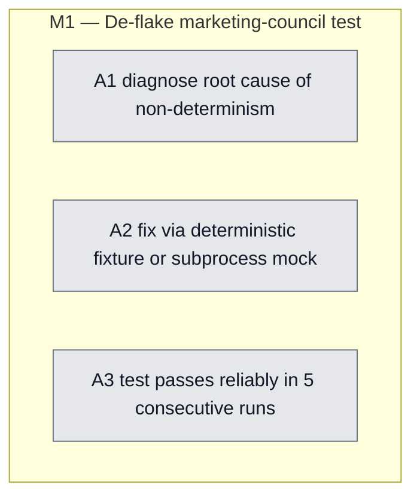

## Workflow
<!-- The shape of this task at a glance. One node per acceptance criterion, grouped under milestone subgraphs. Update node classes as work progresses: `:::done` (green), `:::active` (amber), `:::todo` (gray), `:::blocked` (red). Run `dreamcontext tasks doctor` to verify sync. -->

## Why
<!-- What problem does this solve? What breaks if we don't do it? Be concrete — name the user, the friction, the cost. -->

tests/integration/marketing-council.test.ts > 'creates a debate with all 4 marketing personas pre-registered' is non-deterministic (passes/fails across runs incl. isolated). The mk council subprocess likely races on filesystem state or a transient subprocess failure. De-flake it (deterministic fixture / serialize / mock the subprocess).

## User Stories

- [ ] As a developer running the test suite, I can trust that `vitest run` produces a consistent pass/fail result across consecutive runs (no randomly failing tests).

## Acceptance Criteria

- [ ] **A1** Root cause of non-determinism in `tests/integration/marketing-council.test.ts > 'creates a debate with all 4 marketing personas pre-registered'` is identified (filesystem race, transient subprocess failure, or shared state).
- [ ] **A2** Test fixed via deterministic fixture, subprocess mock, or serialization — no flaky behavior on repeated isolated runs.
- [ ] **A3** `vitest run tests/integration/marketing-council.test.ts` passes in 5 consecutive runs with no skips.

## Constraints & Decisions
<!-- LIFO: newest at top. Capture the why, not just the what. -->

## Technical Details

Key file: `tests/integration/marketing-council.test.ts`. Confirmed: the test passes when run in isolation but fails non-deterministically in the full suite (observed during v06-control-plane-backend M2 session). Hypothesis: filesystem state or subprocess timing race. Pattern ref: `tests/integration/vaults-cli.test.ts` (uses `HOME` tmpdir injection for isolation).

## Notes
<!-- Loose ends, edge cases, open questions. -->

Hypothesis: filesystem state or subprocess timing race in the mk council subprocess. The test passes in isolation. Pattern ref: `tests/integration/vaults-cli.test.ts` for tmpdir isolation.

## Changelog
<!-- LIFO: newest at top. Auto-prepended by `dreamcontext tasks log`. -->

### 2026-05-31 - Session Update
- sleep-tasks: populated placeholder body — added User Stories, 3 ACs, Technical Details (root file + isolation pattern); fixed version v0.5.0 → 0.6.0
### 2026-05-31 - Created
- Task created.
