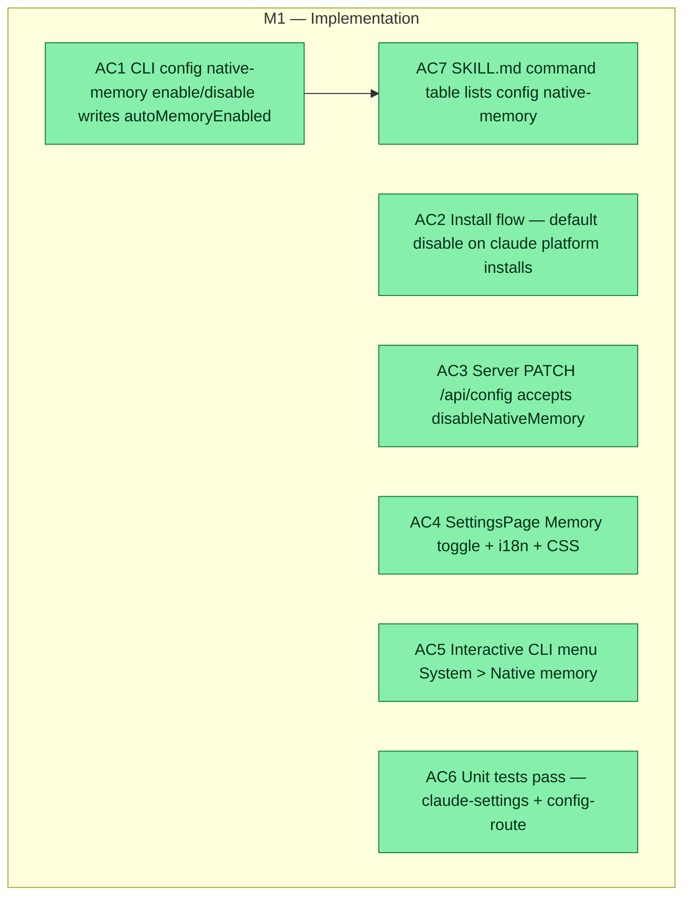

## Workflow
<!-- The shape of this task at a glance. One node per acceptance criterion, grouped under milestone subgraphs. Update node classes as work progresses: `:::done` (green), `:::active` (amber), `:::todo` (gray), `:::blocked` (red). Run `dreamcontext tasks doctor` to verify sync. -->

## Why
<!-- What problem does this solve? What breaks if we don't do it? Be concrete — name the user, the friction, the cost. -->

Two competing memory systems (dreamcontext engine + Claude native MEMORY.md) run side by side; native is dumber and dilutes the brain. dreamcontext should be the single source of project memory by default.

## User Stories
<!-- As a <role>, I can <action>, so that <outcome>. Tick when demonstrably true in the running system. -->

- [x] As a new dreamcontext user, when I install the tool, Claude native auto-memory is disabled by default so dreamcontext owns project memory from day one.
- [x] As a user, I can toggle native memory on/off from the Settings page or via `dreamcontext config native-memory enable/disable`, so I can experiment if needed.
- [x] As a server/dashboard user, I can PATCH /api/config with disableNativeMemory to control the setting programmatically.

## Acceptance Criteria

- [x] AC1 `dreamcontext config native-memory disable` writes `autoMemoryEnabled: false` to `.claude/settings.json`; `enable` sets it to `true`.
- [x] AC2 Install flow (installCoreForPlatform) applies default disable on claude platform installs; `--keep-native-memory` flag skips it.
- [x] AC3 Server PATCH /api/config accepts `disableNativeMemory` boolean and reflects into `.claude/settings.json`.
- [x] AC4 SettingsPage shows Memory toggle wired to the setting with i18n keys and CSS.
- [x] AC5 Interactive CLI menu has System > Native memory option.
- [x] AC6 10 unit tests in tests/unit/claude-settings.test.ts pass; config-route disableNativeMemory cases pass.
- [x] AC7 SKILL.md command table lists `config native-memory`.

## Constraints & Decisions
<!-- LIFO: newest at top. Capture the why, not just the what. -->

- **[2026-06-05]** autoMemoryEnabled:false disables BOTH auto-load (MEMORY.md injection) and the write tool — they are NOT independent per official Claude Code docs. Project-scoped .claude/settings.json is honored at all scope levels. Key: camelCase boolean, not string.
## Technical Details

Key: `autoMemoryEnabled: false` in `.claude/settings.json` (project-scoped). Disables both auto-memory injection at session start AND the memory write tool. Key is camelCase boolean.

Files:
- `src/lib/claude-settings.ts` — `applyClaudeAutoMemory(root, enable)`: reads `.claude/settings.json`, sets `autoMemoryEnabled`, writes back. Server-safe (no inquirer dep).
- `src/lib/setup-config.ts` — `SetupConfig.disableNativeMemory` (default `true`).
- `src/lib/install-packs.ts` — `installCoreForPlatform` calls `applyClaudeAutoMemory` on claude installs; `setup` gains `--keep-native-memory` flag.
- `src/server/routes/config.ts` — PATCH `/api/config` strict-picks `disableNativeMemory` and delegates to `applyClaudeAutoMemory`.
- `dashboard/src/pages/SettingsPage.tsx` + `SettingsPage.css` — Memory toggle in Settings UI.
- `src/cli/commands/config.ts` — `config show` + `config native-memory <enable|disable>` commands.
- Tests: `tests/unit/claude-settings.test.ts` (10 tests), `tests/unit/config-route.test.ts` (disableNativeMemory cases).

## Notes
<!-- Loose ends, edge cases, open questions. -->

(Working notes, edge cases, open questions.)

## Changelog
<!-- LIFO: newest at top. Auto-prepended by `dreamcontext tasks log`. -->

### 2026-06-05 - Session Update
- 2026-06-04: End-to-end implementation shipped. New src/lib/claude-settings.ts applyClaudeAutoMemory(). Wired: install (default disable on claude installs), server PATCH /api/config, SettingsPage Memory toggle, CLI 'config native-memory enable|disable'. SKILL.md updated. 10 new tests. Build clean.
### 2026-06-04 - Status → in_review
- All four surfaces shipped + tested; ready for user verification.
### 2026-06-04 - Session Update
- Implemented end-to-end. New SetupConfig.disableNativeMemory (default true). New lib src/lib/claude-settings.ts applyClaudeAutoMemory() writes autoMemoryEnabled (server-safe, no inquirer dep). Wired: (1) install — installCoreForPlatform applies on claude installs, default disable; setup gains --keep-native-memory flag + summary line; (2) server PATCH /api/config accepts disableNativeMemory (boolean, strict-pick) + reflects into .claude/settings.json; (3) web dashboard SettingsPage Memory toggle + i18n + CSS; (4) CLI 'config' command (show + native-memory enable|disable) and interactive CLI menu System category 'Native memory'. SKILL.md command table updated. Tests: tests/unit/claude-settings.test.ts (10) + config-route disableNativeMemory cases; full unit suite 1085/1086 (the 1 failure is recall-capture-stress baseline, caused by untracked _dream_context/state/.session-digests/, unrelated). CLI + dashboard tsc clean. Smoke-tested config command (disable/enable/bad-state exit1).
### 2026-06-04 - Created
- Task created.
