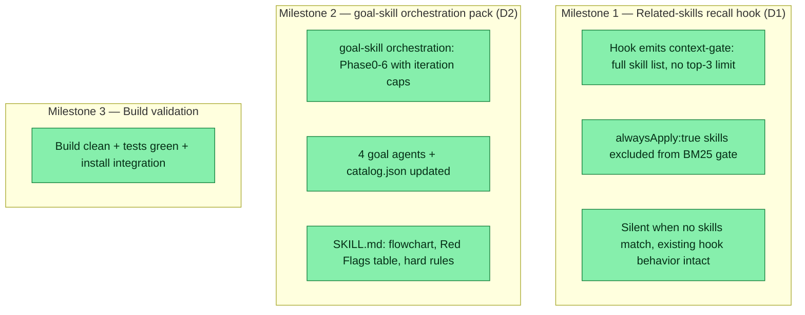

## Workflow
<!-- The shape of this task at a glance. One node per acceptance criterion, grouped under milestone subgraphs. Update node classes as work progresses: `:::done` (green), `:::active` (amber), `:::todo` (gray), `:::blocked` (red). Run `dreamcontext tasks doctor` to verify sync. -->

## Why
<!-- What problem does this solve? What breaks if we don't do it? Be concrete — name the user, the friction, the cost. -->

Our SessionStart injects a knowledge snapshot but nothing makes the agent USE the brain or invoke relevant skills before acting. Superpowers proves a behavioral bootstrap + tested orchestration discipline materially improves agent reliability. We adopt two scoped pieces: (1) surface relevant installed skills on every prompt so the agent invokes them before acting; (2) a goal-skill that drives non-trivial goals through plan->review->implement->validate loops with sub-agents.

## User Stories
<!-- As a <role>, I can <action>, so that <outcome>. Tick when demonstrably true in the running system. -->

- [x] As an agent, I see relevant installed skills surfaced on every substantive prompt, so I invoke them before acting rather than producing skill-blind output.
- [x] As a user, I can invoke `goal-skill` to drive a non-trivial goal through a plan->review->implement->validate loop with sub-agents, so risky or complex goals get proper orchestration discipline.
- [x] As a user, the hook is silent when no skills match, so greetings and off-topic prompts are not polluted with skill noise.

## Acceptance Criteria
<!-- The contract. Each line is testable and gets a node in the Workflow flowchart above. -->

- [x] D1: On UserPromptSubmit (prompt length >= 8, not a greeting, env DREAMCONTEXT_SKILLS_HOOK != 0, sleep not in progress), the hook emits a context-gate block telling the agent to review the full skill list already in context and invoke any that fit — NO top-3 pre-selection, NO listing specific skills by name.
- [x] D1: Skills with alwaysApply:true (engineering, design) are EXCLUDED from the BM25 gate check (they are always loaded; surfacing them is noise).
- [x] D1: When no skills are installed / .claude/skills is missing / no skill clears the score threshold, the block is silent and the hook still exits 0 with all existing behavior (sleep-debt, marketing, memory recall) intact.
- [x] D2: A new skill-pack goal-skill instructs the MAIN agent to orchestrate: Phase0 ask user -> Phase1 PLAN (goal-planner, opus) -> Phase2 PLAN-REVIEW (2 parallel lenses, iterate until SOLID or cap=3) -> Phase3 persist plan into dreamcontext task -> Phase4 IMPLEMENT (goal-implementer) -> Phase5 CODE-REVIEW (reuse existing reviewer, cap=3) -> Phase6 VALIDATE (goal-validator; FAIL -> Phase4).
- [x] D2: goal-skill ships 4 new agents (goal-planner opus, goal-plan-reviewer, goal-implementer, goal-validator), each with `skills:` frontmatter + `## Skills always loaded`. catalog.json updated with packs[] entry (subSkills:[], base, relatedAgents incl. reviewer) and 4 agents[] entries.
- [x] D2: SKILL.md contains orchestration mermaid flowchart, Red Flags table, rationalization table, iteration caps with TodoWrite tracking, hard rules (orchestrator never writes code; never skip Phase0; never auto-complete task).
- [x] Validation: npm run build clean + npm test green; goal-skill installs into tmp project (SKILL.md + 4 goal agents + reviewer.md present, catalog.json parses).
## Constraints & Decisions
<!-- LIFO: newest at top. Capture the why, not just the what. -->

- **[2026-05-31]** [2026-05-31] Context-gate final design (iteration 4): hook no longer lists a top-3 subset of skills — that arbitrary pre-selection is gone. The gate now tells the agent to review the full skill list already in context and decide which to invoke. Internal BM25 check retained only to decide WHETHER to fire the gate (silent on greetings). This ensures the agent sees ALL skills, not a pre-curated few.
- **[2026-05-31]** Build sequence: A = recall.ts loadSkillDocs + CorpusType + unit tests (pure lib, lowest risk). B = hook.ts Related-skills block + integration tests (completes D1). C = goal-skill SKILL.md + 4 agents + catalog.json + install assertion (completes D2). D = install goal-skill into dev repo (npx dreamcontext install-skill --packs goal-skill) + manual smoke run. Verify build+test green after each of A/B/C.
- **[2026-05-31]** Decisions pending user confirmation (recorded, not blocking): iteration cap = 3 per loop; SKILL_SCORE_THRESHOLD = 1.0; plan-reviewer parallel lenses default = 2; goal-planner stays opus per explicit user request despite cost.
- **[2026-05-31]** Skill name is goal-skill (NOT goal) to avoid colliding with the built-in /goal harness command. Invoked via description trigger phrases (no .claude/commands or settings.json wiring needed — confirmed council/multi-review work the same way).
- **[2026-05-31]** YAGNI / out of scope (deferred follow-ups, do NOT build now): standalone writing-skills meta-skill; brainstorming skill; full description audit of all existing packs; CLAUDE.md AI-contributor guardrails; cross-platform tool-mapping & Codex .agents/skills scanning; user-level ~/.claude/skills scanning (v1 is project-only, anchored at process.cwd()); a dreamcontext goal CLI command (existing task system suffices); programmatic loop-iteration enforcement (prose + TodoWrite only for v1); Playwright validation (no playwright in repo; goal-validator has no browser tools — v1 validation = unit/integration tests + build + manual checklist).
## Technical Details
<!-- Where the work lives. Files, services, key functions to reuse. Body is current truth — update in place; don't append. -->

(Key files, services, dependencies, implementation approach.)

D1 / src/lib/recall.ts — Add 'skill' to CorpusType union (the docs returned by the loader carry type:'skill'). Add exported loadSkillDocs(skillsRoot: string): CorpusDoc[] using fg.sync('*/SKILL.md',{cwd:skillsRoot,absolute:true}) (NOT *.md; only top-level pack SKILL.md, not nested sub-skills). Per file: readFrontmatter; skip if data.alwaysApply===true; slug = data.name (fallback dir basename); description = data.description ?? first body line; tags = data.tags ?? []; body tokenized for BM25; relPath relative to skillsRoot. Wrap per-file in try/catch. DO NOT add a 'skill' branch to buildCorpus — keep buildCorpus scoped to contextRoot so haikuRecall is byte-for-byte unchanged.

D1 / src/cli/commands/hook.ts (user-prompt-submit action) — After the memory-recall block, in its OWN try/catch (must never break the hook): gate on prompt.trim().length>=8 and process.env.DREAMCONTEXT_SKILLS_HOOK!=='0'. projectRoot = process.cwd() (matches install-skill.ts:241; the hook runs from project root). skillsRoot = join(projectRoot,'.claude','skills'); if !existsSync -> silent. const docs = loadSkillDocs(skillsRoot); const hits = bm25Search(prompt, docs, 3).filter(h=>h.score>=SKILL_SCORE_THRESHOLD). SKILL_SCORE_THRESHOLD=1.0 (lower than memory's 2.0; safe because alwaysApply noise is filtered and the corpus is tiny). If 0 hits -> silent. Else console.log a '— Related skills (top N) —' block: 'Invoke these via the Skill tool BEFORE acting if they fit the task:' then '  • <slug> — <desc≤120 chars>'. Note in a comment: the sleep_started_at early-return (hook.ts ~579-584) intentionally suppresses this block during consolidation sessions.

D2 / files — CREATE skill-packs/goal-skill/SKILL.md and skill-packs/agents/goal-{planner,plan-reviewer,implementer,validator}.md. EDIT skill-packs/catalog.json: add packs[] entry {name:'goal-skill', description (triggers only), tags, alwaysApply:false, base:'<one-paragraph>', subSkills:[], relatedAgents:['goal-planner','goal-plan-reviewer','goal-implementer','goal-validator','reviewer'], crossPackDeps:['engineering']} AND add the 4 agents to the top-level agents[] array ({name, file:'agents/goal-*.md', pack:'goal-skill', description, tags, model}); reviewer already exists in agents[] — do not duplicate. subSkills:[] and base are MANDATORY or installPackFiles throws at the subSkills iteration.

D2 / agent roster — goal-planner: model opus (per user), tools Read/Glob/Grep/Bash (read-only), skills [engineering,dreamcontext]; produces file-by-file plan, never writes code/task doc, 'a plan that says "update the relevant files" is REJECTED'. goal-plan-reviewer: model sonnet, read-only tools, lens passed per-dispatch (default lenses: pragmatist + critic; security conditional), returns SOLID|NEEDS_WORK + blocking findings, no rubber-stamp / no invented problems. goal-implementer: model sonnet (opus on hard goals), tools Read/Glob/Grep/Bash/Write/Edit + load domain skill the task references, implement ONLY acceptance criteria, STOP+report if plan is wrong, dreamcontext tasks log progress. goal-validator: model sonnet, tools Read/Glob/Grep/Bash (no Write), runs the actual chosen validation, flaky/skipped=FAIL, evidence (command+output) required. Code-review gate reuses reviewer (Phase5) — orchestrator tells it to run git diff <base> itself, NOT pass a raw diff.

D2 / task lifecycle (existing CLI only, no new command): Phase3 dreamcontext tasks create <slug> + tasks insert acceptance_criteria/technical_details/constraints (include 'Validation method: <user choice>'); de-collide slug if it exists (check-before-create, suffix if needed); status todo. Phase4 start: tasks status <slug> in_progress. progress: tasks log. fail loop: tasks log 'review/validation FAIL: <reason>; re-implementing' (stay in_progress). pass: tasks status <slug> in_review. complete is USER-ONLY (orchestrator asks, never auto-completes).

Tests — CREATE tests/unit/recall-skill-corpus.test.ts (tmpdir+fs; loadSkillDocs loads SKILL.md w/ type/slug/desc/tags; alwaysApply:true skipped; missing dir->[]; malformed->skip; bm25 ranks relevant skill above unrelated; multi-level nested SKILL.md ignored). EDIT tests/integration/hook.test.ts: add env?:NodeJS.ProcessEnv param to runWithStdin (execSync env); cases: 'review this PR with the team' -> Related skills + multi-review + invoke instruction; unrelated/below-threshold -> no line; no .claude/skills -> no line + exit 0 + existing recall/sleep assertions intact; greeting <8 chars -> no line; DREAMCONTEXT_SKILLS_HOOK=0 -> suppressed. Install integration: install --packs goal-skill into tmp -> assert .claude/skills/goal-skill/SKILL.md + 4 goal agents + reviewer.md exist + catalog.json parses + relatedAgents resolve.
## Notes
<!-- Loose ends, edge cases, open questions. -->

(Working notes, edge cases, open questions.)

Plan was produced by an opus plan agent and reviewed by 3 parallel reviewers (correctness / pragmatism-YAGNI / risk-edge-cases), all NEEDS_WORK on first pass; findings consolidated into the technical_details above (converged on: alwaysApply exclusion mandatory; use process.cwd() not dirname(contextRoot); don't route skills through buildCorpus; catalog subSkills:[]+base required; runWithStdin needs env param; loop cost controls). This task itself was built by dogfooding the goal-skill loop.

Untracked addition: .codex/agents/review-{cloud-functions,edge-cases,frontend,router,security}.toml — 5 new Codex review-lens agents created alongside this work. These extend the multi-review pattern with domain-specific lenses. No separate task needed — they're infrastructure additions. If Codex agent management becomes significant work, a dedicated task should be created.
## Changelog
<!-- LIFO: newest at top. Auto-prepended by `dreamcontext tasks log`. -->

### 2026-05-31 - Session Update
- Context-gate redesign (iteration 4): hook now tells agent to review full skill list already in context — removed top-3 pre-selection entirely. Agent decides from everything, not a pre-picked few. Internal BM25 check retained only to decide whether to fire the gate (silent on greetings/unrelated). 17 user-prompt-submit tests green including new 'fires gate / no specific skill listing' assertion.
### 2026-05-31 - Status → in_review
- all acceptance criteria met; validation passed via unit+integration tests + build + install check
### 2026-05-31 - Session Update
- VALIDATION PASS. Build clean (tsup). New tests green: 7 unit (recall-skill-corpus) + 6 integration (user-prompt-submit Related-skills incl. alwaysApply-filter, no-skills, <8char, env-off). Reviewer agent returned PASS on the diff. Install verified: goal-skill -> .claude/skills + 4 goal agents + reviewer land in a tmp project. 3 repo test failures (session-start snapshot summary/tool_count, subagent-start pinned knowledge) confirmed PRE-EXISTING at HEAD via stash+rebuild — zero new failures from this work.
### 2026-05-31 - Status → in_progress
- plan validated by 3 reviewers; beginning implementation increment A
### 2026-05-31 - Created
- Task created.
