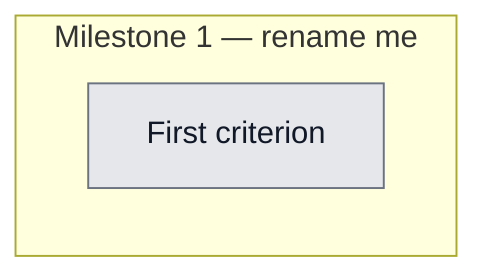

## Workflow
<!-- The shape of this task at a glance. One node per acceptance criterion, grouped under milestone subgraphs. Update node classes as work progresses: `:::done` (green), `:::active` (amber), `:::todo` (gray), `:::blocked` (red). Run `dreamcontext tasks doctor` to verify sync. -->

## Why
<!-- What problem does this solve? What breaks if we don't do it? Be concrete — name the user, the friction, the cost. -->

The original multi-query approach sent the entire raw user prompt to BM25 — poor recall quality for non-English prompts (Turkish/mixed) and verbose prompts where intent is diluted. A single Haiku call with the full corpus index understands intent across languages and returns only relevant docs with zero noise.

## User Stories
<!-- As a <role>, I can <action>, so that <outcome>. Tick when demonstrably true in the running system. -->

- [ ] As a [role], I can [action], so that [outcome]

## Acceptance Criteria
<!-- The contract. Each line is testable and gets a node in the Workflow flowchart above. -->

- [ ] First criterion (matches node A1 in Workflow)

recall-query-extractor.ts ships HaikuRecallResult type + single claude CLI executor with 15s timeout fallback

Corpus index (type/slug summary) injected into Haiku system prompt — not the raw user prompt

Turkish/mixed-language prompts resolved correctly via intent matching across languages

Silent fallback to raw BM25 when claude CLI is unavailable

recall-multi-query.ts and its tests deleted; 66 tests pass with zero TS errors
## Constraints & Decisions
<!-- LIFO: newest at top. Capture the why, not just the what. -->

- **[2026-05-26]** Silent catch with DREAMCONTEXT_DEBUG-gated console.error — no noise on missing claude CLI
- **[2026-05-26]** Corpus capped at 8,000 chars with [truncated] note to prevent token blowup in Haiku context
## Technical Details
<!-- Where the work lives. Files, services, key functions to reuse. Body is current truth — update in place; don't append. -->

(Key files, services, dependencies, implementation approach.)

Key files: src/lib/recall-query-extractor.ts (new single-call Haiku executor), src/cli/commands/hook.ts (integration point). Deleted: src/lib/recall-multi-query.ts + tests/unit/recall-multi-query.test.ts. ClaudeExecutor injectable for testing. Corpus index format: type/slug per line (capped 8,000 chars). CLI flags passed to claude: --model haiku, --no-session-persistence, --exclude-dynamic-system-prompt-sections, --tools ''. Response: JSON {docs:["type/slug"], skip:false}. stripCodeBlock regex is case-insensitive for code fence variants.
## Notes
<!-- Loose ends, edge cases, open questions. -->

(Working notes, edge cases, open questions.)

## Changelog
<!-- LIFO: newest at top. Auto-prepended by `dreamcontext tasks log`. -->

### 2026-05-26 - Status → in_review
- 66/66 tests pass, build succeeds, E2E verified — single Haiku call replaces multi-query BM25, committed in 0685eeb. Unstaged changes remain (hook.ts integration + deleted files not yet committed).
### 2026-05-26 - Session Update
- Session fcaa4dbc: Replaced multi-query BM25 with single Haiku claude CLI call. recall-query-extractor.ts rewritten, recall-multi-query.ts deleted. Multi-review code review run on implementation — all 4 findings fixed (case-sensitive stripCodeBlock regex, silent catch, unbounded corpus index, missing empty-corpus test). 66/66 tests pass. Committed as 0685eeb.
### 2026-05-26 - Created
- Task created.
