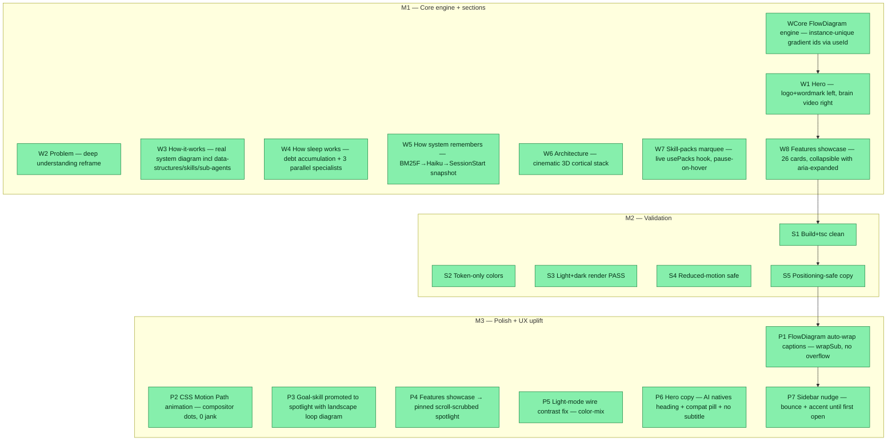

## Workflow
<!-- The shape of this task at a glance. One node per acceptance criterion, grouped under milestone subgraphs. Update node classes as work progresses: `:::done` (green), `:::active` (amber), `:::todo` (gray), `:::blocked` (red). Run `dreamcontext tasks doctor` to verify sync. -->

## Why
<!-- What problem does this solve? What breaks if we don't do it? Be concrete — name the user, the friction, the cost. -->

Major upgrade of the dashboard 'What is this?' landing page: depict the REAL multi-agent system, deeper positioning (deep understanding, not storage), two new How-It-Works sub-sections (sleep + recall), a redesigned architecture section, an infinite skill-packs marquee, and a collapsible features showcase. Built via goal-skill orchestration with opus sub-agents.

## User Stories
<!-- As a <role>, I can <action>, so that <outcome>. Tick when demonstrably true in the running system. -->

- [x] As a new user, I can open 'What is this?' in the dashboard and understand exactly what dreamcontext does, how sleep works, and how recall works, so I can evaluate adoption.
- [x] As a developer, I can see a live skill-packs marquee that always reflects actually installed packs (not hardcoded), so the page never goes stale.
- [x] As a user, I can expand/collapse feature cards and navigate the architecture with keyboard/reduced-motion, so the page is accessible.

## Acceptance Criteria
<!-- The contract. Each line is testable and gets a node in the Workflow flowchart above. -->

- [x] WCore FlowDiagram: one data-driven component renders all animated diagrams; gradient ids instance-unique via useId; comet gradient renders in every on-page diagram.
- [x] W1 Hero: logo+wordmark lockup left; looping brain video right (webm+mp4+poster); install command + links present.
- [x] W2 Problem: reframed to deep understanding ('surfaces what is hiding', 'knows your project better than you').
- [x] W3 How-it-works: REAL system — data-structures, skills, sub-agents, multi-agent RemSleep node; comet animation.
- [x] W4 Sleep section: FlowDiagram of debt accumulation + 3 parallel specialists with file domains.
- [x] W5 Recall section: BM25F -> Haiku (smallest cloud agent) -> SessionStart snapshot flow.
- [x] W6 Architecture: 3D cortical stack replacing the old flat grid.
- [x] W7 Marquee: live from usePacks(), infinite scroll, pause-on-hover, reduced-motion fallback.
- [x] W8 Features showcase: 26 cards, aria-expanded toggles, mini FlowDiagram per card.
- [x] S1 Build+tsc clean (cd dashboard && npm run build exit 0).
- [x] S2 Token-only colors in about/ components.
- [x] S3 Light+dark render PASS (all sections visible, legible, on-palette).
- [x] S4 Reduced-motion: no comet animates, marquee static, all content visible.
- [x] S5 Positioning-safe: honors knowledge/positioning.md.

Validation method (user-chosen): dashboard `npm run build` passes + tsc clean + light/dark Playwright screenshots of every section reviewed as a manual checklist.

S1 Build/typecheck: `cd dashboard && npm run build` (runs tsc -b + vite) exits 0; no new runtime deps in dashboard/package.json.

S2 Token-only colors: dashboard/src/components/about/*.css use only var(--*) tokens; grep for raw #hex/rgb( finds none in component rules.

S3 Light+dark render: shot harness produces about-light.png + about-dark.png with every section visible, legible, on-palette in BOTH themes.

S4 Reduced-motion safe: with prefers-reduced-motion, no comet animates, marquee does not scroll (falls back to overflow-x scroll row), no breathe; all content still visible.

S5 Positioning-safe copy: honors knowledge/positioning.md — no self-directed/fully-agentic claims; 'learning to act' only as roadmap framing.

W1 Hero: logo+wordmark lockup left (inline recolored SVG diamond, NO network/repo-root hotlink); looping brain video right (webm+mp4 + poster fallback); install command + npm/GitHub links present.

W2 Problem: reframed to deep understanding ('surfaces what is hiding', 'knows your project better than you'), not just storage; without/with contrast retained.

W3 How-it-works main diagram shows the REAL system: context files incl data-structures, skills, sub-agents (beyond the 5 brain regions) + a MULTI-AGENT RemSleep node; comet animation.

W4 NEW 'How sleep works' sub-section: FlowDiagram of sleep-debt accumulation + 3 parallel specialists (sleep-tasks/sleep-state/sleep-product) with their file domains; supporting cards. sleep-state domain copy must include core 3-6 + data-structures (per .claude/agents/sleep-state.md).

W5 NEW 'How the system remembers' sub-section: BM25F keyword -> Haiku intent recall (smallest cloud agent, 0-3 docs, BM25 fallback) -> SessionStart snapshot (warm/cold knowledge, features, knowledge index, pinned). Grounded in recall.ts/recall-query-extractor.ts/snapshot.ts.

W6 Architecture redesigned: the old .about-regions card grid is gone, replaced by a premium/cinematic brain-region->file mapping; theme + motion safe.

W7 Skill-packs marquee: infinite horizontal auto-scroll, one card per pack+standalone (name+description) sourced from the EXISTING usePacks() hook (NOT hardcoded); pause on hover/focus; reduced-motion -> static scroll row.

W8 Features showcase: one card per capability with a real <button aria-expanded> collapse/expand toggle; flagship expanded, minor collapsed; each card embeds a mini comet FlowDiagram; collapsed panels use hidden attribute (out of a11y tree).

WCore FlowDiagram: ONE data-driven component renders every animated diagram; gradient ids are instance-unique via useId AND gradient refs are INLINE SVG attributes (stroke={url(#id)}/fill={url(#id)}), removed from CSS; verify comets show gradient stroke in EACH on-page diagram (hero/sleep/recall + feature minis), not just that screenshots render.

- [x] P1 FlowDiagram wrapSub: all node captions auto-wrap to fit their box (greedy · separator split, SVG viewBox units, size-aware 12px full / 10px mini); no spec can overflow.
- [x] P2 CSS Motion Path animation: flow dots ride offset-path/offset-distance (compositor), radial-gradient glow, worst frame ≤12ms with 27 simultaneous dots, 0 jank frames; reduced-motion parks dot at 55%.
- [x] P3 Goal-skill in spotlight: GOAL_SKILL_FLOW landscape diagram (plan→review↻→task→implement→code-review↻→validate↻→shipped); promoted from 'Everything else' to flagship spotlight position.
- [x] P4 Pinned scroll-scrubbed spotlight: FeaturesShowcase sticky during tall track; scroll progress drives continuous opacity/translateY crossfade; debounced snap-to-nearest (140ms idle); mobile <860px falls back to tablist; reduced-motion = instant swap.
- [x] P5 Light-mode wire contrast: .fd-wire uses color-mix(in srgb, var(--color-text) 38%, transparent); dashed loop 2 8→5 7; legible in both themes across all diagrams.
- [x] P6 Hero copy: subtitle eyebrow removed; heading reads 'The persistent brain for AI natives.'; 'Works with Claude Code' credibility pill above install CTA.
- [x] P7 Sidebar nudge: 'What is this?' entry bounces + accent-fill until user opens it once; localStorage flag persists across reloads; motion-safe.
## Constraints & Decisions
<!-- LIFO: newest at top. Capture the why, not just the what. -->

- **[2026-06-06]** [2026-06-06] Hero copy final: heading = 'The persistent brain for AI natives.' (audience-facing shift vs positioning.md canonical 'for your AI agents' — hero-only for now; positioning.md not updated). Subtitle eyebrow removed entirely. 'Works with Claude Code' compat pill added above install CTA. Sidebar bounce nudge: clears after first open, persisted in localStorage. These are UX/copy changes, no backend/CLI impact.
- **[2026-06-06]** Polish (user feedback round 2): (1) FlowDiagram now AUTO-WRAPS captions to fit node width — `wrapSub()` greedily breaks on the ` · ` separators (space fallback for any single segment wider than the box), in viewBox units (SVG font-size is user-space) and size-aware (12 full / 10 mini), so NO spec can overflow again; `sub` accepts `string | string[]` (array = explicit override). Subs reverted to plain strings (auto-wrap is the single source of truth). Recall viewBox 1100→1150 for symmetric margins (snapshot box spans x 40..1110). (2) Animation fluency (final): the flow "comet" is no longer a `stroke-dashoffset` animation on a full-length `<path>` — that re-rasterizes the ENTIRE dashed stroke on the main thread every frame, and with ~27 comets alive across the page's diagrams it stuttered ("frame frame"). Replaced with a small glowing `<circle>` per edge riding the path via the CSS Motion Path (`offset-path: path(edge.d)` + animated `offset-distance: 0→100%`) — a compositor-class property that only dirties a ~14px region per frame; the glow is a per-instance radial-gradient fill (purple→blue→transparent), rasterized once. Node `breathe` is a compositor `transform: scale` (not an animated filter). Measured on the live page: 27 dots, worst frame 11.2ms, 0 jank frames / 179. Reduced-motion parks each dot at offset-distance 55% (static, still directional). `FlowEdge.travel` is now unused (offset-distance is length-independent).
- **[2026-06-04]** Out of scope: marquee auto-sync pipeline beyond usePacks(); automated Playwright *.spec assertions beyond the screenshot harness; i18n of new copy; regenerating brain assets.
- **[2026-06-04]** Decisions: logo=inline recolored diamond SVG (no repo-root hotlink, that image isn't dashboard-served); old HowItWorksDiagram deleted; v1 gallery dropped (3 imgs never existed); English-only (matches current page); brain hero video already generated at dashboard/public/media/brain.{webm,mp4}+brain-hero.png.
- **[2026-06-04]** Frontend-only: no CLI/src/ /backend/API changes; no live data fetch EXCEPT reusing the existing usePacks() hook for the marquee; no new npm deps (pure CSS/SVG); page is a static explainer.
## Technical Details
<!-- Where the work lives. Files, services, key functions to reuse. Body is current truth — update in place; don't append. -->

(Key files, services, dependencies, implementation approach.)

ARCHITECTURE: AboutPage.tsx becomes a thin composition of 9 self-contained section components under dashboard/src/components/about/. AboutPage.css keeps only shared primitives (.about, .about-section, .about-kicker, .about-h2, .about-section-lead, shared keyframes); section-specific CSS lives in each component's own .css. No edits to Sidebar/Shell/App/I18n (route 'about' already wired).

CORE FlowDiagram.tsx+.css. Types: FlowNode{id,x,y,w,h,title,sub?(string|string[]),glyph?,variant?,breathe?,breatheDelay?}; FlowEdge{id,d,comet?,dashed?,delay?,dur?,travel?(unused),label?}; FlowSpec{viewBox,nodes,edges,ariaLabel}; props {spec,className?,size:'full'|'mini'}. useId() for unique gradient ids; gradient refs as INLINE attributes. Animation: CSS Motion Path — one `<circle>` per edge rides `offset-path: path(edge.d)` with animated `offset-distance: 0→100%` (compositor-class, ~14px dirty region/frame). Glow = per-instance radial-gradient fill (purple→blue→transparent). Breathe = `transform: scale` (compositor). Reduced-motion: dots parked at 55% offset-distance (static, directional). Caption auto-wrap: `wrapSub()` greedy ` · ` split → SVG `<tspan>` lines; size-aware (12px full / 10px mini); `sub: string[]` = explicit override.

DATA: flow-specs.ts -> HOW_IT_WORKS_SPEC (8 context categories incl data-structures/skills/sub-agents + multi-agent RemSleep + feedback loop; widen viewBox or 2 rows of 4 for legibility), SLEEP_FLOW_SPEC, RECALL_FLOW_SPEC + vCurve() helper. features.data.ts -> FEATURES: FeatureItem{id,title,tagline,body,defaultOpen,flow?:FlowSpec,tag?} (~24 entries; flow OPTIONAL escape-hatch -> static glyph if no meaningful flow). flagship defaultOpen:true, minor false.

SECTIONS (own files+css): Hero (logo+wordmark left, brain video loop right; heading "The persistent brain for AI natives." with accent gradient; subtitle eyebrow removed; "Works with Claude Code" compat pill above install CTA), ProblemSection, HowItWorksSection (FlowDiagram+steps), SleepFlowSection, RecallFlowSection, ArchitectureSection (premium region->file), SkillPacksMarquee (usePacks() hook; infinite translateX; pause-on-hover; reduced-motion→overflow-x scroll), FeaturesShowcase (PINNED scroll-scrubbed spotlight: sticky panel + tall scroll track; per-frame imperative opacity/translateY crossfade via refs; debounced snap-to-nearest 140ms; rail = real tablist; mobile <860 falls back to normal tablist; reduced-motion = instant swap), ClosingSection. HowItWorksDiagram.tsx/.css DELETED. tsconfig: noUnusedLocals/noUnusedParameters ON. Sidebar: "What is this?" entry has bounce nudge (about-bounce keyframe ±4px) + accent-soft fill until localStorage dreamcontext.dashboard.aboutSeen='1' set on first open.

PARALLELIZATION (opus implementers): Wave1 solo = FlowDiagram + flow-specs + AboutPage.css shared-primitive extraction. Wave2 parallel = {Hero+Problem}, {HowItWorks+Sleep+Recall}, {Architecture+Closing}, {Marquee}, {Features showcase+features.data.ts}. Wave3 solo = wire AboutPage.tsx (import+stack 9 sections), delete old diagram, central build+fix. Only the wiring owner edits AboutPage.tsx/.css.

VALIDATION SEQUENCE (corrected): from REPO ROOT -> (1) cd dashboard && npm run build; (2) npm run build:cli (tsup copies dashboard dist into dist/dashboard); (3) node dist/index.js dashboard --no-open --port 4199 (background); (4) node e2e/shot-about.mjs (defaults BASE=4199, writes e2e/shots/about-{light,dark}.png) — run from repo root, NOT dashboard/. Plus grep color audit + a11y spot check + positioning read.
## Notes
<!-- Loose ends, edge cases, open questions. -->

(Working notes, edge cases, open questions.)

## Changelog
<!-- LIFO: newest at top. Auto-prepended by `dreamcontext tasks log`. -->

### 2026-06-06 - Session Update
- Session f2c18e70: hero subtitle eyebrow removed; heading changed to 'AI natives' with accent gradient; 'Works with Claude Code' compat pill added above install CTA; 'What is this?' sidebar entry gets bounce nudge + accent fill until user opens it once (localStorage persist). Files: Hero.tsx, Hero.css, Sidebar.tsx, Sidebar.css.
### 2026-06-06 - Session Update
- Session 211d2290: FlowDiagram auto-wrap (wrapSub greedy ·-split, SVG-unit-aware, size-aware 12/10); flow animation rewritten to CSS Motion Path (offset-path/offset-distance dots + radial-gradient glow, compositor-class, 27 dots worst-frame 11.2ms 0 jank/179); goal-skill promoted to spotlight with dedicated landscape loop diagram (GOAL_SKILL_FLOW 520×660, vertical spine + 3 dashed retry loops); 'One brain, many faculties' → pinned scroll-scrubbed spotlight (sticky track + continuous opacity/translateY scrub + debounced snap-to-nearest-faculty); light-mode wire contrast fixed (color-mix(in srgb, var(--color-text) 38%, transparent)); dashed loop pattern 2 8→5 7. All files: FlowDiagram.{tsx,css}, features.data.ts, FeaturesShowcase.{tsx,css}, AboutPage.css.
### 2026-06-06 - FlowDiagram wires: fix light-mode contrast
- Wires washed out in light mode (.fd-wire used var(--color-border) = #e8e8e8, near-invisible on the light stage card). Switched to color-mix(in srgb, var(--color-text) 38%, transparent) so the connector keeps consistent subtle contrast in BOTH themes (text is dark in light / light in dark). Also coarsened the dashed loop pattern 2 8 → 5 7 (opacity 0.7→0.85) so loops read as dashed once the diagram is scaled down in the stage. Shared fix → applies to every diagram (HIW/sleep/recall/feature minis). Verified goal-skill stage in light + dark. File: FlowDiagram.css.
### 2026-06-06 - Spotlight: snap-to-nearest faculty on scroll-idle
- The scrub could rest in a half-cross-faded "intermediate form" when the user stopped mid-transition. Added a debounced settle (140ms scroll-idle): smooth-scrolls the container to the nearest faculty centre so it always lands on a clean frame. The smooth scroll re-fires the handler but lands within SNAP_EPS (8px) → no-op (no loop). Skipped at the track ends (progress ≤0.012 / ≥0.988) so the user can scroll into/out of the section; container-only (no snap in window/test fallback); reduced-motion uses behavior:'auto' (instant). Verified: stopping at center 2.4/4.6/7.5 settles to a single panel (op 1); near-end (9.95) does not snap back. Free scrub during active scroll is preserved (settle only fires on idle). File: FeaturesShowcase.tsx.
### 2026-06-06 - Spotlight transition → scroll-SCRUBBED crossfade (felt disconnected)
- The discrete "cross a threshold → canned fade/slide entrance" swap felt bad (not tied to scroll). Replaced with a scroll-scrubbed crossfade: all faculty panels are stacked absolutely in a fixed-height stage; a per-frame handler writes each panel's opacity + translateY from CONTINUOUS scroll progress (center = progress·(N-1); opacity = 1−|i−center|/0.72; slide = (i−center)·40px), so the outgoing faculty fades/slides out while the incoming one fades/slides in, tracking the scroll. Scrub is fully imperative (writes styles on refs) — zero React re-render per frame; React state changes only when the centred faculty changes (rail/counter/ARIA + animation gate). Diagram animations run only on `.feat-panel--near` (≤~3), rest paused. Verified: center 2.0 → only panel 2 (op 1); center 2.5 → panels 2&3 both op 0.31 (true crossfade); continuous-scroll perf worst 9.4ms / 0 jank. Mobile (<860) un-stacks (show active only); reduced-motion drops the slide. Files: FeaturesShowcase.{tsx,css}.
### 2026-06-06 - "One brain, many faculties" → pinned scroll-driven spotlight
- The features showcase now PINS (position: sticky) while a tall track scrolls past; scroll progress maps to the active faculty so the user scrolls through capabilities one at a time, each animating in (direction-aware fade/slide + diagram re-mount). Added a step counter (NN/11) + imperative progress bar (updated via ref, not per-frame React render). Rail stays a real tablist — click/arrow scrolls to that segment (scroll position = single source of truth). Mobile (<860px) disables the pin (track height→auto, sticky→static) = normal tablist; reduced-motion = instant swaps. Required `.about` `overflow-x: hidden`→`clip` (hidden made .about a scroll container and broke descendant sticky; clip clips identically without one, so sticky resolves to .shell-main). Stage diagram sits in a fixed-height letterbox so the pinned height stays stable as panels swap. Verified: stickyTop constant (84) across scroll while title advances 01→11; per-diagram flow dots intact. Files: FeaturesShowcase.{tsx,css}, AboutPage.css.
- Goal-skill diagram redesigned portrait→LANDSCAPE (left→right pipeline + loop-backs under the row) so it fills the spotlight stage like the other 10 faculties instead of shrinking as a tall outlier. Same loop logic. File: features.data.ts.
### 2026-06-06 - Flow animation rewritten on the CSS Motion Path (fluency)
- Comet flow migrated from main-thread `stroke-dashoffset` (full-stroke repaint/frame → stutter) to compositor `offset-path`/`offset-distance` dots with a radial-gradient glow (no per-frame filter). Verified dots ride straight + Bézier + loop paths; live perf: worst frame 11.2ms, 0 jank/179 frames with 27 dots. Files: FlowDiagram.{tsx,css}.
### 2026-06-06 - Goal-skill promoted to spotlight with full-loop diagram
- Added GOAL_SKILL_FLOW (dedicated 520×660 spec): vertical build→review spine with 3 dashed bounded-retry loops — goal-planner → plan review (↻≤3, NEEDS_WORK) → ✓SOLID→task → goal-implementer → code review (↻≤3, FAIL) → ✓PASS → goal-validator (↻≤3, FAIL→implementer) → ✓PASS → shipped (task→in_review). Promoted the `goal-skill` feature from the collapsed "Everything else" grid into the flagship spotlight (defaultOpen, after Council). Verified text-fit + loops in light+dark. Files: features.data.ts.
### 2026-06-06 - Polish: caption auto-fit + animation fluency
- FlowDiagram auto-wraps all captions (wrapSub) so text fits every box; verified on main/sleep/recall + 10 feature spotlight diagrams in light+dark + reduced-motion. Comet glow → dual stroke (dropped per-frame drop-shadow filter); breathe → transform:scale. Build+tsc clean. Files: components/about/FlowDiagram.{tsx,css}, flow-specs.ts.
### 2026-06-05 - Session Update
- 2026-06-04: All 6 goal-skill phases PASSED. AboutPage.tsx rebuilt as 9 section components. FlowDiagram engine (instance-unique gradient ids via useId, inline SVG attributes). Hero: logo+wordmark left, brain video loop right. Architecture: 3D cortical stack. Marquee: live usePacks() hook. Features: 26 cards, collapsible. Build+tsc clean. Light+dark screenshots PASS.
### 2026-06-04 - Status → in_review
- all 8 work-streams + core engine implemented; reviewer PASS; validation (build+tsc+light/dark screenshots) PASS
### 2026-06-04 - Session Update
- Phase 5 reviewer: PASS (no Critical/Major). Phase 6 validator: PASS — dashboard build exit 0 + tsc clean; light+dark screenshots of all 9 sections correct (e2e/shots/sec/); S2 color audit clean (only theme-safe black/white overlays); S4 every animated component has a prefers-reduced-motion guard (ClosingSection 'animation' was a comment). Built by 7 parallel opus implementers across 3 waves.
### 2026-06-04 - Status → in_progress
- plan validated (2 reviewers NEEDS_WORK punch-list folded into ACs); implementing via parallel opus sub-agents
### 2026-06-04 - Created
- Task created.
