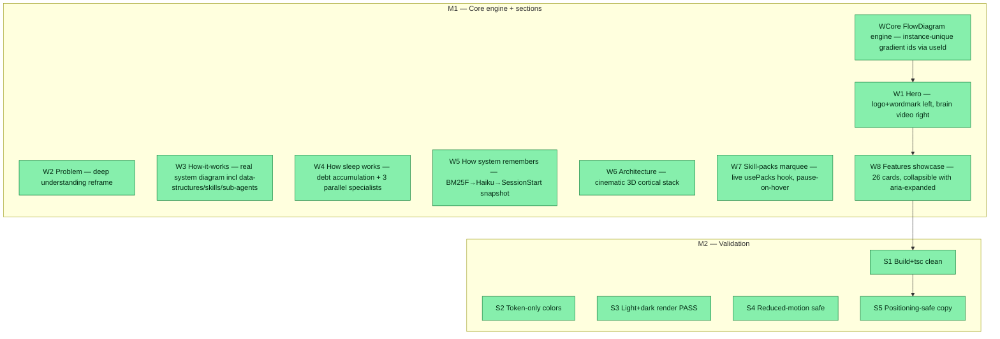

## Workflow
<!-- The shape of this task at a glance. One node per acceptance criterion, grouped under milestone subgraphs. Update node classes as work progresses: `:::done` (green), `:::active` (amber), `:::todo` (gray), `:::blocked` (red). Run `dreamcontext tasks doctor` to verify sync. -->

## Why
<!-- What problem does this solve? What breaks if we don't do it? Be concrete — name the user, the friction, the cost. -->

Major upgrade of the dashboard 'What is this?' landing page: depict the REAL multi-agent system, deeper positioning (deep understanding, not storage), two new How-It-Works sub-sections (sleep + recall), a redesigned architecture section, an infinite skill-packs marquee, and a collapsible features showcase. Built via goal-skill orchestration with opus sub-agents.

## User Stories
<!-- As a <role>, I can <action>, so that <outcome>. Tick when demonstrably true in the running system. -->

- [x] As a new user, I can open 'What is this?' in the dashboard and understand exactly what dreamcontext does, how sleep works, and how recall works, so I can evaluate adoption.
- [x] As a developer, I can see a live skill-packs marquee that always reflects actually installed packs (not hardcoded), so the page never goes stale.
- [x] As a user, I can expand/collapse feature cards and navigate the architecture with keyboard/reduced-motion, so the page is accessible.

## Acceptance Criteria
<!-- The contract. Each line is testable and gets a node in the Workflow flowchart above. -->

- [x] WCore FlowDiagram: one data-driven component renders all animated diagrams; gradient ids instance-unique via useId; comet gradient renders in every on-page diagram.
- [x] W1 Hero: logo+wordmark lockup left; looping brain video right (webm+mp4+poster); install command + links present.
- [x] W2 Problem: reframed to deep understanding ('surfaces what is hiding', 'knows your project better than you').
- [x] W3 How-it-works: REAL system — data-structures, skills, sub-agents, multi-agent RemSleep node; comet animation.
- [x] W4 Sleep section: FlowDiagram of debt accumulation + 3 parallel specialists with file domains.
- [x] W5 Recall section: BM25F -> Haiku (smallest cloud agent) -> SessionStart snapshot flow.
- [x] W6 Architecture: 3D cortical stack replacing the old flat grid.
- [x] W7 Marquee: live from usePacks(), infinite scroll, pause-on-hover, reduced-motion fallback.
- [x] W8 Features showcase: 26 cards, aria-expanded toggles, mini FlowDiagram per card.
- [x] S1 Build+tsc clean (cd dashboard && npm run build exit 0).
- [x] S2 Token-only colors in about/ components.
- [x] S3 Light+dark render PASS (all sections visible, legible, on-palette).
- [x] S4 Reduced-motion: no comet animates, marquee static, all content visible.
- [x] S5 Positioning-safe: honors knowledge/positioning.md.

Validation method (user-chosen): dashboard `npm run build` passes + tsc clean + light/dark Playwright screenshots of every section reviewed as a manual checklist.

S1 Build/typecheck: `cd dashboard && npm run build` (runs tsc -b + vite) exits 0; no new runtime deps in dashboard/package.json.

S2 Token-only colors: dashboard/src/components/about/*.css use only var(--*) tokens; grep for raw #hex/rgb( finds none in component rules.

S3 Light+dark render: shot harness produces about-light.png + about-dark.png with every section visible, legible, on-palette in BOTH themes.

S4 Reduced-motion safe: with prefers-reduced-motion, no comet animates, marquee does not scroll (falls back to overflow-x scroll row), no breathe; all content still visible.

S5 Positioning-safe copy: honors knowledge/positioning.md — no self-directed/fully-agentic claims; 'learning to act' only as roadmap framing.

W1 Hero: logo+wordmark lockup left (inline recolored SVG diamond, NO network/repo-root hotlink); looping brain video right (webm+mp4 + poster fallback); install command + npm/GitHub links present.

W2 Problem: reframed to deep understanding ('surfaces what is hiding', 'knows your project better than you'), not just storage; without/with contrast retained.

W3 How-it-works main diagram shows the REAL system: context files incl data-structures, skills, sub-agents (beyond the 5 brain regions) + a MULTI-AGENT RemSleep node; comet animation.

W4 NEW 'How sleep works' sub-section: FlowDiagram of sleep-debt accumulation + 3 parallel specialists (sleep-tasks/sleep-state/sleep-product) with their file domains; supporting cards. sleep-state domain copy must include core 3-6 + data-structures (per .claude/agents/sleep-state.md).

W5 NEW 'How the system remembers' sub-section: BM25F keyword -> Haiku intent recall (smallest cloud agent, 0-3 docs, BM25 fallback) -> SessionStart snapshot (warm/cold knowledge, features, knowledge index, pinned). Grounded in recall.ts/recall-query-extractor.ts/snapshot.ts.

W6 Architecture redesigned: the old .about-regions card grid is gone, replaced by a premium/cinematic brain-region->file mapping; theme + motion safe.

W7 Skill-packs marquee: infinite horizontal auto-scroll, one card per pack+standalone (name+description) sourced from the EXISTING usePacks() hook (NOT hardcoded); pause on hover/focus; reduced-motion -> static scroll row.

W8 Features showcase: one card per capability with a real <button aria-expanded> collapse/expand toggle; flagship expanded, minor collapsed; each card embeds a mini comet FlowDiagram; collapsed panels use hidden attribute (out of a11y tree).

WCore FlowDiagram: ONE data-driven component renders every animated diagram; gradient ids are instance-unique via useId AND gradient refs are INLINE SVG attributes (stroke={url(#id)}/fill={url(#id)}), removed from CSS; verify comets show gradient stroke in EACH on-page diagram (hero/sleep/recall + feature minis), not just that screenshots render.
## Constraints & Decisions
<!-- LIFO: newest at top. Capture the why, not just the what. -->

- **[2026-06-04]** Out of scope: marquee auto-sync pipeline beyond usePacks(); automated Playwright *.spec assertions beyond the screenshot harness; i18n of new copy; regenerating brain assets.
- **[2026-06-04]** Decisions: logo=inline recolored diamond SVG (no repo-root hotlink, that image isn't dashboard-served); old HowItWorksDiagram deleted; v1 gallery dropped (3 imgs never existed); English-only (matches current page); brain hero video already generated at dashboard/public/media/brain.{webm,mp4}+brain-hero.png.
- **[2026-06-04]** Frontend-only: no CLI/src/ /backend/API changes; no live data fetch EXCEPT reusing the existing usePacks() hook for the marquee; no new npm deps (pure CSS/SVG); page is a static explainer.
## Technical Details
<!-- Where the work lives. Files, services, key functions to reuse. Body is current truth — update in place; don't append. -->

(Key files, services, dependencies, implementation approach.)

ARCHITECTURE: AboutPage.tsx becomes a thin composition of 9 self-contained section components under dashboard/src/components/about/. AboutPage.css keeps only shared primitives (.about, .about-section, .about-kicker, .about-h2, .about-section-lead, shared keyframes); section-specific CSS lives in each component's own .css. No edits to Sidebar/Shell/App/I18n (route 'about' already wired).

CORE FlowDiagram.tsx+.css (generalize existing HowItWorksDiagram). Types: FlowNode{id,x,y,w,h,title,sub?,glyph?,variant?,breathe?,breatheDelay?}; FlowEdge{id,d,comet?,dashed?,delay?,dur?,travel?,label?}; FlowSpec{viewBox,nodes,edges,ariaLabel}; props {spec,className?,size:'full'|'mini'}. useId() for unique gradient ids; gradient refs as INLINE attributes (NOT CSS). Pure CSS stroke-dashoffset comet; reduced-motion freezes. Port HowItWorksDiagram.css rules hiw-*->fd-*, comet keyframe consumes --fd-travel (default 240).

DATA: flow-specs.ts -> HOW_IT_WORKS_SPEC (8 context categories incl data-structures/skills/sub-agents + multi-agent RemSleep + feedback loop; widen viewBox or 2 rows of 4 for legibility), SLEEP_FLOW_SPEC, RECALL_FLOW_SPEC + vCurve() helper. features.data.ts -> FEATURES: FeatureItem{id,title,tagline,body,defaultOpen,flow?:FlowSpec,tag?} (~24 entries; flow OPTIONAL escape-hatch -> static glyph if no meaningful flow). flagship defaultOpen:true, minor false.

SECTIONS (own files+css): Hero (logo+wordmark left, brain <video webm+mp4 poster> right, aura), ProblemSection, HowItWorksSection (FlowDiagram+steps), SleepFlowSection, RecallFlowSection, ArchitectureSection (premium region->file), SkillPacksMarquee (uses usePacks() hook; render packs.concat(standalone); duplicate track for infinite translateX; pause on hover; reduced-motion->overflow-x scroll; aria-hidden on 2nd copy), FeaturesShowcase+FeatureCard (button aria-expanded + aria-controls, panel hidden attr, mini FlowDiagram), ClosingSection. DELETE HowItWorksDiagram.tsx/.css once FlowDiagram lands. tsconfig has noUnusedLocals/noUnusedParameters ON.

PARALLELIZATION (opus implementers): Wave1 solo = FlowDiagram + flow-specs + AboutPage.css shared-primitive extraction. Wave2 parallel = {Hero+Problem}, {HowItWorks+Sleep+Recall}, {Architecture+Closing}, {Marquee}, {Features showcase+features.data.ts}. Wave3 solo = wire AboutPage.tsx (import+stack 9 sections), delete old diagram, central build+fix. Only the wiring owner edits AboutPage.tsx/.css.

VALIDATION SEQUENCE (corrected): from REPO ROOT -> (1) cd dashboard && npm run build; (2) npm run build:cli (tsup copies dashboard dist into dist/dashboard); (3) node dist/index.js dashboard --no-open --port 4199 (background); (4) node e2e/shot-about.mjs (defaults BASE=4199, writes e2e/shots/about-{light,dark}.png) — run from repo root, NOT dashboard/. Plus grep color audit + a11y spot check + positioning read.
## Notes
<!-- Loose ends, edge cases, open questions. -->

(Working notes, edge cases, open questions.)

## Changelog
<!-- LIFO: newest at top. Auto-prepended by `dreamcontext tasks log`. -->

### 2026-06-05 - Session Update
- 2026-06-04: All 6 goal-skill phases PASSED. AboutPage.tsx rebuilt as 9 section components. FlowDiagram engine (instance-unique gradient ids via useId, inline SVG attributes). Hero: logo+wordmark left, brain video loop right. Architecture: 3D cortical stack. Marquee: live usePacks() hook. Features: 26 cards, collapsible. Build+tsc clean. Light+dark screenshots PASS.
### 2026-06-04 - Status → in_review
- all 8 work-streams + core engine implemented; reviewer PASS; validation (build+tsc+light/dark screenshots) PASS
### 2026-06-04 - Session Update
- Phase 5 reviewer: PASS (no Critical/Major). Phase 6 validator: PASS — dashboard build exit 0 + tsc clean; light+dark screenshots of all 9 sections correct (e2e/shots/sec/); S2 color audit clean (only theme-safe black/white overlays); S4 every animated component has a prefers-reduced-motion guard (ClosingSection 'animation' was a comment). Built by 7 parallel opus implementers across 3 waves.
### 2026-06-04 - Status → in_progress
- plan validated (2 reviewers NEEDS_WORK punch-list folded into ACs); implementing via parallel opus sub-agents
### 2026-06-04 - Created
- Task created.
