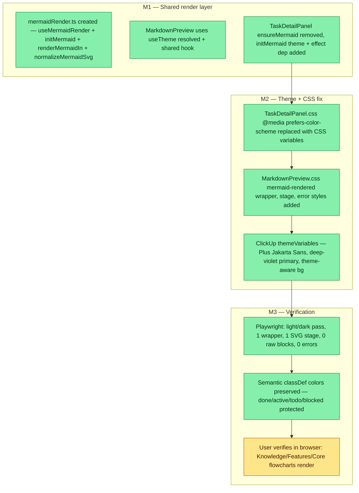

## Workflow

## Why
<!-- What problem does this solve? What breaks if we don't do it? Be concrete — name the user, the friction, the cost. -->

Mermaid blocks were rendering as raw code in Knowledge/Features/Core pages; TaskDetailPanel used OS color-scheme instead of site data-theme causing dark/light mismatch; semantic classDef colors (done/active/todo/blocked) were being overridden by mermaid internal style blocks

## Why

Mermaid flowcharts in Knowledge, Features, and Core pages were rendering as raw `<pre><code>` blocks — agents writing task/feature files with flowcharts got no visual output. TaskDetailPanel used `prefers-color-scheme` (OS theme) instead of the site's `data-theme` attribute, causing light/dark mismatch. Semantic classDef colors (`done=green`, `active=amber`, `todo=gray`, `blocked=red`) were being overridden by mermaid's internal style injection. All three bugs combined to make the Workflow flowcharts non-functional across the dashboard.

## User Stories

- [x] As a user opening a Knowledge or Feature file that contains a mermaid block, I see a rendered flowchart — not raw code.
- [x] As a user toggling dark/light mode, mermaid diagrams re-render with correct theme colors (no light-theme mermaid on a dark page).
- [x] As an agent writing task files with classDef done/active/todo/blocked, those semantic colors are preserved in the rendered SVG.

## Acceptance Criteria

- [x] MarkdownPreview renders mermaid blocks as SVG on Knowledge, Features, and Core pages
- [x] TaskDetailPanel mermaid diagrams respect site `data-theme` (not OS `prefers-color-scheme`)
- [x] Re-theming (toggle dark/light) causes mermaid to re-render cleanly
- [x] Semantic classDef colors (done=green, active=amber, todo=gray, blocked=red) survive SVG normalization
- [x] Playwright: light mode pass, dark mode pass, 1 wrapper per block, 1 SVG stage, 0 raw code blocks, 0 errors
- [ ] User confirms in browser: open a Knowledge card with a mermaid block, verify rendered flowchart

## Constraints & Decisions

- **[2026-05-23]** `normalizeMermaidSvg` strips inline `paint-order` and `!important` overrides from mermaid SVG output to let classDef semantic colors survive mermaid's internal style injection.
- **[2026-05-23]** Shared `mermaidRender.ts` is the single source of truth — MarkdownPreview and TaskDetailPanel both import from it. No component-local mermaid init.
- **[2026-05-23]** ClickUp theme variables applied: Plus Jakarta Sans font, deep-violet primary, theme-aware background — keeps mermaid visually consistent with dashboard design system.

## Technical Details

Key files:
- `dashboard/src/lib/mermaidRender.ts` (new) — `useMermaidRender(containerRef, source, idPrefix)` hook, `initMermaid(theme)`, `renderMermaidIn(root, idPrefix)`, `normalizeMermaidSvg(svg)`
- `dashboard/src/components/core/MarkdownPreview.tsx` — replaced ad-hoc mermaid logic with `useTheme().resolved` + shared hook
- `dashboard/src/components/core/MarkdownPreview.css` — added `.mermaid-rendered`, `.mermaid-stage`, `.mermaid-error` wrapper styles
- `dashboard/src/components/tasks/TaskDetailPanel.tsx` — removed `ensureMermaid()`, replaced with `initMermaid(theme)` + `theme` added to effect deps
- `dashboard/src/components/tasks/TaskDetailPanel.css` — all `@media (prefers-color-scheme: light)` blocks removed; CSS variables now drive mermaid container styling; ClickUp shadow + hover-lift; mermaid-controls glass effect

## Notes

- TaskDetailPanel re-theme works by reverting wrapper elements to `<pre><code>` then re-rendering — relies on mermaid's idempotent render approach.
- Playwright tests use headless Chromium. Brave-specific differences not covered (see saved-views/dashboard-ux session for prior Brave behavior).
- Session fa67d942 was tagged to `sleep-fanout-3specialist-collapse` (wrong slug) — the mermaid work is tracked here under the correct task.

## Changelog
<!-- LIFO: newest at top. Auto-prepended by `dreamcontext tasks log`. -->

### 2026-05-23 - Session Update
- Session fa67d942: root cause — MarkdownPreview not rendering mermaid (raw pre/code blocks), TaskDetailPanel using prefers-color-scheme vs site data-theme, CSS using @media(prefers-color-scheme) instead of CSS variables. Fix: created src/lib/mermaidRender.ts with shared useMermaidRender hook + initMermaid(theme) + renderMermaidIn() + normalizeMermaidSvg(); MarkdownPreview uses useTheme().resolved; TaskDetailPanel.css @media blocks replaced with CSS variables; Playwright verified light/dark pass, 1 SVG stage, 0 raw blocks, semantic classDef colors preserved
### 2026-05-23 - Session Update
- Session fa67d942: fixed mermaid rendering — created src/lib/mermaidRender.ts with useMermaidRender shared hook + initMermaid(theme) + renderMermaidIn(); MarkdownPreview now uses useTheme().resolved; TaskDetailPanel ensureMermaid replaced with initMermaid(theme) + theme dep in effect; normalizeMermaidSvg strips inline paint props and classDef !important overrides from SVG; TaskDetailPanel.css @media(prefers-color-scheme) blocks replaced with CSS variables; Playwright verification: light/dark pass, 1 wrapper, 1 SVG stage, 0 raw code blocks, 0 errors
### 2026-05-23 - Created
- Task created.
