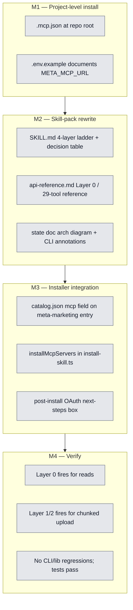

## Workflow

## Why

Meta shipped an official MCP server in April 2026 (29 tools, OAuth via Meta Business). Adopting it as Layer 0 reduces token-heavy CLI orchestration for read/exploration and one-shot writes, while keeping our orchestration layer (launch WAL, scale guardrails, kill corpus, asset chunked upload, async insights) canonical for everything MCP doesn't cover.

## User Stories

- [ ] As a dreamcontext maintainer working in this repo, I want the Meta MCP available at project level so Claude Code picks it up automatically via `.mcp.json` once I've OAuthed and set `META_MCP_URL`.
- [ ] As an end user installing the meta-marketing skill pack into my own project, I want `dreamcontext install-skill meta-marketing` to bootstrap `.mcp.json` and tell me how to OAuth, so adoption is one command.
- [ ] As Claude operating in a project with both layers available, I want the skill pack to teach me when to use the MCP vs. the typed client vs. raw metaFetch, so I don't bypass safety rails (budget guards, WAL idempotency) for ops that need them.

## Acceptance Criteria

- [ ] `.mcp.json` exists at repo root with a `meta-ads` server entry using `${META_MCP_URL}` env interpolation.
- [ ] `.env.example` documents `META_MCP_URL` with the provisioning URL (`facebook.com/business/help/1456422242197840`) and expected format.
- [ ] `skill-packs/meta-marketing/SKILL.md` teaches a 4-layer ladder (MCP → typed client → raw metaFetch → Graph explorer) with a decision table covering at least 6 representative ops.
- [ ] `skill-packs/meta-marketing/api-reference.md` lists all 29 official MCP tools, organized by the 5 buckets (Campaigns 5 / Catalog 10 / Accounts 3 / Datasets 4 / Insights 7).
- [ ] `_dream_context/state/meta-marketing-skill.md` architecture diagram (~line 449) shows MCP as a parallel ingress; CLI surface block (~552–595) annotates which `mk` subcommands have an MCP equivalent.
- [ ] `skill-packs/catalog.json` meta-marketing entry has an `mcp[]` field with name, url, envVar, provisionUrl, description.
- [ ] `installMcpServers()` exists in `src/cli/commands/install-skill.ts`, mirrors the `installHooks` pattern (read → merge → write), is idempotent, and is wired into the skill install flow.
- [ ] After install, the user sees a yellow-bordered next-steps box with the OAuth URL and `META_MCP_URL=...` instruction.
- [ ] In a Claude Code session with `META_MCP_URL` set, asking "list my Meta ad accounts" routes to `mcp__meta-ads__ads_get_ad_accounts` (Layer 0), not `dreamcontext marketing account list`.
- [ ] Asking "upload a 60MB video creative" routes to Layer 1 or Layer 2 (chunked upload), not Layer 0.
- [ ] No CLI commands are deprecated; `meta-client.ts` and `meta-fetch.ts` are untouched; existing tests still pass.

## Constraints & Decisions
<!-- LIFO: newest decision at top -->

### 2026-05-02 — Defer CLI deprecation
Migration is **additive layering**, not replacement. The MCP cleanly covers ~8 of our 23 marketing CLI commands (campaign/adset/ad CRUD, status flips, basic insights, account list, config check), but ~15 remain non-replaceable: orchestration (launch WAL, scale guardrails, kill corpus, cohort hypothesis, learnings ledger, today, diff) and Graph API gaps (asset chunked upload, async insights, custom audiences, targeting search, ad previews, breakdowns). Deprecating the redundant 8 is a follow-up task once Layer 0 is proven in practice.

### 2026-05-02 — Env var interpolation, not committed URL
The Meta MCP URL contains a per-business identifier (`https://mcp.meta.com/ads/<business-id>`). Use `${META_MCP_URL}` in `.mcp.json` so the URL stays in each maintainer's local `.env`. Same pattern as our existing Meta access-token vars.

### 2026-05-02 — Installer bootstraps MCP for end users
`install-skill meta-marketing` writes/merges `.mcp.json` in the target project. Drives off a new `mcp[]` field in `catalog.json` so future skill packs (TikTok, Google when their MCPs ship) get the plumbing for free.

## Technical Details

**Critical files (new):**
- `.mcp.json` (repo root)
- `.env.example` (or extend if exists)

**Critical files (edit):**
- `skill-packs/meta-marketing/SKILL.md` — replace 3-layer ladder section with 4-layer ladder + decision table
- `skill-packs/meta-marketing/api-reference.md` — prepend Layer 0 / 29-tool section
- `skill-packs/catalog.json` (~lines 133–148) — add `mcp[]` field on meta-marketing entry
- `_dream_context/state/meta-marketing-skill.md` (line ~449 diagram, lines ~552–595 CLI surface)
- `src/cli/commands/install-skill.ts` — add `installMcpServers()` modeled on `installHooks()` at lines 297–347; wire into install flow; extend post-install messaging

**MCP server reference:**
- URL pattern: `https://mcp.meta.com/ads/<business-id>` (provisioned per business at OAuth consent)
- Auth: Meta Business OAuth, no tokens stored by us
- Scopes: read-only / read+write / read+write+financial (financial = budget changes)
- 29 tools: Campaigns (5) / Catalog (10) / Accounts (3) / Datasets (4) / Insights (7)
- Provisioning page: `https://www.facebook.com/business/help/1456422242197840`

**Verification:**
1. `npm run build && npm test`
2. Manual install in scratch dir: `node dist/cli/index.js install-skill meta-marketing` → assert `.mcp.json` is written and idempotent on second run
3. Maintainer OAuths, sets `META_MCP_URL` in `.env`, restarts Claude Code, runs `claude mcp list` → `meta-ads` connected
4. Claude session: "list my Meta ad accounts" → MCP tool fires (Layer 0)
5. Claude session: "upload a 60MB video creative" → Layer 1/2 fires (ladder respected)
6. Unset `META_MCP_URL` → MCP fails to connect, CLI + lib still work (no removals)

## Notes

- **Sources:** [Ryze launch coverage](https://www.get-ryze.ai/blog/meta-ads-official-mcp-cli-launch), [Pillitteri 29-tool guide](https://pasqualepillitteri.it/en/news/1707/official-meta-ads-mcp-claude-29-tools-2026), [Synter 2026 guide](https://syntermedia.ai/blog/mcp-server-meta-ads).
- Plan file (full design notes): `~/.claude/plans/ok-ultrathink-on-that-sharded-lemur.md`.
- Open question: do agents `marketing-strategy` / `marketing-monitor` / `marketing-creative` need to declare the `mcp__meta-ads__*` toolset as required, or does the skill-pack `skills:` declaration carry it transitively? Resolve when starting M2.

## Changelog
<!-- LIFO: newest entry at top -->

### 2026-05-09 - Session Update
- Task plan written: 4 milestones (project-level install, skill-pack rewrite, installer integration, verify). Key decisions locked: additive layering (no CLI deprecation), env-var URL interpolation for META_MCP_URL, installMcpServers() in install-skill modeled on installHooks().
### 2026-05-02 - Created
- Task created.
