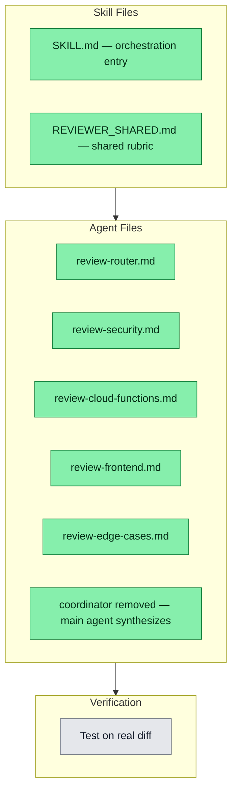

## Workflow
<!-- The shape of this task at a glance. One node per acceptance criterion, grouped under milestone subgraphs. Update node classes as work progresses: `:::done` (green), `:::active` (amber), `:::todo` (gray), `:::blocked` (red). Run `dreamcontext tasks doctor` to verify sync. -->

## Why
<!-- What problem does this solve? What breaks if we don't do it? Be concrete — name the user, the friction, the cost. -->

Productize the multi-reviewer team pattern: router classifies diffs by tier + domain, dispatches niche specialists (security, cloud-functions, frontend, edge-cases) in parallel, and the main agent synthesizes the unified verdict directly. Distinct from the existing single reviewer agent (too generic for non-trivial diffs) and from the pre-implementation three-reviewer-parallel-mandates pattern (different stage).

## User Stories
<!-- As a <role>, I can <action>, so that <outcome>. Tick when demonstrably true in the running system. -->

- [x] As a developer, I can run /multi-review on a branch diff so that a team of niche specialists review it in parallel and the main agent synthesizes the unified verdict directly.

## Acceptance Criteria
<!-- The contract. Each line is testable and gets a node in the Workflow flowchart above. -->

- [x] .claude/skills/multi-review/SKILL.md shipped — orchestration entry point, fires on /multi-review slash command
- [x] .claude/skills/multi-review/REVIEWER_SHARED.md shipped — shared rubric: severity levels, output format, what NOT to flag
- [x] .claude/agents/review-router.md shipped — classifies diff by tier (Lite/Standard/Full) + domain, emits JSON dispatch plan with scoped file lists per specialist
- [x] .claude/agents/review-security.md shipped — secrets, auth, injection, env leaks, crypto, hot-path override for auth/ + *.env* files
- [x] .claude/agents/review-cloud-functions.md shipped — infinite loops, idempotency, scaling traps, billing gotchas; declares firebase-cloud-functions skill
- [x] .claude/agents/review-frontend.md shipped — file size, hooks rules, a11y, design tokens, XSS sinks; declares web-app-frontend + design skills
- [x] .claude/agents/review-edge-cases.md shipped — null/empty, concurrency, partial failures, retries, default-on for tier >= Lite
- [x] review-coordinator.md removed — main agent reads all specialist reports directly and synthesizes unified verdict (READY_TO_MERGE / NEEDS_ATTENTION / NEEDS_WORK)
- [ ] Tested on a real non-trivial diff — router classification + main agent synthesis validated in practice
## Constraints & Decisions
<!-- LIFO: newest at top. Capture the why, not just the what. -->

- **[2026-05-26]** Coordinator sub-agent removed — main agent reads all specialist full reports and synthesizes directly. Extra hop added latency without payoff since main agent already has all reports in context.
- **[2026-05-24]** Declared-skill convention enforced: every specialist agent must list required skills in YAML frontmatter skills: field AND ## Skills always loaded body section (per feedback_agent_skills_declaration)
- **[2026-05-24]** Slash command /multi-review is primary invocation; natural-language triggers also match (review with the team, thorough review of my branch)
## Technical Details
<!-- Where the work lives. Files, services, key functions to reuse. Body is current truth — update in place; don't append. -->

Architecture: router emits JSON (tier: Lite|Standard|Full, specialists: string[], file_map: Record<specialist, string[]>). Main agent fans out specialists in parallel (single message, multiple Agent calls). Each specialist scoped to its niche files only. Main agent reads all specialist full reports and synthesizes unified verdict directly (no coordinator sub-agent). Hot-path override: any file under auth/, crypto/, *.env*, or migration files forces Full tier with security specialist always included. edge-cases is default-on for tier >= Lite. Research sources: Cloudflare 7-specialist + coordinator architecture, HAMY 9-agent Claude Code fan-out, Qodo 2.0 multi-agent benchmarks, Anthropic claude-code/plugins/code-review official pattern. Unique angle vs third-party tools: each specialist declares dreamcontext skills in YAML frontmatter (skill-aware reviews). Key files: skill-packs/multi-review/SKILL.md, skill-packs/multi-review/REVIEWER_SHARED.md, skill-packs/agents/review-{router,security,cloud-functions,frontend,edge-cases}.md.
## Notes
<!-- Loose ends, edge cases, open questions. -->

Untested on a real diff — architecture is theory-verified only. First real run on a non-trivial branch will require iteration on router classification thresholds and main-agent synthesis prompt wording.

Cross-references added: AGENTS.md sub_agents table extended with /multi-review row; _dream_context/knowledge/sub-agent-iterative-reviewer-pattern.md Relationship section added; _dream_context/knowledge/three-reviewer-parallel-mandates-pattern.md Relationship section extended.
## Changelog
<!-- LIFO: newest at top. Auto-prepended by `dreamcontext tasks log`. -->

### 2026-05-26 - Session Update
- Session 1cace19b: Coordinator sub-agent removed — main agent now synthesizes specialist reports directly. Rationale: main agent already sees all specialist reports as tool results; extra coordinator hop added latency without payoff. SKILL.md flow simplified, REVIEWER_SHARED.md coordinator references updated, review-coordinator.md deleted, catalog.json relatedAgents updated. 8 files changed. Committed as 6b22c84.
### 2026-05-24 - Status → in_review
- All 8 files shipped and verified clean — ready for user to test on a real diff before confirming complete
### 2026-05-24 - Session Update
- Session 79bddcc5: built multi-review skill — 8 files shipped (.claude/skills/multi-review/SKILL.md, REVIEWER_SHARED.md, 6 agent files). Architecture: router + 4 niche specialists + coordinator. Web research informed design. Cross-references added in AGENTS.md and two knowledge files. Untested on real diff.
### 2026-05-24 - Update
- Built multi-review skill from scratch: SKILL.md + REVIEWER_SHARED.md + 6 agent files (router, security, cloud-functions, frontend, edge-cases, coordinator). Architecture informed by web research (Cloudflare, HAMY, Qodo, Anthropic official pattern). All 8 files verified clean. Cross-references added in AGENTS.md and two knowledge files.
### 2026-05-24 - Created
- Task created.
