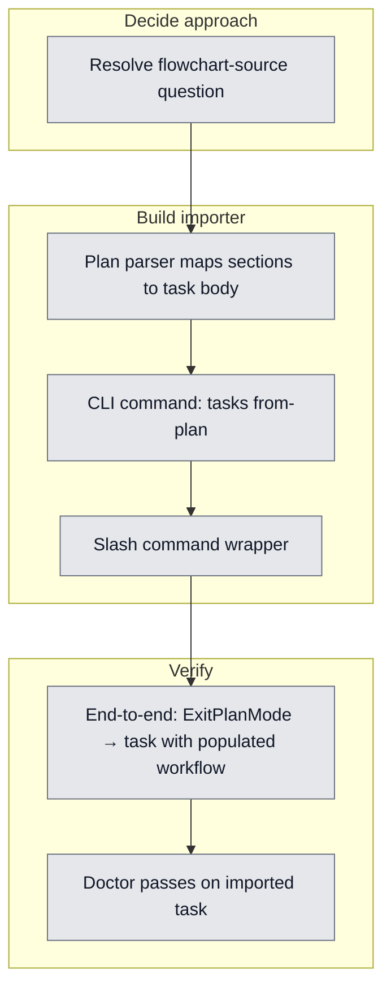

## Workflow
<!-- Mermaid flowchart of milestones + acceptance-criteria nodes. Keep in sync with the Acceptance Criteria checklist: 1 node per criterion, status class matches checkbox state. -->

## Why

Claude Code plan mode writes plans to `~/.claude/plans/<slug>.md`. These plans are invisible to dreamcontext — no task file, no progress tracking, no flowchart, no cross-session continuity. Every plan is a tracking gap. The user wants every planning session to land in `_dream_context/state/` as a task, with a populated `## Workflow` flowchart that matches the new task format.

## User Stories

- [ ] As an engineer, after exiting plan mode, I can run one command and have the plan become a tracked dreamcontext task.
- [ ] As an engineer, the resulting task has a populated `## Workflow` flowchart, not an empty stub.
- [ ] As an engineer, the plan and the imported task stay linked (frontmatter `source_plan: <path>`).

## Acceptance Criteria

- [ ] Resolve flowchart-source question (see Constraints — three candidate approaches)
- [ ] Plan parser maps sections to task body (Plan title → name; `## Context` → Why; verification bullets → Acceptance Criteria; etc.)
- [ ] CLI command `dreamcontext tasks from-plan [path]` works; `[path]` defaults to most recent file in `~/.claude/plans/`
- [ ] Slash command wrapper `/plan-to-task` triggers the CLI
- [ ] End-to-end: write a plan in plan mode → ExitPlanMode → run command → task file appears with populated workflow
- [ ] `dreamcontext tasks doctor` passes on the imported task

## Constraints & Decisions
<!-- LIFO: newest decision at top -->

- **[2026-05-02]** OPEN — flowchart source question. Three candidate approaches, none yet chosen:
  - **A. Auto-generate from `## Verification` bullets.** Trivial, but produces a flat node line with no milestones — "shape with no information." User pushed back on this.
  - **B. Require plan template to include `## Workflow` mermaid block.** Plan author (Claude) draws the chart while planning, importer copies it verbatim. Pros: chart is high-quality, plan stays scannable. Cons: requires changing the plan-mode plan template; need to enforce it (`from-plan` rejects plans without a workflow block).
  - **C. Importer creates an empty/stub workflow, agent fills it on first task touch.** Lowest friction, defers the work. Cons: tasks land with broken flowcharts and stay broken.

  Recommendation when revisiting: **B** if we can modify the plan-mode template/instructions; otherwise **C** with a strong agent rule to fill the chart on first task open.

## Technical Details

- Plan files live at `~/.claude/plans/<slug>.md` (path comes from harness; not a dreamcontext path).
- Parser needs to handle plan-mode's loose section conventions (Context, Design, Files to change, Verification, Out of scope) — these are conventional, not enforced.
- New code:
  - `src/cli/commands/tasks.ts` — add `from-plan` subcommand (~60 lines).
  - `src/lib/plan-parser.ts` (new) — markdown → task body sections.
  - Slash command file (location TBD — likely `.claude/commands/plan-to-task.md` or wherever dreamcontext ships slash commands).
- Reuse: `extractMermaidNodes` (already in `src/lib/markdown.ts`) — copy from plan if present, validate before writing into task.
- Frontmatter: add `source_plan: "<path>"` so plan ↔ task link survives.

## Notes

- Stop hook auto-import was considered and rejected — would import throwaway plans the user didn't want tracked. Opt-in only.
- Plan files are user-readable and re-importable — if a plan changes, decide whether to overwrite the task or create a new revision (open question).
- This task is paused pending the flowchart-source decision (D1 in workflow).

## Changelog
<!-- LIFO: newest entry at top -->

### 2026-05-02 - Session Update
- Task created (2026-05-02): Reviewer agent validated workflow flowchart change in task template. 3 milestones (Decide/Build/Verify) and 5 acceptance-criteria nodes set up. Open question: flowchart-source (Claude Code plan files at ~/.claude/plans/<slug>.md).
### 2026-05-02 - Created
- Task created.
