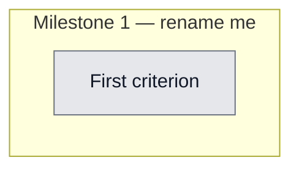

## Workflow
<!-- The shape of this task at a glance. One node per acceptance criterion, grouped under milestone subgraphs. Update node classes as work progresses: `:::done` (green), `:::active` (amber), `:::todo` (gray), `:::blocked` (red). Run `dreamcontext tasks doctor` to verify sync. -->

## Why
<!-- What problem does this solve? What breaks if we don't do it? Be concrete — name the user, the friction, the cost. -->

User is about to deploy/publish v0.5.1. The docs' narrative largely stops at v0.2.0 and omits headline v0.3-v0.5 features (one-command install + in-session update nudge + upgrade/update commands, goal-skill orchestration, full-catalog skill gate, Haiku recall, multi-review, dashboard server security hardening). Stale file names (3.style_guide.md), stale skill-pack list, and a 200-vs-150 line-limit inconsistency. Docs must read clearly for non-technical founders yet stay detailed for engineers — and must obey positioning.md (no 'autonomous'/self-directed framing; 'learning to act' = roadmap not shipped).

## User Stories
<!-- As a <role>, I can <action>, so that <outcome>. Tick when demonstrably true in the running system. -->

- [ ] As a [role], I can [action], so that [outcome]

## Acceptance Criteria
<!-- The contract. Each line is testable and gets a node in the Workflow flowchart above. -->

- [ ] First criterion (matches node A1 in Workflow)

## Constraints & Decisions
<!-- LIFO: newest at top. Capture the why, not just the what. -->

## Technical Details
<!-- Where the work lives. Files, services, key functions to reuse. Body is current truth — update in place; don't append. -->

(Key files, services, dependencies, implementation approach.)

## Notes
<!-- Loose ends, edge cases, open questions. -->

(Working notes, edge cases, open questions.)

## Changelog
<!-- LIFO: newest at top. Auto-prepended by `dreamcontext tasks log`. -->

### 2026-05-31 - Status → in_review
- Docs rewritten, fact-checked against code, positioning tests green — ready for user to verify and deploy
### 2026-05-31 - Session Update
- Rewrote README.md and DEEP-DIVE.md for v0.5.x. README: added ## Skills (current 7 packs + 4 standalone, always-on flags, corrected install commands) and ## Staying Up to Date (upgrade vs update split + in-session nudge + curl one-liner); relocated skill packs out of Quick Start; fixed stale core file tree (3.style_guide_and_branding.md, .version-check.json); added upgrade/update to Commands; nav updated. DEEP-DIVE: new ## Install & Update section (install.sh safety, CLI/project update split, version-check hot-path separation), ## Dashboard > ### Security model (loopback bind/CSRF/CORS/safe-path), extended UserPromptSubmit hook (recall + full-catalog context gate), updated Optional Skill Packs (7 packs + orchestration-pack pattern), 5 new Design Tradeoff rows, rewrote What Comes Next (Codex support + v0.3-v0.5 narrative + v0.6 control-panel direction); fixed file-name/200-line/2.memory.md-LIFO staleness. Verified: 16/16 positioning-doc tests pass, no banned positioning terms, all internal anchor links resolve.
### 2026-05-31 - Created
- Task created.
