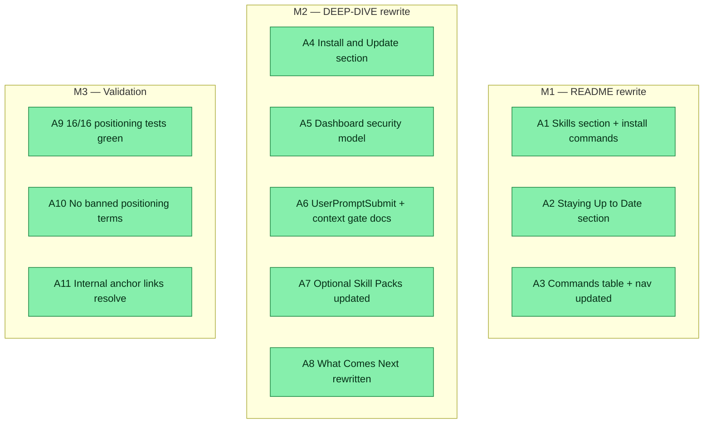

## Workflow
<!-- The shape of this task at a glance. One node per acceptance criterion, grouped under milestone subgraphs. Update node classes as work progresses: `:::done` (green), `:::active` (amber), `:::todo` (gray), `:::blocked` (red). Run `dreamcontext tasks doctor` to verify sync. -->

## Why
<!-- What problem does this solve? What breaks if we don't do it? Be concrete — name the user, the friction, the cost. -->

User is about to deploy/publish v0.5.1. The docs' narrative largely stops at v0.2.0 and omits headline v0.3-v0.5 features (one-command install + in-session update nudge + upgrade/update commands, goal-skill orchestration, full-catalog skill gate, Haiku recall, multi-review, dashboard server security hardening). Stale file names (3.style_guide.md), stale skill-pack list, and a 200-vs-150 line-limit inconsistency. Docs must read clearly for non-technical founders yet stay detailed for engineers — and must obey positioning.md (no 'autonomous'/self-directed framing; 'learning to act' = roadmap not shipped).

## User Stories

- [x] As a non-technical founder reading the README, I can understand what dreamcontext is and how to install it without wading through stale v0.2 content.
- [x] As an engineer evaluating dreamcontext, I can read DEEP-DIVE.md and understand the install/update flow, security model, context gate, and v0.6 roadmap.

## Acceptance Criteria

- [x] **A1** README includes `## Skills` section (7 packs + 4 standalone, always-on flags, corrected install commands); skill packs moved out of Quick Start.
- [x] **A2** README includes `## Staying Up to Date` (upgrade vs update split, in-session nudge, curl one-liner).
- [x] **A3** README Commands table and nav updated; stale core file tree fixed (`3.style_guide_and_branding.md`, `.version-check.json`).
- [x] **A4** DEEP-DIVE includes `## Install & Update` section (install.sh safety, CLI/project update split, version-check hot-path separation).
- [x] **A5** DEEP-DIVE includes `## Dashboard > ### Security model` (loopback bind/CSRF/CORS/safe-path).
- [x] **A6** DEEP-DIVE documents extended UserPromptSubmit hook (recall + full-catalog context gate).
- [x] **A7** DEEP-DIVE Optional Skill Packs section updated (7 packs + orchestration-pack pattern, 5 new Design Tradeoff rows).
- [x] **A8** DEEP-DIVE What Comes Next rewritten (Codex support + v0.3-v0.5 narrative + v0.6 control-panel direction).
- [x] **A9** 16/16 positioning-doc tests pass (no banned terms like 'autonomous'/'self-directed').
- [x] **A10** No banned positioning terms; 'learning to act' framed as roadmap not shipped.
- [x] **A11** All internal anchor links resolve; stale 200-vs-150 line-limit + `2.memory.md` LIFO references fixed.

## Constraints & Decisions
<!-- LIFO: newest at top. Capture the why, not just the what. -->

## Technical Details

Files changed: `README.md`, `DEEP-DIVE.md`. Validation: `tests/unit/positioning-doc.test.ts` (16 tests). No code changes; docs-only.

## Notes

- Positioning rule: never describe dreamcontext as 'autonomous' or 'self-directed'; 'learning to act' is roadmap framing only. Enforced by `tests/unit/positioning-doc.test.ts`.
- DEEP-DIVE anchor links verified manually (no automated link checker in this codebase).

## Changelog
<!-- LIFO: newest at top. Auto-prepended by `dreamcontext tasks log`. -->

### 2026-05-31 - Session Update
- sleep-tasks: reconciled body — replaced placeholder Workflow/ACs/User Stories/Technical Details/Notes with actual work done (11-node Workflow, 11 ACs all done, docs-only scope)
### 2026-05-31 - Status → in_review
- Docs rewritten, fact-checked against code, positioning tests green — ready for user to verify and deploy
### 2026-05-31 - Session Update
- Rewrote README.md and DEEP-DIVE.md for v0.5.x. README: added ## Skills (current 7 packs + 4 standalone, always-on flags, corrected install commands) and ## Staying Up to Date (upgrade vs update split + in-session nudge + curl one-liner); relocated skill packs out of Quick Start; fixed stale core file tree (3.style_guide_and_branding.md, .version-check.json); added upgrade/update to Commands; nav updated. DEEP-DIVE: new ## Install & Update section (install.sh safety, CLI/project update split, version-check hot-path separation), ## Dashboard > ### Security model (loopback bind/CSRF/CORS/safe-path), extended UserPromptSubmit hook (recall + full-catalog context gate), updated Optional Skill Packs (7 packs + orchestration-pack pattern), 5 new Design Tradeoff rows, rewrote What Comes Next (Codex support + v0.3-v0.5 narrative + v0.6 control-panel direction); fixed file-name/200-line/2.memory.md-LIFO staleness. Verified: 16/16 positioning-doc tests pass, no banned positioning terms, all internal anchor links resolve.
### 2026-05-31 - Created
- Task created.
