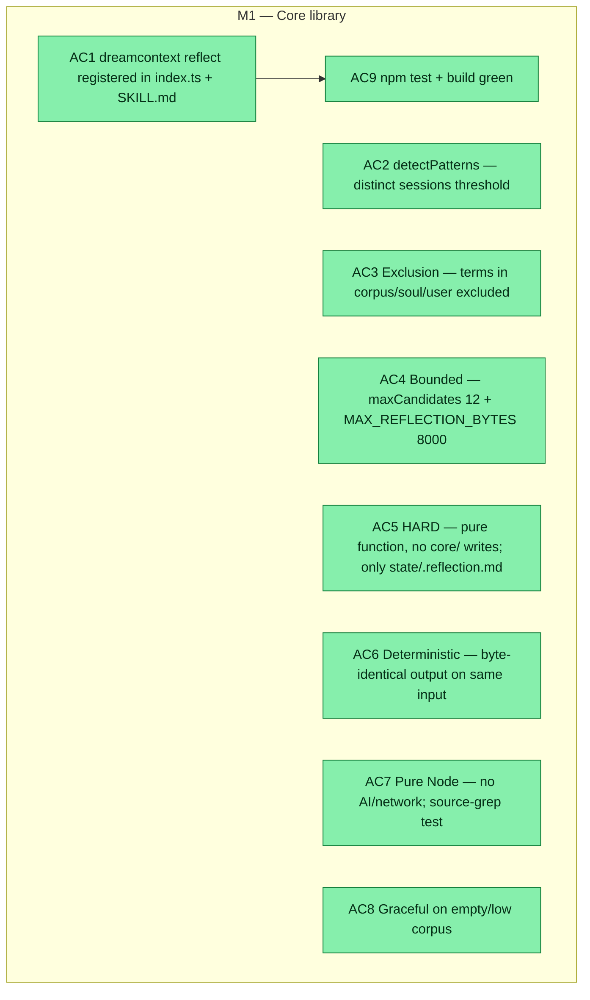

## Workflow
<!-- The shape of this task at a glance. One node per acceptance criterion, grouped under milestone subgraphs. Update node classes as work progresses: `:::done` (green), `:::active` (amber), `:::todo` (gray), `:::blocked` (red). Run `dreamcontext tasks doctor` to verify sync. -->

## Why
<!-- What problem does this solve? What breaks if we don't do it? Be concrete — name the user, the friction, the cost. -->

Reflection is the missing brain function: today sleep distills+files individual facts but never GENERALIZES across sessions. A deterministic step that surfaces recurring cross-session patterns as CANDIDATE generalizations turns the system from 'remembers' toward 'notices a rule'. Must never auto-write core/soul/user (soul non-negotiable).

## User Stories
<!-- As a <role>, I can <action>, so that <outcome>. Tick when demonstrably true in the running system. -->

- [x] As a sleep agent, I can run `dreamcontext reflect` to get a bounded list of candidate patterns seen across multiple sessions, so I can decide what's worth promoting to memory/knowledge.
- [x] As a user, I know reflection never auto-writes soul/user/knowledge — candidates are surfaced for human review only.
- [x] As a developer, I can verify reflection is pure Node (no LLM/network) and deterministic, so it never becomes a latency or hallucination risk.

## Acceptance Criteria

- [x] AC1 `dreamcontext reflect` registered in src/cli/index.ts and SKILL.md; runs on real _dream_context/ and exits 0.
- [x] AC2 detectPatterns surfaces a term only when it spans >= minSessions (default 3) distinct sessions.
- [x] AC3 Terms present in corpus knowledge/feature docs, 2.memory.md, soul/user are excluded.
- [x] AC4 Bounded: maxCandidates 12 + MAX_REFLECTION_BYTES 8000 (capToBytes in reflection.ts).
- [x] AC5 HARD: detectPatterns+formatReflection pure; writeReflection touches ONLY state/.reflection.md; unit test asserts core/ mtimes unchanged.
- [x] AC6 Deterministic: two runs on identical input produce byte-identical ordering.
- [x] AC7 Pure Node: reflection.ts contains no fetch/spawn/execFile/claude/anthropic (source-grep test).
- [x] AC8 Empty/low corpus: no throw; zero candidates is SUCCESS.
- [x] AC9 Full npm test green + npm run build clean.

AC1 — `dreamcontext reflect` is registered in src/cli/index.ts and listed in skill/SKILL.md command table; running it on the real _dream_context/ prints a markdown candidate report and exits 0.

AC2 — detectPatterns surfaces a term ONLY when it spans >= minSessions (default 3) DISTINCT sessions. Repeats within one session count once; multiple bookmarks from the same session collapse to one session (via the bookmarkSessions id->session_id map). digest session key = slug.slice('digest#'.length).

AC3 — Terms already present in corpus knowledge/feature docs, in 2.memory.md sections (memory# slugs), or in soul/user (excludedExtra token set) are EXCLUDED — candidates are genuinely NEW.

AC4 — Bounded: at most maxCandidates (default 12) candidates; formatted output <= MAX_REFLECTION_BYTES (8000) via a LOCAL capToBytes(lines[],max) in reflection.ts.

AC5 (HARD) — detectPatterns + formatReflection are pure (no fs). writeReflection writes ONLY _dream_context/state/.reflection.md. No core/soul/user/knowledge file is created or modified. Unit test asserts core/ files untouched.

AC6 — Deterministic: two runs on identical input produce byte-identical candidate ordering (sort: sessionCount desc, totalOccurrences desc, term asc — total order).

AC7 — Pure Node, no AI/network: reflection.ts imports only node:fs, node:path, and tokenize from recall.ts; source contains no fetch/spawn/execFile/claude/anthropic (asserted by a source-grep test).

AC8 — Empty/low corpus degrades gracefully: no throw; zero candidates is SUCCESS (still emits a valid empty artifact on --write).

AC9 — Full npm test green + npm run build clean (no TS errors).

Validation method: (a) vitest unit tests for AC2-AC8 in tests/unit/reflection.test.ts, AND (b) manual smoke test on real _dream_context/state/.session-digests/ (reflect; reflect --write; git status shows ONLY state/.reflection.md changed, no core/).
## Constraints & Decisions
<!-- LIFO: newest at top. Capture the why, not just the what. -->

- **[2026-06-04]** Impl notes from plan review (SOLID v3): digest session key = slug.slice('digest#'.length) (full UUID, no parsing); bookmark field is session_id (snake_case) not sessionId; CLI must ALWAYS build bookmarkSessions or bookmark dedup degrades; loadBookmarkDocs does NOT propagate session_id into CorpusDoc, so read .sleep.json directly for the map.
- **[2026-06-04]** OUT OF SCOPE (YAGNI): no LLM/semantic clustering; no auto-promotion; no generateSnapshot injection; no new hook; no agents/*.md or .codex mirror edits; no --json; no CHANGELOG as evidence; no dashboard UI; no trigger auto-creation; no change to buildCorpus or recall ranking (score/rankScore decoupling untouched).
- **[2026-06-04]** HARD: never auto-write/modify core/soul/user/knowledge — reflection only PRODUCES candidates; promotion stays with sleep agent/user. Deterministic + bounded + pure Node (no LLM/network).
## Technical Details
<!-- Where the work lives. Files, services, key functions to reuse. Body is current truth — update in place; don't append. -->

(Key files, services, dependencies, implementation approach.)

CREATE src/lib/reflection.ts (pure; fs only in writer). detectPatterns(corpus: CorpusDoc[], opts): ReflectionResult. Evidence docs = digests (type:'task', slug 'digest#<uuid>') + bookmarks (type:'memory', slug 'bookmark#<id>'). Session key: digest -> slug.slice('digest#'.length); bookmark -> opts.bookmarkSessions[id] (id->session_id from .sleep.json) else slug. Cross-session DF = Map<term, Set<sessionKey>>. Exclusion set = corpus type 'knowledge'|'feature' + memory-sections (type:'memory' slug 'memory#') + opts.excludedExtra (soul+user token set). Reuse tokenize() from recall.ts (recall.ts:114). REFLECTION_NOISE stoplist (command/stdout/local/session/digest/goal/bash/write/edit/file...). Bigram pass (skip if either half stop/noise; drop bigram if BOTH halves excluded). Threshold df>=minSessions (3). Rank (sessionCount desc, totalOccurrences desc, term asc). Cap maxCandidates (12). Drop unigram if a kept bigram contains it.

src/lib/reflection.ts also: formatReflection(result)->string builds string[] lines (CANDIDATE-only disclaimer header) then LOCAL capToBytes(lines, MAX_REFLECTION_BYTES=8000) (mirror session-digest.ts:117 enforceByteCap shape; do NOT import/modify session-digest.ts). writeReflection(root, md)->string writes ONLY state/.reflection.md (frontmatter type: reflection-candidates + generated_at). reflectionPath(root).

CREATE src/cli/commands/reflect.ts: registerReflectCommand(program). Flags: --min-sessions <n> (3), --max <n> (12), --write. Default = stdout markdown; --write persists via writeReflection. Build excludedExtra by reading core/0.soul.md + core/1.user.md and tokenize()-ing them. Build bookmarkSessions map by reading _dream_context/state/.sleep.json bookmarks (each has session_id, snake_case). Zero candidates -> friendly info; still writes a valid empty artifact on --write. Mirror transcript.ts command structure.

EDIT src/cli/index.ts: import { registerReflectCommand } from './commands/reflect.js' (near registerTranscriptCommand) + call registerReflectCommand(program) in createProgram().

EDIT skill/SKILL.md: (a) add a 'reflect [--min-sessions N] [--max N] [--write]' row to the command-reference table (~line 476); (b) add ONE sleep-flow step with the gate defined INLINE: 'Run dreamcontext reflect; each candidate is a term seen across >=2 sessions not yet in soul/user/memory/knowledge — promote into 2.memory.md/knowledge ONLY if genuinely load-bearing; most are noise, discard; NEVER auto-promote.' Do NOT reference a 'two-observation gate' by name (that phrase lives only in agents/sleep-state.md).

CREATE tests/unit/reflection.test.ts: threshold; distinct-session dedup INCL. two bookmarks from one session collapsing to one (via bookmarkSessions); exclusion (knowledge doc + excludedExtra token); REFLECTION_NOISE filters digest chrome; bounded (count<=max AND Buffer.byteLength(md)<=8000); determinism (two calls toEqual); bigram>unigram preference; no-core-write guarantee (snapshot core/ mtimes before/after writeReflection, assert untouched, only state/.reflection.md created); no-AI source grep on reflection.ts.
## Notes
<!-- Loose ends, edge cases, open questions. -->

(Working notes, edge cases, open questions.)

## Changelog
<!-- LIFO: newest at top. Auto-prepended by `dreamcontext tasks log`. -->

### 2026-06-05 - Session Update
- 2026-06-04: All 9 ACs met. src/lib/reflection.ts (pure detect+format+write), src/cli/commands/reflect.ts, index.ts wired, SKILL.md command row + sleep step 5a added. 26 reflection tests green. Build clean. Smoke: reflect --write touches only state/.reflection.md, no core/ changes.
### 2026-06-04 - Status → in_review
- All ACs met; validation PASSED via unit tests + manual smoke. Build clean; 26/26 new reflection tests green; full suite 1111/1112 (only pre-existing recall-capture-stress failure from untracked digests); reflect --write touched ONLY state/.reflection.md, zero core/ writes; reviewer PASS on all 8 constraints.
### 2026-06-04 - Session Update
- All 5 files done: reflection.ts (pure detect+format+write), reflect.ts CLI command, index.ts import+register, SKILL.md command row + sleep step 5a, reflection.test.ts 26 tests all green. Build clean, full suite 1111/1112 (1 pre-existing stress-test failure). Smoke: reflect exits 0, --write touches only state/.reflection.md, no core/ changes.
### 2026-06-04 - Session Update
- Starting implementation: creating reflection.ts, reflect.ts command, updating index.ts and SKILL.md, and tests
### 2026-06-04 - Status → in_progress
- plan validated SOLID by 2 reviewers (iter 3/3); implementing
### 2026-06-04 - Created
- Task created.
