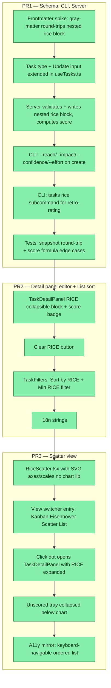

## Workflow



## Why
<!-- What problem does this solve? What breaks if we don't do it? Be concrete — name the user, the friction, the cost. -->

Importance/Urgency alone is too coarse for comparing tasks. RICE forces rigor (reach × impact × confidence ÷ effort) and makes cross-task comparison possible. Eisenhower stays for gut-feel triage; RICE adds the math layer. Current EisenhowerMatrix UI also needs work — scatter view replaces it as a sibling, not a replacement.

## User Stories

- [x] As a solo dev, I can rate a task with R/I/C/E and see a derived score, so that I can compare tasks numerically instead of by gut feel.
- [x] As a solo dev, I can leave RICE blank on a task and still use priority/urgency for it, so that the new system is opt-in per task.
- [x] As a solo dev, I can open the Scatter view and see rated tasks placed on Impact × Effort with quadrant labels (Quick Wins / Big Bets / Fill-ins / Time Sinks), so that I can spot quick wins at a glance.
- [x] As a solo dev, I can click a dot in the Scatter view to edit its RICE in the detail panel, so that I don't need a separate editor surface.
- [x] As a solo dev, I can see unscored tasks in a collapsible tray below the Scatter, so that they don't disappear from view.
- [x] As a CLI user, I can run `dreamcontext tasks rice <slug> --reach 5 --impact 3 --confidence 80 --effort 2` to retro-rate a task without editing other fields.
- [x] As a CLI user, I can run `dreamcontext tasks rice <slug>` (no flags) to print current RICE values + score.

## Acceptance Criteria

**PR1 — Schema, CLI, Server**
- [x] gray-matter spike confirms nested `rice:` block round-trips cleanly (matches A1)
- [x] `Task` interface in `dashboard/src/hooks/useTasks.ts` has `rice: { reach, impact, confidence, effort, score } | null` (A2)
- [x] Server `POST/PATCH /tasks` validates rice fields (reach 1–10 int, impact 1–5 int, confidence ∈ {25,50,75,100}, effort > 0 and ≤ 52) and rejects NaN/negatives (A3)
- [x] Server computes `rice.score = (reach × impact × (confidence/100)) / effort` on read and write when all 4 inputs present; `score: null` if any missing (A3)
- [x] `dreamcontext tasks create --reach --impact --confidence --effort` flags work and validate (A4)
- [x] `dreamcontext tasks rice <slug>` subcommand prints current values (no flags) or updates them (with flags) (A5)
- [x] `tests/integration/snapshot.test.ts` covers tasks with full / partial / no RICE; all round-trip without mangling (A6)
- [x] Unit test for score formula covers: all-set, partial, effort=0 guard, score precision (A6)

**PR2 — Detail panel editor + List sort**
- [x] TaskDetailPanel renders a collapsible "RICE" block below Urgency with 4 numeric inputs + computed score badge (B1)
- [x] Score badge shows `—` when any field empty; colored red <5 / amber 5–15 / green >15 when set (B1)
- [x] "Clear RICE" button sets all 4 fields to null in one PATCH (B2)
- [x] TaskFilters sort dropdown includes "RICE score" option; default remains "Updated" (B3)
- [x] TaskFilters has a "Min RICE" numeric filter; tasks below threshold are hidden (B3)
- [x] All new strings registered in `I18nContext.tsx` (B4)

**PR3 — Scatter view**
- [x] `RiceScatter.tsx` renders an SVG with X = Effort (low effort right, log-ish scale), Y = Impact, dot radius from Reach (clamped 6–24px), opacity from Confidence (min 0.4 floor), color from status (C1)
- [x] Quadrant overlay uses fixed midpoints (effort = 2 weeks, impact = 3) with labels Quick Wins / Big Bets / Fill-ins / Time Sinks (C1)
- [x] View switcher in TaskFilters has segmented control: Kanban / Eisenhower / Scatter / List, persisted via existing `usePersistedState` (C2)
- [x] Clicking a dot opens TaskDetailPanel with the RICE block expanded (C3)
- [x] Hover/keyboard-focus tooltip shows task name, R/I/C/E values, and score (C3)
- [x] Unscored tasks render in a collapsed `Unscored (N)` tray below the chart, horizontal scroll of TaskCards (C4)
- [x] Off-screen `<ul>` ordered by score for screen readers; dots are keyboard-focusable with visible focus ring (C5)
- [x] Scatter ignores priority/urgency entirely; Eisenhower view is unchanged

## Constraints & Decisions

**[2026-05-09]** No drag-to-rate in the Scatter view — solo dev with ~16 tasks and low edit frequency makes the snap/touch/a11y cost not worth it. Click-to-open detail panel is the editing path. Not deferred to a later PR; explicitly out of scope.

**[2026-05-09]** Three PRs, not four. PR3 has no editing surface of its own; without PR2's detail-panel editor, clicking a dot has nowhere to go.

**[2026-05-09]** Coexistence model is per-view, never global. Kanban sorts by priority+updated_at (ignores RICE). Eisenhower drives off priority/urgency. Scatter drives off RICE only. List view gets a sort dropdown including RICE. No precedence rule between the two systems — each view has one source of truth.

**[2026-05-09]** Fixed quadrant thresholds (effort = 2 weeks, impact = 3), not median-based. Median moves the goalposts every time a task is added. Fixed thresholds give a stable mental map. Tunable via constants once the 16 existing tasks are rated.

**[2026-05-09]** Unified 1–N integer scales, no fractional Intercom-style values. Reach 1–10, Impact 1–5, Confidence in {25,50,75,100} percent, Effort 0.5–8 person-weeks. One mental model: "bigger is better, pick a number." Confidence as percent reads naturally ("I'm 80% sure").

**[2026-05-09]** No migration of the 16 existing tasks. They render in Scatter only when rated. Rating-on-demand is the natural workflow; a one-shot wizard is busywork.

**[2026-05-09]** No chart library. Raw SVG with manual scale math (~150 lines). Adding d3/recharts for one chart is unjustified.

**[2026-05-09]** Schema additive only. `priority` and `urgency` stay. If after a month only RICE is used, drop them in a follow-up — not now.

## Technical Details

**Frontmatter shape** (additive, all-optional):
```yaml
rice:
  reach: 5          # integer 1–10
  impact: 3         # integer 1–5
  confidence: 80    # integer ∈ {25, 50, 75, 100}
  effort: 2         # number > 0 and ≤ 52, weeks (0.5 step)
  score: 6.0        # derived server-side, null if any input missing
```

**Score formula**: `score = (reach × impact × (confidence / 100)) / effort`. Computed on every read and on every write where all 4 inputs present. Stored in frontmatter so it shows in raw markdown too.

**Files to touch**

PR1:
- `src/templates/task.md` — append commented `# rice:` example block in frontmatter
- `src/cli/commands/tasks.ts` — extend `create` action with `--reach/--impact/--confidence/--effort`; add new `rice <slug>` subcommand
- `src/server/routes/tasks.ts` — extend `TaskData`, `readTask`, POST validation, PATCH `allowedFields` (add `rice`), nested YAML write, score computation
- `src/lib/frontmatter.ts` — verify nested-object round-trip; if broken, fix or fall back to flat `rice_reach / rice_impact / ...`
- `dashboard/src/hooks/useTasks.ts` — extend `Task` interface with `rice: RiceFields | null`; extend `UpdateTaskInput`
- `tests/integration/snapshot.test.ts` — round-trip cases (full / partial / no RICE)
- `tests/unit/` — new file for score formula + edge cases

PR2:
- `dashboard/src/components/tasks/TaskDetailPanel.tsx` + `.css` — RICE collapsible block with 4 numeric inputs + score badge
- `dashboard/src/components/tasks/TaskFilters.tsx` — sort dropdown + Min RICE filter
- `dashboard/src/context/I18nContext.tsx` — new strings (rice.reach, rice.impact, rice.confidence, rice.effort, rice.score, rice.clear, sort.rice, filter.min_rice)

PR3:
- `dashboard/src/components/tasks/RiceScatter.tsx` + `.css` — new SVG scatter component
- `dashboard/src/components/tasks/TaskFilters.tsx` — view switcher segmented control extended
- Parent that renders Kanban/Eisenhower today (likely the Tasks page) — wire Scatter as a sibling

**Change tracker**: `recordDashboardChange` treats a RICE update as a single `field: 'rice'` change with `from`/`to` being the full object — not four separate audit entries per edit. Implemented.

**Input UX change (post-PR2 fix)**: All 4 RICE inputs are dropdowns, not free-form number fields. Reach 1–10, Impact 1–5, Effort Fibonacci-ish steps (0.5, 1, 1.5, 2, 3, 4, 5, 6, 8w), Confidence stays 25/50/75/100. Client-side no-op guard: PATCH is skipped if picked value equals current — prevents spurious "No valid fields to update" errors from idle interactions. Selecting "—" clears a single field; Clear RICE clears all four.

## Notes

- **Risk: nested YAML round-tripping.** 30-min spike at the start of PR1 — if `frontmatter.ts` mangles nested objects, fall back to flat `rice_reach / rice_impact / ...` keys. Don't commit to nested without proving it round-trips first.
- **Risk: two prioritization systems on one task is genuinely confusing.** Mitigation: document in `_dream_context/core/features/task-management.md`: "priority/urgency = gut feel, RICE = forced rigor for cross-task comparison." Reassess after a month of usage.
- **A11y**: scatter dots are SVG circles — need `role="button"`, `aria-label` with task + score, focusable with `tabindex="0"`, visible focus ring. Off-screen `<ul>` ordered by score is the screen-reader path, not a separate "table view."
- **Dark mode**: dots use `currentColor` derived from status CSS vars (already themed). Quadrant overlay uses low-opacity surface var, not hardcoded gray.
- **Effort axis is log-ish** because 0.5w and 8w can't share a linear axis comfortably. Use `Math.log2(effort + 1)` or similar — verify visually with rated tasks.
- **CLI ergonomics**: `tasks rice <slug>` mirrors the shape of existing `tasks status`. Picked over flags-on-edit because there's no `tasks edit` command today and adding one is scope creep.
- **Quadrant overlay click is noop** — don't open create modal on empty area; surprising.
- **Open**: should completed tasks render in Scatter? Lean toward filtering them out by default (matches existing EisenhowerMatrix behavior at line 56).

## Changelog
<!-- LIFO: newest at top. Auto-prepended by `dreamcontext tasks log`. -->


### 2026-05-09 - Session Update
- All 3 PRs shipped in one session: PR1 schema/CLI/server (rice.ts lib, gray-matter round-trip confirmed, 21 unit tests + 3 integration tests), PR2 detail-panel editor (RiceBlock collapsible with dropdowns for all 4 fields, score badge, Clear button, Min RICE filter + sort) PR3 scatter view (RiceScatter.tsx ~290 LOC raw SVG, quadrants, a11y mirror list, unscored tray). Build clean: tsc + vite. SKILL.md command reference updated with rice flags and tasks rice subcommand.
### 2026-05-09 - Session Update
- Implemented all 3 PRs in one session: schema/CLI/server, detail-panel editor + sort, scatter view. Nested YAML round-trip confirmed. CLI tasks rice subcommand works. RICE block in TaskDetailPanel with score badge + clear. RiceScatter SVG with quadrants (Quick Wins/Big Bets/Fill-ins/Time Sinks), unscored tray, a11y mirror list. View switcher: Kanban/Eisenhower/Scatter/List.
### 2026-05-09 - Session Update
- Task plan written with full architect spec: 3 PRs (schema/CLI/server, detail-panel editor + sort, scatter view), 7 user stories, 23 acceptance criteria, 8 locked decisions. Nested YAML round-trip risk flagged as 30-min spike at start of PR1.
### 2026-05-09 - Created
- Task created.
