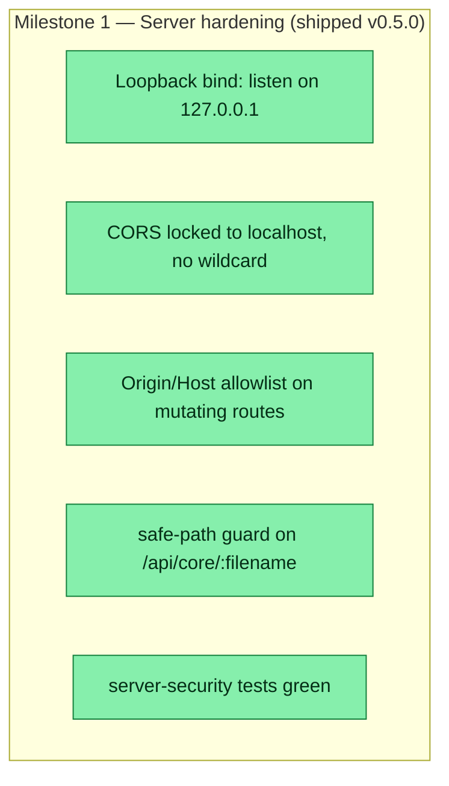

## Workflow
<!-- The shape of this task at a glance. One node per acceptance criterion, grouped under milestone subgraphs. Update node classes as work progresses: `:::done` (green), `:::active` (amber), `:::todo` (gray), `:::blocked` (red). Run `dreamcontext tasks doctor` to verify sync. -->

## Why
<!-- What problem does this solve? What breaks if we don't do it? Be concrete — name the user, the friction, the cost. -->

The dashboard server was binding 0.0.0.0 with wildcard CORS and unauthenticated mutating routes (PUT/PATCH/DELETE) — anyone on the same LAN could read/write the user's _dream_context/ files, and any webpage could issue CSRF writes to localhost. Pulled forward from v0.6 and shipped in v0.5.0 before public release.

## User Stories
<!-- As a <role>, I can <action>, so that <outcome>. Tick when demonstrably true in the running system. -->

- [x] As a user running dreamcontext dashboard on a shared network, the server only accepts connections from localhost (127.0.0.1), so LAN neighbors cannot access or modify my project files.
- [x] As a user with the dashboard open in a browser, mutating routes reject cross-origin requests, so malicious websites cannot CSRF-write my _dream_context/ files.
- [x] As a developer building on the dashboard server, path-traversal inputs are rejected at the route level via safe-path guard, so filenames from HTTP requests cannot escape the project root.
## Acceptance Criteria
<!-- The contract. Each line is testable and gets a node in the Workflow flowchart above. -->

- [x] server.listen binds 127.0.0.1 by default (was 0.0.0.0) — closes LAN exposure
- [x] Access-Control-Allow-Origin: * removed; CORS pinned to localhost origin (no wildcard on mutating routes)
- [x] Origin/Host allowlist check on all mutating routes (PUT/PATCH/DELETE) — closes CSRF drive-by-write vector
- [x] src/server/safe-path.ts path-traversal guard rejects .. sequences; applied to /api/core/:filename route
- [x] tests/unit/server-security.test.ts covers the above — all green
## Constraints & Decisions
<!-- LIFO: newest at top. Capture the why, not just the what. -->

- **[2026-05-31]** [2026-05-31] Defense-in-depth REMAINING for v0.6 (not blocking v0.5.0 ship): apply safeChildPath to slug/param path-joins in tasks.ts, knowledge.ts, features.ts, council.ts; add auth/origin-token when the control plane gains write actions.
- **[2026-05-31]** [2026-05-31] Security review (session f007d91a) flagged loopback bind + CSRF vector as HIGH priority. Decision: pull forward from v0.6 plan and fix before v0.5.0 public release. Reviewed PASS in code review.
## Technical Details
<!-- Where the work lives. Files, services, key functions to reuse. Body is current truth — update in place; don't append. -->

(Key files, services, dependencies, implementation approach.)

src/server/index.ts — server.listen(port, '127.0.0.1', ...) replaces no-host bind. src/server/middleware.ts — CORS locked to localhost origin, Origin/Host allowlist check on mutating verbs. src/server/safe-path.ts (NEW) — path-traversal guard, rejects '..' sequences, used in /api/core/:filename route. tests/unit/server-security.test.ts (NEW) — unit tests covering all hardening.
## Notes
<!-- Loose ends, edge cases, open questions. -->

(Working notes, edge cases, open questions.)

## Changelog
<!-- LIFO: newest at top. Auto-prepended by `dreamcontext tasks log`. -->

### 2026-05-31 - Status → in_review
- Central hardening shipped in v0.5.0 — loopback bind, CORS lockdown, Origin/Host guard, safe-path traversal guard. Reviewed PASS. Remaining defense-in-depth (slug path joins in tasks/knowledge/features/council routes) deferred to v0.6.
### 2026-05-31 - Session Update
- Shipped in v0.5.0: loopback bind (127.0.0.1), wildcard CORS removed + Origin/Host allowlist on mutating routes, safe-path path-traversal guard on /api/core/:filename. Security review passed. New files: src/server/safe-path.ts, tests/unit/server-security.test.ts.
### 2026-05-31 - Status → in_review
- Security hardening shipped in commit 0bb6d7c as v0.5.1: loopback bind, CSRF guard, CORS lockdown, safeChildPath traversal guard, dep audit. 8 tests green. Ready for user verification.
### 2026-05-31 - Created
- Task created.
