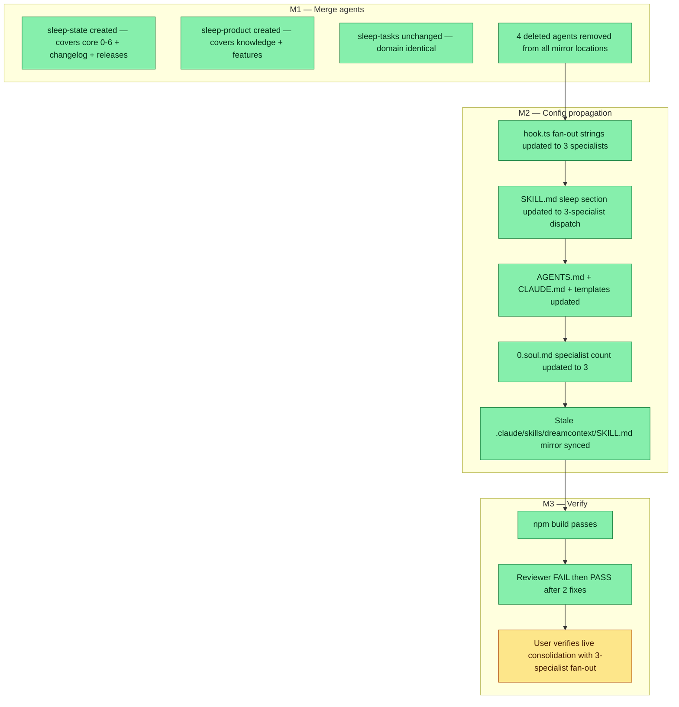

## Workflow

## Why

The 5-specialist design shipped in v0.3.0 but introduced too much orchestration overhead: 5 parallel agent launches, 4 mirror locations to keep in sync, and high prompt density per specialist. Merging sleep-core+sleep-changelog into sleep-state and sleep-knowledge+sleep-features into sleep-product cuts launch cost while preserving non-overlapping file domains.

## User Stories

- [x] As the main agent running SKILL.md sleep flow, I dispatch exactly 3 specialists (sleep-tasks, sleep-state, sleep-product) — always tasks+state, product conditional — so launch overhead is reduced vs the prior 5-specialist design.
- [x] As a sleep specialist, my file domain is clearly bounded (state owns core 0-6+changelog+releases; product owns knowledge+features; tasks owns state/*.md) so I cannot accidentally stomp adjacent domains.
- [x] As a future agent reading the agent list, I see 3 sleep agents (not 5) plus descriptive names that map obviously to their file domains.
## Acceptance Criteria

- [x] sleep-core.md and sleep-changelog.md deleted; sleep-state.md created covering both domains (core 0-6, CHANGELOG.json, RELEASES.json)
- [x] sleep-knowledge.md and sleep-features.md deleted; sleep-product.md created covering both domains (knowledge/, core/features/)
- [x] sleep-tasks.md unchanged — file domain unchanged, prompt only updated for new 3-specialist naming
- [x] All agent files mirrored to .codex/agents/prompts/, .claude/agents/, agents/ — 4 mirrors total per agent
- [x] hook.ts fan-out strings updated to reference 3 specialists by name
- [x] AGENTS.md, CLAUDE.md, SKILL.md, 0.soul.md all reference 3 specialists (not 5)
- [x] npm build passes with no new errors; CLI runs clean
- [x] Reviewer FAIL -> PASS: two flagged issues (over-fire phrasing + soul.md specialist count) both fixed
- [x] .claude/skills/dreamcontext/SKILL.md mirror synced to canonical skill/SKILL.md (was stale, missing RICE + sleep refactor sections)
## Constraints & Decisions
<!-- LIFO: newest at top. Capture the why, not just the what. -->

- **[2026-05-10]** sleep-tasks.md is unchanged by design — only the naming context around it changed; its prompt + file domain stay identical
- **[2026-05-10]** All 4 mirror locations must be kept in sync: .codex/agents/prompts/, .claude/agents/, agents/, and the source agents/ directory
- **[2026-05-10]** 5-specialist design was intentionally kept separate from this task — the original sleep-fanout-architecture task describes the first design (v0.3.0 shipped); this task is the follow-up second-order decision
## Technical Details

Merge map:
- sleep-state = sleep-core (0.soul.md, 1.user.md, 2.memory.md) + sleep-changelog (CHANGELOG.json, RELEASES.json)
- sleep-product = sleep-knowledge (_dream_context/knowledge/) + sleep-features (_dream_context/core/features/)
- sleep-tasks = unchanged (state/*.md)

Files deleted: agents/sleep-core.md, agents/sleep-changelog.md, agents/sleep-knowledge.md, agents/sleep-features.md (and all 4 mirrors for each).
Files created: agents/sleep-state.md, agents/sleep-product.md (and all 4 mirrors for each).

hook.ts fan-out strings: updated sleep specialist names from 5 to 3 in debt/consolidation prompt injection.
SKILL.md Sleep section: fan-out description updated to always fire sleep-tasks + sleep-state; conditionally fire sleep-product.
0.soul.md: '5 specialists' → '3 specialists' with collapse rationale note.
AGENTS.md, CLAUDE.md, src/templates/AGENTS.md, src/templates/CLAUDE.md: all updated to 3-specialist naming.

Stale mirror discovered and fixed: .claude/skills/dreamcontext/SKILL.md was a much older revision (missing RICE + sleep refactor sections); synced from canonical skill/SKILL.md.
## Notes

Reviewer caught 2 MAJOR issues post-implementation: (1) over-fire wording was generic 'over-fire the optional ones' — fixed to 'over-fire sleep-product' for clarity; (2) soul.md still said '5 specialists' — fixed to '3 specialists'. Both passed on re-review.

The .claude/skills/dreamcontext/SKILL.md mirror being stale by ~19 lines was a silent risk — future sessions would have loaded the old skill. Fixed during config verification sweep.
## Changelog
<!-- LIFO: newest at top. Auto-prepended by `dreamcontext tasks log`. -->

### 2026-05-10 - Status → in_review
- 5→3 collapse complete: all 8 acceptance criteria met, reviewer PASS, build green. First live test of sleep-state specialist is this cycle.
### 2026-05-10 - Status → in_review
- All 16+ file changes landed, build passes, reviewer PASS — ready for user verification of 3-specialist sleep architecture
### 2026-05-10 - Session Update
- Session d332f782: collapsed 5 specialists into 3 (sleep-state, sleep-product, sleep-tasks). Deleted sleep-core, sleep-changelog, sleep-knowledge, sleep-features. Created sleep-state + sleep-product. All 4 mirror locations synced. hook.ts fan-out strings updated. AGENTS.md, CLAUDE.md, SKILL.md, 0.soul.md updated to 3-specialist naming. Reviewer FAIL->PASS (2 fixes: over-fire phrasing + soul.md count). Stale .claude/skills/dreamcontext/SKILL.md discovered and synced. npm build passed.
### 2026-05-10 - Created
- Task created.
