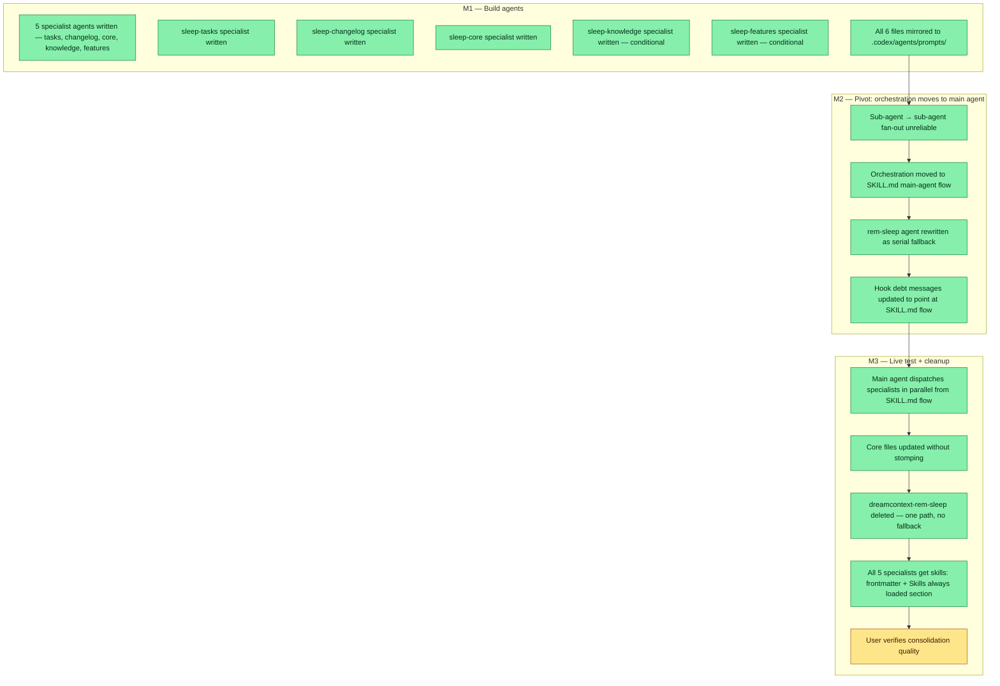

## Workflow

## Why

The monolithic `dreamcontext-rem-sleep` agent handled every consolidation domain (tasks, changelog, core files, knowledge, features) in one sequential pass. In practice, changelog, release, and feature-PRD updates were routinely skipped — too many concerns in one context window. The fix splits work into 5 focused specialists with non-overlapping file domains so nothing falls through.

**Pivot (2026-05-09)**: The first design used a thin `dreamcontext-rem-sleep` orchestrator that dispatched specialists in parallel. In practice, sub-agent → sub-agent dispatch did not fan out reliably (Claude Code sub-agents cannot consistently spawn other sub-agents in parallel). The orchestration role moved to the **main agent**, driven by `skill/SKILL.md`'s "Sleep" section.

**Second cleanup (2026-05-09)**: The `dreamcontext-rem-sleep` agent was deleted entirely. A "fallback" that runs all 5 domains serially in one agent is the same broken pattern the redesign was meant to fix — keeping it would have been a regression vector, not a safety net. One path: SKILL.md fan-out. If the model doesn't follow it, fix SKILL.md. The 5 specialists also received `skills: [dreamcontext]` frontmatter and `## Skills always loaded` body sections per the agent skills-declaration feedback rule.

## User Stories

- [x] As the main agent running the SKILL.md sleep flow, I can dispatch tasks, changelog, and core specialists in parallel from a single message, so that consolidation is faster and each specialist stays focused.
- [x] As the tasks specialist, I can update task statuses, log progress, and reconcile task bodies, without touching changelog or core files.
- [x] As the core specialist, I can update soul/user/memory files surgically, without stepping on task or changelog changes.
- [x] As the user, I can run the SKILL.md sleep flow and see a complete consolidation report showing what each specialist did, so I know exactly what changed.
- [x] As an agent reading the system, I see only one sleep path (SKILL.md fan-out) — no fallback agent exists to create a degradation vector.

## Acceptance Criteria

- [x] Main agent (via SKILL.md) dispatches sleep-tasks, sleep-changelog, sleep-core in parallel always (A1–A4)
- [x] Main agent conditionally dispatches sleep-knowledge and sleep-features based on signals from .sleep.json + git status (A5–A6)
- [x] Each specialist owns a non-overlapping file domain — no stomping (enforced by design)
- [x] Specialists fetch context via CLI commands directly — no shared digest file (A1–A7)
- [x] All 5 specialist files mirrored to `.codex/agents/prompts/` (A7)
- [x] `dreamcontext-rem-sleep` deleted — no fallback agent (second cleanup session)
- [x] All 5 specialists declare `skills: [dreamcontext]` in frontmatter + `## Skills always loaded` body section
- [x] Hook debt messages and SKILL.md instruct main agent to fan out via 5 specialists (P2, P4)
- [x] Live consolidation cycle completed without errors (first fan-out was the previous sleep cycle, 13 changelog entries, all domains covered) (B1–B3)
## Constraints & Decisions
<!-- LIFO: newest at top. Capture the why, not just the what. -->

- **[2026-05-09]** `dreamcontext-rem-sleep` deleted entirely — a serial fallback running all 5 domains in one agent is the same broken pattern the redesign fixed. One path: SKILL.md fan-out from main agent.
- **[2026-05-09]** Sub-agent → sub-agent dispatch is unreliable in Claude Code; orchestration must run in main-agent context. SKILL.md owns the sleep protocol.
- **[2026-05-09]** Brief is small text in prompt: epoch, session IDs, task slugs, planning version, signals, optional user hint — no transcript dumps
- **[2026-05-09]** sleep-knowledge and sleep-features are optional; orchestrator decides from signals (last_assistant_message keywords, knowledge_access staleness, feature/task slug overlap, git status under features/)
- **[2026-05-09]** Specialists do not edit files outside their domain — cross-domain findings are surfaced in reports for the right specialist to pick up
## Technical Details

**Orchestration lives in `skill/SKILL.md` "Sleep" section, not in an agent.** The main agent reads it, runs the protocol, and dispatches specialists in parallel via multiple Agent tool calls in one message. This works reliably because the main agent CAN fan out; sub-agents cannot.

Agent files (all mirrored to `.codex/agents/prompts/` and `agents/`; all have `skills: [dreamcontext]` frontmatter + `## Skills always loaded` body section):
- `sleep-tasks.md` — domain: `_dream_context/state/*.md`; logs progress, bumps statuses, reconciles task bodies
- `sleep-changelog.md` — domain: `_dream_context/core/CHANGELOG.json` + `RELEASES.json`; adds changelog entries, checks version readiness
- `sleep-core.md` — domain: `_dream_context/core/0.soul.md`, `1.user.md`, `2.memory.md`; surgical updates, anti-bloat sweep
- `sleep-knowledge.md` — domain: `_dream_context/knowledge/`; creates/updates knowledge files, handles staleness sweep (optional dispatch)
- `sleep-features.md` — domain: `_dream_context/core/features/`; updates feature PRDs when sessions touch feature code (optional dispatch)

`dreamcontext-rem-sleep.md` **deleted** — no fallback path. If main-agent fan-out fails, fix SKILL.md; don't silently degrade to a serial single-agent run.

SKILL.md sleep flow:
1. `dreamcontext sleep start` — pin epoch.
2. Main agent reads `.sleep.json`, `git status`, `git log` since epoch.
3. Main agent dispatches `sleep-tasks` + `sleep-changelog` + `sleep-core` always; `sleep-knowledge` / `sleep-features` conditionally — all in **one message** with multiple Agent tool calls (true parallel fan-out).
4. Each specialist receives a small text brief (epoch, session IDs, task slugs, planning version, signals, optional user hint) and returns a structured report.
5. Main agent assembles reports, runs marketing pass if applicable, calls `dreamcontext sleep done "
"`.

Dispatch signals for optional specialists:
- `sleep-knowledge`: keyword match in `last_assistant_message` OR `knowledge_access` has entries >30 days old OR git status shows changes under `_dream_context/knowledge/`
- `sleep-features`: git status shows changes under `_dream_context/core/features/` OR task `related_feature` field is non-null in active sessions

Hook debt messages (in `src/cli/commands/hook.ts` / sleep CLI surfaces) instruct the main agent to run the SKILL.md flow directly, not to dispatch `dreamcontext-rem-sleep` as the primary path.

## Notes

- First live test succeeded (2026-05-09 previous cycle): 5 specialists dispatched in parallel, 13 changelog entries written, all domains covered — no skips.
- Decision: each specialist returns a string report; main agent concatenates and stitches into the `sleep done` summary.
- Second session (2026-05-09): deleted rem-sleep, added skills declarations to all 5 specialists. npm build + `dreamcontext update` clean.
- This current consolidation cycle (epoch 2026-05-09T19:36:03Z) is the second live test with the cleaned-up architecture.

## Changelog
<!-- LIFO: newest at top. Auto-prepended by `dreamcontext tasks log`. -->

### 2026-05-10 - Session Update
- 2026-05-10 follow-up: 5-specialist design collapsed to 3 (sleep-state + sleep-product + sleep-tasks) in task sleep-fanout-3specialist-collapse. sleep-core+sleep-changelog merged into sleep-state; sleep-knowledge+sleep-features merged into sleep-product. Original task remains accurate for the v0.3.0 5-specialist architecture; collapse is tracked separately.
### 2026-05-09 - Session Update
- Session 6fb301ee: deleted dreamcontext-rem-sleep agent entirely (no fallback path), updated all 5 specialist agent files with skills: frontmatter + Skills always loaded body section, mirrored to .codex/agents/prompts/, rebuilt + dreamcontext update. Templates CLAUDE.md/AGENTS.md updated to reference fan-out flow. SKILL.md fallback sentence removed. One path, no degradation vector.
### 2026-05-09 - Session Update
- Pivoted: orchestration moved from rem-sleep agent to main-agent SKILL.md flow (sub-agent fan-out unreliable). rem-sleep rewritten as serial fallback. SKILL.md + hook debt messages updated; all agent files mirrored to .codex/agents/prompts/. npm build + dreamcontext update successful.
### 2026-05-09 - Session Update
- Orchestrator + 5 specialists (sleep-tasks, sleep-changelog, sleep-core, sleep-knowledge, sleep-features) built and mirrored to .codex/agents/prompts/. Live test: this cycle. Fan-out architecture is operational.
### 2026-05-09 - Status → in_review
- Orchestrator + 5 specialists written and mirrored. Ready for live test on next consolidation cycle.
### 2026-05-09 - Session Update
- Built orchestrator + 5 specialists (sleep-tasks, sleep-changelog, sleep-core, sleep-knowledge, sleep-features). Each owns a non-overlapping file domain. No shared digest file — specialists pull context via CLI directly. Mirrored to .codex/agents/prompts/.
### 2026-05-09 - Created
- Task created.
