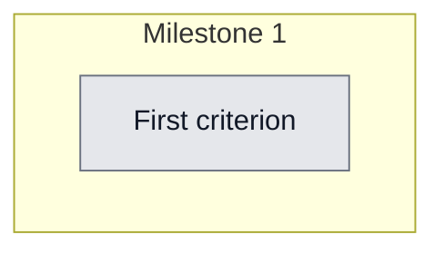

## Workflow
<!-- Mermaid flowchart of milestones + acceptance-criteria nodes. Keep in sync with the Acceptance Criteria checklist: 1 node per criterion, status class matches checkbox state. -->

## Why

(To be defined)

## User Stories

- [ ] As a [user], I want [action] so that [outcome]

## Acceptance Criteria

- [ ] First criterion (must match a node in Workflow)

## Constraints & Decisions
<!-- LIFO: newest decision at top -->

## Technical Details

(Key files, services, dependencies, implementation approach.)

## Notes

(Working notes, edge cases, open questions.)

## Changelog
<!-- LIFO: newest entry at top -->

### 2026-05-02 - Session Update
- Implemented (2026-05-02 session 67873c11): KnowledgeEntry gains optional pinnedPreviewLines/pinnedPreviewAll from frontmatter. snapshot.ts: extractPinnedPreview() + DEFAULT_PINNED_PREVIEW_LINES=60. Both generateSnapshot() and generateSubagentBriefing() cap pinned content with '→ Read full: ...' pointer. Snapshot shrunk 1242→730 lines (112KB→80KB). 11 new test assertions (44 affected tests pass). Unrelated marketing-council test failure is pre-existing.
### 2026-05-02 - Created
- Task created.
