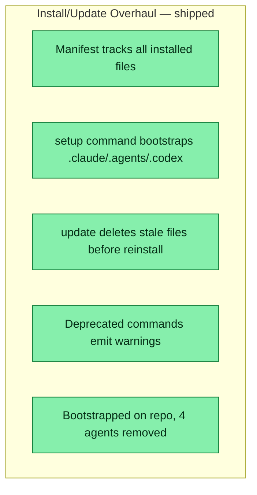

## Workflow
<!-- The shape of this task at a glance. One node per acceptance criterion, grouped under milestone subgraphs. Update node classes as work progresses: `:::done` (green), `:::active` (amber), `:::todo` (gray), `:::blocked` (red). Run `dreamcontext tasks doctor` to verify sync. -->

## Why
<!-- What problem does this solve? What breaks if we don't do it? Be concrete — name the user, the friction, the cost. -->

install/update needed manifest tracking to prevent stale file accumulation across .claude/.agents/.codex directories; old commands lacked deprecation paths

## User Stories

- [x] As a CLI user, I can run `dreamcontext setup` to install/update all platform files so that I always have a clean, manifest-tracked installation
- [x] As a CLI user, I can run `dreamcontext update` and have stale files auto-removed so that my .claude/.agents/.codex directories stay clean

## Acceptance Criteria

- [x] Manifest system (src/lib/manifest.ts) tracks every installed file per pack and platform
- [x] setup command creates or updates .claude/.agents/.codex with manifest bootstrap
- [x] update deletes stale files absent from new manifest before installing fresh copies
- [x] Deprecated old commands emit warnings pointing users to setup/update
- [x] Bootstrapped on dreamcontext repo itself; 4 stale brand-voice agents removed
## Constraints & Decisions
<!-- LIFO: newest at top. Capture the why, not just the what. -->

- **[2026-05-22]** Manifest must handle missing/empty states gracefully for legacy projects without prior manifest
## Technical Details
<!-- Where the work lives. Files, services, key functions to reuse. Body is current truth — update in place; don't append. -->

New files: src/lib/manifest.ts, src/lib/setup-config.ts, src/cli/commands/setup.ts. Rewritten: src/cli/commands/update.ts. Updated: src/cli/commands/install-skill.ts, src/cli/commands/install-claude-md.ts, src/cli/commands/init.ts, src/cli/index.ts
## Notes

## Changelog
<!-- LIFO: newest at top. Auto-prepended by `dreamcontext tasks log`. -->

### 2026-05-22 - Session Update
- WS-1 shipped and passed holistic reviewer: manifest.ts created, setup.ts command added, update.ts rewritten to delete stale .claude/.agents/.codex files, install-skill.ts threaded with manifest, deprecation warnings on old commands, init.ts + install-claude-md.ts + cli/index.ts updated; bootstrapped on repo itself, 4 stale brand-voice agents deleted
### 2026-05-22 - Created
- Task created.
