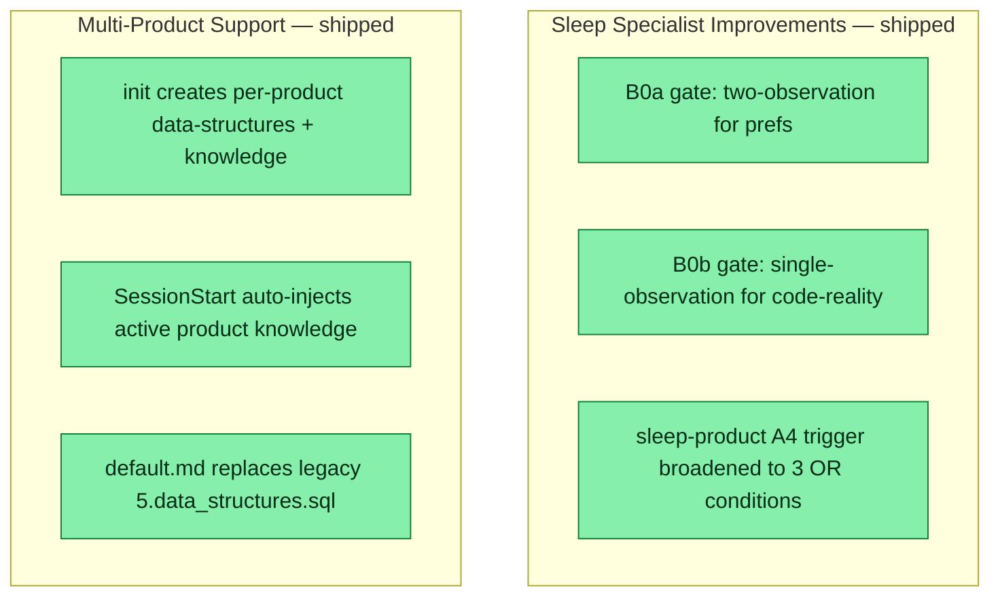

## Workflow
<!-- The shape of this task at a glance. One node per acceptance criterion, grouped under milestone subgraphs. Update node classes as work progresses: `:::done` (green), `:::active` (amber), `:::todo` (gray), `:::blocked` (red). Run `dreamcontext tasks doctor` to verify sync. -->

## Why
<!-- What problem does this solve? What breaks if we don't do it? Be concrete — name the user, the friction, the cost. -->

sleep-state gate was monolithic (B0a+B0b conflated); multi-product projects lacked conventions for per-product data structures and knowledge; SessionStart injected no product-specific context

## User Stories

- [x] As a sleep-state specialist, I fire B0a (user pref recurrence) only after two observations so that single-session prefs don't create noise
- [x] As a sleep-state specialist, I fire B0b (code-reality divergence) on first observation so that structural issues are caught immediately
- [x] As a multi-product project user, I get per-product data structures and knowledge auto-injected so that each product's context stays isolated

## Acceptance Criteria

- [x] sleep-state B0a gate fires only after two observations of the same user pref pattern
- [x] sleep-state B0b gate fires on single observation of code-reality divergence
- [x] sleep-product A4 PRD trigger fires when ANY of 3 conditions is met (research, AC advancement, feature concept with 2+ criteria)
- [x] Multi-product init creates core/data-structures/<product>.md and knowledge/products/<product>.md per product
- [x] SessionStart hook auto-injects active product knowledge (capped 200 lines) when active task has product: frontmatter
- [x] default.md template replaces legacy 5.data_structures.sql template for single-product projects
## Constraints & Decisions
<!-- LIFO: newest at top. Capture the why, not just the what. -->

- **[2026-05-22]** snapshot.ts null-guards legacy projects without .config.json
- **[2026-05-22]** SessionStart product injection no-ops safely when multiProduct is false/missing in .config.json
## Technical Details
<!-- Where the work lives. Files, services, key functions to reuse. Body is current truth — update in place; don't append. -->

Files changed: agents/sleep-state.md, agents/sleep-product.md, agents/dreamcontext-explore.md, agents/dreamcontext-initializer.md, skill/SKILL.md (+ .claude/ mirrors), src/cli/commands/init.ts, src/cli/commands/snapshot.ts, src/cli/commands/doctor.ts, src/templates/init/data-structures/default.md
## Notes

## Changelog
<!-- LIFO: newest at top. Auto-prepended by `dreamcontext tasks log`. -->

### 2026-05-22 - Session Update
- WS-2 shipped and passed holistic reviewer: sleep-state B0a (two-observation for prefs) and B0b (single-observation for code-reality) gates split; sleep-product A4 PRD trigger broadened to 3 OR conditions; multi-product conventions added (core/data-structures/<product>.md, knowledge/products/<product>.md, optional task product: frontmatter); SessionStart hook auto-injects active product knowledge; default.md replaces legacy 5.data_structures.sql template; agents/dreamcontext-explore.md + agents/dreamcontext-initializer.md + SKILL.md + .claude mirrors updated; snapshot.ts + doctor.ts + init.ts updated
### 2026-05-22 - Created
- Task created.
