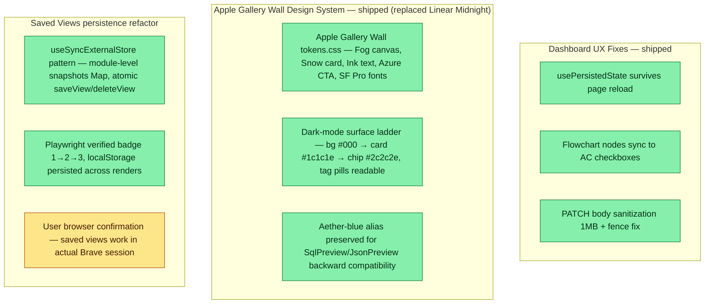

## Workflow
<!-- The shape of this task at a glance. One node per acceptance criterion, grouped under milestone subgraphs. Update node classes as work progresses: `:::done` (green), `:::active` (amber), `:::todo` (gray), `:::blocked` (red). Run `dreamcontext tasks doctor` to verify sync. -->

## Why
<!-- What problem does this solve? What breaks if we don't do it? Be concrete — name the user, the friction, the cost. -->

dashboard filter state was lost on reload due to projectId hydration timing; flowchart nodes had no live sync to AC checkboxes; PATCH endpoint lacked body size limits; design system used deprecated glass/purple tokens

## User Stories

- [x] As a dashboard user, filter selections persist across page reloads so that I don't lose my context when refreshing
- [x] As a task author, flowchart nodes automatically reflect AC checkbox state so that the Workflow summary stays accurate without manual sync
- [x] As a dashboard user, I see an Apple Gallery Wall design — Fog canvas, Snow cards, SF Pro fonts, zero shadows, 28px radius. (Linear Midnight replaced 2026-05-23)
- [x] As a dashboard user, tag pills in dark mode are readable (Apple macOS surface ladder — chip background #2c2c2e on #1c1c1e card)
- [ ] As a dashboard user, saved views persist reliably in Brave Incognito (code shipped + Playwright verified; awaiting user confirmation in real session)

## Acceptance Criteria

- [x] usePersistedState survives page reload — projectId hydrates before state is read
- [x] Flowchart node class (done/active/todo) stays in sync with AC checkbox state via node markers
- [x] Server PATCH endpoint rejects bodies >1 MB and prepends newline before first --- fence
- [x] Apple Gallery Wall design system applied: tokens.css fully rewritten — Fog #f5f5f7 canvas, Snow #ffffff card, Ink #1d1d1f text, Azure #0071e3 CTA, SF Pro Display/Text fonts, 28px radius, zero shadows, negative letter-spacing (Linear Midnight was superseded 2026-05-23)
- [x] Dark-mode tag pill contrast fixed: Apple macOS surface ladder (bg=#000, card=#1c1c1e, chip=#2c2c2e, text-tertiary=#8e8e93); Playwright verified tagBg rgb(44,44,46), tagColor rgb(142,142,147)
- [x] --color-aether-blue alias added (→ --color-azure) for SqlPreview/JsonPreview backward compatibility
- [ ] Saved-views persistence confirmed in user's actual Brave session (code shipped via useSyncExternalStore refactor; Playwright PASS; awaiting user confirmation)
## Constraints & Decisions
<!-- LIFO: newest at top. Capture the why, not just the what. -->

- **[2026-05-23]** User requested Apple Gallery Wall design system — tokens.css fully rewritten (not additive). Linear Midnight replaced. aether-blue alias preserved as backward-compat shim.
- **[2026-05-23]** useSyncExternalStore chosen over useEffect for saved-views — eliminates oscillation by making the external store the source of truth, not React state. FilterPreset aliased to SavedView.
- **[2026-05-22]** font-weight 510/590 (Inter variable font) gracefully falls back to 500/600 when Inter not loaded
- **[2026-05-22]** Design system overhaul was scope creep from WS-4 — additive and non-breaking, reviewed and approved by holistic reviewer
## Technical Details
<!-- Where the work lives. Files, services, key functions to reuse. Body is current truth — update in place; don't append. -->

WS-4 original files (2026-05-22): dashboard/src/components/tasks/TaskDetailPanel.tsx, dashboard/src/hooks/usePersistedState.ts, dashboard/src/hooks/useTasks.ts, src/server/routes/tasks.ts. CSS scope-creep: Header.css, Sidebar.css, Shell.css, global.css, tokens.css, dashboard/index.html. 193 token references migrated across 22 files.

Apple design system + saved-views refactor (2026-05-23): dashboard/src/styles/tokens.css (full rewrite), dashboard/src/components/tasks/KanbanBoard.tsx (useSavedViews/saveView/deleteView), new dashboard/src/hooks/useSavedViews.ts (useSyncExternalStore, module-level snapshots Map). Component CSS files updated for tag pill dark mode.
## Notes

Google Fonts CDN in dashboard/index.html will warn in air-gapped environments but falls back to system font
## Changelog
<!-- LIFO: newest at top. Auto-prepended by `dreamcontext tasks log`. -->

### 2026-05-23 - Session Update
- Session fa67d942: (1) saved-views persistence refactored to useSyncExternalStore pattern — module-level snapshots Map, saveView/deleteView as pure functions, FilterPreset aliased to SavedView; Playwright verified badge 1→2→3, localStorage persisted across renders; user browser confirmation pending. (2) Apple Gallery Wall design system migration — tokens.css fully rewritten from Linear Midnight to Apple: Fog #f5f5f7 canvas, Snow #ffffff card, Ink #1d1d1f text, Azure #0071e3 CTA, SF Pro Display/Text fonts, 28px radius, zero shadows, negative letter-spacing scaled to size; KanbanBoard refactored to use useSavedViews/saveView/deleteView. (3) Dark-mode tag pill fix — Apple macOS surface ladder applied: bg #000 → card #1c1c1e → chip #2c2c2e, text-tertiary #8e8e93; Playwright verified tagBg rgb(44,44,46), tagColor rgb(142,142,147).
### 2026-05-22 - Session Update
- WS-4 shipped and passed holistic reviewer: usePersistedState projectId hydration timing fixed; flowchart-to-AC sync via <!-- node:<id> --> markers in TaskDetailPanel.tsx; server PATCH body sanitization (1 MB limit, --- first-line prepend-newline) in routes/tasks.ts; scope-creep Linear Midnight design system overhaul (Header.css, Sidebar.css, Shell.css, global.css, tokens.css, index.html) — additive/non-breaking, legacy glass/purple variables preserved; 193 token references migrated across 22 files
### 2026-05-22 - Created
- Task created.
