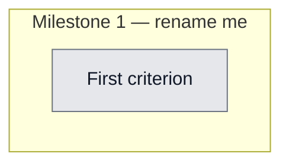

## Workflow
<!-- The shape of this task at a glance. One node per acceptance criterion, grouped under milestone subgraphs. Update node classes as work progresses: `:::done` (green), `:::active` (amber), `:::todo` (gray), `:::blocked` (red). Run `dreamcontext tasks doctor` to verify sync. -->

## Why
<!-- What problem does this solve? What breaks if we don't do it? Be concrete — name the user, the friction, the cost. -->

Reposition dreamcontext (a persistent brain that remembers, knows, and is learning to act) and remove install/update friction: one-command install, frictionless upgrade, and a non-blocking in-session nudge to run dreamcontext update when a newer CLI or new skill-packs are available. One validatable slice of a larger epic; the control panel (WS4) is deferred to a dedicated next run because it depends on this slice version-check library.

## User Stories
<!-- As a <role>, I can <action>, so that <outcome>. Tick when demonstrably true in the running system. -->

- [ ] As a [role], I can [action], so that [outcome]

## Acceptance Criteria
<!-- The contract. Each line is testable and gets a node in the Workflow flowchart above. -->

- [ ] First criterion (matches node A1 in Workflow)

[x] PRECONDITION: package.json version is 0.5.0 and src/cli/index.ts uses dreamcontextVersion() (from lib/manifest) instead of the hardcoded literal; built CLI prints 0.5.0 for --version. [vitest + manual]

[x] WS1: _dream_context/knowledge/positioning.md exists with three labelled variants (Short <=120 chars, Medium one-sentence, Long) plus an explicit rule that frames act as roadmap and forbids the word autonomous. [vitest]

[x] WS1: package.json description equals the Short variant (<=120 chars) and keywords includes brain. [vitest]

[x] WS1: 0.soul.md Project Identity contains the positioning sentence and Core Principles contains the roadmap-framing / no-autonomous bullet. [vitest]

[x] WS1: the literal string autonomous is ABSENT from positioning.md, the soul Project Identity block, and the package.json description. [vitest negative]

[ ] WS1: README hero shows the Long positioning variant. [manual]

[x] WS2: sh -n install.sh exits 0, and install.sh contains no sudo, no eval, and no nested remote pipe-to-sh. [vitest]

[x] WS2: package.json files[] includes install.sh and npm pack --dry-run lists install.sh and the skill/ directory. [vitest + manual]

[ ] WS2: install.sh bails non-zero with nodejs.org guidance when Node major < 18 or node/npm is missing, and never auto-installs Node. [manual]

[ ] WS2: install.sh idempotency — if _dream_context/ exists it runs dreamcontext update; on a clean dir when non-TTY/piped or DREAMCONTEXT_INSTALL_NO_SETUP=1 it prints the setup next-step and exits 0 without running setup and without hanging. [manual]

[ ] WS2: local tarball install works end-to-end — npm pack, then npm install -g the resulting tgz, then dreamcontext --version prints 0.5.0. [manual]

[x] WS3: compareVersions handles equal, behind, ahead, multi-digit (0.10.0 greater than 0.9.0), ignores pre-release suffixes, and handles the 0.0.0 sentinel. [vitest]

[x] WS3: isCacheFresh returns true within the 24h TTL, false past it, and treats malformed/missing cache fields as stale without throwing. [vitest]

[x] WS3: buildNudge is pure (no I/O) and returns exact strings — CLI-behind line when behind, packs line when new packs exist, both when both, and null when up-to-date or when latestCli is null. [vitest]

[x] WS3: generateSnapshot injects the Update Available block ONLY when the cache is fresh and behind (seeded fixture), stays silent when the cache is missing/stale/offline, and performs NO child_process spawn during generateSnapshot. [vitest integration]

[x] WS3: refreshVersionCache writes latestCli null on any runner failure (injected failing runner) and never throws to its caller. [vitest]

[x] WS3: dreamcontext upgrade --check prints current-vs-latest and exits 0 WITHOUT installing (injected installer spy asserts not-called). [vitest]

[x] WS3 layer-purity: src/lib/version-check.ts imports nothing from src/cli/commands/; refreshVersionCache receives catalog pack-names as an injected parameter, and the hook.ts caller (CLI layer) passes loadCatalog() names. [vitest/structural]

[ ] WS3: the UserPromptSubmit hook triggers refreshVersionCache lazily, gated by isCacheFresh (at most once per 24h), opt-out via DREAMCONTEXT_VERSION_CHECK=0, and never from generateSnapshot. [vitest + manual]

[ ] WS3: skill/SKILL.md command table includes an upgrade row and .gitignore ignores _dream_context/state/.version-check.json. [vitest/grep]

Validation method: npm run build and npm test (vitest) MUST pass with the new specs green, PLUS the manual checklist executed with evidence — local npm pack tarball install, and the seeded .version-check.json nudge cases (behind, up-to-date, offline, new-packs, stale).
## Constraints & Decisions
<!-- LIFO: newest at top. Capture the why, not just the what. -->

- **[2026-05-31]** DEFERRED (do not implement here): WS4 control panel/Tauri (next run, depends on this version-check lib); and a HIGH-priority server security fix — the dashboard server binds 0.0.0.0 with Access-Control-Allow-Origin:* and exposes mutating routes (CSRF/drive-by). Fix in the WS4 run: bind 127.0.0.1, drop wildcard CORS, add origin/token checks on mutating routes.
- **[2026-05-31]** knowledge create prompts interactively unless -d, -t AND -c are all passed — pass all three (or scaffold then Edit) to avoid a stdin hang. Work on a feature branch, not main.
- **[2026-05-31]** generateSnapshot (SessionStart hot path) must NEVER spawn a subprocess or make a network call — it only READS the cache. The single networked fn refreshVersionCache runs only from the UserPromptSubmit hook, gated at most once/24h, and never throws.
- **[2026-05-31]** src/lib/version-check.ts MUST stay pure — zero imports from src/cli/commands/ (the lib/cli boundary is clean across the codebase). Catalog pack-names are injected by the CLI-layer caller (hook.ts), resolving the plan-review layer-violation finding.
- **[2026-05-31]** No npm publish this run. ALL validation is offline: local npm pack tarball install + seeded .version-check.json fixtures. The curl install URL and the live in-session nudge activate only after the user publishes (publish checklist handed over separately).
- **[2026-05-31]** Scope locked: WS1+WS2+WS3 ONLY. Do NOT touch src/server/ or the dashboard. Do NOT add WS4 / control panel / Tauri this run.
## Technical Details
<!-- Where the work lives. Files, services, key functions to reuse. Body is current truth — update in place; don't append. -->

(Key files, services, dependencies, implementation approach.)

ORDER: land the version fix FIRST (WS3 depends on it). package.json version 0.2.0 -> 0.5.0. src/cli/index.ts: import dreamcontextVersion from ../lib/manifest.js and replace .version(0.1.0 literal) at ~line 85 with .version(dreamcontextVersion()).

WS1: CREATE _dream_context/knowledge/positioning.md via dreamcontext knowledge create -d -t -c (all three flags to avoid an interactive stdin hang) then Edit the body. EDIT 0.soul.md Project Identity (~:9) one sentence + Core Principles (~:21) one bullet. EDIT package.json description + add keyword brain. EDIT README hero (~:8). Out of scope: dashboard copy, landing page.

WS2: CREATE install.sh at repo root (POSIX sh, set -e, functions say/die/check_node/install_cli/verify/maybe_setup/main). install_cli = npm install -g dreamcontext@latest with a trust comment; no sudo/eval/nested-remote-sh. maybe_setup uses [ -t 0 ] for TTY and honors DREAMCONTEXT_INSTALL_NO_SETUP. EDIT package.json files[] add install.sh. EDIT README Quick Start: curl one-liner primary (raw.githubusercontent.com/meanllbrl/dreamcontext/main/install.sh) + npm fallback, noting it is live after publish+merge-to-main.

WS3 Part A: CREATE src/cli/commands/upgrade.ts registering upgrade [--check][-y]; default = execFileSync npm install -g dreamcontext@latest (stdio inherit) then print to run dreamcontext update; --check uses dreamcontextVersion() vs readVersionCache; inject installer + latest source for tests (mirror haikuRecall executor opts in recall-query-extractor.ts:61-77). Register in src/cli/index.ts near registerUpdateCommand (~:100) + HELP_GROUPS Setup. Add upgrade row to skill/SKILL.md command table (~:471, the canonical SKILL.md).

WS3 Part B: CREATE src/lib/version-check.ts: VersionCache{checkedAt,latestCli,availablePacks,ttlHours}; cache file _dream_context/state/.version-check.json; readVersionCache (sync tolerant), writeVersionCache, isCacheFresh (TTL 24h), compareVersions (semver-lite), buildNudge (PURE no I/O), refreshVersionCache(root, opts?{runner?, catalogPackNames?}) = ONLY networked fn (execFileSync npm view dreamcontext version timeout 5000, try/catch, latestCli null on fail, never throws; availablePacks supplied by caller NOT imported from cli).

WS3 wiring: EDIT hook.ts UserPromptSubmit handler (~:569+) to lazily refresh gated by isCacheFresh, passing loadCatalog() pack-names; opt-out DREAMCONTEXT_VERSION_CHECK=0. EDIT snapshot.ts (~:336) add getVersionNudge(root) that reads cache ONLY (no network/subprocess), installed packs via readSetupConfig(root).packs (already imported :13), wrapped in try/catch returning empty string. EDIT .gitignore to ignore the cache file. Injected copy: ## Update Available + a v{installed} -> v{latest} line + run dreamcontext upgrade then dreamcontext update.

TESTS: unit in tests/unit/ (version-check, positioning-doc, install-script); integration in tests/integration/ (extend snapshot.test.ts with seeded .version-check.json fixture + a guard that no child_process spawns during generateSnapshot; upgrade --check with injected installer spy). DI test template: tests/unit/recall-query-extractor.test.ts.
## Notes
<!-- Loose ends, edge cases, open questions. -->

(Working notes, edge cases, open questions.)

## Changelog
<!-- LIFO: newest at top. Auto-prepended by `dreamcontext tasks log`. -->

### 2026-05-31 - Status → in_review
- all in-scope criteria met; validation passed via build+vitest(new specs)+manual checklist; WS4 deferred to v06 task
### 2026-05-31 - Session Update
- VALIDATION PASS. Build exit 0; 5 new spec files green (63 tests); full suite 856 pass / 17 fail (all 17 PRE-EXISTING, identical at base 23c28a2, in out-of-scope sleep-state/sleep/snapshot/hook). Manual: sh -n OK; install.sh ships in tarball; node dist/index.js --version=0.5.0; nudge fixtures all correct (behind shows block 'v0.5.0 -> v9.9.9', up-to-date/offline/stale silent); snapshot 208ms (no blocking). Note: cache checkedAt is numeric epoch (not ISO).
### 2026-05-31 - Session Update
- Tests: 5 new spec files all GREEN. Full suite 856 passed / 17 failed; the 17 are PRE-EXISTING (identical at base commit 23c28a2, in sleep-state/sleep/snapshot/hook from an unrelated in-flight refactor) — our changes add zero new failures. Build clean.
### 2026-05-31 - Session Update
- tests: 5 new test files written (63 new tests, all green). Fixed real bug: getVersionNudge/getActiveProductKnowledge/hook.ts/upgrade.ts were passing _dream_context/ path to readVersionCache/readSetupConfig (which expect project root); fixed with dirname(root). Build: npm run build:cli passes. Full suite: Test Files 50 passed / 5 failed (all 5 were pre-existing), Tests 855 passed / 18 failed (same 18 pre-existing failures, zero new).
### 2026-05-31 - Session Update
- WS3 wiring: hook.ts lazy version refresh (gated by isCacheFresh, env opt-out, try/catch); snapshot.ts getVersionNudge helper + injection after active-tasks; .gitignore entry for .version-check.json; skill/SKILL.md upgrade command row
### 2026-05-31 - Session Update
- WS1+WS2 docs/script: package.json description set to 111-char Short variant; positioning.md created with 3 variants + roadmap rule (no 'autonomous'); 0.soul.md Project Identity + Core Principles updated; README hero replaced with Long variant + curl install primary; install.sh created (POSIX, set -e, sh -n passes, no sudo/eval/nested-pipe); publish-checklist.md created
### 2026-05-31 - Status → in_progress
- plan validated (iteration 2, layer-purity fix incorporated); implementing
### 2026-05-31 - Created
- Task created.
