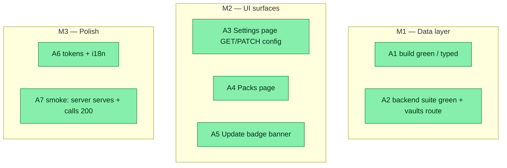

## Workflow
<!-- One node per acceptance criterion. -->

## Why

Slice 2 of [[v06-control-panel-vaults-tauri]]: the slice-1 backend routes (`/api/config`, `/api/packs`, `/api/version-check`) have no UI. This wires the existing React 19 + Vite dashboard to them — Settings (view/edit platforms + packs), Packs (browse catalog + installed state), an update badge (surfaces the version-check nudge), and a read-only Vaults list. Plan validated via goal-skill (opus planner + pragmatist/critic review).

## User Stories

- [x] As a dashboard user, I can view and edit my project's platforms + packs from a Settings page.
- [x] As a dashboard user, I can browse available skill packs and see which are installed.
- [x] As a dashboard user, I'm notified in-app when a dreamcontext update is available.
- [x] As a dashboard user, I can see which vaults are registered (read-only this slice).

## Acceptance Criteria

- [x] **A1** `npm run build` (root → `cd dashboard && tsc -b && vite build`, then tsup) completes with ZERO TypeScript errors. Primary gate: all new client calls, hooks, page props, and the `Page` union are fully typed (no `any`); the config mutation input type is restricted to `{ platforms?, packs? }`.
- [x] **A2** Backend vitest suite stays green (baseline 949) PLUS new `tests/unit/vaults-route.test.ts` (controls `HOME`→tmpdir for determinism; asserts `{vaults, current}` shape + never-throws). No existing test regresses.
- [x] **A3** A "Settings" nav item renders a page that loads `GET /api/config`, shows `platforms` (checkbox per `PLATFORM_OPTIONS`) and `packs` (toggle per catalog pack), and on Save issues `PATCH /api/config` with a body containing ONLY `{platforms, packs}`; shows loading/error/success states and a `config: null` empty state; includes a read-only Vaults subsection (current highlighted) from `GET /api/vaults`.
- [x] **A4** A "Packs" nav item lists `packs` + `standalone` from `GET /api/packs` (name, description, tags); packs present in `config.packs` show an "Installed" indicator.
- [x] **A5** A header **banner/badge** surfaces the `nudge` from `GET /api/version-check` when non-null (rendered via existing `MarkdownPreview`); renders NOTHING when `nudge` is null (header layout unchanged). Simple banner — NOT a focus-trapped popover (per pragmatist).
- [x] **A6** Zero hardcoded hex/rgb/raw-px-spacing in new CSS (all `var(--…)` tokens from `tokens.css`); zero inline user-facing strings in new TSX (all via `useI18n().t(...)` keys added to `I18nContext.tsx`).
- [x] **A7** Smoke: the built app served by `node dist/index.js dashboard` loads; Settings + Packs render; `/api/{config,packs,version-check,vaults}` calls resolve 200; PATCH body is exactly `{platforms,packs}`; no console errors / 404s.

**Validation method (Phase 6 contract, autonomous):** `npm run build` green (tsc is the primary correctness gate) + full backend vitest suite green + the A7 smoke check. No frontend test framework is added (none exists; out of scope).

## Constraints & Decisions
<!-- LIFO -->

- **[2026-06-01] CRITIC FIX 1:** `App.tsx` `PageRouter` switch has no `default` and `dashboard/tsconfig.json` lacks `noImplicitReturns` → a missing case renders blank with NO type error. Implementer MUST add `case 'settings'` AND `case 'packs'`, AND add `"noImplicitReturns": true` to `dashboard/tsconfig.json` (so future omissions are compile errors). Verify build still green after the tsconfig change.
- **[2026-06-01] CRITIC FIX 2:** must update `Shell.tsx` `VALID_PAGES` to include `'settings'|'packs'` (TS won't catch this — the `includes` cast erases types; a miss silently falls back to `'brain'` on reload).
- **[2026-06-01] CRITIC FIX 3:** `vaults-route.test.ts` must set `process.env.HOME` to a tmpdir (seed/empty registry) and restore it in `afterEach`, so it does NOT read the runner's real `~/.dreamcontext/vaults.json`. (Handler keeps the uniform 4-arg signature; `listVaults()` reads `homedir()` which honors `HOME` on darwin.)
- **[2026-06-01] CRITIC FIX 4 / security (scoped):** the nudge surface is SAFE (server-built; `latestCli` is regex-constrained `/^\d+\.\d+/`; no user input) → rendering it via `MarkdownPreview` is acceptable. BUT `MarkdownPreview` uses `dangerouslySetInnerHTML` over unsanitized `marked` (no DOMPurify) — a PRE-EXISTING XSS risk for user-authored content (core/knowledge pages). OUT OF SCOPE for slice 2; recorded as follow-up `v06-markdownpreview-sanitize` (add DOMPurify before MarkdownPreview renders any externally-sourced content).
- **[2026-06-01] Pragmatist nits folded:** UpdateBadge = simple banner (no popover/focus-trap); `useVersionCheck` carries a comment noting the cache-only contract (optional `refetchInterval`); audit the i18n key list to avoid unused keys.
- **[2026-06-01] Decisions:** hooks mirror TanStack Query (`useKnowledge.ts`), NOT a hand-rolled hook; badge lives in `Header.tsx` not `Sidebar.tsx`; `PlatformId`/`PLATFORM_OPTIONS` (2 entries) duplicated client-side (can't import `src/lib`) — acceptable; no new `api/client.ts` methods (generic `get`/`patch` suffice); duplicate the FULL `CatalogSubSkill` interface incl. `hasReferences?`; client types model `nudge: string | null` and handle `config: null` via `config ?? defaults`.
- **[2026-06-01] OUT OF SCOPE:** active vault switching / multi-server proxying / add-remove-vault UI (→ Tauri slice); editing `multiProduct`/`setupVersion` (PATCH allow-list forbids); frontend test framework; live `npm view` refresh from the browser (route is cache-only); persisted/dismissible badge state.

## Technical Details
<!-- File-by-file. -->

**Backend (small):**
- CREATE `src/server/routes/vaults.ts` — `handleVaultsGet(_req,res,_params,contextRoot)`, read-only, mirrors `packs.ts`: `import { listVaults } from '../../lib/vaults.js'`, `import { dirname } from 'node:path'`; `sendJson(res,200,{ vaults: listVaults(), current: dirname(contextRoot) })`. Never 500.
- EDIT `src/server/index.ts` — import `handleVaultsGet`; register `router.get('/api/vaults', handleVaultsGet)` after the version-check block.
- CREATE `tests/unit/vaults-route.test.ts` — set `process.env.HOME`→tmpdir (restore in `afterEach`); assert GET returns 200 `{vaults:[...], current:<dirname(contextRoot)>}` and never throws when registry absent. Mirror `tests/unit/config-route.test.ts` helpers.

**Dashboard hooks (TanStack Query, mirror `dashboard/src/hooks/useKnowledge.ts`):**
- CREATE `useConfig.ts` — `SetupConfig` type (mirror `src/lib/setup-config.ts`), `useConfig()`=`useQuery(['config'], ()=>api.get<{config:SetupConfig|null}>('/config'), {select:d=>d.config})`; `useUpdateConfig()`=`useMutation((patch:{platforms?:PlatformId[];packs?:string[]})=>api.patch<{config:SetupConfig}>('/config',patch))` + `invalidateQueries(['config'])`. `PlatformId='claude'|'codex'`.
- CREATE `usePacks.ts` — `CatalogPack` (FULL incl. `subSkills:{name,file,description,hasReferences?}[]`) + `CatalogStandalone` (mirror `src/lib/catalog.ts`); `usePacks()`=`useQuery(['packs'], ()=>api.get<{packs:CatalogPack[];standalone:CatalogStandalone[]}>('/packs'))`.
- CREATE `useVersionCheck.ts` — `VersionCheck={cache:VersionCache|null;fresh:boolean;nudge:string|null}` (mirror route); `useQuery(['version-check'], ()=>api.get<VersionCheck>('/version-check'))`. Comment: cache-only contract.
- CREATE `useVaults.ts` — `Vault={name;path}`; `useQuery(['vaults'], ()=>api.get<{vaults:Vault[];current:string|null}>('/vaults'))`.

**Dashboard pages/components:**
- CREATE `pages/SettingsPage.tsx`+`.css` — mirror `CorePage.tsx` edit/save + `SleepPage.tsx` guards. Local `PLATFORM_OPTIONS:{id:PlatformId;labelKey:string}[]`. Draft state seeded from `config` (handle `config:null`→defaults). Platforms checkboxes + packs checklist (labels from `usePacks`). Save → `updateConfig.mutate({platforms,packs})`, disabled when `!dirty||isPending`; loading/error/success/empty states. Read-only Vaults subsection (highlight `current`). Reuse global classes `.page-title`/`.error-state`/`.btn`/`.btn--primary`/`.loading`; scoped `.settings-*` tokens-only.
- CREATE `pages/PacksPage.tsx`+`.css` — mirror `KnowledgePage.tsx` cards + `tagHue`. `installed=new Set(config?.packs??[])`. Two sections (Packs / Standalone); each card name/description/tags + "Installed" pill. Loading/error/empty guards. Tokens-only scoped `.packs-*`.
- CREATE `components/layout/UpdateBadge.tsx`+`.css` — `const nudge=useVersionCheck().data?.nudge??null; if(!nudge) return null;` render a banner/badge; click reveals `<MarkdownPreview content={nudge} />` (pass only `content`). Escape-to-close + `aria-expanded` if it reveals; reduced-motion guard on any animation. Tokens-only.
- EDIT `components/layout/Header.tsx` — `import { UpdateBadge }`; mount in `.header-right` leading position.

**Dashboard nav/routing/i18n:**
- EDIT `components/layout/Sidebar.tsx` — extend `Page` union with `'settings'|'packs'`; add 2 `NAV_ITEMS` (`packs` ◳, `settings` ⚙) after `sleep`.
- EDIT `components/layout/Shell.tsx` — add `'settings','packs'` to `VALID_PAGES` (CRITIC FIX 2).
- EDIT `App.tsx` — import `SettingsPage`/`PacksPage`; add `case 'settings'` + `case 'packs'` to `PageRouter` switch (CRITIC FIX 1).
- EDIT `dashboard/tsconfig.json` — add `"noImplicitReturns": true` (CRITIC FIX 1).
- EDIT `context/I18nContext.tsx` — add `en` keys: `nav.settings`,`nav.packs`,`settings.title`,`settings.platforms`,`settings.packs`,`settings.save`,`settings.saving`,`settings.saved`,`settings.no_config`,`settings.platform.claude`,`settings.platform.codex`,`settings.vaults.title`,`settings.vaults.empty`,`settings.vaults.note`,`settings.vaults.current`,`settings.packs.installed`,`packs.title`,`packs.section.packs`,`packs.section.standalone`,`update.available`,`update.title`,`update.dismiss`. (Audit for unused before finishing.)

## Notes

- `t()` falls back to the raw key (`I18nContext.tsx`), so missing keys show dotted strings, not crashes — but `tsc` won't catch them; verify in smoke.
- Vite concatenates imported CSS globally (no CSS modules) — use page-prefixed class names to avoid collisions.
- Pattern refs: `useKnowledge.ts`, `CorePage.tsx`, `KnowledgePage.tsx`, `FeaturesPage.tsx`, `tokens.css`, `src/server/routes/packs.ts`, `tests/unit/config-route.test.ts`.

## Changelog

### 2026-05-31 - Status → in_review
- all 7 criteria met; build green + 952/953 (1 pre-existing marketing-council flake) + smoke 200 (goal-skill Phase 6 PASS)
### 2026-05-31 - Session Update
- A1-A7 implemented: backend vaults route + test, 4 TanStack Query hooks (useConfig/usePacks/useVersionCheck/useVaults), SettingsPage + PacksPage + UpdateBadge, tsconfig noImplicitReturns, i18n keys, Sidebar/Shell/App/Header wiring. npm run build green (0 TS errors), 953/953 tests pass, smoke: /api/vaults|packs|config|version-check all 200 JSON.
### 2026-05-31 - Status → in_progress
- plan validated (goal-skill); implementing
### 2026-06-01 - Plan validated (goal-skill)
- opus planner → pragmatist (SOLID) + critic (NEEDS_WORK, 4 surgical findings folded). Status → in_progress for implementation.

### 2026-06-01 - Created
- Task created.
