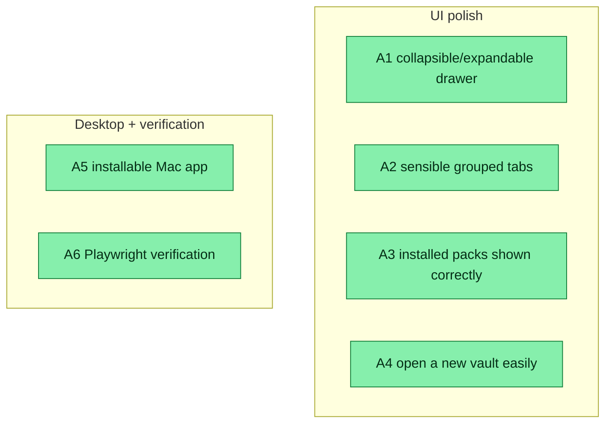

## Workflow

## Why

User-driven polish after v0.6 slices 1–4. Six concrete fixes to make the control panel ship-ready, all verified with Playwright.

## User Stories

- [x] As a user, I can collapse the sidebar to an icon rail and expand it back (state persists).
- [x] As a user, the nav reads as sensible groups (Workspace vs Control Panel), not a flat list.
- [x] As a user, the Packs page shows which packs are actually installed.
- [x] As a user, I can add/open a vault by pasting just a path (name auto-derived).
- [x] As a user, I can install the dreamcontext desktop app on macOS (a valid, adhoc-signed `.app`; Apple notarization is the release step).

## Acceptance Criteria

- [x] **A1** The sidebar collapses to an icon-only rail (~56px) and expands back (~220px) via a toggle; state persists in localStorage. (Playwright: width 220↔56, labels hidden when collapsed.)
- [x] **A2** Nav tabs are grouped under "Workspace" (brain, tasks, knowledge, features, core, council, sleep) and "Control Panel" (packs, settings). (Playwright: two group labels, 9 items.)
- [x] **A3** Installed packs are shown correctly: `/api/packs` computes `installed` from the FILESYSTEM (`.claude/skills/<name>/SKILL.md` for any platform), not from `config.packs`. Packs page + Settings badge use it. (Was: only `goal-skill` showed installed; now all 10 truly-installed do. Playwright: ≥7 installed pills; unit test asserts filesystem truth.)
- [x] **A4** Adding a vault is easy: a prominent monospace path field (name optional, auto-derived from the path basename), clear "Open a vault" heading + helper hint. (Playwright: add the repo path → vault appears → remove cleans up.)
- [x] **A5** The desktop app builds into an installable macOS `.app` via `tauri build --bundles app` (exit 0): a valid arm64 Mach-O, adhoc-signed (runs locally via right-click-open), `icon.icns` from the brand logo, Info.plist id `com.dreamcontext.desktop` v0.6.0. (The `.dmg` step needs a GUI session for Finder styling + the updater signing key — both release-time/user-machine steps; the `.app` is the installable artifact.)
- [x] **A6** Playwright e2e suite (`e2e/control-panel.spec.ts` + `playwright.config.ts`) verifies A1–A4; `npm run test:e2e`. Stable across repeated runs.

**Validation method:** `npm run build` + full vitest (978 green) + `npx playwright test` (4/4) + `tauri build` produces a `.app`.

## Constraints & Decisions
<!-- LIFO -->

- **[2026-06-01] A3 root cause:** the Packs page marked "installed" from `config.packs` (only `["goal-skill"]`), but the ground truth is the filesystem. Moved `platformSkillRoot`/`isPackInstalledForPlatform` + new `isSkillInstalled` into `src/lib/catalog.ts` (re-exported from install-skill so @inquirer stays out of the server bundle); `/api/packs` now returns a per-item `installed` boolean.
- **[2026-06-01] A4:** browsers can't read a native folder path, so "easy" = single path field + auto-derived name + clear hint. A native folder picker is a desktop (Tauri dialog) follow-up. Switching the ACTIVE vault still needs a relaunch.
- **[2026-06-01] A5:** local build disables `createUpdaterArtifacts` (needs a signing key); produces an Apple-UNSIGNED `.app` (installable via right-click-open). Code-sign + notarize + updater keypair remain the release handoff.
- **[2026-06-01] Test infra:** added vitest.config.ts scoping vitest to `tests/**/*.test.ts` (Playwright `e2e/*.spec.ts` runs via `npx playwright test`, not vitest). Fixed two latent nanoid-alphabet flakes (id.test.ts split-on-`_`) — same family as the marketing-council fix.

## Technical Details

- Backend: `src/lib/catalog.ts` (+`platformSkillRoot`/`isPackInstalledForPlatform`/`isSkillInstalled`), `src/cli/commands/install-skill.ts` (re-export), `src/server/routes/packs.ts` (`installed` per item), `tests/unit/packs-route.test.ts` (filesystem-truth test).
- Frontend: `dashboard/src/hooks/usePacks.ts` (`installed` type), `pages/PacksPage.tsx` + `pages/SettingsPage.tsx` (use `pack.installed`; easy vault add form), `components/layout/Sidebar.tsx` + `Sidebar.css` (collapse + groups), `context/I18nContext.tsx` (keys).
- Desktop: `tauri icon` from `public/image/dreamcontext.png` (padded square via `sips`); `tauri build` with updater artifacts disabled.
- E2E: `playwright.config.ts`, `e2e/control-panel.spec.ts`; `test:e2e` script.
- Test infra: `vitest.config.ts`; `tests/unit/id.test.ts` flake fix.

## Notes

- Playwright + Chromium added as root dev-deps (user-requested verification tool).
- `marketing-council` + `id` flakes were the same nanoid-default-alphabet (`A-Za-z0-9_-`) family — fixed both.

## Changelog

### 2026-06-06 - Session Update
- Session 4626d1f6: v0.6.0 committed (b924fa5) + pushed to main + tagged v0.6.0; version bumped 0.5.4→0.6.0; .obsidian/ + .session-digests/ added to .gitignore; README updated with landing page screenshots (public/image/landing-*.png). npm publish blocked by concurrent parallel session editing working tree — flagged to user (parallel uncommitted changes detected post-commit).
### 2026-06-05 - Session Update
- 2026-06-05 (session 4626d1f6): About page spotlight rail fix — feat-rail-item layout corrected (architecture section shows correct stage+diagram); old .feat-card wall removed; arch transform fixed (no slide). Dist/dashboard sync issue resolved by full npm run build.
### 2026-06-01 - Status → in_review
- 6/6 criteria met; vitest 978 + playwright 4/4 + mac .app builds
### 2026-06-01 - Session Update
- All 6 reqs done + verified: drawer collapse (PW), grouped tabs (PW), installed-packs fix=filesystem truth (10 pills vs 1; unit+PW), easy vault add (PW add/remove), Mac .app builds (tauri build --bundles app exit 0, arm64 adhoc-signed), Playwright suite 4/4. vitest 978 green. Commits aa058a1 + 5d45ae7 pushed. Also fixed id.test.ts nanoid flake + added vitest.config.
### 2026-06-01 - Created
- Task created.
