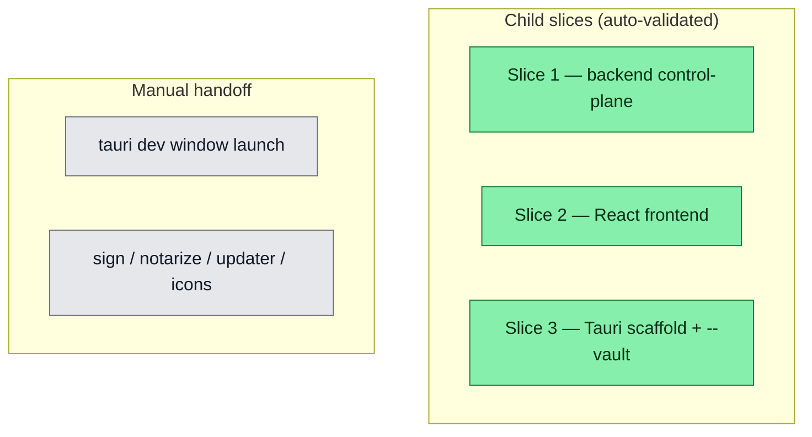

## Workflow
<!-- Epic tracker: one node per child slice / manual milestone. `:::done` = slice in_review (goal-skill Phase 6 PASS). `:::todo` = manual handoff not yet started. -->

## Why
<!-- What problem does this solve? What breaks if we don't do it? Be concrete — name the user, the friction, the cost. -->

Replace dreamcontext dashboard with an installable always-on control panel: multi-vault (open multiple projects), per-project settings, per-project update detection (reuses the v0.5 version-check lib), and skill/skill-pack management. Build the browser control-plane (backend APIs + wire the existing React dashboard) first, then wrap in a Tauri native shell with auto-update. Deferred from the v0.5 run as a dedicated next epic.

## User Stories

- [x] As a dashboard user, I can register multiple project vaults and switch between them.
- [x] As a dashboard user, I can view/edit project config (platforms, packs) from a Settings page.
- [x] As a dashboard user, I can browse available skill packs and see installed state.
- [x] As a dashboard user, I'm notified in-app when a dreamcontext update is available.
- [x] As a CLI user, I can run `dreamcontext dashboard --vault <name|path>` to open any vault.
- [ ] As a user, I can open dreamcontext as a native desktop window (Tauri launch — manual).
- [ ] As a user, the desktop app auto-updates via the GitHub Releases endpoint (manual).

## Acceptance Criteria
<!-- Epic-level milestones; detail lives in each child task. -->

**Child slices — all in_review (goal-skill Phase 6 PASS):**
- [x] **Slice 1** `v06-control-plane-backend`: vault registry+CLI + 3 control-plane routes + safeChildPath hardening (11/11 ACs, 949 tests)
- [x] **Slice 2** `v06-control-panel-frontend`: Settings/Packs pages + update badge + read-only Vaults wired to the routes (7/7 ACs, 953 tests)
- [x] **Slice 3** `v06-tauri-shell`: `dashboard --vault` (name|path) + Tauri 2.x desktop scaffold, cargo check compiles (A1-A6/6 auto ACs, 962 tests)

**Manual handoff (cannot be auto-verified; user's machine + secrets required):**
- [ ] `tauri dev` launches a native window that loads the spawned dashboard (A7 of v06-tauri-shell)
- [ ] Sign/notarize + updater keypair/endpoint + branded icons + `npm run tauri build` produces `.app`/`.dmg` (A8 of v06-tauri-shell)

## Constraints & Decisions
<!-- LIFO: newest at top. Capture the why, not just the what. -->

- **[2026-05-31]** DEFER: bundling a standalone agent runtime for non-technical users (multi-month, separate epic); in-panel SKILL.md editing (view/install/update only in v1); Windows/Linux packaging beyond one dev target.
- **[2026-05-31] SECURITY DONE (v0.5.0):** Central server hardening was pulled forward and shipped in v0.5.0 before public release: loopback bind (127.0.0.1), wildcard CORS removed + localhost Origin allowlist, Origin/Host check on mutating routes, safe-path traversal guard on /api/core/:filename. Tracked in task server-security-hardening (in_review). REMAINING for v0.6 (defense-in-depth, not blocking v0.5.0): apply safeChildPath to slug/param path-joins in tasks.ts, knowledge.ts, features.ts, council.ts; add auth/origin-token when the control plane gains write actions; PATCH /api/config must strict-pick {platforms,packs}.
## Technical Details
<!-- Epic-level overview; canonical detail lives in each child task's Technical Details. -->

**BUILT (slices 1-3):**
- `src/lib/vaults.ts` — vault registry (`~/.dreamcontext/vaults.json`), `addVault`/`listVaults`/`removeVault`, `resolveVaultContextRoot`
- `src/cli/commands/vaults.ts` — `vaults add|list|remove` CLI
- `src/server/routes/config.ts` — `GET`/`PATCH /api/config` (strict-pick `platforms|packs`)
- `src/server/routes/packs.ts` — `GET /api/packs` (from `src/lib/catalog.ts`, no inquirer)
- `src/server/routes/version-check.ts` — `GET /api/version-check` (cache-only, no network in request path)
- `src/server/routes/vaults.ts` — `GET /api/vaults` (read-only; returns `{vaults, current}`)
- `src/lib/catalog.ts` — extracted catalog types + `loadCatalog` + `findPackageDir` (decoupled from inquirer)
- `src/server/safe-path.ts` — `safeChildPath` applied to 7 slug→path joins (tasks 4×, knowledge 2×, features 1×)
- `dashboard/src/hooks/` — `useConfig`, `usePacks`, `useVersionCheck`, `useVaults` (TanStack Query)
- `dashboard/src/pages/` — `SettingsPage.tsx`, `PacksPage.tsx`
- `dashboard/src/components/layout/UpdateBadge.tsx` — banner surfacing version-check nudge
- `src/cli/commands/dashboard.ts` — `--vault <name|path>` option wired via `resolveVaultContextRoot`
- `desktop/` — Tauri 2.x scaffold (Cargo.toml, lib.rs, tauri.conf.json, capabilities, placeholder icons, .gitignore for target/+signing)

**REMAINING (manual handoff):**
- Run `cd desktop && npm install && npm run tauri dev` on the user's machine to validate window launch
- `tauri signer generate` keypair; fill GitHub Releases updater endpoint; `tauri icon` for branded icons; `npm run tauri build` + Apple notarization
## Notes

- Follow-up tasks spawned this session: `v06-markdownpreview-sanitize` (add DOMPurify to MarkdownPreview; pre-existing XSS on user-authored content), `deflake-marketing-council` (non-deterministic integration test).
- `vaults.json` is last-write-wins (no file lock) — acceptable for single-user local CLI; symlink resolution out of scope for this version.
- `desktop/` requires Rust 1.96+ (tauri 2.x constraint); `cargo check` was validated in the session.
- Multi-server approach (one server per vault) is the current architecture; a multiplexed proxy is deferred.

## Changelog
<!-- LIFO: newest at top. Auto-prepended by `dreamcontext tasks log`. -->

### 2026-06-01 - Session Update
- Standalone Tauri shell PARKED → branch parked/desktop-app. Dashboard slices (control-plane-backend, control-panel-frontend, vault-management, control-panel-polish) shipped to main. Standalone tasks (v06-tauri-shell, v06-tauri-launch-fix) + tauri-desktop-hosting knowledge removed from main (preserved on parked/desktop-app). Shipping via npm + dreamcontext dashboard.
### 2026-05-31 - Session Update
- 3 goal-skill slices built and in_review: v06-control-plane-backend (11/11 ACs, 949 tests), v06-control-panel-frontend (7/7 ACs, 953 tests), v06-tauri-shell (A1-A6 done, 962 tests, cargo check compiles). Remaining: manual handoff A7 (tauri dev launch), A8 (sign/notarize/updater/icons). Browser control panel is functionally complete.
### 2026-05-31 - Status → in_progress
- 3 child slices in_review; remaining = manual Tauri launch/sign/notarize (A7/A8 of tauri-shell)
### 2026-05-31 - Session Update
- v0.6 control panel built across 3 goal-skill slices (all in_review): (1) v06-control-plane-backend — vaults registry+CLI, /api/config|packs|version-check routes, path hardening (949 tests); (2) v06-control-panel-frontend — Settings/Packs pages, update badge, read-only Vaults, wired to the routes (953 tests); (3) v06-tauri-shell — dashboard --vault (name|path) + Tauri 2.x desktop scaffold that spawns the Node dashboard + loads it via WebviewUrl::External, cargo check compiles (962 tests). Functional browser control panel is DONE. Remaining = MANUAL handoff: tauri dev launch, code-sign/notarize, updater keypair+endpoint, branded icons. Follow-ups: v06-markdownpreview-sanitize, deflake-marketing-council.
### 2026-05-31 - Session Update
- Central server security hardening pulled forward to v0.5.0 — loopback bind, CORS lockdown, Origin/Host guard, safe-path on /api/core. Tracked in server-security-hardening task (in_review). Remaining defense-in-depth (slug path joins, auth token) stays in v0.6 scope.
### 2026-05-31 - Session Update
- v0.5.1 landed the CENTRAL server security fix (loopback bind + CSRF Origin guard + non-wildcard CORS + safeChildPath on /api/core + picomatch audit fix; reviewed PASS). REMAINING for this task (defense-in-depth, currently gated by CSRF+loopback+URL-normalization): apply safeChildPath to slug/param path-joins in tasks.ts, knowledge.ts, features.ts, council.ts; add auth/origin-token when the control plane gains write actions.
### 2026-05-31 - Created
- Task created.
