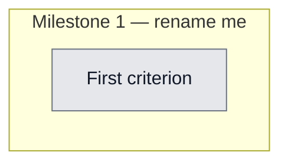

## Workflow
<!-- The shape of this task at a glance. One node per acceptance criterion, grouped under milestone subgraphs. Update node classes as work progresses: `:::done` (green), `:::active` (amber), `:::todo` (gray), `:::blocked` (red). Run `dreamcontext tasks doctor` to verify sync. -->

## Why
<!-- What problem does this solve? What breaks if we don't do it? Be concrete — name the user, the friction, the cost. -->

Replace dreamcontext dashboard with an installable always-on control panel: multi-vault (open multiple projects), per-project settings, per-project update detection (reuses the v0.5 version-check lib), and skill/skill-pack management. Build the browser control-plane (backend APIs + wire the existing React dashboard) first, then wrap in a Tauri native shell with auto-update. Deferred from the v0.5 run as a dedicated next epic.

## User Stories
<!-- As a <role>, I can <action>, so that <outcome>. Tick when demonstrably true in the running system. -->

- [ ] As a [role], I can [action], so that [outcome]

## Acceptance Criteria
<!-- The contract. Each line is testable and gets a node in the Workflow flowchart above. -->

- [ ] First criterion (matches node A1 in Workflow)

## Constraints & Decisions
<!-- LIFO: newest at top. Capture the why, not just the what. -->

- **[2026-05-31]** DEFER: bundling a standalone agent runtime for non-technical users (multi-month, separate epic); in-panel SKILL.md editing (view/install/update only in v1); Windows/Linux packaging beyond one dev target.
- **[2026-05-31] SECURITY DONE (v0.5.0):** Central server hardening was pulled forward and shipped in v0.5.0 before public release: loopback bind (127.0.0.1), wildcard CORS removed + localhost Origin allowlist, Origin/Host check on mutating routes, safe-path traversal guard on /api/core/:filename. Tracked in task server-security-hardening (in_review). REMAINING for v0.6 (defense-in-depth, not blocking v0.5.0): apply safeChildPath to slug/param path-joins in tasks.ts, knowledge.ts, features.ts, council.ts; add auth/origin-token when the control plane gains write actions; PATCH /api/config must strict-pick {platforms,packs}.
## Technical Details
<!-- Where the work lives. Files, services, key functions to reuse. Body is current truth — update in place; don't append. -->

(Key files, services, dependencies, implementation approach.)

v1a (browser control-plane, vitest-validatable): CREATE src/lib/vaults.ts (~/.dreamcontext/vaults.json, validate each path has _dream_context/), src/cli/commands/vaults.ts (add/list/remove), src/server/routes/{config,packs,version}.ts (GET/PATCH /api/config, GET /api/packs, GET /api/version-check reusing version-check.ts), register in src/server/index.ts buildRouter; wire the existing React dashboard with a vault switcher, Settings page, update badge, packs page. Multi-vault Option A = launch one server per vault.

v1b (Tauri shell, manual-validation): CREATE desktop/ Tauri project that spawns dreamcontext dashboard as a sidecar and loads it; tauri-plugin-updater against GitHub Releases; EDIT dashboard.ts to accept --vault. Code-signing/notarization is its own CI+secrets sub-project.
## Notes
<!-- Loose ends, edge cases, open questions. -->

(Working notes, edge cases, open questions.)

## Changelog
<!-- LIFO: newest at top. Auto-prepended by `dreamcontext tasks log`. -->

### 2026-05-31 - Session Update
- Central server security hardening pulled forward to v0.5.0 — loopback bind, CORS lockdown, Origin/Host guard, safe-path on /api/core. Tracked in server-security-hardening task (in_review). Remaining defense-in-depth (slug path joins, auth token) stays in v0.6 scope.
### 2026-05-31 - Session Update
- v0.5.1 landed the CENTRAL server security fix (loopback bind + CSRF Origin guard + non-wildcard CORS + safeChildPath on /api/core + picomatch audit fix; reviewed PASS). REMAINING for this task (defense-in-depth, currently gated by CSRF+loopback+URL-normalization): apply safeChildPath to slug/param path-joins in tasks.ts, knowledge.ts, features.ts, council.ts; add auth/origin-token when the control plane gains write actions.
### 2026-05-31 - Created
- Task created.
