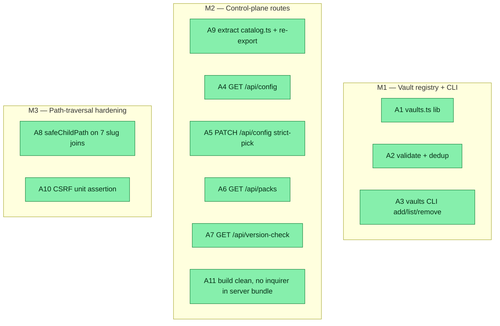

## Workflow
<!-- One node per acceptance criterion, grouped under milestone subgraphs. Update node classes as work progresses. Run `dreamcontext tasks doctor` to verify sync. -->

## Why
<!-- What problem does this solve? -->

First buildable slice of the v0.6 control-panel epic ([[v06-control-panel-vaults-tauri]]): the **backend control-plane**. Adds a multi-vault registry + CLI, three read/config API routes (`/api/config`, `/api/packs`, `/api/version-check`), and completes the v0.6 defense-in-depth path-traversal hardening on the remaining slug routes. Backend-only and fully vitest-validatable; React/Tauri wiring and `dashboard --vault` are deferred to later slices. Plan validated via goal-skill: opus planner + 3 parallel plan-reviewers (pragmatist/critic/security) across 2 iterations.

## User Stories

- [ ] As a control-panel user, I can register multiple project vaults so the panel can later switch between them.
- [ ] As a dashboard client, I can GET/PATCH the current project's config (platforms, packs) over the API.
- [ ] As a dashboard client, I can list available skill packs and read the cached update-check status.
- [ ] As a security-conscious user, I can trust that no dashboard route lets a crafted slug read/write files outside `_dream_context/`.

## Acceptance Criteria
<!-- The contract. Each line testable; maps to a Workflow node. -->

- [x] **A1** `src/lib/vaults.ts` reads/writes a JSON registry at `~/.dreamcontext/vaults.json`, accepts an injectable `home` param (default `os.homedir()`), and exposes `listVaults`/`addVault`/`removeVault` returning typed `Vault[]`. Missing file → empty registry; malformed JSON → empty (logged), never throws.
- [x] **A2** `addVault` rejects a non-existent path or a path lacking a `_dream_context/` child (throws typed `VaultError`); rejects duplicate name and duplicate resolved path.
- [x] **A3** `vaults add <name> <path>` / `vaults list` / `vaults remove <name>` CLI subcommands registered; human-readable output; `list` prints `(none)` when empty; `VaultError` rendered as a clean message (no stack).
- [x] **A4** `GET /api/config` returns `{ config: SetupConfig | null }` for the current project (via `dirname(contextRoot)`), 200 always.
- [x] **A5** `PATCH /api/config` accepts ONLY `platforms` and `packs` via an explicit allow-list (body is never spread). `platforms` validated per-id via `parsePlatformList`/`PLATFORM_CATALOG` (invalid → 400 `invalid_platforms`). `packs` validated per-element: `Array.isArray(body.packs) && body.packs.every(el => typeof el === 'string' && el.length > 0)` (else 400 `invalid_packs`). Non-JSON body → 400 `invalid_body`. Valid → `updateSetupConfig`, returns `{ config }` 200. No prototype pollution.
- [x] **A6** `GET /api/packs` returns `{ packs, standalone }` sourced from `src/lib/catalog.ts` (NOT `install-skill.ts`); catalog unreadable → `{ packs: [], standalone: [] }` 200.
- [x] **A7** `GET /api/version-check` returns the nudge payload via `buildNudge(installedCli, cache|null, installedPacks[], catalogPackNames[])` (that arg order), reading the cache from `dirname(contextRoot)`; read failure → benign payload, never 500; NO network/subprocess in the request path.
- [x] **A8** All seven request-derived slug→path joins route through `safeChildPath(<dir>, ` + "`${slug}.md`" + `)` (full filename): `tasks.ts` (4 handlers), `knowledge.ts` (2), `features.ts` (1). Traversal slug → 400 `invalid_path`; `slug='.'` → `..md` (nonexistent) → existing 404 branch (never a 500 directory read). `handleTasksCreate` (slugify) confirmed safe, NOT modified. `council.ts` already compliant, NOT modified.
- [x] **A9** `src/cli/commands/install-skill.ts` re-exports `loadCatalog` + catalog types + `findPackageDir` from `../../lib/catalog.js`; every existing importer keeps compiling and behaving identically.
- [x] **A10** CSRF coverage for `PATCH /api/config` asserted at the unit level: `isCrossSiteWrite(req('PATCH','https://evil.com')) === true`, documenting the guard runs at `src/server/index.ts:103` before routing. No live-server integration test.
- [x] **A11** `npm run build` (tsup) succeeds; the server bundle does NOT pull `@inquirer/prompts` via the packs route; `vitest run` passes including all new tests (baseline 881 stays green).
**Validation method (Phase 6 contract):** vitest unit/integration tests for the new units/routes + `npm run build` + full suite green.

## Constraints & Decisions
<!-- LIFO: newest at top. -->

- **[2026-06-01] CRITIC FIX 2 (plan correction):** the version-check route imports `buildNudge`/`readVersionCache`/`isCacheFresh` from **`src/lib/version-check.ts`** (the real file), NOT `src/cli/commands/version-check.ts` (does not exist).
- **[2026-06-01] CRITIC FIX 1 (plan correction):** `src/lib/catalog.ts` must explicitly declare `import { fileURLToPath } from 'node:url'` and `const __dirname = fileURLToPath(new URL('.', import.meta.url));` (the original `__dirname` lives at `install-skill.ts:364`, outside the moved function range — do not rely on a "verbatim" copy of `findPackageDir` alone).
- **[2026-06-01] B1 (required):** extract `loadCatalog` + catalog types + `findPackageDir` to `src/lib/catalog.ts`; `install-skill.ts` re-exports them. Rationale: `install-skill.ts:7` is a top-level `import { checkbox, confirm } from '@inquirer/prompts'`; a server route importing `loadCatalog` from it would pull interactive-prompt deps into the server bundle (breaks/bloats tsup). Server routes import only from `src/lib/catalog.ts`.
- **[2026-06-01] B2:** config route does NOT call `recordDashboardChange` — the entity union (`change-tracker.ts:18`) has no `'config'` member; adding it would be a TS compile error. Union NOT widened in this slice.
- **[2026-06-01] B4/security:** pass the FULL `${slug}.md` to `safeChildPath` (mirrors `core.ts:62-66`) so `slug='.'` resolves to a nonexistent dotfile (404) rather than the base directory (500 DoS).
- **[2026-06-01] Decision:** `GET /api/version-check` is cache-only (no network in the request path); the networked `refreshVersionCache` stays out-of-band (hook/CLI). Avoids up-to-5s request latency and a new failure mode.
- **[2026-06-01] Decision:** packs "installed" status — out of scope for this slice's response shape beyond catalog listing; do not export `isPackInstalledForPlatform` from the 1141-line install-skill.ts.
- **[2026-06-01] OUT OF SCOPE:** React/Tauri/dashboard UI; `dashboard --vault`; POST/DELETE config; network refresh in version route; file locking / atomic rename for vaults.json; symlink resolution in safeChildPath; widening the change-tracker union; hardening `handleTasksCreate` (slugify already safe); council.ts (already compliant).

## Technical Details
<!-- Where the work lives. File-by-file. Current truth — update in place. -->

**CREATE `src/lib/vaults.ts`** — pure fs+JSON registry (mirror the never-throw read discipline of `src/lib/version-check.ts`). Exports: `interface Vault { name; path }` (resolved absolute), `interface VaultRegistry { vaults: Vault[] }`, `class VaultError extends Error`, `vaultsFilePath(home = os.homedir())` = `join(home,'.dreamcontext','vaults.json')`, `listVaults(home?)` (missing→`[]`; JSON.parse throw→log+`[]`), `addVault(name, dirPath, home?)` (resolve abs; throw `VaultError` if missing or no `_dream_context/` child via `existsSync(join(resolved,'_dream_context'))`; throw on dup name or dup resolved path; `mkdirSync(dirname,{recursive:true})`; write pretty JSON + trailing newline), `removeVault(name, home?)`→`boolean`. Injectable `home` for testability (DI pattern like `runner` in `version-check.ts:177`). Imports `node:os|fs|path`.

**CREATE `src/lib/catalog.ts`** (B1 + CRITIC FIX 1) — move from `install-skill.ts`: catalog types (`CatalogSubSkill|CatalogPack|CatalogStandalone|CatalogAgent|Catalog`, ~`install-skill.ts:193-233`), `findPackageDir` (~379-390), `loadCatalog` (~394-407). **Must include** at top: `import { fileURLToPath } from 'node:url';` and `const __dirname = fileURLToPath(new URL('.', import.meta.url));` (the declaration currently at `install-skill.ts:364`). Imports only `node:fs|path|url`; no inquirer/chalk/prompts. `loadCatalog` returns `{ catalog, packsDir } | null` (pure `existsSync`/`readFileSync`/`JSON.parse` of `skill-packs/catalog.json`). NOTE: after the move, `findPackageDir` runs from `dist/lib/` — its 3-depth candidate probe still reaches `skill-packs/` (hits the 2-hop candidate); run the built CLI once (`dreamcontext install-skill --list`) to confirm.

**EDIT `src/cli/commands/install-skill.ts`** (B1, A9) — delete the moved decls/bodies; add `export { loadCatalog, findPackageDir, type Catalog, type CatalogPack, type CatalogStandalone, type CatalogSubSkill, type CatalogAgent } from '../../lib/catalog.js';`. Re-import `findPackageDir` for `installCoreForPlatform` (~`:988`). Keep the `@inquirer/prompts` import (line 7) — it's just no longer reachable from the server bundle. Verify all in-file callers (`interactivePackInstall`, `directPackInstall`, `installSingleSkill`, `listAvailablePacks`, hint block) still resolve via the re-export.

**CREATE `src/server/routes/config.ts`** (A4, A5, B2, B5) — `handleConfigGet(req,res,params,contextRoot)`: `const config = readSetupConfig(dirname(contextRoot)); sendJson(res,200,{config})`. `handleConfigPatch`: `parseJsonBody`→400 `invalid_body`; build a FRESH `patch` object from allow-list `['platforms','packs']` (never spread body); if `body.platforms!==undefined` validate via `parsePlatformList`+`PLATFORM_CATALOG` (`src/lib/platforms.ts`), `invalid.length>0`→400 `invalid_platforms`, else `patch.platforms`; if `body.packs!==undefined` require `Array.isArray && every(el=>typeof el==='string'&&el.length>0)`→else 400 `invalid_packs`, else `patch.packs`; if empty pick→400 `no_changes`; `updateSetupConfig(dirname(contextRoot),patch)`; `sendJson(res,200,{config:next})`. NO `recordDashboardChange`. Helpers from `../middleware.js` (`parseJsonBody`,`sendJson`,`sendError`).

**CREATE `src/server/routes/packs.ts`** (A6, B1) — `handlePacksGet`: `import { loadCatalog } from '../../lib/catalog.js'` (NEVER install-skill); `const loaded = loadCatalog(); if(!loaded){sendJson(res,200,{packs:[],standalone:[]});return;} sendJson(res,200,{packs:loaded.catalog.packs,standalone:loaded.catalog.standalone})`.

**CREATE `src/server/routes/version-check.ts`** (A7, CRITIC FIX 2) — `handleVersionCheckGet`: import `readVersionCache`,`isCacheFresh`,`buildNudge` from **`../../lib/version-check.js`** (NOT cli/commands). `const projectRoot = dirname(contextRoot); const cache = readVersionCache(projectRoot); const fresh = isCacheFresh(cache);` gather `installedCli = dreamcontextVersion()` (`../../lib/manifest.js`), `installedPacks = readSetupConfig(projectRoot)?.packs ?? []`, `catalogPackNames = cache?.availablePacks ?? []`; `const nudge = buildNudge(installedCli, fresh ? cache : null, installedPacks, catalogPackNames)`; `sendJson(res,200,{cache,fresh,nudge})`; wrap in try/catch→`{cache:null,fresh:false,nudge:null}`. NO network/subprocess.

**EDIT `src/server/index.ts`** (A4,A6,A7) — import the four handlers; in `buildRouter()` (after the Council block) register `router.get('/api/config',handleConfigGet)`, `router.patch('/api/config',handleConfigUpdate)`, `router.get('/api/packs',handlePacksGet)`, `router.get('/api/version-check',handleVersionCheckGet)`. CSRF/CORS pipeline unchanged (PATCH already covered at `:103`).

**EDIT `src/server/routes/tasks.ts`** (A8) — at handlers `:245,:266,:429,:474`, replace `join(getStateDir(contextRoot),` + "`${slug}.md`" + `)` with `const filePath = safeChildPath(getStateDir(contextRoot), ` + "`${slug}.md`" + `); if(!filePath){sendError(res,400,'invalid_path',`Invalid task slug: ${slug}`);return;}` BEFORE `existsSync` (mirror `core.ts:62-66`). Import `safeChildPath` from `../safe-path.js`. Optional local `resolveTaskPath` helper for DRY.

**EDIT `src/server/routes/knowledge.ts`** (A8) — at `:33,:64`, `safeChildPath(join(contextRoot,'knowledge'),` + "`${slug}.md`" + `)` + 400 guard (add a `getKnowledgeDir` helper for parity).

**EDIT `src/server/routes/features.ts`** (A8) — at `:56`, `safeChildPath(getFeaturesDir(contextRoot),` + "`${slug}.md`" + `)` + 400 guard.

**EDIT `src/cli/index.ts`** (A3) — `import { registerVaultsCommand } from './commands/vaults.js';` + call in `createProgram()`; add a `vaults` line to `HELP_GROUPS` Content.

**Test plan (vitest):** `tests/unit/vaults.test.ts` (A1,A2 — injected tmp home), `tests/integration/vaults-cli.test.ts` (A3 — `HOME`=tmpdir), `tests/unit/config-route.test.ts` (A4,A5 — fake req/res; strict-pick ignores `__proto__`/`setupVersion`; `packs` `[null]`/`[{}]`/`[123]`/`['']`/`'notarray'`→400; no proto pollution), `tests/unit/packs-route.test.ts` (A6 — real catalog non-empty; route imports lib/catalog not install-skill), `tests/unit/version-check-route.test.ts` (A7 — buildNudge arg order + nudge matrix; read-failure→benign), EXTEND `tests/unit/server-security.test.ts` (A10 — `isCrossSiteWrite` PATCH evil→true; `safeChildPath('../x.md')`→null, `('..md')`→inside base), `tests/unit/route-path-traversal.test.ts` (A8 — `../../etc/passwd`→400, `.`→404 not 500, legit slug→404/200; sentinel outside base never read). Build (A11): `npm run build` + grep emitted server chunk for absence of `@inquirer/prompts`.

## Notes
<!-- Risks, edge cases, open questions. -->

- **RISK (A9/A11):** `findPackageDir` `__dirname` depth after the move — the 3-candidate probe is robust but MUST be smoke-tested via the built CLI once. If it fails, adjust the candidate depths.
- **RISK (A7):** confirm `src/lib/version-check.ts` exports `readVersionCache`/`isCacheFresh`/`buildNudge` (it does, per plan verification) and has no top-level interactive-prompt import (it doesn't).
- `vaults.json` is last-write-wins (no file lock) — acceptable for a single-user local CLI (YAGNI).
- `safeChildPath` does not resolve symlinks — out of scope; threat model is browser CSRF / URL-encoded traversal, not a local symlink planter.
- **Reviewer note:** the security plan-reviewer's iteration-2 NEEDS_WORK was a phase-misread (it judged the unwritten codebase rather than the plan) and explicitly confirmed the plan's fix logic is correct; the critic's 2 corrections (folded above) were the only genuine plan defects.

## Changelog
<!-- LIFO: newest at top. -->

### 2026-05-31 - Status → in_review
- all 11 criteria met; validated via vitest (949 green) + build (goal-skill Phase 6 PASS)
### 2026-05-31 - Session Update
- A8 complete: safeChildPath guard added to tasks.ts (4 handlers via resolveTaskPath helper), knowledge.ts (2 handlers), features.ts (1 handler). 15 new tests in tests/unit/route-path-traversal.test.ts cover traversal→400, dot→404, missing→404, legit→200 for all three routes. Full suite: 949 tests green.
### 2026-05-31 - Session Update
- M2 complete: created src/server/routes/config.ts (A4+A5), packs.ts (A6), version-check.ts (A7), registered all 4 routes in index.ts. Extended server-security.test.ts with A10 CSRF assertion. Created tests/unit/config-route.test.ts (17 tests), packs-route.test.ts (2 tests), version-check-route.test.ts (5 tests). Build clean, no @inquirer in server bundle. Suite: 934 tests pass, marketing-council flake confirmed isolated (passes alone). A9/A11 confirmed done.
### 2026-05-31 - Session Update
- M1 complete: created src/lib/vaults.ts (A1+A2), src/cli/commands/vaults.ts (A3), registered command in src/cli/index.ts. 20 unit tests + 8 integration tests pass. Full suite: 909 tests green.
### 2026-05-31 - Status → in_progress
- plan validated (goal-skill, 2 review iterations); implementing
### 2026-06-01 - Plan validated (goal-skill)
- Plan validated via goal-skill orchestration: opus planner → 3 parallel plan-reviewers (pragmatist/critic/security) → 2 iterations. v2 resolved 5 blocking findings (catalog extraction, recordDashboardChange omit, CSRF unit test, dot-path guard, per-element packs validation); 2 critic corrections folded into this doc. Status → in_progress for implementation (Phase 4).

### 2026-05-31 - Created
- Task created.
