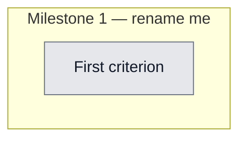

## Workflow
<!-- The shape of this task at a glance. One node per acceptance criterion, grouped under milestone subgraphs. Update node classes as work progresses: `:::done` (green), `:::active` (amber), `:::todo` (gray), `:::blocked` (red). Run `dreamcontext tasks doctor` to verify sync. -->

## Why
<!-- What problem does this solve? What breaks if we don't do it? Be concrete — name the user, the friction, the cost. -->

Dashboard Packs page is read-only; users asked to install uninstalled packs and remove installed ones with a button. Install logic exists (directPackInstall) but is locked inside the @inquirer-importing CLI module, which the server bundle deliberately excludes — so it must be extracted into a pure lib first.

## User Stories
<!-- As a <role>, I can <action>, so that <outcome>. Tick when demonstrably true in the running system. -->

- [ ] As a [role], I can [action], so that [outcome]

## Acceptance Criteria
<!-- The contract. Each line is testable and gets a node in the Workflow flowchart above. -->

- [ ] First criterion (matches node A1 in Workflow)

POST /api/packs/:name/install writes the pack's SKILL.md + sub-skills + related agents under config.platforms and records them in the manifest with kinds pack-skill/pack-agent; responds 200 {name,installed,warnings,platforms}.

DELETE /api/packs/:name deletes exactly the files the manifest/catalog attribute to that pack for the configured platforms, removes the manifest pack entry, and never deletes a shared agent (e.g. reviewer) while another still-installed pack uses it; responds 200 {name,removed,skipped,warnings,platforms}.

Unknown catalog name -> 404 unknown_pack; traversal/slash/null name -> 400 invalid_name; both reject BEFORE any fs write/delete. Uninstalling an absent-but-catalog-valid pack -> 200 no-op removed:[] (DELETE idempotent).

Platforms: no .config.json -> defaults ['claude']; platforms:['codex'] -> only .agents/skills + .codex/agents touched.

src/lib/install-packs.ts AND src/server/routes/packs-install.ts import nothing from @inquirer/prompts or chalk (unit test reads the files as text + asserts; CI grep). The full extraction keeps the existing test suite green.

resolveSkillDirToRemove(skillRoot,name) is pure+exported, returns null for '.', '..', slash-containing, absolute, and skillRoot itself — only a strict child otherwise; uninstall's dir-delete + fallback-walk root both use it; test A10 unit-tests it directly (bypassing the allowlist).

Dashboard: each pack card AND the detail modal show one button — 'Install' when not installed, 'Remove' when installed; a card button click does NOT open the modal (stopPropagation); after the mutation React Query invalidation flips the Installed pill. All strings via i18n. Pending/error states handled (no window.alert).

Validation method (Phase 6 contract): full 'npx vitest run' green + 'npm run build' clean + Playwright e2e in e2e/control-panel.spec.ts (Install business-idea-validation -> badge appears; Remove -> badge gone; self-cleaning + afterEach force-cleanup).
## Constraints & Decisions
<!-- LIFO: newest at top. Capture the why, not just the what. -->

- **[2026-06-01]** Keep @inquirer + chalk OUT of src/lib/install-packs.ts and the server bundle (the whole reason for the extraction). Keep every existing export of install-skill.ts intact (update.ts/setup.ts/tests depend on them) — move only private helpers, delegate from the unchanged public functions; build:cli + full vitest right after the extraction, before writing the route, to isolate regressions. OUT OF SCOPE (YAGNI): bulk/multi-select install, refactoring installSingleSkill, writing config.packs from these endpoints, confirm dialogs/undo, codex AGENTS.md/hook changes on pack install, rate limiting/auth (loopback + global CSRF already cover it). .claude/ and .agents/ are gitignored so the e2e never dirties the tree.
## Technical Details
<!-- Where the work lives. Files, services, key functions to reuse. Body is current truth — update in place; don't append. -->

(Key files, services, dependencies, implementation approach.)

Full file-by-file plan + all 3 review rounds of resolutions live in _dream_context/state/.goal-plan-pack-install.md — READ IT FIRST; it is authoritative. Summary: (1) CREATE src/lib/install-packs.ts — extract installPackFiles/installStandaloneFiles/installAgentForPlatform/writeCodexAgent/parseAgentFile out of install-skill.ts (NOT findPackageFile — it stays). Pure, no chalk/@inquirer; RETURN data. Exports: installPack, uninstallPack, installAgentForPlatform, resolveSkillDirToRemove, InstallResult, UninstallResult, CatalogUnavailableError, UnknownPackError. installPack/uninstallPack call loadCatalog() once and thread catalog+packsDir to helpers. References push each ref rel-path to installed[] (no chalk label). uninstall = manifest 'pack-skill' prefix-match + catalog-derived on-disk fallback; agents removed only if not shared with another installed pack; every delete via isSafeDeletePath; dir-delete + fallback-walk root bounded by resolveSkillDirToRemove. (2) EDIT install-skill.ts — import installPack + installAgentForPlatform from the lib; directPackInstall/interactivePackInstall/installCoreForPlatform keep identical exported signatures (delegate); catch UnknownPackError to reproduce the 'not found' message. (3) CREATE src/server/routes/packs-install.ts — handlePackInstall (POST /api/packs/:name/install) + handlePackUninstall (DELETE /api/packs/:name); shared validatePackName (reject slash/null/traversal -> 400, loadCatalog null -> 500, allowlist -> 404, resolve platforms from readSetupConfig fallback ['claude']); read/installPack|uninstallPack/writeManifest; generic 500 messages, log to stderr. (4) EDIT src/server/index.ts — register both routes. (5) EDIT manifest.ts — export walk (or walkDir wrapper) for the lib's fallback. (6) EDIT dashboard/src/hooks/usePacks.ts — useInstallPack/useUninstallPack mutations (api.post/api.del) invalidating ['packs']. (7) EDIT dashboard/src/pages/PacksPage.tsx — PackActionButton on card + modal (stopPropagation on card). (8) EDIT PacksPage.css + I18nContext.tsx (packs.action.* keys). Tests: tests/unit/install-packs.test.ts (A1-A10, temp dir, real catalog), tests/unit/packs-install-route.test.ts (POST/DELETE success/404/400/idempotent/platforms, fake res), extend tests/unit/packs-route.test.ts (bundle-purity grep), e2e/control-panel.spec.ts (install/remove business-idea-validation).
## Notes
<!-- Loose ends, edge cases, open questions. -->

(Working notes, edge cases, open questions.)

## Changelog
<!-- LIFO: newest at top. Auto-prepended by `dreamcontext tasks log`. -->

### 2026-06-01 - Status → in_review
- all acceptance criteria met; validation passed via tests+build+e2e (clean room)
### 2026-06-01 - Session Update
- Phase 6 VALIDATION PASSED (clean room). npm run build exit 0; npx vitest run 986/986 green (+23 new: install-packs.test 13, packs-install-route.test 9, bundle-purity 1); npx playwright test 5/5 green incl. the new install/remove test (req 5). NOTE: the goal-validator's first e2e run was a FALSE NEGATIVE — playwright.config has reuseExistingServer:true and a stale dashboard server process from the earlier UX-fix phase was still on :4173. A running node process keeps its startup-loaded routes, so the stale server lacked /api/packs/:name/install (404) while serving fresh static JS with the Install button -> mutation failed -> pill never appeared. Killing the stale server + rebuild + re-run = all green. Backend proven independently via curl POST -> 200 + files on disk. Reviewer (Phase 5) PASS on all 7 risk areas (endpoint security fail-closed, delete bound via resolveSkillDirToRemove, shared-agent data-loss guard, CLI extraction preserved, bundle purity, frontend stopPropagation, no stack leak).
### 2026-06-01 - Session Update
- Frontend + tests for pack install/uninstall shipped. Added PackActionButton to PacksPage.tsx (used by card + modal; stopPropagation/preventDefault, isPending disabled state, inline error with aria-invalid, success flips pill via RQ invalidation). Added .packs-card-actions/.packs-action-btn(+--danger)/.packs-action-error CSS via tokens (reused .btn/.btn--ghost, --color-error/-subtle). Created tests/unit/install-packs.test.ts (13 tests, A1-A10+R8/R9), tests/unit/packs-install-route.test.ts (9 tests, B1-B9). Extended tests/unit/packs-route.test.ts with bundle-purity guard (no @inquirer/chalk import in packs-install.ts + install-packs.ts). Added e2e install->pill->remove test for business-idea-validation with self-cleaning afterEach. npm run build exit 0; npx vitest run 986 passed (67 files); import grep empty.
### 2026-06-01 - Session Update
- Extraction step done: created src/lib/install-packs.ts (installPack/uninstallPack/installAgentForPlatform/parseAgentFile/resolveSkillDirToRemove + InstallResult/UninstallResult/CatalogUnavailableError/UnknownPackError). install-skill.ts now delegates to the lib; findPackageFile + installCoreForPlatform stayed. Exported walk from manifest.ts. Fixed one regression: cross-pack-dep warnings suppressed in-batch via filterBatchDepWarnings in the CLI callers (lib can't know sibling selections). build:cli clean; full vitest 963/963 green post-extraction.
### 2026-06-01 - Status → in_progress
- plan validated by 3 reviewers (pragmatist+critic+security) over 3 rounds; implementing
### 2026-06-01 - Created
- Task created.
