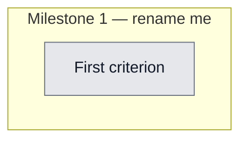

## Workflow
<!-- The shape of this task at a glance. One node per acceptance criterion, grouped under milestone subgraphs. Update node classes as work progresses: `:::done` (green), `:::active` (amber), `:::todo` (gray), `:::blocked` (red). Run `dreamcontext tasks doctor` to verify sync. -->

## Why
<!-- What problem does this solve? What breaks if we don't do it? Be concrete — name the user, the friction, the cost. -->

Dashboard UX fixes from user review: (1) remove Vaults section (can't switch vaults in browser/project-based model); (2) fix skill-packs checkbox confusion (all installed but only 1 checked); (3) fix half-screen layout weirdness; (4) Packs page not clickable / no details + redundant pack-install in Settings — consolidate to one place, make Packs clickable with details; (5) fix Sleep State weird area layout. Tasks/Brain/Features/Knowledge are fine.

## User Stories
<!-- As a <role>, I can <action>, so that <outcome>. Tick when demonstrably true in the running system. -->

- [ ] As a [role], I can [action], so that [outcome]

## Acceptance Criteria
<!-- The contract. Each line is testable and gets a node in the Workflow flowchart above. -->

- [ ] First criterion (matches node A1 in Workflow)

## Constraints & Decisions
<!-- LIFO: newest at top. Capture the why, not just the what. -->

## Technical Details
<!-- Where the work lives. Files, services, key functions to reuse. Body is current truth — update in place; don't append. -->

(Key files, services, dependencies, implementation approach.)

## Notes
<!-- Loose ends, edge cases, open questions. -->

(Working notes, edge cases, open questions.)

## Changelog
<!-- LIFO: newest at top. Auto-prepended by `dreamcontext tasks log`. -->

### 2026-06-01 - Status → in_review
- all 5 UX fixes verified via screenshots + tests
### 2026-06-01 - Session Update
- All 5 UX fixes done + verified. (1) Removed Vaults section + useVaults hook + /api/vaults routes + vaults-route test (kept lib/CLI). (2) Removed confusing Skill Packs checkboxes from Settings — now Platforms-only. (3) Centered Settings+Sleep content (max-width 880, margin auto) — no more half-screen. (4) Packs cards now clickable -> detail modal (base/sub-skills/agents, Esc+overlay close). (5) Sleep gauge enlarged + summary as a balanced card. Build exit 0; 963 unit/integration green; 4/4 Playwright e2e green (added a modal-open/close test). Verified via 1440x900 screenshots.
### 2026-06-01 - Session Update
- Implemented all 5 UX fixes: (1) removed Vaults section from SettingsPage + deleted useVaults.ts, vaults.ts route, vaults-route.test.ts, removed route registrations from server/index.ts; (2) removed Skill Packs section from Settings, handleSave now sends only {platforms}; (3) SettingsPage.css max-width:880px + margin-inline:auto centering, SleepPage.css same treatment; (4) PacksPage fully clickable cards with detail modal (role=dialog, aria-modal, Esc+overlay close, keyboard Enter/Space), 4 new i18n keys; (5) SleepPage sleep-gauge enlarged to 160px, sleep-details styled as card with flex:1; deleted dashboard-vault.test.ts /api/vaults tests; e2e vault test removed; build clean, 963/963 tests green
### 2026-06-01 - Created
- Task created.
