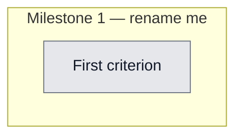

## Workflow
<!-- The shape of this task at a glance. One node per acceptance criterion, grouped under milestone subgraphs. Update node classes as work progresses: `:::done` (green), `:::active` (amber), `:::todo` (gray), `:::blocked` (red). Run `dreamcontext tasks doctor` to verify sync. -->

## Why
<!-- What problem does this solve? What breaks if we don't do it? Be concrete — name the user, the friction, the cost. -->

dreamcontext update offered to DELETE a user's custom .claude/agents/watchlist-monitor.md it never installed (data loss). Root cause: bootstrapManifestFromScan adopts EVERY agent/skill file as owned. Two fixes needed: allowlist the bootstrap + never auto-delete heuristic (PRE_MANIFEST) entries. Plus upgrade --check stale-cache bug.

## User Stories
<!-- As a <role>, I can <action>, so that <outcome>. Tick when demonstrably true in the running system. -->

- [ ] As a [role], I can [action], so that [outcome]

## Acceptance Criteria
<!-- The contract. Each line is testable and gets a node in the Workflow flowchart above. -->

- [ ] First criterion (matches node A1 in Workflow)

bootstrapManifestFromScan(projectRoot, known) records a .claude/agents/<n>.md (and .codex/agents/<n>.toml) only if <n> in known.agentNames; records a .claude/skills/<d>/ (and .agents/skills/<d>/) subtree only if <d> in known.skillDirs. Custom files (watchlist-monitor) never adopted. (T1-T3)

knownArtifactNames() (in catalog.ts) = catalog.agents + repo-root agents/ core names for agentNames; {'dreamcontext', ...packs, ...standalone} for skillDirs. Includes reviewer/goal-planner/sleep-state/dreamcontext-explore/engineering/dreamcontext; excludes watchlist-monitor + review-coordinator. manifest.ts must NOT import catalog.ts (type-only KnownArtifacts import into catalog.ts; no cycle). (T4)

pruneStaleFiles returns { removed, keep } with keep = candidates.filter(c => !removed.includes(c)). Never auto-deletes a removed candidate whose oldManifest version === PRE_MANIFEST_VERSION (heuristic) — flags only. Concrete-version owned files (e.g. review-coordinator) stay auto-deletable with confirm/--yes. (T5, T6, T7a/T7b, T8b)

Caller (update.ts) re-persists every keep entry into newManifest.files if absent UNCONDITIONALLY (the if(pruneResult.cancelled) guard at ~205 is removed). The isFirstRun early-return returns { removed: [], keep: candidates }. Heuristic, owned-declined, AND first-run candidates all stay tracked across runs (re-offered next update). (T8c, T15)

E2E: dreamcontext update --yes on a project containing custom .claude/agents/watchlist-monitor.md leaves it on disk — both the no-manifest (bootstrap) path AND a polluted-manifest (pre-manifest entry) path. (T10, T11)

upgrade --check reflects the LIVE npm latest when reachable (source-fn selection opts.liveLatest ?? opts.latestVersion ?? defaultLiveLatest, called once; null -> 'unknown' / cache fallback). The four existing upgrade --check tests pass UNCHANGED. --refresh is NOT added. (T12, T13)

Validation method: full 'npx vitest run' green (existing suite + new tests) + 'npm run build' clean. New: tests/unit/manifest-bootstrap.test.ts, tests/unit/prune-stale.test.ts, tests/integration/update-prune.test.ts; edited tests/unit/upgrade.test.ts.
## Constraints & Decisions
<!-- LIFO: newest at top. Capture the why, not just the what. -->

- **[2026-06-01]** manifest.ts must NEVER import catalog.ts (avoid cycle; pass known-set IN). Keep additive: do not change unsafe-path skip behavior or the first-run flag-only INTENT (only its return shape). A custom file can only enter the manifest via bootstrap (PRE_MANIFEST) because every real install path records dreamcontextVersion() — this invariant is load-bearing for the partition. OUT OF SCOPE (YAGNI): --refresh flag, update --dry-run, Bug E (settings.json/config.toml hook recording), in-place migration of already-polluted manifests, Bug G (prompt default), dashboard version-check route. Build CLI + run prune-stale/manifest-bootstrap unit tests BEFORE the integration tests.
## Technical Details
<!-- Where the work lives. Files, services, key functions to reuse. Body is current truth — update in place; don't append. -->

(Key files, services, dependencies, implementation approach.)

Full plan + 2 rounds of review resolutions: _dream_context/state/.goal-plan-install-update.md (READ FIRST; the 'Review Round 1/2' sections are AUTHORITATIVE and supersede conflicting earlier text). Edits: (1) src/lib/manifest.ts — add 'export interface KnownArtifacts { agentNames: Set<string>; skillDirs: Set<string> }'; change bootstrapManifestFromScan(projectRoot, known); filter each adoption site (.claude/agents/*.md, .codex/agents/*.toml by known.agentNames; .claude/skills/<d>/ + .agents/skills/<d>/ by known.skillDirs); export PRE_MANIFEST_VERSION. (2) src/lib/catalog.ts — add knownArtifactNames(): KnownArtifacts (loadCatalog agents/packs/standalone + readdir findPackageDir('agents') core .md base-names + 'dreamcontext'); type-only import KnownArtifacts from manifest.js. (3) src/cli/commands/update.ts — call bootstrapManifestFromScan(projectRoot, knownArtifactNames()); export pruneStaleFiles; change its return to { removed, keep }, keep = candidates.filter(c=>!removed.includes(c)); partition candidates by oldManifest.files[p]?.version===PRE_MANIFEST_VERSION (heuristic never deleted) vs owned (first-run flag / else confirm-or-yes delete); first-run early-return -> { removed:[], keep:candidates }; REPLACE the if(pruneResult.cancelled) re-persist block with an UNCONDITIONAL loop re-inserting every keep path's old entry into newManifest.files if absent. (4) src/cli/commands/upgrade.ts — add liveLatest?:()=>string|null to UpgradeOpts; --check source = opts.liveLatest ?? opts.latestVersion ?? defaultLiveLatest, called once (defaultLiveLatest = execFileSync npm view dreamcontext version, validate /^\d+\.\d+/, null on fail); best-effort writeVersionCache on live success. Tests: manifest-bootstrap.test.ts (T1-T4), prune-stale.test.ts (T5,T6,T7a,T7b,T8,T8b,T8c,T9,T15), update-prune.test.ts integration (T10,T11 spawn node dist/index.js update --yes), upgrade.test.ts (T12,T13; keep existing 4).
## Notes
<!-- Loose ends, edge cases, open questions. -->

(Working notes, edge cases, open questions.)

## Changelog
<!-- LIFO: newest at top. Auto-prepended by `dreamcontext tasks log`. -->

### 2026-06-01 - Status → in_review
- data-loss fix + hardening validated: build 0, 1003 tests green (21/21 regression incl. watchlist-monitor survival + cancel-tracking)
### 2026-06-01 - Session Update
- Implemented per goal-plan Round 2 contract. manifest.ts: added KnownArtifacts interface, exported PRE_MANIFEST_VERSION, bootstrapManifestFromScan now takes (projectRoot, known) and allowlist-filters every adoption site. catalog.ts: added knownArtifactNames() (type-only KnownArtifacts import, no cycle). update.ts: wired allowlist into bootstrap call, exported pruneStaleFiles, changed return to {removed,keep}, partition candidates by PRE_MANIFEST_VERSION (heuristic=never delete, owned=first-run-flag/confirm-or-yes), first-run early-return now returns {removed:[],keep:candidates}, replaced cancelled-guarded re-persist with unconditional keep re-insert loop. upgrade.ts: added liveLatest, source-fn selection (liveLatest ?? latestVersion ?? defaultLiveLatest, called once, no value fall-through), defaultLiveLatest does npm view validated /^\d+\.\d+/ + best-effort writeVersionCache; --refresh NOT added. Tests: manifest-bootstrap T1-T4, prune-stale T5/T6/T7a/T7b/T8/T8b/T8c/T9/T15, update-prune integration T10/T11, upgrade T12/T13. npm run build exit 0; full vitest 70 files / 1003 tests green.
### 2026-06-01 - Status → in_progress
- plan validated by 3 reviewers over 2 rounds (pragmatist+critic SOLID, security after R5); implementing
### 2026-06-01 - Created
- Task created.
