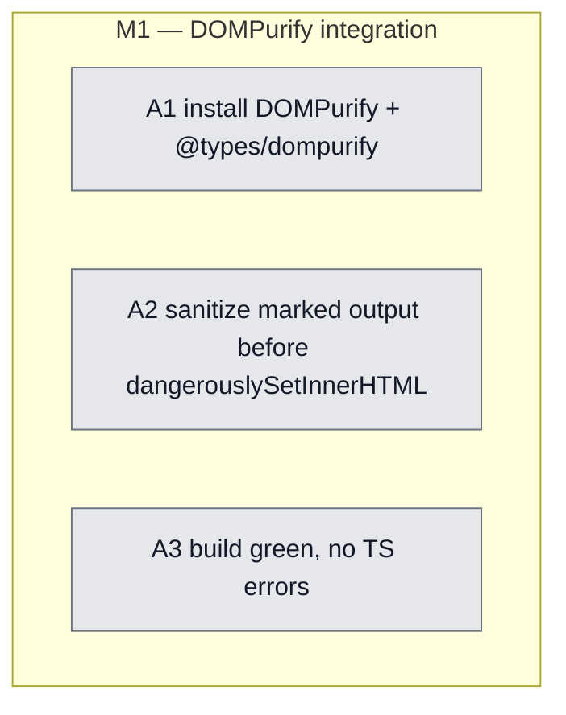

## Workflow
<!-- The shape of this task at a glance. One node per acceptance criterion, grouped under milestone subgraphs. Update node classes as work progresses: `:::done` (green), `:::active` (amber), `:::todo` (gray), `:::blocked` (red). Run `dreamcontext tasks doctor` to verify sync. -->

## Why
<!-- What problem does this solve? What breaks if we don't do it? Be concrete — name the user, the friction, the cost. -->

MarkdownPreview uses dangerouslySetInnerHTML over unsanitized marked output (no DOMPurify). Pre-existing XSS risk for user-authored content (core/knowledge pages). Add DOMPurify before MarkdownPreview renders any externally-sourced content. Surfaced during v06 slice-2 review (nudge surface itself is safe).

## User Stories

- [ ] As a dashboard user viewing knowledge/core pages, I am protected from XSS in user-authored markdown content rendered by MarkdownPreview.

## Acceptance Criteria

- [ ] **A1** `dompurify` + `@types/dompurify` installed in `dashboard/` (not root); build still green.
- [ ] **A2** `MarkdownPreview.tsx` wraps `marked(content)` output in `DOMPurify.sanitize(...)` before passing to `dangerouslySetInnerHTML`. The nudge/version-check path uses the same component and benefits automatically.
- [ ] **A3** `npm run build` (root tsc + vite) completes with zero TS errors after the change.

## Constraints & Decisions
<!-- LIFO: newest at top. Capture the why, not just the what. -->

## Technical Details

Key file: `dashboard/src/components/MarkdownPreview.tsx` (uses `dangerouslySetInnerHTML` over `marked(content)` output). Add `DOMPurify.sanitize()` wrapper. Surfaced in v06-control-panel-frontend slice-2 security review; the nudge surface itself is safe (server-built, constrained) but the same component renders user-authored knowledge/core content.

## Notes
<!-- Loose ends, edge cases, open questions. -->

The nudge/version-check surface is safe (server-built, regex-constrained input) — DOMPurify is still a good habit since the same component renders user-authored content. DOMPurify is browser-safe; no SSR concerns in this dashboard.

## Changelog
<!-- LIFO: newest at top. Auto-prepended by `dreamcontext tasks log`. -->

### 2026-05-31 - Session Update
- sleep-tasks: populated placeholder body — Why already correct; added User Stories, 3 ACs, Technical Details (MarkdownPreview.tsx + DOMPurify install); fixed version v0.5.0 → 0.6.0
### 2026-05-31 - Created
- Task created.
