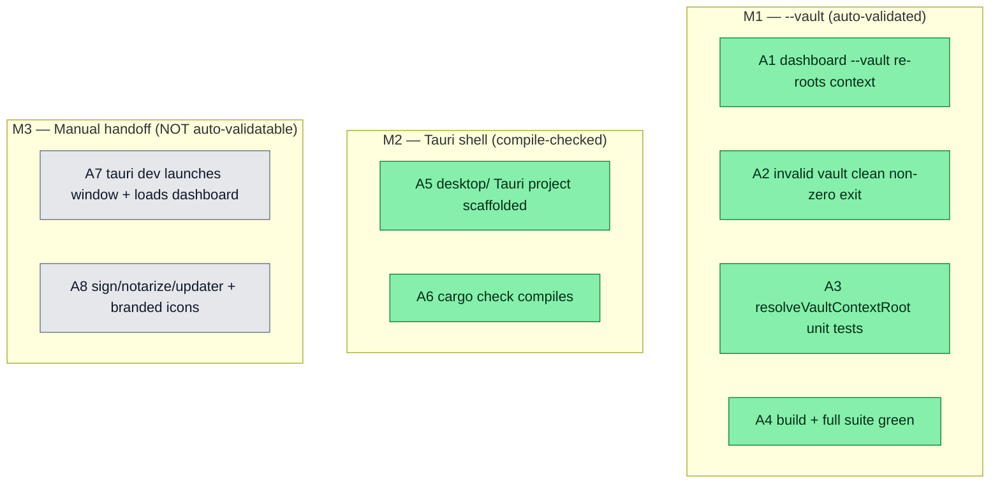

## Workflow

## Why

Slice 3 of [[v06-control-panel-vaults-tauri]]: turn the functional dashboard (slices 1+2) into a launchable desktop app. Two parts with very different validatability: (1) `dashboard --vault <name|path>` so a desktop shell can point the server at a chosen vault — fully vitest-validatable; (2) a Tauri 2.x native shell in `desktop/` that spawns the Node dashboard on a free loopback port and loads it — compile-checkable only; window-launch + code-signing + notarization + updater need the user's machine/secrets. Plan validated via goal-skill (opus planner).

## User Stories

- [ ] As the desktop shell, I can launch the dashboard server pointed at a specific vault via `--vault`.
- [ ] As a CLI user, I can run `dreamcontext dashboard --vault <path|name>` to open any registered/located vault.
- [ ] As a user (on my own machine), I can run the dreamcontext desktop app in a native window.

## Acceptance Criteria

### [auto] — validated by goal-skill Phase 6 (vitest + build + cargo check)
- [x] **A1** `src/cli/commands/dashboard.ts` accepts `--vault <path|name>`; with the flag the served context root is the chosen vault's `_dream_context/` (proven by `GET /api/vaults` `current` matching the vault); without it, behavior is byte-for-byte the current `ensureContextRoot()` walk-up.
- [x] **A2** Invalid `--vault` (missing dir / dir lacking `_dream_context/` / unknown name) → non-zero exit with a clean message and NO stack frames (mirror `vaults-cli.test.ts`).
- [x] **A3** `resolveVaultContextRoot(arg, home?)` in `src/lib/vaults.ts` is unit-tested (`tests/unit/vaults-resolve.test.ts`): valid path → `<path>/_dream_context`; registered name → that vault's `_dream_context`; non-existent / missing-`_dream_context` / unknown-name → `VaultError`.
- [x] **A4** `npm run build` green; full vitest suite green (no regressions); new `tests/integration/dashboard-vault.test.ts` passes (spawns `node dist/index.js dashboard --no-open --port <free> --vault <tmp>`, polls `/api/health`, asserts `/api/vaults.current`, kills child).
- [x] **A5** `desktop/` Tauri 2.x project scaffolded per the file-by-file plan (Cargo.toml, tauri.conf.json, main.rs/lib.rs, build.rs, capabilities, package.json, frontend-placeholder, icons, .gitignore for target/ + signing material).
- [x] **A6** `cd desktop/src-tauri && cargo check` compiles the Rust shell with all three plugins wired — **IF network is available to fetch the tauri crates**; if the environment is offline, scaffold is committed and this defers to the manual handoff with a note.

### [manual] — handoff (cannot be auto-verified here)
- [ ] **A7** `cd desktop && npm install && npm run tauri dev` launches a native window that loads the spawned dashboard and renders the UI; the Node child is killed on window close.
- [ ] **A8** `tauri signer generate` keypair (pubkey → `tauri.conf.json`, private key → CI secret, never committed); `npm run tauri build` produces `.app`/`.dmg` + updater `.sig`/`latest.json`; code-sign + Apple-notarize; real branded icons via `tauri icon`; fill the GitHub Releases `latest.json` endpoint owner/repo.

**Validation method (Phase 6 contract, autonomous):** for [auto] — `npm run build` + full `vitest run` + the new --vault tests + `cargo check` (network-permitting). [manual] criteria are explicitly NOT claimed; they are documented for the user.

## Constraints & Decisions
<!-- LIFO -->

- **[2026-06-01] DECISION (open-q #5):** `--vault` accepts BOTH a registered vault **name** and a filesystem **path** (one `resolveVaultContextRoot` code path serves desktop-launch-by-name and CLI-launch-by-path). Name match is tried first (against `listVaults`), else treated as a path.
- **[2026-06-01] DECISION (open-q #6):** the Tauri shell learns which vault to open from an env var `DREAMCONTEXT_VAULT` (+ a dev default), and the CLI path via `DREAMCONTEXT_CLI` (path to `dist/index.js`). A native vault-picker reading `~/.dreamcontext/vaults.json` is a follow-up, not slice 3.
- **[2026-06-01] ARCHITECTURE:** Tauri spawns the existing Node CLI (`node <dist/index.js> dashboard --port <free> --no-open --vault <path>`) via `tauri-plugin-shell`, polls `GET /api/health` for readiness, then opens `WebviewUrl::External(http://127.0.0.1:<port>)`. Window is created at runtime (port is dynamic) via `WebviewWindowBuilder`. Node is a documented prerequisite for v1; a packaged-Node sidecar (`bundle.externalBin`) is scaffolded commented-out as the follow-up path. Free port via `TcpListener::bind('127.0.0.1:0')` then drop; retry-once on child EADDRINUSE (accept TOCTOU for single-user desktop).
- **[2026-06-01] SECURITY:** least-privilege Tauri capability (`shell:allow-spawn` scoped to `node`); private signing key never committed (`desktop/.tauri-signing/` gitignored + CI secret); pubkey in `tauri.conf.json` is public. CSP null for first cut (own loopback content) — flagged as a hardening TODO.
- **[2026-06-01] OUT OF SCOPE:** packaged-Node sidecar; Windows/Linux packaging; native vault-picker UI / tray / menus; actual signing/notarization/live-updater; branded icons (placeholder now); webview CSP hardening.

## Technical Details
<!-- File-by-file (from the validated plan). -->

**--vault (the auto-validated core):**
- EDIT `src/cli/commands/dashboard.ts` — add `.option('--vault <path>', '...')`. In the action: if absent → `ensureContextRoot()` (unchanged); if present → `resolveVaultContextRoot(opts.vault)` (new helper). Keep port validation. Pass resolved `contextRoot` to `startDashboardServer` (signature already takes it — no server change). Catch `VaultError` → clean non-stack error message + non-zero exit.
- EDIT `src/lib/vaults.ts` — add `export function resolveVaultContextRoot(arg: string, home = homedir()): string`: (1) if `arg` matches a registered vault name in `listVaults(home)` → use its `path`; (2) else `resolve(arg)` as a path; (3) require the dir exists AND contains `_dream_context/` (mirror `addVault` checks) → return `join(resolved, '_dream_context')`; (4) throw `VaultError` on any failure.
- CREATE `tests/unit/vaults-resolve.test.ts` — injectable `home` (tmpdir), the 5 cases in A3.
- CREATE `tests/integration/dashboard-vault.test.ts` — mirror `tests/integration/vaults-cli.test.ts`. Cases: `--vault <validPath> --no-open --port <free>` starts → poll `/api/health` 200 → `GET /api/vaults.current` === vault dir → SIGTERM; `--vault <noDreamContext>` → non-zero + clean msg; `--vault <nonexistent>` → non-zero; no flag (cwd has `_dream_context/`) → starts, `current` === cwd project. Always `--no-open`, explicit `--port`, kill child in `afterEach` with a timeout fallback.

**Tauri shell (compile-checked; under `desktop/`):**
- CREATE `desktop/package.json` — devDep `@tauri-apps/cli ^2.9`; deps `@tauri-apps/api ^2`, `@tauri-apps/plugin-shell ^2`, `@tauri-apps/plugin-updater ^2`; script `"tauri":"tauri"`. NOT added to root build.
- CREATE `desktop/src-tauri/Cargo.toml` — pkg `dreamcontext-desktop` ed.2021; `tauri-build = "2"` build-dep; deps `tauri = "2"`, `tauri-plugin-shell = "2"`, `tauri-plugin-updater = "2"`, `serde`/`serde_json`; `[lib] crate-type=["staticlib","cdylib","rlib"]`; `[[bin]] dreamcontext-desktop → src/main.rs`.
- CREATE `desktop/src-tauri/build.rs` — `fn main(){ tauri_build::build() }`.
- CREATE `desktop/src-tauri/src/main.rs` — `#![cfg_attr(not(debug_assertions), windows_subsystem="windows")]` + `fn main(){ dreamcontext_desktop_lib::run() }`.
- CREATE `desktop/src-tauri/src/lib.rs` — `pub fn run()`: `tauri::Builder::default().plugin(tauri_plugin_shell::init())` + `#[cfg(desktop)] .setup(|app|{ app.handle().plugin(tauri_plugin_updater::Builder::new().build())?; host_dashboard(app)?; Ok(()) })`. `host_dashboard`: pick free port (TcpListener bind :0, read, drop); spawn `node` via shell plugin `[cli,"dashboard","--port",port,"--no-open","--vault",vault]` (cli+vault from env `DREAMCONTEXT_CLI`/`DREAMCONTEXT_VAULT` w/ dev defaults); poll `/api/health` ~10s (fail-loud on timeout); `WebviewWindowBuilder::new(app,"main",WebviewUrl::External("http://127.0.0.1:{port}".parse()?)).title("dreamcontext").inner_size(1280,800).build()?`; store child handle → kill on window Destroyed/exit.
- CREATE `desktop/src-tauri/tauri.conf.json` — productName dreamcontext, version 0.6.0, identifier com.dreamcontext.desktop; `build.frontendDist` → `./frontend-placeholder`; `app.windows: []` (runtime-created), `security.csp: null` (TODO); `bundle.active:true, targets:["dmg","app"], createUpdaterArtifacts:true, icon:[...]`; `plugins.updater.endpoints:["https://github.com/<owner>/<repo>/releases/latest/download/latest.json"], pubkey:"<PLACEHOLDER>"`. Comment the sidecar upgrade path.
- CREATE `desktop/src-tauri/capabilities/default.json` — windows:["main"], permissions ["core:default","shell:allow-spawn","updater:default"] (tightest grant for the node spawn).
- CREATE `desktop/src-tauri/frontend-placeholder/index.html` — one-line "starting…" body (Tauri requires a frontendDist dir; External webview replaces it).
- CREATE `desktop/src-tauri/icons/` — commit Tauri default placeholder icons so build doesn't fail on missing `icon.icns`. Real icons = design handoff (`tauri icon`).
- CREATE `desktop/.gitignore` — `src-tauri/target/`, `node_modules/`, `src-tauri/gen/`, `.tauri-signing/`, `*.key`, `*.key.pub`.

## Notes

- RISK: `cargo check` needs NETWORK to fetch `tauri 2` + plugin crates on first run. If the sandbox is offline, scaffold is committed and A6 defers to the manual handoff (`cargo fetch` with network).
- macOS uses system WebKit — no extra system deps on Darwin arm64.
- Order for [auto] validation: `npm run build` FIRST (the integration test runs `node dist/index.js`, so `dist/` must be current).
- Pattern refs: `tests/integration/vaults-cli.test.ts`, `src/server/index.ts` (`startDashboardServer(contextRoot)`, `/api/health`), `src/server/routes/vaults.ts` (`current = dirname(contextRoot)`), `src/lib/vaults.ts` (`addVault` validation).

## Changelog

### 2026-05-31 - Status → in_review
- auto criteria A1-A6 met (962 tests, build green, cargo check compiled, capability scoped); A7/A8 manual handoff documented
### 2026-05-31 - Session Update
- scoped shell spawn capability to node (review fix); cargo check green
### 2026-05-31 - Session Update
- PART 1: resolveVaultContextRoot added to vaults.ts; dashboard --vault option wired; tests/unit/vaults-resolve.test.ts (5 tests green); tests/integration/dashboard-vault.test.ts (4 tests green); npm run build green; full suite 65 files / 962 tests all pass. PART 2: desktop/ Tauri 2.x scaffold created (package.json, Cargo.toml, build.rs, main.rs, lib.rs, tauri.conf.json, capabilities/default.json, frontend-placeholder/index.html, icons/ PNGs+ICO+ICNS, .gitignore); cargo check compiled successfully (Rust updated to 1.96.0 to satisfy tauri 2 dependency requirements).
### 2026-05-31 - Status → in_progress
- plan validated (goal-skill); implementing --vault + scaffolding Tauri
### 2026-06-01 - Plan validated (goal-skill)
- opus planner; architecture = spawn Node CLI + External webview; open questions resolved (name-or-path; env-var launch). [auto]/[manual] criteria split. Status → in_progress.

### 2026-06-01 - Created
- Task created.
