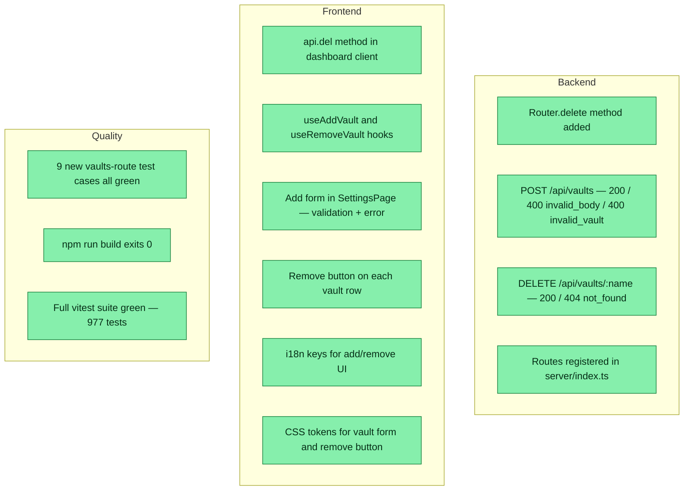

## Workflow
<!-- The shape of this task at a glance. One node per acceptance criterion, grouped under milestone subgraphs. Update node classes as work progresses: `:::done` (green), `:::active` (amber), `:::todo` (gray), `:::blocked` (red). Run `dreamcontext tasks doctor` to verify sync. -->

## Why

Slice 4: manage vaults from the dashboard (POST/DELETE /api/vaults + Settings add/remove UI). Browser+backend, vitest+build validatable.

## User Stories

- [x] As a user, I can add a vault from the Settings page, so that I can register new dreamcontext projects without the CLI.
- [x] As a user, I can remove a vault from the Settings page, so that I can clean up stale registrations.

## Acceptance Criteria

- [x] `Router.delete()` method added; `:param` routes work for DELETE
- [x] `POST /api/vaults` — 200 with updated list on success; 400 `invalid_body` when name or path missing/blank; 400 `invalid_vault` on VaultError (path missing _dream_context/, duplicate name/path)
- [x] `DELETE /api/vaults/:name` — 200 with updated list; 404 `not_found` when name not registered
- [x] New routes registered in `src/server/index.ts`
- [x] `api.del<T>()` method in dashboard client
- [x] `useAddVault()` and `useRemoveVault()` mutation hooks in `useVaults.ts`
- [x] Add form (name + path inputs, Add button) in SettingsPage Vaults section; disabled when blank or pending; error surfaced
- [x] Remove button on each vault row; disabled when pending
- [x] i18n keys: `settings.vaults.add`, `settings.vaults.namePlaceholder`, `settings.vaults.pathPlaceholder`, `settings.vaults.addButton`, `settings.vaults.adding`, `settings.vaults.remove`
- [x] CSS tokens only for new vault form/button styles
- [x] 9 new test cases in `tests/unit/vaults-route.test.ts` — all green
- [x] `npm run build` exits 0
- [x] Full vitest suite green (977 tests)

## Constraints & Decisions

### 2026-06-01 — removeVault returns boolean not { removed }
The spec called for `const { removed } = removeVault(name)` but the actual lib returns a plain `boolean`. Adapted the handler to use `const removed = removeVault(name)` — semantically identical, no lib change needed.

### 2026-06-01 — Security
POST/DELETE protected by the global `isCrossSiteWrite` CSRF guard. `addVault` validates the path contains `_dream_context/`. DELETE is name-only, no filesystem traversal from the request.

## Technical Details

- `src/server/router.ts` — added `delete()` method (delegates to `add('DELETE', ...)`)
- `src/server/routes/vaults.ts` — added `handleVaultsPost`, `handleVaultsDelete`
- `src/server/index.ts` — registered POST + DELETE vault routes
- `tests/unit/vaults-route.test.ts` — extended with 9 new cases; uses HOME→tmpdir isolation + Readable stream for POST bodies (mirrors config-route pattern)
- `dashboard/src/api/client.ts` — `del<T>()` method
- `dashboard/src/hooks/useVaults.ts` — `useAddVault()`, `useRemoveVault()` mutations
- `dashboard/src/pages/SettingsPage.tsx` — add form + remove buttons in vaults section
- `dashboard/src/pages/SettingsPage.css` — `.settings-vault-add`, `.settings-vault-add-input`, `.settings-vault-add-btn`, `.settings-vault-add-error`, `.settings-vault-remove-btn`
- `dashboard/src/context/I18nContext.tsx` — 6 new i18n keys

## Notes

The `settings.vaults.note` string was updated from "read-only view" to the correct "switching needs relaunch / desktop required" copy, per spec.

## Changelog

### 2026-06-01 - Session Update
- Backend: POST/DELETE /api/vaults handlers + Router.delete() method. Frontend: useAddVault/useRemoveVault hooks, api.del(), add form + remove buttons in SettingsPage, CSS tokens, i18n keys. Tests: 9 new vaults-route cases (200 POST, 400 invalid_body, 400 invalid_vault, 400 duplicate, 200 DELETE, 404 not_found). Build green, 977/977 tests pass.

### 2026-05-31 - Created
- Task created.
