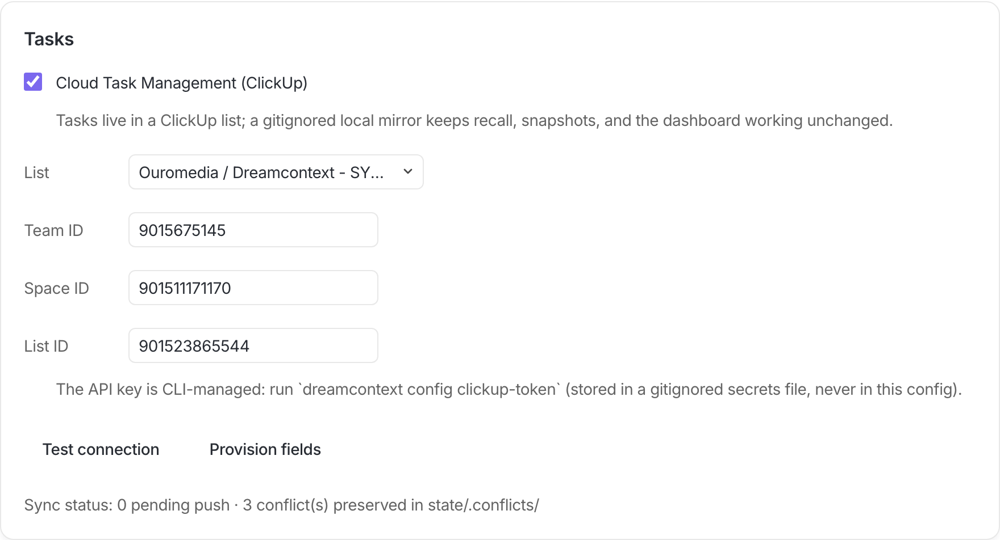
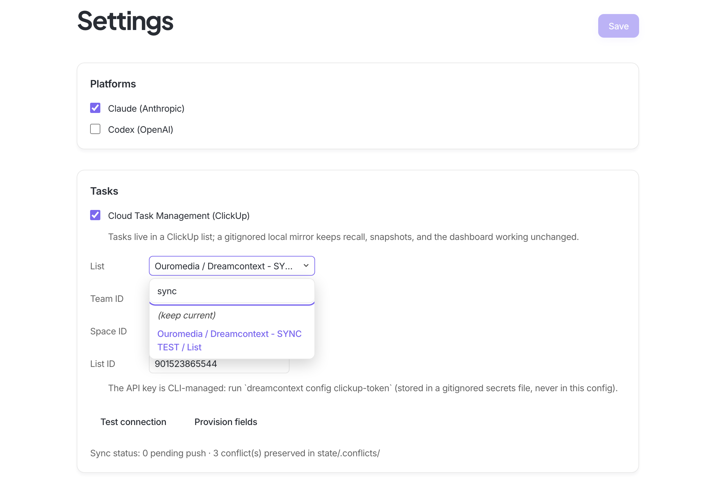
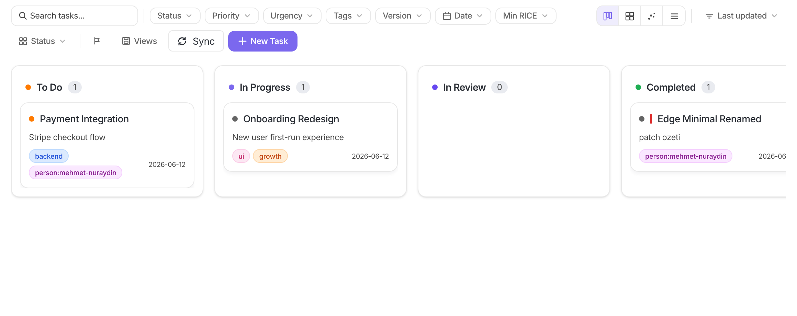
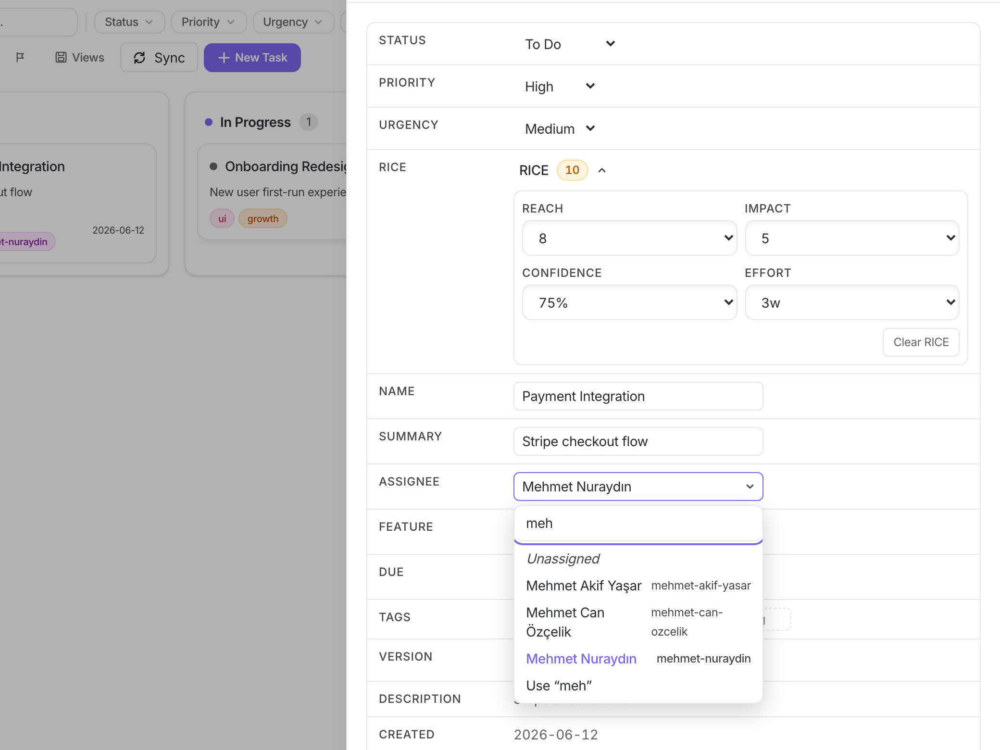
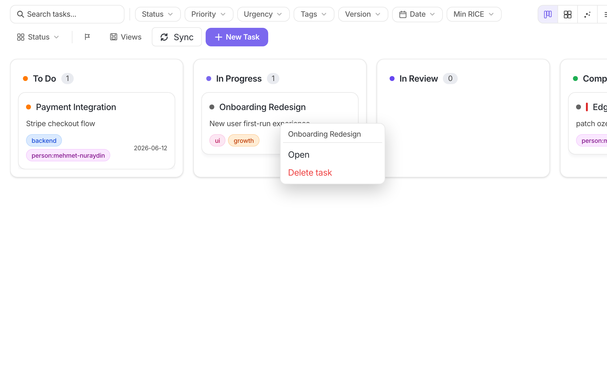
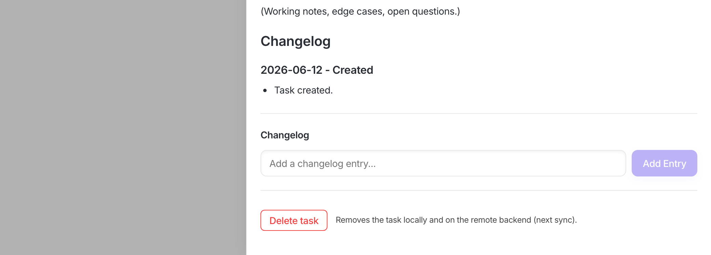

# ClickUp Task Sync — User Guide

dreamcontext tasks can live in a **ClickUp list** instead of (only) local
markdown files. Same CLI verbs, same dashboard, same recall/snapshot behavior
— backed by a gitignored local mirror and a two-way sync engine. This guide
walks through setup and daily use with screenshots. For the full technical
reference (field mappings, merge rules, limits) see
[remote-task-setup.md](remote-task-setup.md).

> Nothing here affects projects that don't enable it: with `taskBackend`
> unset, dreamcontext behaves byte-for-byte as before (golden-tested).

---

## 1. Enable it

### From the terminal (recommended — full guided onboarding)

```
$ dreamcontext config task-backend clickup

ℹ .gitignore updated (5 entries for the task mirror/sync state).
✓ Task backend set to clickup.
ℹ git sync hooks installed: post-commit, pre-push (best-effort, never block git).
? ClickUp API key (pk_…; goes to the gitignored secrets file — leave empty to add later): ████
✓ ClickUp token stored (••••••••RKBH).
✓ Connected to ClickUp as Mehmet Nuraydın.
ℹ Fetching your ClickUp workspaces…
? Which list should tasks sync to? (Use arrow keys)
❯ Ouromedia / Dreamcontext - SYNC TEST / List
  Ouromedia / OURO ALL / INBOX-OURO
  …
✓ Sync target: Ouromedia / Dreamcontext - SYNC TEST / List.
? Create the recommended custom fields on the list (urgency, summary, RICE, …)? (Y/n) y
✓ Created remote fields: Urgency, Summary, Reach, Impact, Confidence, Effort, RICE Score, Feature, Version
? Run the first sync now? 3 local task(s) will be created in the list. (Y/n) y
✓ Synced: 3 up, 0 down.
```

One command, ends in a working state. Notes:

- The **API key** goes to `_dream_context/state/.secrets.json` (mode 0600).
  The `.gitignore` entry is written **before** the secrets file exists — the
  key can never be committed, even transiently.
- The target list is **picked from your workspaces**, fetched live — no
  hunting ids out of URLs.
- Get a key from ClickUp: avatar → **Settings → Apps → API Token**.

### From the dashboard

Settings → **Tasks → Cloud Task Management (ClickUp)**:



- Toggle it on, then **pick the list** from the searchable dropdown (fetched
  from your workspaces — the ID fields below fill themselves):



- **Test connection** verifies the token; **Provision fields** creates the
  recommended custom fields (Urgency, Summary, RICE numbers, Feature,
  Version) and backfills values onto already-synced tasks.
- The API key itself is CLI-only by design — run
  `dreamcontext config clickup-token` once in the terminal.

---

## 2. Daily use

### Syncing

Sync is **never required for local work** — every task verb writes the local
mirror instantly and queues the change. The network runs only when a sync
triggers:

| Trigger | When |
|---|---|
| **Sync button** | Tasks board toolbar — only visible with a remote backend. Badge = pending changes. |
| `dreamcontext tasks sync` | manual, `push` / `pull` / `both` |
| git hooks | after every `git commit` / `git push` — best-effort, can **never** fail or block git |
| post-sleep | `sleep done` pushes consolidation updates and re-mirrors |



The button reports what happened: `↕ 2 up · 1 down`, `✓ up to date`, or
`⚠ …` with the error. Offline edits queue in a write-ahead log and replay
idempotently on the next successful sync.

### Assigning people

No manual mapping: every sync caches the list's members. Assign from the
task panel's searchable dropdown (Turkish-insensitive — "meh" finds
"Mehmet Nuraydın"):



The assignee field and the `person:<slug>` tag are **one concept** — picking
someone sets both; clearing removes both; a `person:` tag added anywhere
(CLI `tasks tag x person:mehmet-nuraydin`, dashboard tags row) assigns the
ClickUp member on the next sync. `person:` tags never appear as ClickUp tags
— ClickUp gets a real assignee.

> ClickUp only allows assigning people who can access the list — invite your
> teammates to the Space first. `dreamcontext tasks members` lists who's
> available.

### Everything else

| What | Where |
|---|---|
| Status, priority, urgency, RICE, version, due date, name, summary, feature, tags | task panel (all editable) / CLI verbs — synced both ways |
| Changelog entries (`tasks log`) | become ClickUp **comments** (union-merged, conflict-free) |
| Task body (Why / AC / Notes …) | ClickUp description; section-level 3-way merge |
| Custom fields (Urgency, RICE, …) | written/read automatically once they exist on the list (`tasks provision`) |

### Deleting tasks

Right-click any card, or use the **Delete task** button at the very bottom
of the task panel, or `dreamcontext tasks delete <name>`:




Deletion propagates **both ways**: deleting locally removes the ClickUp task
on the next sync; deleting in ClickUp removes the local mirror — and if the
local copy had unsynced edits, it is preserved under `state/.conflicts/`
first. Nothing is ever silently lost.

---

## 3. When both sides change (merge rules in one breath)

- **Comments/changelog**: union — both sides keep everything, no conflicts.
- **Status / assignee / fields**: the side that actually changed wins; if
  both changed, the later one wins (ClickUp server time).
- **Prose sections**: merged 3-way — disjoint edits both survive; the same
  section edited on both sides → ClickUp wins and your local version is
  saved to `state/.conflicts/` and surfaced (sync report, dashboard badge,
  sleep report).
- Everything a sync changes (including remote-originated edits and
  deletions) is journaled into the sleep ledger, so consolidation sees
  outside changes exactly like local ones.

## 4. Switching lists later

```bash
dreamcontext config clickup-list <teamId> <spaceId> <newListId> --migrate  # recreate everything in the new list
dreamcontext config clickup-list <teamId> <spaceId> <newListId> --keep     # tasks were moved inside ClickUp
```

Interactive runs ask; scripts must pass a flag (no half-states). `--migrate`
backs up the old id-map before resetting.

## 5. Turning it off

`dreamcontext config task-backend local` — asks whether to remove the git
hooks. Mirror files stay (they're your tasks); ClickUp keeps its copies;
nothing else changes.
