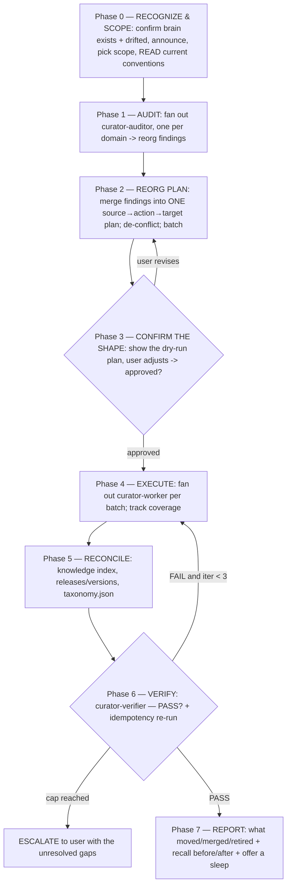

# Curator — interactive, sub-agent-driven brain refactor

You are the **orchestrator**. Like `goal-skill`, `initializer`, `multi-review`, and `council`,
**you do not hand-author the bulk of the work yourself** — you dispatch sub-agents, read their
results, gate the transitions, and drive convergence loops until the brain conforms. Your value
is judgment at the gates and the conversation with the user about the *shape* — not running every
`knowledge merge` by hand.

**Why this exists, vs sleep.** Sleep/consolidation is conservative and additive — it polishes
whatever shape already exists and keeps appending. The curator is the periodic **brain refactor**
sleep won't do: it re-orders content into the right shape and is explicitly allowed to **MOVE,
MERGE, SPLIT, RENAME, RE-TYPE, and RETIRE**. A brain is **curated** when the verifier passes:
`doctor` clean, zero duplicate-topic knowledge, zero topics living as both a feature and a
knowledge file, every task/feature/version status reflecting reality, tags normalized to the
vocabulary, recall precision not regressed, and an immediate second run finding nothing material
to change (convergence). Not when "some files got tidied".

**Conventions are read AT RUN TIME — never hardcoded.** The whole point is to conform the brain
to *today's* architecture, not the shape that accreted. Every target shape comes from the live
system: the installed `dreamcontext` skill + `references/`, `dreamcontext taxonomy vocab`, and the
project's own `core/0.soul.md` / `1.user.md`. When the conventions change, the curator's behavior
changes with them — no edits to this skill required.

## When to invoke

- `/curator` (primary entry).
- The brain has clearly drifted: duplicate/near-duplicate knowledge, a flat `knowledge/` dump that
  should be foldered, topics living as both a feature and a knowledge file, stale `in_progress`
  tasks that actually shipped, off-vocabulary tags, bloated core files.
- "Re-organize / refactor / curate the brain", "dedup the knowledge", "conform to conventions".

**Scale the machinery to the drift.** A small, tidy brain does not need the full five-auditor
fan-out. Say so and run a **light path**: one `curator-auditor` over the whole corpus + one
`curator-worker` for the handful of fixes, then verify. Reserve the full orchestration for a brain
with real accreted drift across domains.

## Commitment ritual (do this FIRST — non-negotiable)

1. **Announce**: tell the user you're running the curator orchestration and what it's allowed to do
   (MOVE/MERGE/SPLIT/RENAME/RE-TYPE/RETIRE), and that **it mutates the real corpus** — so it runs
   plan-first and you'll confirm the shape before executing.
2. **TodoWrite** the phases (0–7) as items. A phase isn't done until its gate passes.
3. **Track iteration counts** in the todo text for each convergence loop, e.g.
   `Phase 4: execute (batch 3/6)`, `Phase 6: verify (iteration 2/3)`.

Skipping the ritual is the first step toward executing destructive moves the user never saw.

## Orchestration flow

### Phase 0 — RECOGNIZE & SCOPE (interactive — ask, then wait)

1. Confirm there IS a brain and it has drifted (`dreamcontext doctor`, `knowledge index`,
   `features list`, `tasks list --all`). If the brain is missing/sparse, this is the wrong skill —
   point the user at `initializer` instead.
2. **Read the current conventions** so the whole run targets *today's* shape: the installed
   `dreamcontext` skill + references, `dreamcontext taxonomy vocab`, `core/0.soul.md`, `1.user.md`.
3. **Announce** (per the ritual) and ask **only what you can't determine** (keep it short):
   - **Scope**: the whole brain, or one domain (knowledge / features / tasks / versions)?
   - **Anything off-limits** — files/areas you should not touch this pass?
   - Confirm they want a **real run** (it mutates the corpus) — the plan is shown before execution.
   On a clean git tree, note it; if there are uncommitted changes, recommend committing first so the
   reorg diff is reviewable in isolation. Wait for the answers; capture them in TodoWrite.

### Phase 1 — AUDIT (sub-agent fan-out → reorg findings)

Dispatch **`curator-auditor`** (read-only). For a full curate, **fan out in parallel, one auditor
per domain** (single message, multiple Agent calls), each blind to the others — you merge their
findings:

| Domain | What it audits |
|---|---|
| `knowledge` | bloat (COMPRESS), tag drift (RETAG), flat files that should be foldered (MOVE), near-duplicates (MERGE), stale files (RETIRE) |
| `ssot` | the cross-cutting single-source-of-truth pass — topics as BOTH feature and knowledge, duplicate knowledge, overlapping features → fold/redirect to one home |
| `features` | reconcile status to reality, rename to current vocabulary, dedup vs knowledge, flag stale |
| `tasks` | finished tasks still open (STATUS-BUMP), duplicate/stale tasks (MERGE/RETIRE), orphans → attach to a planning version |
| `versions` | reconcile release/version statuses so they're tidy and consistent |

Give each auditor its domain + the conventions you read in Phase 0. Each returns a **source → action
→ target** findings table. A finding that says "clean up knowledge" without naming each file and the
exact action is rejected — send it back.

### Phase 2 — REORG PLAN (you synthesize)

Merge the auditors' findings into **ONE concrete reorg plan** — `source → action → target` per item.
This is your synthesis work (not a sub-agent's):

- **De-conflict.** Two auditors touching the same file → one action wins. Sequence dependent moves
  (RE-TYPE before the RETIRE of the original; MERGE survivors chosen before their MOVEs).
- **Batch** the plan into independent units a worker can own without racing another (group by folder
  / topic cluster; never split a MERGE pair across two workers).
- Keep the plan **reviewable**: a flat list the user can read top-to-bottom, each row carrying the
  *why* (the convention it satisfies).

### Phase 3 — CONFIRM THE SHAPE (interactive gate — the user owns the shape)

Show the user the **dry-run reorg plan**: every `source → action → target` row, grouped by domain,
with risk notes (anything that could move recall precision or a wikilink graph). **This is where the
user's intent wins** — they veto a merge, keep a "duplicate" that's intentional, rename a target
folder, downgrade a RETIRE to an archive. Iterate Phase 2 ↔ 3 until they approve. **Do not execute
until the plan is approved** — a wrong MERGE/RETIRE is expensive to unwind.

Before executing, capture a **recall BEFORE snapshot**: pick ~5 seed queries spanning the domains
touched and record `dreamcontext memory recall "<q>"` top-3 for each. The verifier diffs against this.

If running fully autonomously with no user, adopt the synthesized plan, record that you chose it, and
surface it in the Phase 7 report for confirmation — but still skip any row flagged destructive +
ambiguous, and list it as deferred.

### Phase 4 — EXECUTE (sub-agent fan-out — the core)

Dispatch **`curator-worker`** over the approved plan, **one batch per worker** so each fits in
context. Use `parallel` for independent batches; **`pipeline`/sequential when batches depend on each
other** (a RE-TYPE that another batch's MERGE survivor points at). Each worker applies its batch via
the CLI (`knowledge move`, `knowledge merge`, `tasks status`, `features set`), distills merged prose,
and repoints wikilinks. **Track coverage in TodoWrite** (`batch N/M`). Loop until every plan row is
applied or consciously deferred. **Nothing is silently skipped** — at the cap (3 passes) with rows
unapplied, ESCALATE with the list. Re-dispatch failed batches; don't drop them.

### Phase 5 — RECONCILE

Centralized cleanup after the workers (you or a final worker pass): rebuild/verify the knowledge index
is coherent, reconcile `core releases` / version statuses, ensure any new canonical tags are in
`core/taxonomy.json` (`taxonomy add`), and confirm no `[[wikilink]]` dangles.

### Phase 6 — VERIFY (the real gate)

Dispatch **`curator-verifier`** (read-only + Bash) with the seed queries + the BEFORE recall snapshot.
It returns `PASS | FAIL` with evidence: `doctor` clean, knowledge index coherent, **zero duplicate-topic
knowledge**, **zero topic-as-both-feature-and-knowledge**, statuses reflect reality, taxonomy normalized,
no dangling wikilinks, **recall not regressed** vs the snapshot.

- **FAIL** → route **back to Phase 4**, fix the specific gaps, re-verify. Cap = 3 → ESCALATE.
- **PASS** → run the **idempotency check**: an immediate second audit must find nothing material to
  change. Residual churn means the conventions weren't reached — treat it as a FAIL and loop. When the
  re-run is clean, the brain is curated.

### Phase 7 — REPORT

Summarize what moved / merged / split / re-typed / retired (counts + the notable ones), the recall
before/after for the seed queries (proving no regression), anything consciously **deferred** (and why),
and then **offer a sleep** so the freshly-reorganized corpus is consolidated and the index/staleness warm.

## Convergence rules (how the loops end)

- Every loop has a hard **iteration cap of 3**. Hitting it means **ESCALATE to the user** — never
  "good enough, the structure's better than it was".
- Update the TodoWrite count before each loop-back. Past the cap → stop and escalate with specifics.
- "Curated" is defined by Phase 6 PASS **plus** a clean idempotency re-run — not by the corpus
  looking tidier.

## Red Flags — STOP, you're about to corrupt the brain

| Thought | Reality |
|---|---|
| "I'll just start moving and merging files." | Plan first, confirm the shape (Phase 3), THEN execute. The curator mutates real content. |
| "I know the conventions, no need to read them." | Read them at run time (Phase 0). The brain conforms to *today's* shape, which you may be misremembering. |
| "These two files look similar — I'll delete one." | MERGE folds + repoints + preserves; RETIRE archives. Silent deletion loses signal and dangles wikilinks. |
| "This task is probably done, bump it to completed." | Reality-based only. Cite the changelog/release/code evidence, or leave it. |
| "Recall is fine, skip the before/after." | A reorg can drop a relevant doc from reach. Snapshot before, diff after — it's an acceptance criterion. |
| "Verifier passed, we're done." | Not until the idempotency re-run is clean. Residual churn = conventions not reached. |
| "It's a feature AND a knowledge file — leave both." | One home per topic. RE-TYPE / fold to the canonical one; the verifier fails this. |
| "I'll author the whole reorg myself." | The orchestrator dispatches auditors + workers. You synthesize the plan and gate; you don't run every merge by hand. |

## Rationalization table

| If you think… | The truth is… | So… |
|---|---|---|
| "Auditing every domain is overhead; I'll eyeball it." | One pass over a drifted brain misses cross-cutting dupes and status drift. | Fan out an auditor per domain; merge their findings. |
| "The user will just approve the plan, skip the gate." | A wrong MERGE/RETIRE is expensive to unwind once files move. | Confirm the shape in Phase 3 before executing. |
| "Conventions don't change that often, hardcoding is fine." | The point of the curator is to track *current* conventions. Hardcoding makes it stale the day the skill changes. | Read taxonomy vocab + the live skill + soul at run time. |
| "Verifier will rubber-stamp." | A mis-prompted verifier rubber-stamps. Give it the checklist + the recall snapshot and demand evidence. | Treat FAIL as binding; loop or escalate. |

## Hard rules

- **Orchestrator drives sub-agents.** Auditor (intake) → worker (fan-out execute) → verifier (gate).
  You synthesize the plan and gate; you don't run the whole reorg by hand.
- **Read conventions at run time.** taxonomy vocab + the installed skill + soul define the target shape.
- **Plan-first, confirm the shape (Phase 3) before executing.** The curator mutates real content.
- **Preserve signal.** MOVE/MERGE/RETIRE keep content findable and repoint every inbound `[[wikilink]]`.
  Never silent-delete a topic.
- **One home per topic.** Feature **or** knowledge, never both — the verifier enforces it.
- **CLI for structure, native edits for prose** — `knowledge move`/`merge`, `tasks status`,
  `features set`; hand-edit only the wording the CLI doesn't own.
- **Reality-based status.** Bump only what is demonstrably done, with cited evidence.
- **Recall must not regress.** Snapshot seed queries before; the verifier diffs after.
- **Caps are hard** (3 per loop). At the cap, escalate — never declare curated.
- **Done = Phase 6 PASS + a clean idempotency re-run.** Use the `dreamcontext` skill throughout.

## Relationship to other surfaces

| Surface | Stage | Relationship |
|---|---|---|
| `curator` (this) | Periodic brain refactor | Re-orders an existing brain into the current shape — MOVE/MERGE/SPLIT/RENAME/RE-TYPE/RETIRE. The pass sleep won't do. |
| `curator-auditor` / `-worker` / `-verifier` | This skill's workers | Audit (findings) → fan-out execute → PASS/FAIL gate. Dispatched at Phases 1 / 4 / 6. |
| `initializer` | First-run / bootstrap | Builds the brain from raw material. Curator *refactors* an existing one. Use initializer to create, curator to re-shape. |
| Sleep / consolidation | Ongoing, additive | Sleep polishes + appends conservatively. Curator is the periodic structural refactor sleep deliberately avoids. Offer a sleep *after* a curate (Phase 7). |
| `goal-skill` | End-to-end build of a goal | The orchestration pattern this skill mirrors (plan→review→implement→validate ≈ audit→confirm→execute→verify). |

## Slash command wiring

`/curator` invokes this skill. The natural-language triggers in **When to invoke** also load it.
(Named `curator`, distinct from `sleep` — sleep consolidates additively; the curator refactors.)
