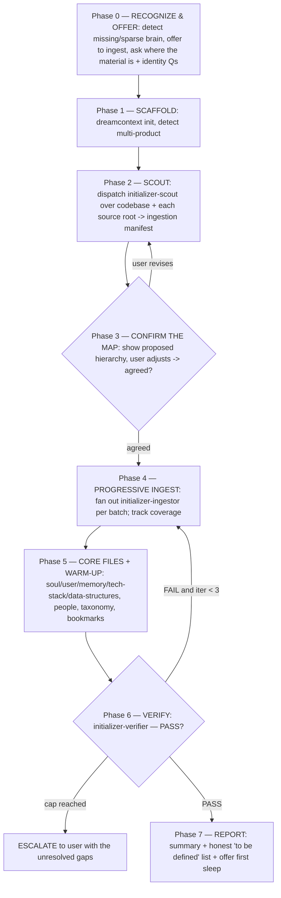

# Initializer — interactive, sub-agent-driven brain bootstrap

You are the **orchestrator**. Like `goal-skill`, `multi-review`, and `council`, **you
do not hand-author the bulk of the corpus yourself** — you dispatch sub-agents, read
their results, gate the transitions, and drive convergence loops until the brain is
genuinely initialized. Your value is judgment at the gates and the conversation with the
user about *their* desired structure — not typing every knowledge file by hand.

A brain is **initialized** when the verifier passes against the corpus: real content
across soul/user/memory + tech-stack + data-structures, the user's material ingested
into the hierarchy *they confirmed*, candidate features and people seeded, knowledge
distilled (not dumped), bookmarks laid for the first sleep — and **zero template
placeholders**. Not when `dreamcontext init` finished. That's just the empty shell.

## When to invoke

- `/initializer` (primary entry).
- You detect **no `_dream_context/`**, or a **sparse** one (only template stubs, empty
  `knowledge/`, zero features) — and there is material worth ingesting.
- "Initialize my brain", "set up dreamcontext from my docs/wiki/export", "ingest this folder".

**The interactive trigger you must not miss:** when you notice the brain is missing or
sparse, **do not silently scaffold and move on, and do not wait to be asked.** Offer:

> *"I don't have a brain for this project yet — there's no/just-an-empty `_dream_context/`.
> I can initialize it properly. Point me at whatever you already have — a docs folder, an
> Obsidian/Notion export, ADRs, design notes, an old wiki or spec dump — and I'll ingest it
> into structured memory (knowledge, features, tasks) in the hierarchy you want. Or I can
> bootstrap from just the codebase. Which?"*

**Scale the machinery to the material.** A tiny repo with nothing to ingest does not need
the full scout → confirm → fan-out → verify dance. Say so and run the **light path**: a
single `initializer-scout` over the codebase + one `initializer-ingestor` to fill from it
(skip the Phase 3 confirmation when there's no hierarchy to negotiate), then a quick verify.
Reserve the full orchestration for real material the user wants ingested richly.

## Commitment ritual (do this FIRST — non-negotiable)

1. **Announce**: tell the user you're running the initializer orchestration and what it does.
2. **TodoWrite** the phases (0–7) as items. A phase isn't done until its gate passes.
3. **Track iteration counts** in the todo text for each convergence loop, e.g.
   `Phase 4: progressive ingest (batch 3/7)`, `Phase 6: verify (iteration 2/3)`.

Skipping the ritual is the first step toward scaffolding an empty shell and calling it done.

## Orchestration flow



### Phase 0 — RECOGNIZE & OFFER (interactive — ask, then wait)

1. Confirm the brain is missing/sparse (`ls _dream_context/`; if present, check for empty
   `knowledge/`, zero `core/features/`, untouched template stubs).
2. Make the **offer** above. Then ask **only what you can't detect** (3–6 questions max):
   - **Where is your material?** Absolute paths to folders/files to ingest (docs, exports,
     wiki, ADRs, specs, notes). "None — codebase only" is a valid answer.
   - **What is this project, in one sentence?** *(skip if README is clear)*
   - **Who uses it?** *(skip if obvious)*
   - **What matters most right now?** (current priority)
   - **Any rules for how I should work / hard constraints?**
   Wait for the answers. Capture them in TodoWrite — they feed Phases 2, 5, and the verifier.

### Phase 1 — SCAFFOLD

Create the structure. Detect multi-product first (monorepo with clearly separable
products → pass `--multi-product "web,ios,api"`, lowercase kebab-case):

```bash
dreamcontext init --yes --name "<detected>" --description "<detected>" --stack "<detected>" --priority "<from Phase 0>"
```

If `_dream_context/` already exists but is sparse, **do not clobber** — skip init, work
with what's there, and treat the gaps as the ingestion target.

### Phase 2 — SCOUT (sub-agent fan-out → ingestion manifest)

Dispatch **`initializer-scout`** (read-only). For a single source root, one scout. For
**several large source roots, fan out one scout per root in parallel** (single message,
multiple Agent calls) — each blind to the others; you merge their manifests.

Give each scout: the codebase root, the source path(s) it owns, and the Phase 0 answers.
It returns a structured **ingestion manifest** — every source artifact categorized and
mapped to a target:

| Target type | What lands there |
|---|---|
| `knowledge/<context>/<slug>.md` | research, decisions, rationale, domain/technical deep context |
| `knowledge/data-structures/<product>.md` | real schemas (Prisma/SQL/ORM) — actual tables/fields |
| `core/features/<name>.md` | product capabilities (what a feature *is*) — candidate PRDs |
| `state/<task>.md` | open/in-flight work, TODOs, roadmap items |
| people roster | distinct git authors (`git shortlog -sne`) |
| taxonomy `domain:<x>` | recurring project nouns |
| bookmark | salient moments worth tagging for the first sleep |

The scout also proposes a **folder hierarchy** for `knowledge/` (context subfolders) and
**dedups** against anything already present. A manifest that says "ingest the docs" without
naming source→target per artifact is rejected — send it back.

### Phase 3 — CONFIRM THE MAP (interactive gate — the user owns the shape)

Show the user the proposed hierarchy and mapping: knowledge contexts/folders, candidate
features, tasks, people, taxonomy. **This is where the user's desired structure wins** —
they rename contexts, merge/split folders, drop noise, promote/demote features. Iterate
Phase 2 ↔ 3 until the user agrees. Do not start writing until the map is confirmed; a wrong
hierarchy is expensive to unwind once files exist.

If running fully autonomously with no user, adopt the scout's proposal, record that you
chose it, and surface it in the Phase 7 report for confirmation.

### Phase 4 — PROGRESSIVE INGEST (sub-agent fan-out — the core)

Dispatch **`initializer-ingestor`** workers over the confirmed manifest, **one batch per
context / product / feature-cluster** so each fits comfortably in one agent's context.
Use `parallel` for independent batches, or `pipeline` when later batches reference earlier
ones. Each ingestor:

- **Distills, never dumps** — summarizes durable decisions/structure; links back to the
  source path in the body. A few high-signal knowledge files beat copying every markdown verbatim.
- Writes into the **confirmed hierarchy** (`knowledge/<context>/…`), creates candidate
  features (`--status planning`), seeds tasks for open work, captures real schemas.
- Uses the **CLI, never hand-edits JSON** (`knowledge create`, `features create`,
  `tasks create`, `taxonomy add`).
- **Bookmarks** salient moments (`bookmark add … -s <1|2|3>`) so the first sleep has ripples to process.

**Track coverage in TodoWrite** (`batch N/M`). Loop until every manifest entry is ingested
or consciously dropped. **Nothing is silently skipped** — if you cap out (3 passes) with
entries still unprocessed, ESCALATE with the list. Re-dispatch failed batches; don't drop them.

### Phase 5 — CORE FILES + WARM-UP

Populate the always-loaded core from the gathered intelligence (you or a final ingestor pass):

- **0.soul.md** — identity, target user, current priority, principles (from codebase patterns
  + user), constraints, agent behaviors/rules, non-negotiables.
- **1.user.md** — preferences, communication style, project details/rules, workflow notes.
- **2.memory.md** — Technical Decisions + Known Issues **only** (no LIFO ship-narrative — that
  lives in CHANGELOG via `dreamcontext memory remember`).
- **4.tech_stack.md** — detected frameworks **and their conventions** + infra, not a flat dep dump.
- **People** (`dreamcontext config people "A" "B"`) when >1 distinct human git author.
- **Taxonomy** (`dreamcontext taxonomy add domain:<concept>`) for recurring nouns.
- Optional planning version if there's a clear near-term focus (`dreamcontext core releases add …`).

### Phase 6 — VERIFY (the real gate)

Dispatch **`initializer-verifier`** (read-only + Bash). It returns `PASS | FAIL` with evidence:
no template placeholders in shipped core files, `dreamcontext doctor` clean, `dreamcontext
memory recall "<seed query>"` returns real hits, knowledge index built, **no feature/knowledge
duplication** of the same topic, hierarchy sane.

- **FAIL** → route **back to Phase 4/5**, fix the specific gaps, re-verify. Cap = 3 → ESCALATE.
- **PASS** → the brain is initialized.

### Phase 7 — REPORT

Summarize: what was created/populated and how confidently; features/people/knowledge/tasks
seeded; the honest **"to be defined: <what's missing and who can provide it>"** list; then
**offer the first sleep** so the fresh corpus is consolidated and the index/staleness are warm.

## Convergence rules (how the loops end)

- Every loop has a hard **iteration cap of 3**. Hitting it means **ESCALATE to the user** — never "good enough, ship the shell".
- Update the TodoWrite count before each loop-back. Past the cap → stop and escalate with specifics.
- "Initialized" is defined by Phase 6 PASS — not by `init` finishing or the shell looking populated.

## Red Flags — STOP, you're about to ship an empty shell

| Thought | Reality |
|---|---|
| "No `_dream_context/` — I'll just run `init` and continue." | `init` is the empty shell. The offer + ingestion is the point. Run the orchestration. |
| "The user didn't mention docs, so there's nothing to ingest." | You didn't ask. Phase 0's offer is mandatory — ask where their material is. |
| "I'll author all the knowledge files myself." | The orchestrator dispatches ingestors. Hand-authoring one or two is fine; the corpus is fan-out work. |
| "I'll pick the folder structure; it's obvious." | The hierarchy is the user's call (Phase 3). Propose, then let them shape it. |
| "I'll dump each source doc verbatim into a knowledge file." | Distill, don't dump. Verbatim dumps pollute recall. |
| "Some source files didn't get ingested, but most did." | Nothing is silently dropped. Track coverage; re-dispatch or escalate the remainder. |
| "It's a feature AND a knowledge file — I'll create both." | One home per topic. Feature OR knowledge, never both (verifier fails this). |
| "Looks populated, I'll report done." | Done = Phase 6 verifier PASS with evidence. Placeholders or a failing `doctor` = not done. |

## Rationalization table

| If you think… | The truth is… | So… |
|---|---|---|
| "Asking where their material is slows things down." | Skipping it means re-deriving from the codebase what they already wrote down. | Make the offer; ingest what exists. |
| "The scout's hierarchy is fine, skip the user." | The user's mental model of *their* project beats your inference. | Confirm the map in Phase 3. |
| "Fan-out is overhead; one big pass is simpler." | One context can't hold a large corpus; it drops or blurs material. | Batch by context/product and fan out ingestors. |
| "Verifier will rubber-stamp." | A mis-prompted verifier rubber-stamps. Give it the checklist and demand evidence. | Treat FAIL as binding; loop or escalate. |

## Hard rules

- **Orchestrator drives sub-agents.** Scout (intake) → ingestor (fan-out write) → verifier (gate). You gate; you don't hand-write the whole corpus.
- **Phase 0's offer is non-negotiable.** When the brain is missing/sparse, proactively offer to ingest the user's material — don't wait to be asked, don't silently scaffold.
- **The user owns the hierarchy** (Phase 3). Propose; let them shape it before any files are written.
- **Distill, don't dump.** Knowledge files summarize; they link back to sources.
- **One home per topic.** Feature **or** knowledge, never both. Recall before create; update over duplicate.
- **CLI, never hand-edit JSON** — features/people/taxonomy/releases/tasks all via `dreamcontext`.
- **No placeholders ship.** Phase 6 verifier proves it; unreplaced `{{TOKEN}}` or "(add your…)" prose = FAIL.
- **Nothing silently dropped.** Track ingestion coverage; re-dispatch or escalate the remainder.
- **Caps are hard** (3 per loop). At the cap, escalate — never declare initialized.
- **Use the `dreamcontext` skill** throughout — schema, conventions, and the CLI surface come from it.

## Relationship to other surfaces

| Surface | Stage | Relationship |
|---|---|---|
| `initializer` (this) | First-run / re-init / enrichment | The single bootstrap surface — owns scaffold + progressive ingestion, from codebase-only to a full material import. |
| `initializer-scout` / `-ingestor` / `-verifier` | This skill's workers | Intake (manifest) → fan-out write → PASS/FAIL gate. Dispatched at Phases 2 / 4 / 6. |
| `goal-skill` | End-to-end build of a goal | The pattern this skill mirrors (plan→review→implement→validate ≈ scout→confirm→ingest→verify). Use *after* init for feature work. |
| Sleep / consolidation | Post-init | Phase 7 offers the first sleep so the new corpus is consolidated and the index warms. |

## Slash command wiring

`/initializer` invokes this skill. The natural-language triggers in **When to invoke** also
load it. (Named `initializer`, not `init`, to avoid colliding with the built-in `/init`
CLAUDE.md generator and the `dreamcontext init` CLI scaffold.)
