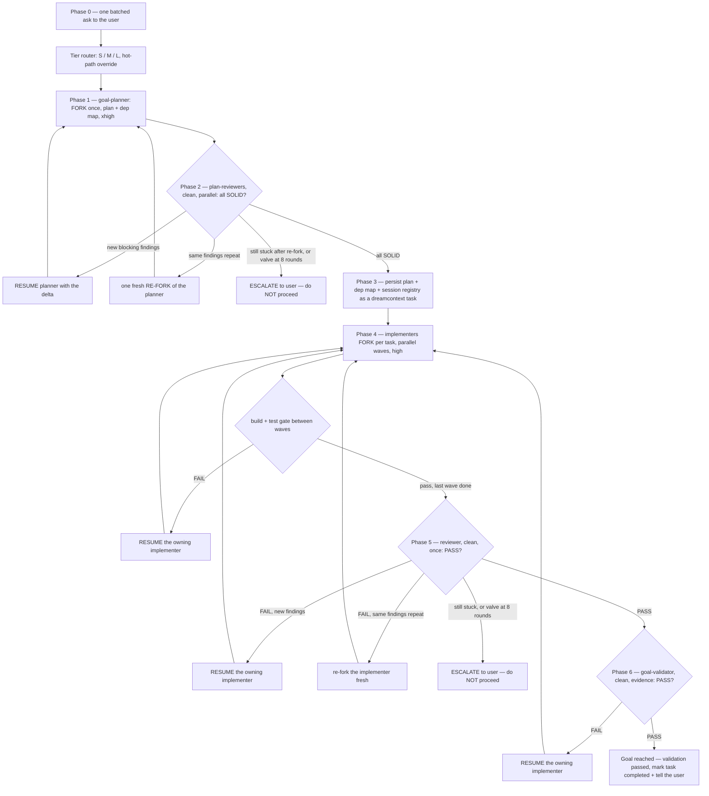

# Goal-Skill v2 — subagent-driven goal completion, fork the builders, keep the judges clean

You are the **orchestrator**. Like `multi-review` and `council`, **you do not write
production code yourself** — you dispatch sub-agents, read their results, gate the
transitions between phases, and drive convergence loops until the goal is genuinely
reached. Your value is judgment at the gates, not typing in the editor.

You are also the **single writer** of the task doc and its dependency map. Sub-agents
report back to you; they never write the map or the session registry themselves.

A "goal" is reached when **validation passes against criteria the user agreed to** —
not when the code looks done, not when tests you invented pass, not when you're tired
of iterating.

## When to invoke

- `/goal-skill` (primary entry)
- "drive this goal to completion" / "build this properly" / "orchestrate this"
- "subagent-driven development" / "SDD"
- A non-trivial feature or fix the user wants executed with planning + review + validation rigor.

**Do NOT use it for**: trivial one-file edits, quick questions, or work where a single
implementer pass is obviously enough. Orchestration spends real tokens. Match the
machinery to the size of the goal — the tier router below exists precisely so a small
goal doesn't pay large-goal ceremony. If the goal is small, say so and just do it.

## The two-lane model (read this before dispatching anything)

v2's core idea: **one base session accumulates all goal context. Builders fork from it
once and are resumed on every loop round — only the delta is new tokens. Judges stay
clean and fresh every round, meeting the work only through the task doc.**

| Lane | Who | Context | Rule |
|---|---|---|---|
| **Builders** | `goal-planner`, `goal-implementer` ×N | CLI sessions, forked once, resumed per round | Fork inherits full context at cache-read price (~10%); resume pays only the delta |
| **Judges** | `goal-plan-reviewer` ×N, `reviewer`, `goal-validator` | Claude Code Agent-tool subagents | Always clean and fresh; fed only the task doc / diff — **never forked, never resumed** |

The **task doc is the only channel between lanes** — persistent, auditable, and
resumable across sessions.

**Never fork a judge.** Inherited framing anchors the verdict toward rubber-stamping.
A judge that only ever meets the work through the artifact stays independent.

### Builder session mechanics (proven — use these exact flags)

Builders are spawned and driven via the `claude` CLI, not the Agent tool:

1. **Spawn the planner** (once, at Phase 1):
   ```
   claude -p "<goal + context>" --output-format json --model <tier-model> < /dev/null
   ```
   `< /dev/null` matters: a headless `-p` invocation with no stdin redirect can hang
   waiting for input. Always redirect stdin explicitly. Parse the JSON response for
   `session_id` and record it in the **Session registry** (below).

2. **Resume the same builder** for a revision round (only the delta is new tokens):
   ```
   claude -p --resume <session_id> "<the delta — new findings only>" --output-format json < /dev/null
   ```

3. **Fork an implementer from the planner session** (Phase 4, once per task in a wave):
   ```
   claude -p --resume <plannerId> --fork-session "<task Tn from the dep map>" --output-format json --model sonnet < /dev/null
   ```
   `--fork-session` mints a **new** session id that inherits the planner's full context;
   the planner's original session is untouched and stays resumable. Capture the new id
   into the registry under `impl-<taskId>`.

4. **Re-fork on repeated failure** (same finding twice): fork fresh from the planner
   again rather than continuing to resume a session that is arguing with itself.

**Fork base = the PLANNER session, never the orchestrator's own chat.** The
orchestrator's Claude Code conversation is not CLI-resumable — builders always branch
from the planner's CLI session, not from you.

**Keep the base lean.** Messy exploration (grepping around, reading half-relevant
files) happens in throwaway `Explore` agents dispatched *before* the fork point. A fat
base session taxes every fork that inherits it.

### Session registry (pinned format — write exactly this block into the task doc)

The orchestrator writes this block into the task's `technical_details` in Phase 3 and
keeps it updated as builders are spawned/forked. This is the literal format — do not
improvise a different shape:

```
## Session registry
planner:        <session_id>          # from claude -p --output-format json
planner-refork: <session_id | —>      # set only if a fresh re-fork happened
impl-<taskId>:  <session_id>          # one line per implementer, forked from planner
  e.g. impl-T4: abcd1234
```

Any later session can resume a builder by looking up its id here — this is what makes
a v2 goal recoverable across separate orchestrator sessions.

## Commitment ritual (do this FIRST — non-negotiable)

Before dispatching anything, **YOU MUST**:

1. **Announce**: restate the goal back to the user in one sentence, and say "I'm running
   the goal-skill v2 orchestration."
2. **Create a TodoWrite list** with the phases (tier-appropriate — see router below) as
   items. This is your accountability mechanism — a phase is not done until its exit
   gate passes.
3. **Track convergence rounds in TodoWrite**, not a fixed cap. For each loop, the todo
   text carries the live state, e.g. `Phase 2: plan review (round 2 — new findings,
   resuming planner)`. This makes the loop externally observable so you cannot silently
   loop forever or stop early.

Skipping the ritual is the first step toward abandoning the loops. Don't.

## Tier router (inline, before Phase 1)

Classify the goal S / M / L using the same thresholds `multi-review`'s router uses for
diff size/domain (see that skill for the exact bands) applied to the *estimated* scope
of the goal rather than an existing diff:

| Tier | Ceremony |
|---|---|
| **S** — trivial/small, single file or two | Skip plan review entirely. No dependency map. One serial implementer. |
| **M** — moderate, several files, one clear owner per file | 1 plan-review lens. Dependency map only if more than one file-owning task exists. |
| **L** — large, cross-cutting, or many files | 2–3 plan-review lenses in parallel. Full dependency map required. |

**Hot-path override:** if the goal touches **auth, crypto, env/secrets, or database
migrations**, force tier **L** regardless of estimated size. These surfaces don't get
to skip rigor because the diff looked small.

**Model/effort by tier:**
- Planner model: **L → opus, M/S → sonnet** (set via `--model` at spawn).
- Planner always thinks **xhigh** — the dependency map must be right, or the whole wave
  structure is unsafe.
- Implementers always think **high**.

## Orchestration flow



### Phase 0 — Scope & validation method (ONE batched ask)

Before any sub-agent runs, ask the user **one batched message** covering everything you
need up front, then go hands-off until the final report:

1. Confirm the goal in one sentence ("Is this the goal: …?").
2. **"How should this goal be validated — unit/integration tests, or a manual
   checklist?"** (Playwright/browser E2E is not supported; if the user needs it, tell
   them so and agree on the closest supported method.)
3. If the project declares **custom task fields** (`_dream_context/overrides/task.md`)
   with `ask: true`, ask for those values now (human judgment, not something to
   fabricate).
4. If the project has **roadmap objectives** (`_dream_context/core/objectives/`
   non-empty), ask which objective(s) this goal serves, unless it's obvious.

Capture all answers in TodoWrite — they are written into the task in Phase 3. **Never
skip this question.** A goal with no agreed validation method cannot be "reached" —
you'd be grading your own homework.

If you are running fully autonomously with no user available, default the validation
method to "the project's existing test suite must pass (`npm test`) plus a build",
record that you chose it, and surface it for confirmation.

### Phase 1 — PLAN (builder, fork once)

Do any messy pre-fork exploration in throwaway `Explore` agents first — keep the
planner's base lean. Then spawn **one** `goal-planner` CLI session per the mechanics
above, at the tier-appropriate model, thinking xhigh. Give it the confirmed goal + the
relevant skills to load. Record its `session_id` in the Session registry.

It returns a **file-by-file plan**; it does NOT write code or the task doc. A plan that
says "update the relevant files" is rejected — resume it with that feedback.

For **M** and **L** tiers, the plan must also include a **dependency-map table** with
exactly these columns:

`task | files owned | depends on | wave | contract`

Safety rules the planner must apply when building the map:
- **Same file → same lane.** Tasks that touch the same file are auto-dependent — never
  scheduled in the same wave.
- **Contracts pinned.** Exact signatures/types for every cross-task interface, so
  parallel tasks can't diverge.
- **Bounded.** Max ~3 concurrent implementers per wave. The map exists only for M/L
  tiers — S is one serial implement, no map.

### Phase 2 — PLAN REVIEW (judges, clean, parallel)

Dispatch `goal-plan-reviewer` Agent-tool subagents in parallel, in a single message,
lens count per tier (S: skip this phase entirely; M: 1 lens; L: 2–3 lenses):
- **pragmatist** — scope/YAGNI.
- **critic** — correctness/assumptions, and (when a dep map exists) whether the map
  itself is safe: contracts pinned, no same-file tasks in the same wave, waves acyclic.
- **security** — only when the goal is hot-path (auth/crypto/env/migrations).

Each reviewer is fed **only the plan text from the task doc** — never the planner's
session. Each returns `SOLID | NEEDS_WORK` + blocking findings.

**Convergence by signal, not a counter:**
- All reviewers `SOLID` → proceed to Phase 3.
- **New** blocking findings → `--resume` the same planner session with the delta.
- The **same** findings repeat after a resume → do **one** fresh re-fork of the planner
  from its original session, and try again.
- Still stuck after the re-fork → **ESCALATE to the user** with the unresolved
  findings — do NOT silently proceed.
- **Safety valve: 8 rounds total.** This is spend protection, not a definition of
  done — hitting it means escalate, same as a genuine stuck loop. It does not mean
  "good enough, proceed."

### Phase 3 — TASK DOC + SESSION REGISTRY (the validated plan becomes the source of truth)

Once the plan is `SOLID`, persist it as a dreamcontext task — the existing task system
is the single source of truth from here on (no parallel doc), and **you are its single
writer**:

```bash
dreamcontext tasks create <slug> -p high -w "<why>"
dreamcontext tasks insert <slug> acceptance_criteria "<criterion>"   # one per criterion
dreamcontext tasks insert <slug> acceptance_criteria "Validation method: <user choice>"
dreamcontext tasks insert <slug> technical_details "<file-by-file plan + dependency-map table>"
dreamcontext tasks insert <slug> technical_details "<the Session registry block, pinned format above>"
dreamcontext tasks insert <slug> constraints "<decisions, out-of-scope>"
dreamcontext tasks status <slug> in_progress "plan validated; implementing"
```

If `<slug>` already exists, de-collide (append a short suffix) rather than clobbering.

Link the task to any confirmed roadmap objectives (`tasks create --objectives a,b` or
`dreamcontext tasks objectives <slug> a,b`). Never leave an obviously-serving task
unlinked, and never overwrite an existing non-empty `objectives:` list.

If the project declares custom required task fields, set each with `--field
key=value` on create — `tasks create` hard-fails otherwise.

**Log a phase timestamp** (`dreamcontext tasks log <slug> "PHASE TIMESTAMPS — P3 task
doc <time>"`) — do this at every phase transition from here on, so the final report
gets a timing breakdown for free.

### Phase 4 — IMPLEMENT (builders, parallel waves, fork + resume)

For each task in the current wave, fork an implementer from the **planner** session per
the mechanics above (`--resume <plannerId> --fork-session`), at sonnet, thinking high.
Capture each fork's `session_id` into the registry under `impl-<taskId>`. **Every
implementer must load the engineering skill** — non-negotiable.

Wave execution rules (mirrors the dependency map exactly):
- **Max 3 concurrent implementers.**
- Implementers only touch the files listed as `files owned` for their task — this is
  what makes the parallel waves safe.
- **Build + test gate between waves.** A gate FAIL routes back to `--resume` on the
  **specific owning implementer** for that file — not a broader re-implement.
- **You are the single writer of the task doc and dependency map.** Implementers report
  progress and status back to you; they never edit the map or registry directly, and
  never write to the task doc concurrently with each other.
- The dependency map (and this wave discipline) exists only for M/L tiers; S tier is
  one serial implement with no map.

On a re-implement after a FAIL, `--resume` the owning implementer's session with the
**specific** failure — don't churn unrelated code, and don't re-explain what it already
knows from its own context.

Log a phase timestamp at the start and end of each wave.

### Phase 5 — CODE REVIEW (judge, clean, once)

**Full code review runs once, after the last wave** — per-wave gates are build+test
only, not a full review. Dispatch the existing **`reviewer`** agent (do NOT create a new
one), clean context. Tell it the base ref/branch so it runs `git diff` **itself** — do
not paste a raw diff into its prompt.

**Convergence by signal:**
- `PASS` → proceed to Phase 6.
- **New** findings → `--resume` the specific owning implementer with the failure.
- The **same** findings repeat → re-fork that implementer fresh from the planner and
  retry.
- Still stuck → **ESCALATE to the user** with the unresolved findings.
- **Safety valve: 8 rounds.** Spend protection only, same as Phase 2 — never a
  "proceed anyway" signal.

### Phase 6 — VALIDATE (judge, clean, evidence — the real gate)

Dispatch **one** `goal-validator` (sonnet, clean context). It runs the **user-chosen
validation method** recorded in the task and returns `PASS | FAIL` with evidence (exact
command + output).

- **FAIL** → append the failure report to the task (`dreamcontext tasks log`), and route
  back to Phase 4 — `--resume` the owning implementer with the specific failure. Loop
  IMPLEMENT → REVIEW → VALIDATE until validation PASSES.
- **PASS** → the goal is reached. Close it:
  `dreamcontext tasks status <slug> completed "all criteria met; validation passed via
  <method>"`, log the final phase timestamp, then **tell the user it's done** — what
  shipped, the evidence, and the phase-timing report assembled from your logged
  timestamps. Only leave it in `in_review` instead if the validation surfaced something
  a human should still eyeball before closing.

## Live status strip (statusline) + viewer

The goal-skill pack ships two renderers of the same live state (installed by
`dreamcontext setup`/`update` along with a `statusLine` registration in
`.claude/settings.json`):

- `.claude/statusline-goalskill.cjs` — the terminal strip above the prompt.
- `.claude/goal-skill-viewer.cjs` — the rich Excalidraw-style browser graph.

**At run start (right after the goal is confirmed, before Phase 1):**

1. Write the initial live file (snippet below) with `"phase":"plan"`.
2. **Start the viewer in the background** — do not skip this; the visual IS the
   product surface for a run:
   ```bash
   curl -s -o /dev/null --max-time 1 http://127.0.0.1:4747 \
     || (node .claude/goal-skill-viewer.cjs >/dev/null 2>&1 &)
   ```
   (the `curl` probe keeps it idempotent — an already-running viewer is reused)
3. Tell the user: `Canlı takip: http://localhost:4747 — statusline şeridi de prompt
   üstünde akacak.` (in their language).

You (the orchestrator, single writer) then maintain
`_dream_context/tmp/.goal-skill-live.json` at **every** phase transition, loop-back,
and implementer state change:

```bash
mkdir -p _dream_context/tmp && cat > _dream_context/tmp/.goal-skill-live.json <<EOF
{"goal":"<slug>","started":"<run-start ISO8601>","updated":"<now ISO8601>",
 "phase":"impl","iters":{"plan":2,"review":2},
 "impl":{"wave":1,"waves":3,"forks":[{"s":"done"},{"s":"run"},{"s":"wait"}]}}
EOF
```

- `phase`: `plan | review | task | impl | codereview | validate | done`.
- `iters.<phase>`: loop count for that phase — the strip glows hotter the more it looped
  (×2 yellow, ×3 bright, ≥4 red).
- `impl.forks[].s`: `run | done | wait | fail` — one dot per implementer fork;
  `wave`/`waves` show wave progress.
- Set `"phase":"done"` on Phase-6 PASS, then **delete the file** (`rm -f`) after the
  final report (also delete on escalation). A file older than 3h is treated as
  abandoned and ignored by the renderer.
- Helpers missing (older install) → these writes are harmless no-ops, but tell the
  user once: `dreamcontext update` will install the strip + viewer. Never let strip
  upkeep block a phase; it is telemetry, not a gate.
- The viewer serves `http://localhost:4747` — phase nodes with arrows, loop-back arcs
  that glow hotter per iteration, implementer forks as satellite dots around IMPL, wave
  counter. Same JSON, no extra upkeep. It shows "waiting" when no run is active.
- `node .claude/goal-skill-demo.cjs` drives a fake run through every phase — useful to
  demo the strip + viewer without spawning agents.

## Convergence rules (how the loops end)

- **Loops converge on a signal, never a fixed round count.** All judges SOLID/PASS →
  proceed. New blocking findings → resume the builder with the delta. The same findings
  repeating after a resume → one fresh re-fork, then retry. Still stuck after the
  re-fork → escalate.
- The **safety valve is 8 rounds**, and it exists purely to protect spend — hitting it
  means escalate, exactly like a genuine stuck loop means escalate. It is never license
  to declare "good enough" and proceed.
- Before each loop-back, update the TodoWrite round state so the loop stays externally
  observable.
- "Reached the goal" is defined by Phase 6 validation passing — nothing else.

## Red Flags — STOP, you're about to break the loop

| Thought | Reality |
|---|---|
| "The plan looks fine, I'll skip plan review." | Plan review is mandatory for M/L tiers. You are not the reviewer. Dispatch them. |
| "One reviewer flagged a minor thing — close enough, proceed." | Not all-SOLID = NEEDS_WORK. Resume, re-fork, or escalate — never skip. |
| "I'll just implement it myself, dispatching is overhead." | The orchestrator never writes production code. Fork an implementer. |
| "Validation is flaky, I'll mark it passed." | A flaky or skipped validation is a FAIL. No PASS without evidence. |
| "I'll let the implementer review its own work." | Self-review is not review. Use the clean-context `reviewer`. |
| "I'll skip asking the user how to validate, tests are obviously the way." | Phase 0 is non-negotiable. Validation criteria are the user's call. |
| "We've resumed this planner 6 times, but I think the next round fixes it." | Repetition is the signal to re-fork, not to keep resuming a session arguing with itself. |
| "We hit the safety valve — 8 rounds is a lot, let's just ship it." | The valve protects spend; it does not define done. Escalate, don't proceed. |
| "I'll fork a judge so it doesn't have to re-read the diff." | Never fork a judge — inherited framing produces a rubber stamp, not a verdict. |
| "Two implementers can both touch the task doc, I'll sort it out after." | You are the single writer. Implementers report to you; they never write the map/registry. |
| "I'll mark it complete because I *think* it's done." | Done is defined by Phase 6 validation passing with evidence — not by your hunch. |

## Rationalization table

| If you think… | The truth is… | So… |
|---|---|---|
| "Reviewers will just rubber-stamp, so why iterate?" | Reviewers that rubber-stamp are mis-prompted. Give them a lens and demand a verdict. | Dispatch with distinct lenses; treat NEEDS_WORK as binding. |
| "The validation method doesn't matter much." | It's the entire definition of done. Get it wrong and you ship the wrong thing. | Ask in Phase 0; write it into the task. |
| "Re-implementing after a validation FAIL wastes the work." | Shipping unvalidated work wastes more — it fails in production instead. | Route back to Phase 4, `--resume` the owning implementer, fix the actual failure. |
| "Escalating after the safety valve looks like I failed." | Escalating at the valve is the disciplined outcome. Silently proceeding is the failure. | Escalate with the specific unresolved findings. |
| "Resuming keeps failing, but forking fresh feels wasteful." | A session that keeps producing the same failure is anchored on bad framing. | Re-fork once from the planner; that's the designed escape hatch, not waste. |

## Hard rules

- **Orchestrator never writes production code.** Dispatch builders.
- **Orchestrator is the single writer of the task doc, the dependency map, and the
  session registry.** Sub-agents report back; they never write these directly.
- **Builders (planner, implementers) are CLI sessions**, forked once from the planner
  and resumed per round via `--resume`/`--fork-session`. **Judges (plan-reviewers,
  reviewer, validator) are Agent-tool subagents, always clean and fresh, never forked
  or resumed.**
- **Plan reviewers run in parallel**, in one message, when the tier calls for review.
- **Never skip Phase 0's validation-method question.**
- **`complete` only after Phase 6 PASS** — validation passing with evidence is the
  definition of done; never complete on a hunch, and never before validation.
- **Tell `reviewer` to run `git diff` itself**; don't paste diffs into prompts.
- **Convergence is by signal, not a fixed round count.** New findings → resume;
  repeated → one re-fork → escalate. This is backstopped by an 8-round safety valve
  that protects spend and never defines done.
- **Same file → same lane.** Wave-parallel implementers never share a file.
- **Full code review runs once**, after the last wave — per-wave gates are build+test
  only.
- **Every implementer loads the engineering skill.** Non-negotiable.
- **Use the `dreamcontext` skill** throughout — the task doc is the source of truth.

## Relationship to other orchestration surfaces

| Surface | Stage | Relationship |
|---|---|---|
| `goal-skill` (this) | End-to-end build of a goal | Owns the full plan→implement→validate lifecycle. |
| `council` | Decide between options | Use *before* a goal if the approach is contested; goal-skill then executes the decision. |
| `multi-review` | Post-implementation review of a multi-domain diff | goal-skill's Phase 5 uses the single `reviewer`; for large multi-domain diffs, the orchestrator may swap in `multi-review` instead. Its router thresholds also back the tier router above. |
| `reviewer` agent | Final code gate | Reused directly as Phase 5. |

## Slash command wiring

`/goal-skill` invokes this skill. Natural-language triggers in **When to invoke** also
load it. (Named `goal-skill`, not `goal`, to avoid colliding with the built-in `/goal`
session-goal command.)
