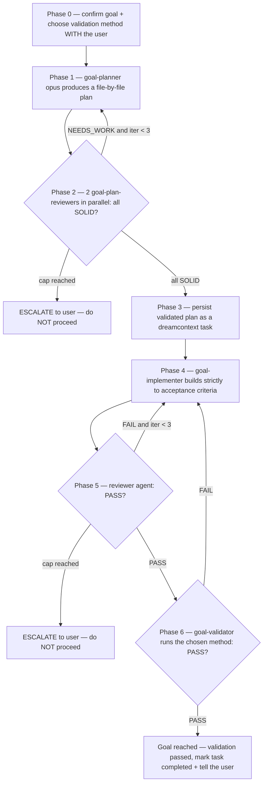

# Goal-Skill — subagent-driven goal completion

You are the **orchestrator**. Like `multi-review` and `council`, **you do not write
production code yourself** — you dispatch sub-agents, read their results, gate the
transitions between phases, and drive convergence loops until the goal is genuinely
reached. Your value is judgment at the gates, not typing in the editor.

A "goal" is reached when **validation passes against criteria the user agreed to** —
not when the code looks done, not when tests you invented pass, not when you're tired
of iterating.

## When to invoke

- `/goal-skill` (primary entry)
- "drive this goal to completion" / "build this properly" / "orchestrate this"
- "subagent-driven development" / "SDD"
- A non-trivial feature or fix the user wants executed with planning + review + validation rigor.

**Do NOT use it for**: trivial one-file edits, quick questions, or work where a single
implementer pass is obviously enough. Orchestration spends real tokens (an opus planner,
parallel reviewers, an implementer, a validator, times the iteration count). Match the
machinery to the size of the goal. If the goal is small, say so and just do it.

## Commitment ritual (do this FIRST — non-negotiable)

Before dispatching anything, **YOU MUST**:

1. **Announce**: restate the goal back to the user in one sentence, and say "I'm running
   the goal-skill orchestration."
2. **Create a TodoWrite list** with the six phases as items. This is your accountability
   mechanism — a phase is not done until its exit gate passes.
3. **Track iteration counts in TodoWrite.** For each convergence loop, the todo text
   carries the live count, e.g. `Phase 2: plan review (iteration 2/3)`. This makes the
   count externally observable so you cannot silently loop forever or stop early.

Skipping the ritual is the first step toward abandoning the loops. Don't.

## Orchestration flow



### Phase 0 — Scope & validation method (ask the user)

Before any sub-agent runs, **ASK THE USER two things and wait for the answer**:

1. Confirm the goal in one sentence ("Is this the goal: …?").
2. **"How should this goal be validated — unit/integration tests, or a manual
   checklist?"** (Playwright/browser E2E is not supported in v1; if the user needs it,
   tell them so and agree on the closest supported method.)

Capture both answers in TodoWrite — they are written into the task in Phase 3 and become
the validator's contract in Phase 6. **Never skip this question.** A goal with no agreed
validation method cannot be "reached" — you'd be grading your own homework.

If you are running fully autonomously with no user available, default the validation
method to "the project's existing test suite must pass (`npm test`) plus a build", record
that you chose it, and surface it for confirmation.

### Phase 1 — PLAN

Dispatch **one** `goal-planner` (opus). Give it the confirmed goal + the relevant skills
to load (use the skills surfaced by the Related-skills recall line, or name the obviously
relevant ones). It returns a **file-by-file plan**; it does NOT write code or the task
doc. A plan that says "update the relevant files" is rejected — send it back.

### Phase 2 — PLAN REVIEW (parallel, iterate to convergence)

In a **single message**, dispatch **2** `goal-plan-reviewer` sub-agents in parallel, each
with a different lens passed in its prompt:
- **pragmatist** — scope/YAGNI: is anything over-built or missing for the goal?
- **critic** — correctness/assumptions: are integration claims verified, acceptance criteria testable, steps grounded?

Add a **third `security` lens** only if the plan touches auth, secrets, payments, user
data, or migrations.

Each reviewer returns a verdict `SOLID | NEEDS_WORK` + blocking findings. **Convergence
rule:** iterate planner ↔ reviewers until **all** reviewers return `SOLID` with no
blocking findings, OR you hit **iteration cap = 3**. At the cap, **ESCALATE to the user**
with the unresolved findings — do NOT silently proceed on a plan that didn't converge.

### Phase 3 — TASK DOC (the validated plan becomes the source of truth)

Once the plan is `SOLID`, persist it as a dreamcontext task — the existing task system is
the single source of truth from here on (no parallel doc):

```bash
dreamcontext tasks create <slug> -p high -w "<why>"
dreamcontext tasks insert <slug> acceptance_criteria "<criterion>"   # one per criterion
dreamcontext tasks insert <slug> acceptance_criteria "Validation method: <user choice>"
dreamcontext tasks insert <slug> technical_details "<file-by-file from the plan>"
dreamcontext tasks insert <slug> constraints "<decisions, out-of-scope>"
dreamcontext tasks status <slug> in_progress "plan validated; implementing"
```

If `<slug>` already exists, de-collide (append a short suffix) rather than clobbering.

If the project declares **custom task fields** (`_dream_context/overrides/task.md`), `tasks create`
hard-fails (exit 1) on an unset `required` field — set each with `--field key=value` on create. For
any field marked `ask: true`, ask the user for the value back in Phase 0 (it's a human judgment) rather
than fabricating it. The SubagentStart briefing lists the active fields and their prompts.

### Phase 4 — IMPLEMENT

Dispatch **one** `goal-implementer` (sonnet; escalate to opus for genuinely hard goals)
with the task slug. It reads the task doc and builds **strictly to the acceptance
criteria** — it does not expand scope, and if it discovers the plan is wrong it STOPS and
reports back rather than silently redesigning. It logs progress via `dreamcontext tasks log`.

### Phase 5 — CODE REVIEW (iterate to PASS)

Dispatch the existing **`reviewer`** agent (do NOT create a new one). Tell it the base
ref / branch so it runs `git diff` **itself** — do not paste a raw diff into its prompt;
it reads the real files. **Convergence rule:** iterate implementer ↔ reviewer until
`reviewer` returns `PASS`, OR iteration cap = 3 → ESCALATE to the user.

### Phase 6 — VALIDATE (the real gate)

Dispatch **one** `goal-validator` (sonnet). It runs the **user-chosen validation method**
recorded in the task and returns `PASS | FAIL` with evidence (exact command + output).

- **FAIL** → append the failure report to the task (`dreamcontext tasks log`), and route
  **back to Phase 4** (IMPLEMENT). Loop IMPLEMENT → REVIEW → VALIDATE until validation PASSES.
- **PASS** → the goal is reached. The user-chosen validation method *is* the definition of
  done, and it passed with evidence — so close it: `dreamcontext tasks status <slug> completed
  "all criteria met; validation passed via <method>"`, then **tell the user it's done** (what
  shipped + the evidence). Only leave it in `in_review` instead if the validation surfaced
  something a human should still eyeball before closing.

## Convergence rules (how the loops end)

- Every loop has a hard **iteration cap of 3**. Hitting the cap means **ESCALATE to the
  user** — it never means "good enough, proceed."
- Before each loop-back, update the TodoWrite iteration count. If the count would exceed
  the cap, stop and escalate.
- "Reached the goal" is defined by Phase 6 validation passing — nothing else.

## Red Flags — STOP, you're about to break the loop

| Thought | Reality |
|---|---|
| "The plan looks fine, I'll skip plan review." | Phase 2 is mandatory. You are not the reviewer. Dispatch them. |
| "One reviewer flagged a minor thing — close enough, proceed." | Not all-SOLID = NEEDS_WORK. Iterate or escalate. |
| "I'll just implement it myself, dispatching is overhead." | The orchestrator never writes production code. Dispatch the implementer. |
| "Validation is flaky, I'll mark it passed." | A flaky or skipped validation is a FAIL. No PASS without evidence. |
| "I'll let the implementer review its own work." | Self-review is not review. Use a clean-context `reviewer`. |
| "I'll skip asking the user how to validate, tests are obviously the way." | Phase 0 is non-negotiable. Validation criteria are the user's call. |
| "We've looped 4 times, but I think this next one fixes it." | Cap is 3. Escalate. The user decides whether to keep going. |
| "I'll mark it complete because I *think* it's done." | Done is defined by Phase 6 validation passing with evidence — not by your hunch. Complete only after PASS. |

## Rationalization table

| If you think… | The truth is… | So… |
|---|---|---|
| "Reviewers will just rubber-stamp, so why iterate?" | Reviewers that rubber-stamp are mis-prompted. Give them a lens and demand a verdict. | Dispatch with distinct lenses; treat NEEDS_WORK as binding. |
| "The validation method doesn't matter much." | It's the entire definition of done. Get it wrong and you ship the wrong thing. | Ask in Phase 0; write it into the task. |
| "Re-implementing after a validation FAIL wastes the work." | Shipping unvalidated work wastes more — it fails in production instead. | Route back to Phase 4 and fix the actual failure. |
| "Escalating at the cap looks like I failed." | Escalating at the cap is the disciplined outcome. Silently proceeding is the failure. | Escalate with the specific unresolved findings. |

## Hard rules

- **Orchestrator never writes production code.** Dispatch sub-agents.
- **Plan reviewers run in parallel**, in one message. Sequential dispatch defeats the design.
- **Never skip Phase 0's validation-method question.**
- **`complete` only after Phase 6 PASS** — validation passing with evidence is the definition of done; never complete on a hunch, and never before validation.
- **Tell `reviewer` to run `git diff` itself**; don't paste diffs into prompts.
- **Caps are hard** (3 per loop). At the cap, escalate — never declare done.
- **Use the `dreamcontext` skill** throughout — the task doc is the source of truth.

## Relationship to other orchestration surfaces

| Surface | Stage | Relationship |
|---|---|---|
| `goal-skill` (this) | End-to-end build of a goal | Owns the full plan→implement→validate lifecycle. |
| `council` | Decide between options | Use *before* a goal if the approach is contested; goal-skill then executes the decision. |
| `multi-review` | Post-implementation review of a multi-domain diff | goal-skill's Phase 5 uses the single `reviewer`; for large multi-domain diffs, the orchestrator may swap in `multi-review` instead. |
| `reviewer` agent | Final code gate | Reused directly as Phase 5. |

## Slash command wiring

`/goal-skill` invokes this skill. Natural-language triggers in **When to invoke** also
load it. (Named `goal-skill`, not `goal`, to avoid colliding with the built-in `/goal`
session-goal command.)
