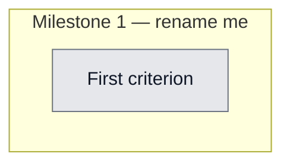

## Workflow
<!-- The shape of this task at a glance. One node per acceptance criterion, grouped under milestone subgraphs. Update node classes as work progresses: `:::done` (green), `:::active` (amber), `:::todo` (gray), `:::blocked` (red). Run `dreamcontext tasks doctor` to verify sync. -->

## Why
<!-- What problem does this solve? What breaks if we don't do it? Be concrete — name the user, the friction, the cost. One paragraph beats five bullets. -->

{{WHY}}

## User Stories
<!-- Who benefits, what they can do, why it matters. Format: As a <role>, I can <action>, so that <outcome>. Tick the box when the story is demonstrably true in the running system. -->

- [ ] As a [role], I can [action], so that [outcome]

## Acceptance Criteria
<!-- The contract. Each line is testable, observable, and gets a node in the Workflow flowchart above. Tick `[x]` AND flip the node to `:::done` in the same edit. -->

- [ ] First criterion (matches node A1 in Workflow)

## Constraints & Decisions
<!-- LIFO: newest decision at top. Format: **[YYYY-MM-DD]** Decision + one-line rationale. Capture trade-offs, not just outcomes — future you needs the "why". -->

## Technical Details
<!-- Where the work lives. Files to touch, services involved, key functions to reuse. Update this in place when the approach changes — don't append; the body is current truth, the changelog is history. -->

(Key files, services, dependencies, implementation approach.)

## Notes
<!-- Loose ends. Edge cases, open questions, things to verify, ideas for later. -->

(Working notes, edge cases, open questions.)

## Changelog
<!-- LIFO: newest entry at top. Auto-prepended by `dreamcontext tasks log`. Each entry is a session-shaped breadcrumb — what shipped, what was decided, where you stopped. -->

### {{DATE}} - Created
- Task created.
